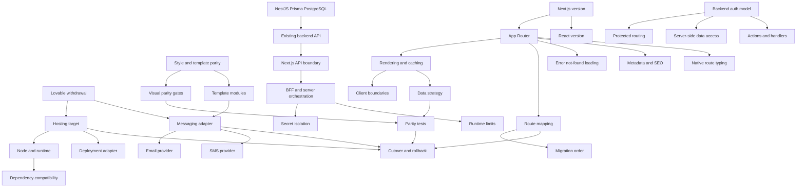

# Decision Dependencies

Hosting (Vercel) and runtime pins (Next.js 16.3.x, React 19.2.x, TypeScript 6.0.x, Node 24 LTS) are decided. Email/SMS providers are **ACCEPTED RISK** behind messaging adapter stubs. Production route map is **APPROVED** ([02-route-migration.md](../frontend/02-route-migration.md)). Style/template parity is already decided and must gate every migrated surface. Backend remains the primary API; Next.js adds BFF only where justified. **Auth is NestJS from Product MVP (Ship 1)** (local JWT; no Supabase Auth — [ADR-005](decisions/ADR-005-authentication.md) Option C). Remaining product APIs cut over to NestJS 11.x, Prisma 7.x, PostgreSQL 18.x ([ADR-015](decisions/ADR-015-backend-stack.md)). Scope labels: [phase-1-scope.md](../product/phase-1-scope.md).
