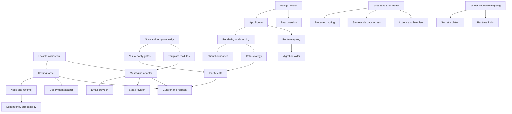

# Decision Dependencies

Hosting (Vercel) and runtime pins (Next.js 16.3.x, React 19.2.x, TypeScript 6.0.x, Node 24 LTS) are decided. Resolve the messaging adapter before freezing email route cutover. Style/template parity is already decided and must gate every migrated surface.
