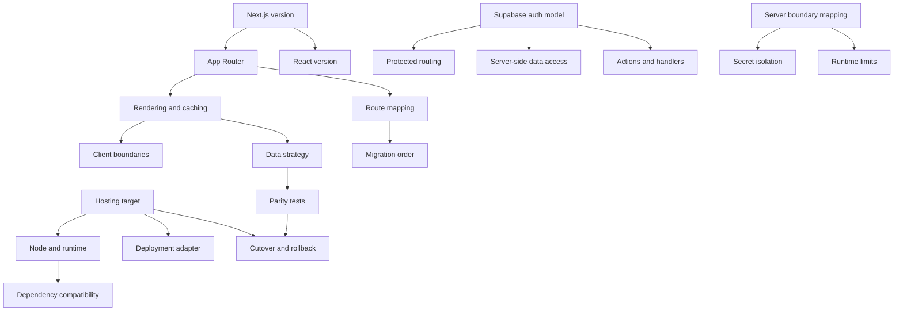

# Decision Dependencies

```mermaid
flowchart TD
  Hosting[Hosting target] --> Node[Node and runtime]
  Hosting --> Adapter[Deployment adapter]
  NextVersion[Next.js version] --> AppRouter[App Router]
  NextVersion --> ReactVersion[React version]
  Node --> Dependencies[Dependency compatibility]
  AppRouter --> Rendering[Rendering and caching]
  AppRouter --> Routes[Route mapping]
  Auth[Supabase auth model] --> Protected[Protected routing]
  Auth --> ServerData[Server-side data access]
  Auth --> Mutations[Actions and handlers]
  ServerBoundaries[Server boundary mapping] --> Secrets[Secret isolation]
  ServerBoundaries --> RuntimeLimits[Runtime limits]
  Rendering --> ClientBoundaries[Client boundaries]
  Rendering --> DataStrategy[Data strategy]
  Routes --> MigrationOrder[Migration order]
  DataStrategy --> Testing[Parity tests]
  Hosting --> Cutover[Cutover and rollback]
  Testing --> Cutover
```

Resolve hosting, runtime, auth, and server boundaries before freezing route-level rendering decisions.
