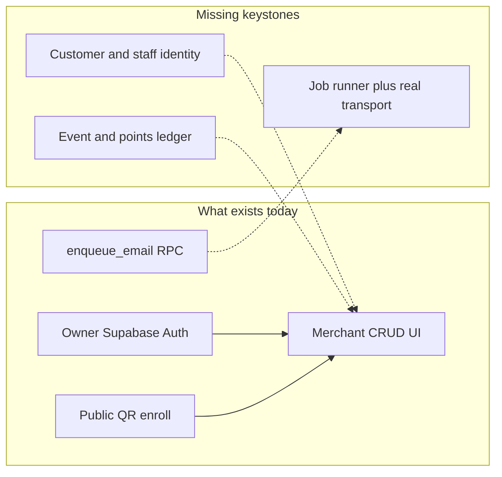
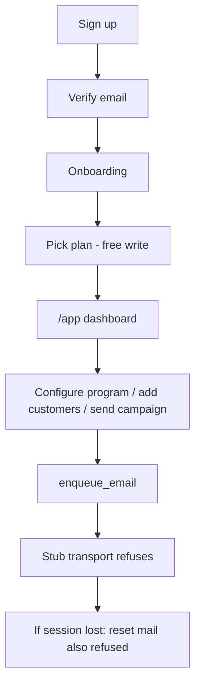
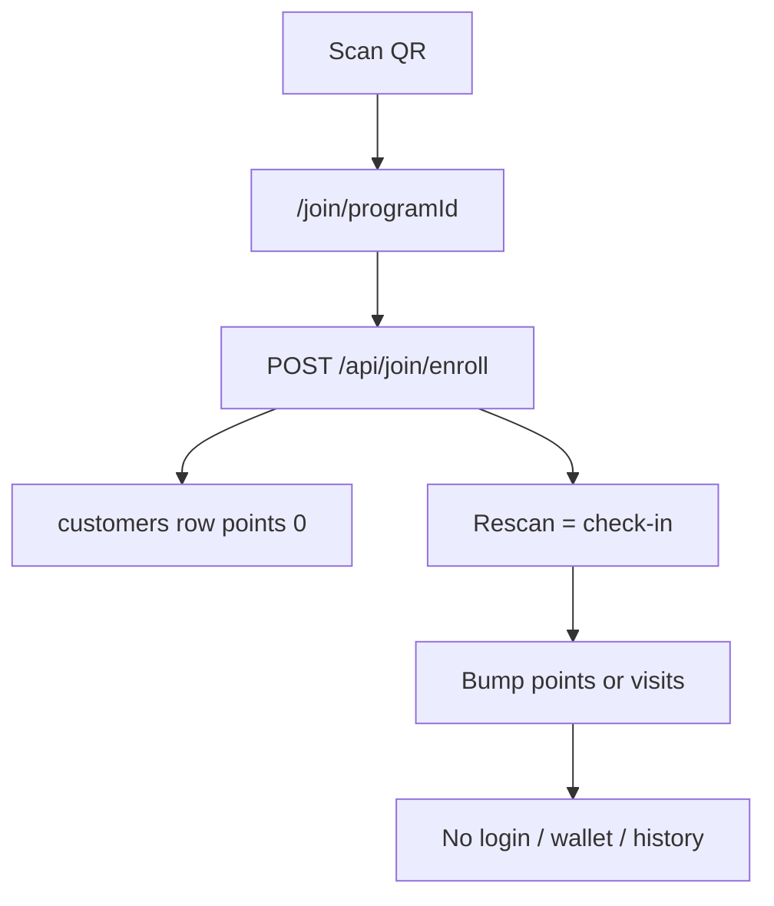

# Security, UI, and Product Audit

**Date:** 2026-08-14  
**Scope:** Current Next.js App Router app (`src/app`, `src/features`, `src/lib/server`), legacy TanStack Start (`src/routes`), Supabase migrations, and product/architecture docs.  
**Method:** Code and docs only. Schema/API recommendations are attributed to the **backend program** per [ADR-014](../architecture/decisions/ADR-014-product-data-ownership.md). This report does **not** add tables or migrations.  
**Backlog mapping:** Findings that already exist in [gaps-and-solutions.md](../frontend/gaps-and-solutions.md) are tagged `G-01`…`G-36`. New items are tagged `A-xx` (audit).

**Role naming note:** The product lock uses **`admin` / `staff` / `customer`**. The buyer is **`admin`**, not `purchaser` ([product-manager-meeting-report.md](../product-manager-meeting-report.md) L52). This report uses those locked names.

---

## 1. Executive summary

Loyollo’s merchant UI is largely **CRUD-wired** (customers, loyalty program config, branches, campaigns, settings). What is missing is the **operating system around that CRUD**: identity for anyone who is not the shop owner, an event ledger that makes KPIs true, and a job runner that actually delivers mail and campaigns.

Until those three keystones exist, the locked product rules cannot be enforced, and several screens train the merchant to distrust the numbers.

### Top risks

| # | Risk | Why it matters now |
|---|------|--------------------|
| 1 | **No `role` or `account_status` in schema or code** | Locked rules (“`customer` must never open `/app`”, inactive staff blocked) are **unenforceable**. Every logged-in user is an undifferentiated merchant. `G-33`, `G-34`, `G-36`. |
| 2 | **Email delivery is a stub; queue drain is not scheduled** | Next transport always returns `ok: false`. Failed messages are **not deleted**. There is no `vercel.json` / GitHub Action / `cron.schedule('process-email-queue')` in this repo. At Lovable cutover, verification and password-reset mail stop — **total lockout**. |
| 3 | **No staff or customer credential recovery** | No invite API, no team table, `customers` has no `user_id`. A locked-out staff member or enrolled customer has **no login to recover**. `G-33`, `G-34`. |
| 4 | **Points have no integrity** | No `CHECK (points >= 0)`, no ledger, check-in is a non-atomic read-modify-write, **redemption does not exist**. `rewards.redeemed_count` is never written. Concurrent QR scans can double-award. `G-20`. |
| 5 | **Server auth is “session exists” only** | `requireUser()` and the `/app` proxy do not check email verification, role, or account status. Verification is a client `useEffect`. |
| 6 | **Stored open-redirect / XSS footgun** | Next `/api/notifications/owner` writes unsanitized `linkPath` into `notifications.link`. The TanStack counterpart already sanitizes. |

### Three missing architectural keystones



1. **Customer and staff identity** — a second auth plane for shop customers (never `/app`) and a teammate invite + temp-password + first-login-change flow for `admin`/`staff`, with `active`/`inactive` gates. Product is **DECIDED**; schema and APIs are **not shipped**.
2. **Event / points ledger** — `visit_events`, `points_ledger`, `orders` (backend-owned). Without them, QR scans, branch splits, LTV, redemption rate, MoM deltas, and ROI cannot be honest.
3. **Job runner + real transport** — campaign fan-out and email drain **outside** Next (ADR-013), with a real email/SMS provider. Today Next fans out in-request and the transport is a stub.

### What is already solid

- Tenant isolation via RLS `owner_id` / program-owner `EXISTS` policies is **correct** for the current one-owner-per-shop model.
- Next BFF routes that need a user call `getUser()` (verified JWT), not `getSession()`.
- Public join was moved off the dropped anon INSERT policy onto a service-role BFF.
- `.env` is gitignored; no hardcoded secrets found in `src/`.
- Many widgets already show `"—"` instead of invented deltas (dashboard/analytics stat cards). That honesty is **not** applied to the branches donut, customers “New this month” / “Returning Rate”, or auth promo stats.

---

## 2. Security and vulnerability audit

### 2.1 Role and account-status enforcement matrix

Locked product rules ([product-manager-meeting-report.md](../product-manager-meeting-report.md) L44–56, L105–117; [ADR-005](../architecture/decisions/ADR-005-authentication.md); [11-authentication-migration.md](../frontend/11-authentication-migration.md) L20–37):

- Three roles: `admin`, `staff`, `customer`. No `purchaser`.
- `customer` must never open `/app`.
- Inactive `staff` cannot use `/app`; inactive `customer` cannot use customer login.
- Member `customers.status` / `tier` are **not** auth roles.

**Runtime reality:** `profiles` has no `role` and no `account_status` ([types.ts](../../src/integrations/supabase/types.ts) L680–706). Grep of `src/` for `purchaser`, `account_status`, `user_role` returns **zero** product matches.

| Layer | File | Login | Email verified | Role | Account status | Tenant / ownership |
|-------|------|-------|----------------|------|----------------|--------------------|
| Edge proxy | [src/proxy.ts](../../src/proxy.ts) L8–10 → [update-session.ts](../../src/integrations/supabase/update-session.ts) L10–17, L59–68 | `/app` only (`getUser()`) | No | No | No | No |
| RSC layout | [app/(shell)/layout.tsx](../../src/app/app/(shell)/layout.tsx) L14; [onboarding/layout.tsx](../../src/app/onboarding/layout.tsx) L10 | `requireUser()` | No | No | No | No |
| Server guard | [guards.ts](../../src/lib/server/auth/guards.ts) L14–27 | Session exists → pass | No | No | No | No |
| Client UX | [ProtectedRoute.tsx](../../src/components/ProtectedRoute.tsx) L15–27; feature page effects | Yes | Yes (`isVerified`) | No | No | No |
| Next APIs (user) | `src/app/api/**` | `getUser()` | No | No | No | Campaigns: `owner_id` check |
| RLS | `supabase/migrations/*` | `auth.uid()` | N/A | **No role column** | **No account_status** | `owner_id` / program owner |

**Implication:** A shop customer who somehow obtained a Supabase Auth session (or any future customer-auth user) would be treated as a merchant. The rule is not violated by a specific if-statement — **the data to evaluate the rule does not exist**.

### 2.2 Categorized security findings

#### S-01 — Authz is login-only (Critical) — `G-33`, `G-34`, `G-36`

- [src/lib/server/auth/guards.ts](../../src/lib/server/auth/guards.ts) L18–19: `if (user) return user`.
- [src/integrations/supabase/update-session.ts](../../src/integrations/supabase/update-session.ts) L10: `PROTECTED_PREFIXES = ["/app"]` — **`/onboarding` is not gated at the proxy**. Layout `requireUser()` covers it, still without verification/role.
- Unverified users with a valid session reach `/app` and `/onboarding` at the RSC layer; only client effects bounce them to `/verify`.

#### S-02 — Email transport stub + queue leak (Critical)

- [src/lib/server/messaging/transport.ts](../../src/lib/server/messaging/transport.ts) L19–33: `sendEmail` always returns `{ ok: false, code: "EMAIL_TRANSPORT_STUB" }`.
- [src/app/api/email/queue/process/route.ts](../../src/app/api/email/queue/process/route.ts) L97–106: on failure, logs `failed` and **`continue`s without `delete_email`**. Successful sends delete (L116–119). Stub path therefore **re-reads forever**.
- No `vercel.json`, no `.github/workflows`, no `cron.schedule('process-email-queue')` in migrations. The 5-second processor is **commented as dynamic setup** in [20260713172245_email_infra.sql](../../supabase/migrations/20260713172245_email_infra.sql) L295–302; it is not in committed SQL.
- Weekly/monthly **report enqueue** cron **does** exist ([20260716141142](../../supabase/migrations/20260716141142_1f0f06fb-7922-4f8f-820d-5c48303ff32d.sql) L226–252) — those jobs enqueue mail that Next cannot deliver.
- Legacy TanStack [lovable/email/queue/process.ts](../../src/routes/lovable/email/queue/process.ts) still sends via Lovable and uses **non-timing-safe** `token !== supabaseServiceKey` (L84). Next’s equivalent is timing-safe (process route L9–14, L29).

**Cutover risk:** ADR-009 withdraws Lovable. After that, password reset / verify / invite mail has no working path.

#### S-03 — No staff or customer recovery (Critical) — `G-33`, `G-34`

- `InviteEmail` template and webhook `action_type: invite` exist; **no UI or API creates a teammate**.
- `customers` has no `user_id` ([types.ts](../../src/integrations/supabase/types.ts) L275–293).
- Owner forgot-password **is** wired (`/auth/forgot-password` → `resetPasswordForEmail`). That path depends on S-02 actually delivering mail.

#### S-04 — Points integrity and missing redemption (Critical) — `G-20`

- `customers.points` / `visits`: `INTEGER NOT NULL DEFAULT 0` — **no `CHECK (>= 0)`** ([20260714191332](../../supabase/migrations/20260714191332_befb50c4-9190-4b4b-a922-8f37810e3591.sql) L8–10).
- Check-in is read-modify-write without a transaction ([join-service.ts](../../src/lib/server/join-service.ts) L192–237). Concurrent QR scans can both read the same balance.
- New enroll starts at `points: 0` (L143) even when `bonus_signup_points` is saved in the loyalty UI.
- **No redemption code path** in `src/`. `rewards.redeemed_count` is read for analytics and **never incremented**. `customer_rewards.status = 'redeemed'` is never written.
- Owners **can** `UPDATE customers.points` via RLS with no column restriction (same migration L29–32). Compromised owner session = arbitrary balances.

#### S-05 — Unsanitized `linkPath` on Next notifications (Critical)

| Path | Behavior |
|------|----------|
| Next [api/notifications/owner/route.ts](../../src/app/api/notifications/owner/route.ts) L20–45 | No zod. No `prefKey` allowlist. `link: body.linkPath ?? null` stored as-is. Ignores `notification_preferences`. Returns `{ ok: true }` even though email half is skipped (comment L7–9). |
| TanStack [notifications.functions.ts](../../src/lib/notifications.functions.ts) L26–34 | `ALLOWED_PREFS`, `sanitizeLinkPath` (must start with `/`, reject `//`, cap 512). |

Any authenticated user can insert a notification for **themselves** with `javascript:` or `https://evil.example` in `link`. The bell UI then renders it.

#### S-06 — Self-service plan escalation (High) — `G-07`

- RLS `"Users can update own profile"` WITH CHECK is only `auth.uid() = id` — **`plan` is writable**.
- [settings-page.tsx](../../src/features/settings/settings-page.tsx) L952–967 writes `plan` from the Billing tab; copy admits “no payment was charged” (L1011–1012).
- [plan-page.tsx](../../src/features/onboarding/plan-page.tsx) L134–141 same write at onboarding.
- [plans.ts](../../src/lib/plans.ts) defines branch / admin / contact caps. **Branch Add is hidden in UI only**; insert ([branches-page.tsx](../../src/features/branches/branches-page.tsx) L221–244) has **no server cap**. Contact and campaign quotas are **not enforced**.
- Violates data-contract write rule: checkout + webhook is the **sole** writer of `profiles.plan`.

#### S-07 — Public enroll rate limit is process-local (High) — `G-18`, ADR-012

- [api/join/enroll/route.ts](../../src/app/api/join/enroll/route.ts) L6–27: in-memory `Map`, 10/min per IP. Resets per instance; useless on Vercel.
- [api/join/program/route.ts](../../src/app/api/join/program/route.ts) L6–19 **defines** `rateLimit` and **never calls it** on GET (L21–33). Program lookup is unthrottled (QR scrape / enumeration of UUIDs still needs a valid id).
- No CAPTCHA. No marketing opt-in column. Join disclaimer is copy-only.

#### S-08 — Error message leakage (High)

- [api/join/enroll/route.ts](../../src/app/api/join/enroll/route.ts) L41–43: `{ error: error.message }`.
- [api/campaigns/send/route.ts](../../src/app/api/campaigns/send/route.ts) L31–33: same.

Internal PostgREST / RPC messages can reach the browser.

#### S-09 — `handle_new_user` mutable `search_path` (High)

```35:36:supabase/migrations/20260707121036_7bc283bd-ad02-401a-9423-c054d15cad49.sql
CREATE OR REPLACE FUNCTION public.handle_new_user()
RETURNS TRIGGER LANGUAGE plpgsql SECURITY DEFINER SET search_path = public AS $$
```

`tg_profiles_set_updated_at` is the same. Later trigger functions pin `search_path = ''`. A poisoned `public` schema can hijack this DEFINER function. **Backend program** (ADR-011: RLS/schema changes need separate approval; this is a security defect, not a product table).

#### S-10 — Service-role client without `server-only` (High)

- Next [admin.ts](../../src/integrations/supabase/admin.ts) has `import "server-only"`.
- Legacy [client.server.ts](../../src/integrations/supabase/client.server.ts) does **not**. Relies on dynamic-import convention and exclusion from `tsconfig.next.json`. Accidental client import would leak `SUPABASE_SERVICE_ROLE_KEY`.

#### S-11 — Campaign fan-out in the request (High) — ADR-013, `G-09`

[campaigns-service.ts](../../src/lib/server/campaigns-service.ts) L142–214 loops every recipient, mints unsubscribe tokens, and `enqueue_email`s **inside** `POST /api/campaigns/send`. ADR-013: Next may enqueue a **job**, must not fan-out in the request lifecycle.

Recipients are marked `sent` when **enqueued**, not delivered (L201–205). Combined with the stub transport, “sent” means “queued for a sender that refuses”.

#### S-12 — Stale `GRANT INSERT ON customers TO anon` (Medium)

Policy `"Anyone can enroll…"` was **dropped** ([20260714210603](../../supabase/migrations/20260714210603_4af1edf6-6eeb-4df3-8762-383339a32653.sql)). Grant remains from [20260714205953](../../supabase/migrations/20260714205953_6c2298f3-8ad9-4c51-a242-fc484e4cda65.sql). RLS blocks the grant today; revoke for hygiene.

#### S-13 — `qr_page_settings` anon `USING (true)` (Medium)

Public SELECT of all QR branding rows ([20260722133246](../../supabase/migrations/20260722133246_db5a38b0-4d75-4151-9b5d-caebaeea486d.sql) L70–73). Needed for join pages, but leaks every program’s colors/copy to anyone who can guess or enumerate UUIDs. Join BFF already loads this with service role — consider tightening to a single-row RPC.

#### S-14 — Email infra tables: RLS on, zero policies (Medium)

Final migration [20260724191139](../../supabase/migrations/20260724191139_0eb5748f-45c8-4d18-88be-d71657c19446.sql) revokes anon/authenticated and leaves **no policies** on `email_send_log`, `email_send_state`, `suppressed_emails`, `email_unsubscribe_tokens`. Correct for service-role-only; user-scoped clients get silent empty/deny.

#### S-15 — D-28 cookie/SSR still BLOCKED (Medium)

[proxy.ts](../../src/proxy.ts) L5–7 and [update-session.ts](../../src/integrations/supabase/update-session.ts) L22 document D-28 as BLOCKED. TanStack still uses **localStorage**. [server.ts](../../src/integrations/supabase/server.ts) swallows cookie `setAll` errors in RSC. Do not assume authenticated Server Component reads until the spike PASSES.

#### S-16 — `redirectedFrom` is set, never consumed (Low)

Proxy sets `redirectedFrom` from **pathname only** (safe today). Sign-in does **not** read it. Future `navigate(redirectedFrom)` without an allow-list is an open redirect.

#### S-17 — No unique `(loyalty_program_id, email|phone)` (Medium)

Dedupe is application-only ([join-service.ts](../../src/lib/server/join-service.ts) L113–128). Race: two concurrent enrolls with the same email create two rows. No unique index.

#### S-18 — Notifications INSERT grant vs policy (Low)

Policy allows INSERT own notifications; table GRANT is SELECT/UPDATE in the creating migration. Client inserts may fail; BFF uses service role so the Next route still works.

#### S-19 — No observability / audit log (Medium)

No Sentry. Logger is `console.*` JSON. No general `audit_log` for points, plan, or profile changes. Dashboard/analytics/branches `Promise.all` fetches often **ignore** `error` and render empty as “no data”.

#### S-20 — Storage public read (Low)

`avatars` and `qr-branding` buckets are publicly readable. Avatars use long-lived signed URLs (`G-16`). Not secret, but PII in filenames/paths should be assumed enumerable.

### 2.3 API route checklist (Next)

| Route | Auth | Authz | Validation | Rate limit | Notes |
|-------|------|-------|------------|------------|-------|
| `POST /api/account/delete` | `getUser()` | Self | None | No | Service-role `deleteUser` |
| `POST /api/account/password-changed-email` | `getUser()` | Self | None | No | Enqueues; delivery stubbed |
| `POST /api/campaigns/send` | `getUser()` | `owner_id` | Zod in service | No | Fan-out in request; leaks `error.message` |
| `GET /api/join/program` | Public | N/A | UUID in service | **Defined, unused** | Service role |
| `POST /api/join/enroll` | Public | N/A | Zod in service | In-memory IP | Leaks `error.message` |
| `POST /api/notifications/owner` | `getUser()` | Self insert | **None** | No | Unsanitized `linkPath` |
| `POST /api/email/queue/process` | Bearer = service key (timing-safe) | Worker | N/A | DB cooldown | Stub transport; no delete on fail |
| `POST /api/email/auth/webhook` | `EMAIL_WEBHOOK_SECRET` or `LOVABLE_API_KEY` | Secret | Payload checks | No | Enqueue only |
| `POST /api/email/auth/preview` | Same secret | Secret | Type enum | No | No DB |

---

## 3. UI implementation status

Legend: **A** = fully wired to Supabase or `/api`. **B** = visual only / hardcoded. **C** = mix.

### 3.1 Per-route classification

| Route | Class | Wired | Fake / missing | Evidence |
|-------|-------|-------|----------------|----------|
| `/app/dashboard` | **C** | Checklist + counts from `profiles`, `loyalty_programs`, `rewards`, `customers`, `campaigns` | KPI deltas `"—"`; revenue = sum `campaigns.revenue_cents`; Live Activity empty; “This month” / “View All” no handlers | [dashboard-page.tsx](../../src/features/dashboard/dashboard-page.tsx); [SetupCompleteDashboard.tsx](../../src/components/dashboard/SetupCompleteDashboard.tsx) L136–137, L235–241, L260–284, L359–373 |
| `/app/analytics` | **C** | Member counts, segments, tier donut, top rewards from `customers`/`rewards` | All deltas `"—"`; redeemed series always 0; Revenue tab placeholder; QR/frequency/peak `"—"`; Export / date / insight CTAs dead | [analytics-page.tsx](../../src/features/analytics/analytics-page.tsx) L106–119, L303–315, L337–358, L516–529, L624–643, L1011–1076 |
| `/app/customers` | **C** | List CRUD, search/filter/sort in memory, CSV export | **“New this month” = Gold+VIP count**; **“Returning Rate” = Silver count**; revenue column `"—"` (sort-by-revenue uses points); `at_risk`/`churned` tabs empty because nothing writes those statuses | [customers-page.tsx](../../src/features/customers/customers-page.tsx) L126–128, L232–236, L248+, L354–355 |
| `/app/customers/[id]` | **C** | Profile load/edit; points/visits from DB | `rewardsRedeemed`, `lifetimeValue`, `referrals` hardcoded `0`; transactions/rewards “Coming soon”; empty activity | [customer-detail-page.tsx](../../src/features/customers/customer-detail-page.tsx) L152–155, L244, L261 |
| `/app/loyalty` | **C** | Program CRUD, tiers, rewards, QR (`qrcode` + join URL), referral **settings**, QR page settings | Scan counts forced 0; visit/funnel stats 0; referral leaderboard `[]`; `redeemed_count` never moves | [loyalty-page.tsx](../../src/features/loyalty/loyalty-page.tsx) L187–248, L261–267; [ReferralsSection.tsx](../../src/components/loyalty/ReferralsSection.tsx) L42 |
| `/app/branches` | **C** | Branch CRUD | **Even-split performance donut**; per-branch cards = equal split of program totals | [branches-page.tsx](../../src/features/branches/branches-page.tsx) L208–218, L345–347 |
| `/app/branches/[id]` | **B/C** | Branch metadata edit / active toggle | Stats `"—"`; fake bar chart; empty top customers/rewards | [branch-detail-page.tsx](../../src/features/branches/branch-detail-page.tsx) L237–244, L254–277, L423–452 |
| `/app/campaigns` | **A/C** | CRUD + send via `/api/campaigns/send`; automations **CRUD** | Enable sets `active` without sending; send writes `active` not `completed`; Completed tab always empty; SMS fails; automations never run | [campaigns-page.tsx](../../src/features/campaigns/campaigns-page.tsx) L308, L354–367, L621; [campaigns-service.ts](../../src/lib/server/campaigns-service.ts) L216 |
| `/app/campaigns/[id]` | **C** | Campaign + recipients | `rewardsRedeemed = 0`, `topEngaged = []`; opens/clicks never written | [campaign-detail-page.tsx](../../src/features/campaigns/campaign-detail-page.tsx) L104–123, L183–187 |
| `/app/settings` General / Notifications / Security | **A** | Profile, prefs, password, MFA TOTP+QR, delete account | Email field disabled (intentional) | [settings-page.tsx](../../src/features/settings/settings-page.tsx) |
| `/app/settings` Integrations | **C** | Row upsert | Status stuck `pending`; no OAuth | L742–760, L818–821 |
| `/app/settings` Billing | **C** | Writes `profiles.plan` | Placeholder, no payment | L952–967, L1011–1012 |
| `/app/settings/password` | **A** | `updateUser({ password })` | May skip password-changed email (`G-25`) | [password-page.tsx](../../src/features/settings/password-page.tsx) |
| `/onboarding/*` | **A/C** | Profile steps persist | Plan cards cosmetic; no checkout | [plan-page.tsx](../../src/features/onboarding/plan-page.tsx) |
| `/auth/*` | **A/C** | Sign-in/up, verify, forgot/reset | Promo KPIs `+20%`, `863.5K`, `5.6M` are **marketing fiction** | [sign-in-page.tsx](../../src/features/auth/sign-in-page.tsx) L237–247 |
| `/join/[programId]` | **A** | `GET /api/join/program`, `POST /api/join/enroll` | Success screen only; no later login | [join-page.tsx](../../src/features/join/join-page.tsx) |
| Marketing / legal | **B** | — | Contact form `setTimeout` reset; Leaflet map is real (fixed Vancouver coords); landing hero targets hardcoded | [contact-page.tsx](../../src/features/marketing/contact-page.tsx); [Hero.tsx](../../src/components/landing/Hero.tsx) |
| Shell search | **B** | Notifications bell reads `notifications` | Header search has no `value`/`onChange` | [DashboardShell.tsx](../../src/components/dashboard/DashboardShell.tsx) L285–290, L353–358 |

### 3.2 Fully functional (narrow definition)

Operational end-to-end **for the owner session**, assuming Supabase is up:

- Auth: sign-up, sign-in, verify UI, forgot/reset **forms** (mail delivery = S-02).
- Onboarding profile fields (not paid plan).
- Customer list add/edit/delete + CSV of those rows.
- Loyalty program **configuration** (rules, tiers, rewards catalog, QR image, join-page branding, referral **settings**).
- Branch CRUD (not per-branch metrics).
- Campaign create/edit/delete and **attempted** send (enqueue, not deliver).
- Settings general, notification **toggles**, password, MFA enroll, account delete.
- Public QR enroll + re-scan check-in (subset of loyalty rules).

### 3.3 UI only / mock

- Auth and landing invented stats.
- Contact form submit.
- Header search.
- Analytics Revenue tab, visit-frequency, peak-hour, insight CTAs.
- Branch performance donut and per-branch equal split (`G-04`).
- Customer detail LTV / referrals / transaction history (`G-13`).
- Referral leaderboard (`G-14`).
- Integrations connect (`G-19`).
- Billing checkout (`G-07`).
- Campaign automations execution (`G-09`).
- “This month” date filters, analytics Export.

### 3.4 Backend / schema exists — no UI to manage it

| Artifact | Stored | UI / writer missing |
|----------|--------|---------------------|
| `customer_rewards` earn rows | Written on check-in milestone | Never listed on customer detail (hardcoded empty) |
| `customer_rewards.status='redeemed'`, `redeemed_at` | Columns | No redeem UI/API |
| `rewards.redeemed_count` | Column | Never incremented |
| `campaigns.scheduled_at` | Column | Never read/written; Scheduled tab empty |
| `campaigns.opened_count`, `clicked_count` | Columns | No open/click webhook |
| `email_send_log`, `suppressed_emails`, unsubscribe tokens | Service-role tables | No owner UI (`G-30`) |
| `campaign_automations` | CRUD UI exists | **No worker** — config only |
| Weekly/monthly report RPCs | pg_cron scheduled | Prefs not consulted; mail not delivered |
| `InviteEmail` + webhook invite branch | Templates | No add-teammate form (`G-34`) |
| Plan admin/contact limits | [plans.ts](../../src/lib/plans.ts) | No team UI; contact cap unused (`G-32`) |

### 3.5 UI / product promised — no backend

| Promise | Gap | ID |
|---------|-----|----|
| Shop-customer register/login + portal | No `user_id`, no customer routes | `G-33` |
| Admin creates admin/staff + temp password + first-login change | No team table/API | `G-34` |
| Multiple loyalty programs + `draft`/`active`/`disabled` | Unique one program per owner | `G-35` |
| Account list Active/Inactive + filters | No `account_status` | `G-36` |
| POS award / redeem | No ledger, no redeem endpoint | `G-20` |
| Orders / GMV / ROI | No `orders` | `G-06` |
| QR scan counts | No `visit_events` | `G-01` |
| Per-branch metrics | No `branch_id` on customers/events | `G-04` |
| Referrals that pay | No `referrals` + `?ref=` | `G-14` |
| Real integrations | Toggle → `pending` | `G-19` |
| Paid plans + quotas | Client writes `plan` | `G-07` |
| Campaign Completed / Performance | Status stuck `active`; opens never increment | `G-09` |
| Internal admin (suspend tenant, impersonate, refund points) | **Does not exist** | `A-01` |

### 3.6 Misleading labels (honesty bugs, frontend-fixable)

| Widget | What it shows | What the label claims | File |
|--------|---------------|----------------------|------|
| Customers “New this month” | Count of Gold+VIP tiers | New members this month | [customers-page.tsx](../../src/features/customers/customers-page.tsx) L232–234, L354 |
| Customers “Returning Rate” | Count of Silver | A rate | L235, L355 |
| Branches donut | Even % split | Performance share | [branches-page.tsx](../../src/features/branches/branches-page.tsx) L208–218 |
| Campaign Performance | `opened_count/sent_count` with opens always 0 | Measured open/redeem % | [campaigns-page.tsx](../../src/features/campaigns/campaigns-page.tsx) L681–687 |
| Auth promo cards | Hardcoded `+20%` / `863.5K` | Product metrics | [sign-in-page.tsx](../../src/features/auth/sign-in-page.tsx) L237–247 |

---

## 4. System architecture and product blind spots

### 4.1 User journeys (locked roles vs code)

#### Admin (shop buyer) — the only journey that partially works



**Break points**

| Step | What happens | What real life needs |
|------|----------------|----------------------|
| Verify / reset mail | Enqueued; Next stub refuses | Real provider + scheduled drain |
| Plan | Saved on `profiles.plan` with no payment | Checkout + webhook sole writer (`G-07`) |
| Add staff | **No UI** | G-34 form + temp password + force change |
| Inactive staff | **Cannot express** | `account_status` gate in proxy + API |
| Award points at POS | **No UI** | Staff device + atomic ledger |
| Redeem reward | **No path** | Balance check, ledger debit, `redeemed_count` |
| Send campaign | Fan-out in request; status → `active`; mail not delivered | Job runner; status → `completed`/`failed`; opens via ESP |
| Customer locked out | N/A — customer cannot log in | Customer auth + reset (`G-33`) |
| Support | No impersonate / suspend / refund | Internal admin (`A-01`) |

Forgot-password **UI** exists for this role only. If the queue is not drained with a real transport, the owner is as stuck as everyone else.

#### Staff — decided, not built

Intended: `/app` with **same permissions as `admin`** until a later split; admin can set Active/Inactive.

**Break:** there is no staff user. No invite, no `profiles.role`, no first-login password change, no inactive gate. The `InviteEmail` template is dead code until G-34 ships.

Credential reset for staff **cannot** be the owner forgot-password screen: that resets the **buyer**. Staff need invite-or-reset owned by admin, plus the same mail pipe as S-02.

#### Customer (shopper) — enroll then drop



**Break points**

- After enroll: success screen with current counters. **No account, no password, no magic link, no wallet, no “what are my points next week?”**
- Re-scan check-in applies a **subset** of configured rules (`points_earned`, `max_visits_per_day`, `double_stamp_weekends`). Ignored: `bonus_signup_points`, `points_expiry_months`, spend-based earn, birthday double points, tier assignment (`G-03`, `G-10`).
- Duplicate email/phone is app-level only (S-17).
- Inactive customer login: **no login exists to disable** (`G-36`).
- Marketing consent: disclaimer copy, no stored opt-in, join does not check `suppressed_emails`.

### 4.2 Logically required plumbing that does not exist

#### Identity and recovery

- Customer register/login (separate authz plane; must not authorize `/app` APIs) — `G-33`.
- Link QR enroll row → customer account when they later register.
- Admin add teammate: name, email, role; email includes temp password; first login **must** change it — `G-34`.
- Account list with filters (role, email, name, phone) and Active/Inactive for staff and customers — `G-36`.
- Staff/customer forgot-password that is **not** the owner’s `/auth/forgot-password`.
- Session timeout UX: proxy redirects `/app` to sign-in; `redirectedFrom` is unused so the user lands on a generic sign-in, not the page they wanted.

#### Ledger, POS, redemption

- Atomic `visit_events` + counter update (`G-01`, `G-02`).
- `points_ledger` and `POST .../redeem` with insufficient-balance / zero-balance rejection (`G-20`).
- Staff POS: identify member (QR/phone), award visit/spend, redeem.
- Points expiry job honoring `points_expiry_months` / grace (`G-10`, `G-21`).
- Unique constraint on member email/phone per program.
- `assign_customer_tier` on enroll/check-in/points change (`G-03`).

#### Jobs, mail, campaigns

- Real email (and later SMS) transport replacing the stub (ADR-010 ACCEPTED RISK).
- Scheduler that **hits** `/api/email/queue/process` (or, per ADR-013, a worker **outside** Next).
- `campaign_jobs` + worker: enqueue 202, process off-request (`G-09`).
- Write `completed` when `sent_count > 0`, `failed` when 0 — not `active`.
- Enable on a disabled **draft** restores `draft`, not `active` ([campaigns-page.tsx](../../src/features/campaigns/campaigns-page.tsx) L621).
- `scheduled_at` processor (column exists, unused).
- ESP webhooks for open/click/bounce → `opened_count` / `suppressed_emails`.
- Automation worker for `campaign_automations` (birthday, inactivity, etc.).
- Consult `notification_preferences` before insert/email (`G-15`).

#### Metrics that need history

Dashboard/analytics “vs last month” is `"—"` because there are **no snapshots and no event time series**. Live `COUNT(*)` cannot produce MoM. Required: `visit_events` / `orders` / daily rollups (backend). Until then, keep `"—"` — do not invent percentages.

#### Billing and entitlements

- Checkout + webhook sole writer of `plan` (`G-07`).
- Server-side enforce `PLAN_LIMITS` on branch insert, `PLAN_CONTACT_LIMITS` on enroll, `PLAN_ADMIN_LIMITS` on teammate create (`G-32`).
- Hide Add Branch is not enforcement.

#### Admin / operations (`A-01`)

There is **no** `/admin` surface. Support cannot: suspend a tenant, view cross-tenant data, resend a stuck email, refund points, or impersonate. `createAdminSupabaseClient` is a BFF primitive, not a back office.

#### Join / program GET

`GET /api/join/program` should log `visit_events` `source=qr_view` (`G-01`) and should call the unused `rateLimit`.

### 4.3 Edge cases the current features cannot handle

| Edge case | Current behavior |
|-----------|------------------|
| Redeem with 0 / insufficient points | **No redeem path** — cannot succeed or fail honestly |
| Concurrent double scan | Lost update on `points`/`visits` |
| Customer types email twice (race) | Two rows possible |
| Campaign “At Risk” audience | Query `status = 'at-risk'`; DB uses `at_risk`; **zero matches**; UI: “No recipients match…” |
| Nothing writes `at_risk` | Tab and audience dead even after hyphen fix |
| SMS campaign | Throws `"SMS provider not configured"` per recipient; `failed_count` up |
| Session idle on `/app` | Proxy redirect to sign-in; deep link dropped |
| Unverified user hits `/app` | RSC allows; client bounce to `/verify` (flicker / incomplete defense) |
| Owner switches plan in Settings | Immediate entitlement change, $0 |
| Delete last main branch | Not blocked (`G-28`) |
| Program type change after members | Allowed; counters not migrated (`G-31`) |
| MFA required at login | Enroll exists; sign-in **does not** handle `mfa_challenge` (`G-26`) |
| Header search | Does nothing (`G-05`) |
| Insight Send/Nudge/Create | No `onClick` (`G-09` / data-contract insight rule) |

---

## 5. Discrepancies with project rules

Each row is a **testable** assertion from docs vs **what the code does**.

### 5.1 Roles and `/app` access

| Rule | Source | Code |
|------|--------|------|
| Three roles `admin`/`staff`/`customer`; never `purchaser` | Meeting report L44–52; ADR-005 | **No role column, no checks.** Buyer is implicit “anyone with a session”. |
| `customer` must never open `/app` | Meeting report L56; 11-auth L20–37 | **Unenforceable.** `/app` = logged in. |
| Inactive staff blocked from `/app`; inactive customer blocked from customer login | Meeting report L105–117 | **No `account_status`.** No customer login. |
| Frontend gates never substitute for backend authz | 11-auth L141–143; ADR-005 | Client `isVerified` is the **only** verification gate. |

### 5.2 Campaign lifecycle (DECIDED 2026-08-14)

| Rule | Source | Code |
|------|--------|------|
| Must not start Active | Meeting report L23 | Create uses `status: "draft"` — **OK** ([campaigns-page.tsx](../../src/features/campaigns/campaigns-page.tsx) L308) |
| After processing, `sent_count > 0` → **Completed**; `0` → **Failed** | Meeting report L25–27 | `finalStatus = sentCount > 0 ? "active" : "failed"` — **violates** ([campaigns-service.ts](../../src/lib/server/campaigns-service.ts) L216) |
| Enable must not mark Active without sending; disabled draft → Draft | Meeting report L29 | `onEnable={() => updateStatus(c, "active", …)}` — **violates** ([campaigns-page.tsx](../../src/features/campaigns/campaigns-page.tsx) L621) |
| Completed tab exists | Meeting report / campaigns-page.md | Tab exists; filter is `c.status !== tab` so **Completed is always empty** while sends stay `active` |
| Performance `"—"` when `sent_count === 0` | Meeting report L17 | `formatPerformance` returns `"—"` if no sent_count — **OK**; after send, `% Open` is **0%** because opens never increment (looks measured, is not) |
| Next must not fan-out in request | ADR-013 | **Violates** — loop L142–214 |

### 5.3 UI honesty (ADR-014)

| Rule | Source | Code |
|------|--------|------|
| No even-split donuts | ADR-014 L26–31; G-04 | **Violates** [branches-page.tsx](../../src/features/branches/branches-page.tsx) L208–218 |
| No proxy metrics under misleading labels | ADR-014; G-12 | **Violates** “New this month” / “Returning Rate” |
| Revenue `"—"` or hide, not fake $0 as GMV | ADR-014; G-06 | Dashboard **sums `revenue_cents`** (usually $0.00, looks like GMV) |
| Insight CTAs disabled until API exists | data-contract write rule 6 | Buttons have **no handler** — still look actionable |
| Header search hidden or functional | G-05 | Decorative input |
| Audience `at_risk` not `at-risk` | campaigns-page.md; G-08 | **Violates** [campaigns-service.ts](../../src/lib/server/campaigns-service.ts) L88 and [campaigns.functions.ts](../../src/lib/campaigns.functions.ts) L89 |

### 5.4 Loyalty and data ownership

| Rule | Source | Code |
|------|--------|------|
| Multiple programs; status draft/active/disabled | Meeting report L94–102; G-35 | Unique **one program per owner** |
| Join/check-in only for `active` programs | data-contract | **No program status column**; join loads any id |
| `customers.tier` written on enroll/check-in | G-03 | **Never written** in `enrollCustomer` / `recordCheckIn` |
| Earn ≠ redeem; explicit redeem | data-contract; G-20 | Earn-on-milestone only; no redeem |
| No new product tables in this repo | ADR-014 | This audit **recommends only** — no migrations added |
| `profiles.plan` only via checkout webhook | data-contract; G-07 | **Violates** Settings + onboarding client updates |
| Branch/contact caps server-side | G-07, G-32 | UI hide only |

### 5.5 Messaging and Lovable

| Rule | Source | Code |
|------|--------|------|
| Withdraw Lovable packages/routes/secrets | ADR-009 | `@lovable.dev/*` still in [package.json](../../package.json); [src/routes/lovable](../../src/routes/lovable) still present (migration in progress — allowed until cutover, **must not** remain the only working sender) |
| Send only via `src/lib/server/messaging/` | ADR-010 | Next queue uses that contract — **but the implementation is a stub** |
| Public enroll HTTP 429 + toast, no silent retry | ADR-012 | Enroll returns 429; GET program does not rate-limit |

### 5.6 Customers page KPI honesty (documented)

| Rule | Source | Code |
|------|--------|------|
| “New this month” uses `created_at` | customers-page.md | Uses Gold+VIP **tier counts** |
| “Returning Rate” from events | customers-page.md | Uses Silver **count** (not a rate) |

---

## 6. Prioritized action plan

Owners: **Frontend** = this repo (honesty, guards, BFF hygiene). **Backend** = schema/API program (ADR-014). Do not add product tables here.

### Critical

| ID | Action | Owner | Primary files / contracts | Maps to |
|----|--------|-------|---------------------------|---------|
| C1 | **Do not cut over off Lovable** until a real email transport + scheduled drain exist. Stub + no cron = lockout. | Frontend + messaging | [transport.ts](../../src/lib/server/messaging/transport.ts); [queue/process/route.ts](../../src/app/api/email/queue/process/route.ts) — on failure: retry/DLQ/`delete_email`, never infinite re-read | ADR-009/010, S-02 |
| C2 | Ship **role + account_status** (backend) and enforce in proxy + `requireUser` + every `/api/*` that is merchant-only. Customer sessions must fail `/app`. | Backend then Frontend | data-contract; [guards.ts](../../src/lib/server/auth/guards.ts); [update-session.ts](../../src/integrations/supabase/update-session.ts) | G-33, G-34, G-36, S-01 |
| C3 | Customer register/login (separate plane) + link to `customers` row; staff invite + temp password + mandatory first-login change. | Backend then Frontend | 11-auth; api-contract shop-customer session | G-33, G-34, S-03 |
| C4 | **Points ledger + atomic check-in + redeem API** with `CHECK (points >= 0)` and insufficient-balance errors. Stop owner arbitrary point updates or wrap them as audited adjustments. | Backend | data-contract `points_ledger`; join-service becomes a client of the API | G-20, S-04 |
| C5 | Sanitize Next notifications like TanStack: allow-list `prefKey`, `sanitizeLinkPath`, honor prefs. | Frontend | [api/notifications/owner/route.ts](../../src/app/api/notifications/owner/route.ts); copy from [notifications.functions.ts](../../src/lib/notifications.functions.ts) L26–34 | S-05, G-15 |
| C6 | Server-side **email verified** check in `requireUser()` / proxy (not only client). Add `/onboarding` to protected prefixes. | Frontend | [guards.ts](../../src/lib/server/auth/guards.ts); [update-session.ts](../../src/integrations/supabase/update-session.ts) | S-01 |

### High

| ID | Action | Owner | Primary files | Maps to |
|----|--------|-------|---------------|---------|
| H1 | Campaign send: write **`completed` / `failed`**, not `active`. Enable disabled draft → **`draft`**. | Frontend (status strings now); Backend (`campaign_jobs`) | [campaigns-service.ts](../../src/lib/server/campaigns-service.ts) L216; [campaigns-page.tsx](../../src/features/campaigns/campaigns-page.tsx) L621 | Meeting report L23–29, G-09 |
| H2 | Fix audience query **`at_risk`** (underscore) in both Next and TanStack send paths. | Frontend | [campaigns-service.ts](../../src/lib/server/campaigns-service.ts) L88; [campaigns.functions.ts](../../src/lib/campaigns.functions.ts) L89 | G-08 |
| H3 | Stop in-request fan-out: `POST /send` returns **202 + job_id**; worker outside Next. | Backend | api-contract campaigns; ADR-013 | G-09, S-11 |
| H4 | Stop client writes to `profiles.plan`; lock column (trigger or revoke) until billing webhook. Hide Billing switch or mark non-operational. | Backend + Frontend | [settings-page.tsx](../../src/features/settings/settings-page.tsx) L952–967; [plan-page.tsx](../../src/features/onboarding/plan-page.tsx) | G-07 |
| H5 | Redis/Upstash rate limit on enroll **and** GET program; return 429. | Backend / infra | [enroll/route.ts](../../src/app/api/join/enroll/route.ts); [program/route.ts](../../src/app/api/join/program/route.ts) L6–19 unused | G-18, ADR-012 |
| H6 | Stop returning raw `error.message` from enroll and campaigns/send. | Frontend | those two route.ts files | S-08 |
| H7 | Pin `search_path = ''` on `handle_new_user` and `tg_profiles_set_updated_at`. | Backend (security exception to ADR-011 freeze — treat as defect fix) | [20260707121036](../../supabase/migrations/20260707121036_7bc283bd-ad02-401a-9423-c054d15cad49.sql) | S-09 |
| H8 | Add `import "server-only"` to [client.server.ts](../../src/integrations/supabase/client.server.ts). | Frontend | that file | S-10 |
| H9 | Apply signup bonus and max-visits correctly; do not claim check-in implements unused rule fields — hide or implement (`G-10`). | Backend (writers) + Frontend (honesty) | [join-service.ts](../../src/lib/server/join-service.ts) L102–103 select list omits `bonus_signup_points` | G-10 |
| H10 | Prove D-28 cookie SSR before relying on RSC data for authz. | Frontend | [auth-ssr-spike.md](../architecture/spikes/auth-ssr-spike.md) | D-28 |

### Medium

| ID | Action | Owner | Primary files | Maps to |
|----|--------|-------|---------------|---------|
| M1 | Replace even-split branch donut with `"—"` / hide until `branch_id`. | Frontend | [branches-page.tsx](../../src/features/branches/branches-page.tsx) L208–218 | G-04, ADR-014 |
| M2 | Relabel or recompute “New this month” (`created_at`) and “Returning Rate” (hide until events). | Frontend | [customers-page.tsx](../../src/features/customers/customers-page.tsx) L232–236, L354–355 | G-12 |
| M3 | Hide header search or wire `GET /api/search`. Disable insight CTAs. | Frontend | [DashboardShell.tsx](../../src/components/dashboard/DashboardShell.tsx) L285–290; analytics insight buttons | G-05 |
| M4 | Dashboard revenue: `"—"` until `orders`, do not sum empty `revenue_cents` as GMV. | Frontend | [SetupCompleteDashboard.tsx](../../src/components/dashboard/SetupCompleteDashboard.tsx) L136–137 | G-06 |
| M5 | Unique `(loyalty_program_id, email)` / phone; enroll race. | Backend | customers table | S-17 |
| M6 | Revoke stale `GRANT INSERT ON customers TO anon`. | Backend | [20260714205953](../../supabase/migrations/20260714205953_6c2298f3-8ad9-4c51-a242-fc484e4cda65.sql) | S-12 |
| M7 | Handle `mfa_challenge` on sign-in. | Frontend | [sign-in-page.tsx](../../src/features/auth/sign-in-page.tsx); [use-auth.tsx](../../src/hooks/use-auth.tsx) | G-26 |
| M8 | Password page always enqueue password-changed mail (same as Settings). | Frontend | [password-page.tsx](../../src/features/settings/password-page.tsx) | G-25 |
| M9 | Fetch error states on dashboard/analytics/branches (do not treat error as empty). | Frontend | those page `Promise.all` blocks | S-19 |
| M10 | Timing-safe compare on legacy Lovable queue route **or** delete route at cutover. | Frontend | [lovable/.../process.ts](../../src/routes/lovable/email/queue/process.ts) L84 | S-02 |
| M11 | Write `customers.tier` on enroll/check-in. | Backend | join enroll; `assign_customer_tier` | G-03 |
| M12 | `visit_events` on GET program + enroll. | Backend | join routes; data-contract | G-01, G-02 |
| M13 | Server-enforce branch insert cap. | Backend | branches API | G-07, G-32 |
| M14 | Allow-list `redirectedFrom` when sign-in starts using it. | Frontend | sign-in + [update-session.ts](../../src/integrations/supabase/update-session.ts) | S-16 |

### Low

| ID | Action | Owner | Notes | Maps to |
|----|--------|-------|-------|---------|
| L1 | Auth promo stats: clearly marketing, or remove numbers that look like product KPIs | Frontend | [sign-in-page.tsx](../../src/features/auth/sign-in-page.tsx) L237–247 | ADR-014 spirit |
| L2 | Contact form: send or remove submit | Frontend | contact-page | — |
| L3 | Settings `?tab=`; avatar → `/settings` | Frontend | G-22, G-23 | |
| L4 | Align settings field labels to columns | Frontend | G-24 | |
| L5 | Branches search placeholder copy | Frontend | G-29 | |
| L6 | Suppression list read-only UI | Frontend | G-30 | |
| L7 | Main-branch uniqueness / block delete | Backend | G-28 | |
| L8 | Lock program type after first member | Backend | G-31 | |
| L9 | Structured error tracking (vendor deferred) | Frontend | S-19 | |
| L10 | Internal admin / support tools | Backend + later Frontend | `A-01` — suspend, resend mail, refund points | |
| L11 | Multiple programs + program status | Backend | G-35 | |
| L12 | Tighten `qr_page_settings` anon policy to known program id RPC | Backend | S-13 | |

### Suggested sequence (does not replace [remediation-roadmap.md](../backend/remediation-roadmap.md))

1. **Frontend Phase 0 honesty** (H1, H2, M1–M4, C5, C6, H6, H8) — stop lying and stop storing unsafe links. No schema.
2. **Messaging go-live gate** (C1) — real transport + drain **before** Lovable withdrawal.
3. **Backend identity** (C2, C3) — without this, customer/staff rules stay fiction.
4. **Backend ledger** (C4, M11, M12) — without this, POS/redeem/KPIs stay fiction.
5. **Campaign jobs + billing webhook** (H3, H4, H5) — without this, send/quotas stay fiction.

---

## Appendix A — Files touched by this audit (index)

| Area | Paths |
|------|--------|
| Auth | `src/lib/server/auth/guards.ts`, `session.ts`, `src/proxy.ts`, `src/integrations/supabase/update-session.ts`, `server.ts`, `admin.ts`, `client.server.ts`, `src/hooks/use-auth.tsx`, `src/components/ProtectedRoute.tsx` |
| APIs | `src/app/api/join/**`, `campaigns/send`, `notifications/owner`, `email/**`, `account/**` |
| Domain services | `src/lib/server/join-service.ts`, `campaigns-service.ts`, `src/lib/campaigns.functions.ts`, `notifications.functions.ts` |
| UI | `src/features/{dashboard,analytics,customers,loyalty,branches,campaigns,settings,join,auth,onboarding}/**` |
| Schema | `supabase/migrations/*.sql`, `src/integrations/supabase/types.ts` |
| Product rules | `docs/product-manager-meeting-report.md`, `docs/frontend/gaps-and-solutions.md`, `docs/backend/data-contract.md`, ADRs 005, 006, 009, 010, 012, 013, 014 |

## Appendix B — Explicit absences (do not rebuild under another name)

- Staff invite / team table / first-login force-change — **not found**
- Customer Auth user / portal / wallet — **not found**
- Redemption API / POS — **not found**
- `orders`, `visit_events`, `points_ledger`, `referrals`, `campaign_jobs` tables — **not in this database** (specified in data-contract only)
- Payment provider — **not found**
- `/admin` back office — **not found**
- `vercel.json` crons / GitHub scheduled workflows / `supabase/functions/` — **not found**
- Sentry / audit_log — **not found**

---

*This report is documentation. It does not authorize frontend migrations of backend-owned tables (ADR-014).*
