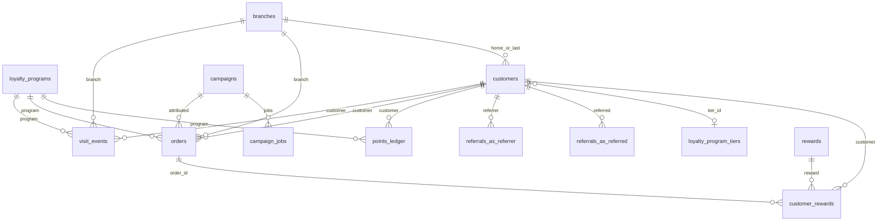

# Backend data contract

**Status:** SPEC-READY (docs-only). Implementation owned by the custom Backend / Database program ([ADR-011](../architecture/decisions/ADR-011-rls-storage-strategy.md) Phase 2, [ADR-014](../architecture/decisions/ADR-014-product-data-ownership.md)).

**Do not** add these tables/columns as migrations in the frontend repo or write them from Next BFF handlers.

**Related:** [api-contract.md](api-contract.md) · [remediation-roadmap.md](remediation-roadmap.md) · [gaps-and-solutions.md](../frontend/gaps-and-solutions.md) · current ER in [system-architecture.md](../frontend/system-architecture.md#database-relationships)

---

## Target ER (additions on top of current schema)

---

## New tables

### `visit_events`

| Column | Type | Null | Notes |
|--------|------|------|-------|
| `id` | uuid PK | no | |
| `loyalty_program_id` | uuid FK → `loyalty_programs` | no | |
| `customer_id` | uuid FK → `customers` | yes | null on anonymous QR view |
| `branch_id` | uuid FK → `branches` | yes | from `?branch=` or staff picker |
| `source` | text | no | `qr_view` \| `check_in` \| `pos` |
| `occurred_at` | timestamptz | no | default `now()` |

**Writer:** join BFF / backend on GET program view (`qr_view`) and on successful enroll/check-in (`check_in`); POS ingest (`pos`).

**Unlocks:** G-01, G-02, parts of G-04, G-12 return rate, Dashboard live activity.

### `orders`

| Column | Type | Null | Notes |
|--------|------|------|-------|
| `id` | uuid PK | no | |
| `loyalty_program_id` | uuid FK | no | |
| `customer_id` | uuid FK | yes | null = non-member ticket |
| `branch_id` | uuid FK | yes | |
| `amount_cents` | integer | no | ≥ 0 |
| `occurred_at` | timestamptz | no | |
| `attributed_channel` | text | yes | `email` \| `sms` \| `in_store` \| … |
| `campaign_id` | uuid FK → `campaigns` | yes | tracking link / promo |

**Writer:** POS integration or manual entry API — **never** the campaign send path.

**Unlocks:** G-06 and all Revenue / LTV widgets. `campaigns.revenue_cents` becomes a **rollup** of attributed orders, not a write target.

### `points_ledger`

| Column | Type | Null | Notes |
|--------|------|------|-------|
| `id` | uuid PK | no | |
| `loyalty_program_id` | uuid FK | no | |
| `customer_id` | uuid FK | no | |
| `delta` | integer | no | positive = issued, negative = redeemed |
| `reason` | text | no | `check_in` \| `redeem` \| `referral` \| `signup_bonus` \| `adjustment` |
| `occurred_at` | timestamptz | no | |
| `order_id` | uuid FK → `orders` | yes | when spend drives points |
| `customer_reward_id` | uuid FK | yes | when redeem |

**Writer:** same transaction as check-in / redeem / referral credit.

**Unlocks:** Analytics points chart, Dashboard “Points Redeemed” truthfulness (with G-20).

### `referrals`

| Column | Type | Null | Notes |
|--------|------|------|-------|
| `id` | uuid PK | no | |
| `loyalty_program_id` | uuid FK | no | |
| `referrer_id` | uuid FK → `customers` | no | |
| `referred_id` | uuid FK → `customers` | yes | set when enroll completes |
| `code` | text | no | unique per program |
| `status` | text | no | `pending` \| `completed` \| `rejected` |
| `points_awarded` | integer | yes | |
| `created_at` | timestamptz | no | |

**Writer:** enroll with `?ref=` / code; credits `referrer_bonus_points` from `referral_settings`.

**Unlocks:** G-14, Customer detail Referrals.

### `campaign_jobs`

| Column | Type | Null | Notes |
|--------|------|------|-------|
| `id` | uuid PK | no | |
| `campaign_id` | uuid FK | no | |
| `status` | text | no | `queued` \| `running` \| `succeeded` \| `failed` |
| `enqueued_at` | timestamptz | no | |
| `started_at` / `finished_at` | timestamptz | yes | |
| `error` | text | yes | |

**Writer:** Backend enqueue API (Next may call it; must not fan-out in-request — [ADR-013](../architecture/decisions/ADR-013-campaign-messaging-runtime.md)).

**Unlocks:** G-09 send reliability; pairs with ESP webhooks for `opened_count` and automation runner.

---

## Changes to existing tables

| Change | Purpose | Gaps |
|--------|---------|------|
| `customers.tier_id` uuid FK → `loyalty_program_tiers` (or keep `tier` text but **write it**) | Assign ladder on enroll/check-in | G-03 |
| `customers.branch_id` nullable | Home / last check-in branch | G-04, G-13 |
| `customer_rewards.branch_id` nullable | Where reward was earned/redeemed | G-04 |
| `customer_rewards.order_id` nullable FK → `orders` | ROI / redeem ticket link | G-06, G-20 |
| `rewards.cost_cents` integer nullable | Cash cost of honouring reward (`point_cost` ≠ money) | Analytics ROI |
| Enforce writers for `campaigns.opened_count`, rollup for `revenue_cents` | Stop dead performance columns | G-06, G-09 |

---

## Binding write rules

1. **`visit_events` + denormalized counters:** when `customer_id` is set on check-in, insert the event and update `customers.visits` + `last_activity_at` in the **same transaction**.
2. **Tier assignment:** on enroll (base tier) and every check-in, set `customers.tier` / `tier_id` to the highest `loyalty_program_tiers` row where points (or visits) meet `points_threshold`. One shared function for join and POS.
3. **`campaigns.revenue_cents`:** derived/rollup from `orders` where `campaign_id` matches — not a column the UI or send path writes.
4. **Earn vs redeem:** check-in may insert `customer_rewards` with `status=earned`; only an explicit redeem path sets `redeemed_at`, increments `rewards.redeemed_count`, and may attach `order_id`.
5. **Plan / billing:** checkout + webhook are the only writers of `profiles.plan`. Branch insert and enroll must enforce `PLAN_LIMITS` / contact caps server-side.
6. **Authz:** owner-scoped to `loyalty_program_id` / `owner_id`. Service-role only in workers and public enroll ([ADR-006](../architecture/decisions/ADR-006-server-boundaries.md)).

---

## Unified glossary

One meaning everywhere (Dashboard, Customers, Analytics, Campaigns). Do not mix the previous colliding labels.

| Term | Canonical meaning | Source of truth |
|------|-------------------|-----------------|
| **At risk** | No `last_activity_at` in the last **30 days** (configurable later, same module) | Shared rules module; optionally nightly job writes `customers.status = 'at_risk'` |
| **Active (member)** | `customers.status = 'active'` **or** activity within the at-risk window — pick one and document in the rules module | Same module; Campaigns audience string must be `at_risk` (underscore), not `at-risk` |
| **Champion / Gold / VIP** | Loyalty **tier** from `loyalty_program_tiers` / assigned `customers.tier` | Not visit-count engagement buckets |
| **Engagement buckets** (Champions / Loyal / … on Analytics Engagement) | Visit + recency heuristics — **labels must not reuse tier names** if cutoffs differ | Shared module; exclusive buckets |
| **Revenue** | `sum(orders.amount_cents)` in period | Never `campaigns.revenue_cents` as GMV |
| **Active (campaign)** | `campaigns.status` | Unrelated to member status |

Full collision history: [analytics-page.md](../frontend/analytics-page.md#three-different-systems-do-not-mix-them).

---

## What already exists (do not rebuild)

See [gaps-and-solutions.md § What already exists](../frontend/gaps-and-solutions.md#what-already-exists-do-not-rebuild). Reuse `customers`, `loyalty_programs`, `loyalty_program_tiers`, `rewards`, `customer_rewards`, `qr_page_settings`, `referral_settings`, `branches`, notifications, integrations, join `recordCheckIn`, and email RPCs.
