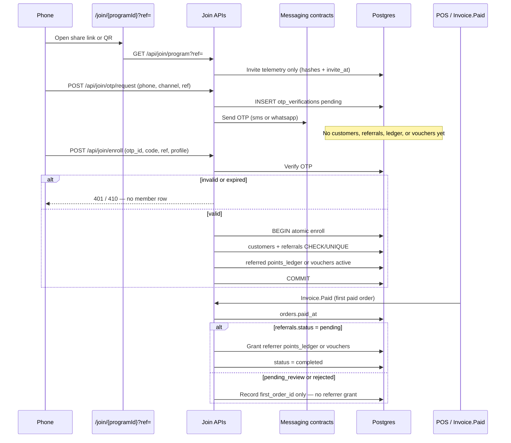

# Backend data contract

**Status:** SPEC-READY (docs-only). Implementation owned by the custom Backend / Database program ([ADR-011](../architecture/decisions/ADR-011-rls-storage-strategy.md) Phase 2, [ADR-014](../architecture/decisions/ADR-014-product-data-ownership.md)).

**Stack (DECIDED):** PostgreSQL 18.x via Prisma 7.x, served by NestJS 11.x — latest stable patches at implementation ([ADR-015](../architecture/decisions/ADR-015-backend-stack.md), [README.md](README.md#target-stack-decided)).

**Do not** add these tables/columns as migrations in the frontend repo or write them from Next BFF handlers.

**Related:** [api-contract.md](api-contract.md) · [remediation-roadmap.md](remediation-roadmap.md) · [gaps-and-solutions.md](../frontend/gaps-and-solutions.md) · current ER in [system-architecture.md](../frontend/system-architecture.md#database-relationships) · product model [program-model.md](../product/program-model.md)

---

## Independent programs (DECIDED, not shipped)

Canonical product: [program-model.md](../product/program-model.md) · [ADR-016](../architecture/decisions/ADR-016-independent-programs.md). **Do not** add these as migrations in this frontend repo.

**Shop identity:** there is **no** `shops` table today. The Shop is `owner_id` / `profiles`. Treat `shop_id` in indexes as `owner_id`.

| Object | Today | Target |
| ------ | ----- | ------ |
| `loyalty_programs` | `UNIQUE (owner_id)` — one row total | **Independent programs.** Drop unique-on-owner-alone and do **not** use `UNIQUE (owner_id, program_type)`. **Partial unique:** one row with `status = 'active'` per `owner_id`. Statuses: `draft` \| `active` \| `archived` \| `disabled` \| `expired` \| `soft_deleted`. |
| `customers` | One row per `loyalty_program_id` | One **identity** per Shop. `enrolled_program_id` lock. Unique phone/email (when present) per Shop. Soft-delete only. |
| Membership / wallet | Balances on `customers` | `customer_program_memberships`: per-program `spendable_points`, `visits`, `period_points_earned`, `status` active\|archived. At most one active membership per customer per Shop. |
| `visit_events`, `orders`, `points_ledger`, `referrals`, `otp_verifications`, `vouchers`, `customer_rewards`, `rewards` | FK `loyalty_program_id` | **Program-scoped.** |
| `campaigns` | FK program | Stay **Shop-scoped** (`owner_id`). |
| Rewards catalog | Per program today | Stay **per program**. `reward_snapshot` on each catalog redemption. |

**DECIDED (not open):** PM-08 period vs spendable counters; PM-07 voucher-only referrals when ACTIVE is not points; UX-75 required enroll fields.

**Indexes:** `UNIQUE (owner_id) WHERE status = 'active'`; pending claims `(loyalty_program_id, status)` and `(reward_id, status)` where `status = 'pending'`; membership `(customer_id, status)`.

---

## Target ER (additions on top of current schema)

```mermaid
erDiagram
  loyalty_programs ||--o{ visit_events : program
  loyalty_programs ||--o{ orders : program
  loyalty_programs ||--o{ points_ledger : program
  loyalty_programs ||--o{ insight_actions : program
  loyalty_programs ||--o{ vouchers : program
  loyalty_programs ||--o{ otp_verifications : program
  customers ||--o{ visit_events : customer
  customers ||--o{ orders : customer
  customers ||--o{ points_ledger : customer
  customers ||--o{ vouchers : customer
  customers ||--o{ referrals_as_referrer : referrer
  customers ||--o{ referrals_as_referred : referred
  customers }o--o| loyalty_program_tiers : tier_id
  referrals ||--o| vouchers_referred : referred_voucher
  referrals ||--o| vouchers_referrer : referrer_voucher
  referrals ||--o{ points_ledger : referral_lots
  branches ||--o{ visit_events : branch
  branches ||--o{ orders : branch
  branches ||--o{ customers : home_or_last
  branches ||--o{ customer_rewards : branch
  campaigns ||--o{ orders : attributed
  campaigns ||--o{ campaign_jobs : jobs
  campaigns ||--o{ insight_actions : from_insight
  rewards ||--o{ customer_rewards : reward
  orders ||--o{ customer_rewards : order_id
  orders ||--o{ vouchers : redeemed_on
  customers ||--o{ customer_rewards : customer
  customers ||--o{ customer_program_memberships : identity
  loyalty_programs ||--o{ customer_program_memberships : program
  customer_program_memberships ||--o{ tier_milestone_grants : grants
  rewards ||--o{ reward_versions : versions
```



---

## New tables

### `customer_program_memberships`

One wallet per customer per program. Canonical product: [program-model.md §4](../product/program-model.md#4-customer-membership-and-wallet). **PM-08:** `spendable_points` and `period_points_earned` are **two counters** — never alias them.

| Column | Type | Null | Notes |
|--------|------|------|-------|
| `id` | uuid PK | no | |
| `customer_id` | uuid FK → `customers` | no | Shop identity |
| `loyalty_program_id` | uuid FK → `loyalty_programs` | no | |
| `status` | text | no | `active` \| `archived` |
| `spendable_points` | integer | no | default `0`; Available = this minus Reserved |
| `visits` | integer | no | default `0`; visit-program stamp counter |
| `period_points_earned` | integer | no | default `0`; **ladder input only** (PM-08) |
| `current_milestone_id` | uuid FK → `loyalty_program_tiers` | yes | displayed highest milestone this period |
| `period_id` | text or uuid | no | current `tier_reset_period` window |
| `archived_at` | timestamptz | yes | set when leftover balances are archived (POS migrate or expiry cleanup) |
| `created_at` | timestamptz | no | default `now()` |

**Indexes:** `UNIQUE (customer_id) WHERE status = 'active'` (at most one active membership per customer per Shop); `(customer_id, status)`; `(loyalty_program_id, status)`.

**Writer:** enroll (new ACTIVE membership at 0 + Sign-up Bonus if enabled); POS migrate (archive leftover → new ACTIVE at 0 + bonus); earn/redeem mutate counters per [write rule 13](#binding-write-rules); `roll-tier-period` zeros `period_points_earned` + displayed milestone only — **does not** zero `spendable_points` and **does not** archive the membership.

### `tier_milestone_grants`

One-time payout per milestone per period. Writer on earn when `period_points_earned >= threshold`.

| Column | Type | Null | Notes |
|--------|------|------|-------|
| `id` | uuid PK | no | |
| `membership_id` | uuid FK → `customer_program_memberships` | no | |
| `period_id` | text or uuid | no | same window as membership |
| `tier_id` | uuid FK → `loyalty_program_tiers` | no | |
| `granted_at` | timestamptz | no | default `now()` |
| `voucher_id` | uuid FK → `vouchers` | yes | when payout is a voucher |
| `ledger_id` | uuid FK → `points_ledger` | yes | when payout is bonus points |

**Unique:** `(membership_id, period_id, tier_id)`.

### `reward_versions`

Material catalog cuts (especially a large `point_cost` increase or condition tightening) insert a **new version**. Cosmetic copy-only edits may update the live `rewards` row **prospectively** without versioning, but still never rewrite `reward_snapshot` on existing redemptions.

| Column | Type | Null | Notes |
|--------|------|------|-------|
| `id` | uuid PK | no | |
| `reward_id` | uuid FK → `rewards` | no | |
| `version` | integer | no | monotonic per reward |
| `point_cost` | integer | no | |
| `conditions` | jsonb | yes | fulfillment rules then in force |
| `created_at` | timestamptz | no | |

**Unique:** `(reward_id, version)`. Live `rewards` row may diverge after a later PATCH; scan/complete uses `customer_rewards.reward_snapshot`, never the live row.

### `visit_events`

Event-driven check-in / scan log. **Do not** derive Peak Hours, days-between-visits, or return vs first-time from flat `customers.visits` alone.

| Column | Type | Null | Notes |
|--------|------|------|-------|
| `id` | uuid PK | no | default `gen_random_uuid()` |
| `loyalty_program_id` | uuid FK → `loyalty_programs` | no | ON DELETE CASCADE |
| `customer_id` | uuid FK → `customers` | yes | null on anonymous QR view |
| `branch_id` | uuid FK → `branches` | yes | from `?branch=` or staff picker |
| `source` | text | no | `qr_view` \| `check_in` \| `pos` (CHECK constraint) |
| `occurred_at` | timestamptz | no | event time; default `now()` — use for all temporal metrics |
| `created_at` | timestamptz | no | row insert time; default `now()` |

**Required indexes:**

```sql
CREATE INDEX visit_events_program_time_idx
  ON public.visit_events (loyalty_program_id, occurred_at DESC);

CREATE INDEX visit_events_customer_time_idx
  ON public.visit_events (customer_id, occurred_at DESC)
  WHERE customer_id IS NOT NULL;

CREATE INDEX visit_events_branch_time_idx
  ON public.visit_events (branch_id, occurred_at DESC)
  WHERE branch_id IS NOT NULL;

CREATE INDEX visit_events_source_time_idx
  ON public.visit_events (loyalty_program_id, source, occurred_at DESC);
```

**Writer:** join BFF / backend on GET program view (`qr_view`) and on successful enroll/check-in (`check_in`); POS ingest (`pos`).

**Unlocks:** G-01, G-02, parts of G-04, G-12 return rate, Dashboard live activity, Analytics Peak Hours / visit frequency.

#### Standard analytics SQL (visit_events)

Bind `:program_id`, `:from`, `:to`, and optionally `:tz` (IANA zone for peak hours).

**Peak hours**

```sql
SELECT EXTRACT(HOUR FROM occurred_at AT TIME ZONE :tz)::int AS hour,
       COUNT(*) AS visits
FROM visit_events
WHERE loyalty_program_id = :program_id
  AND source = 'check_in'
  AND occurred_at >= :from AND occurred_at < :to
GROUP BY 1
ORDER BY 1;
```

**Average days between visits**

```sql
WITH gaps AS (
  SELECT customer_id,
         EXTRACT(EPOCH FROM (
           occurred_at - LAG(occurred_at) OVER (
             PARTITION BY customer_id ORDER BY occurred_at
           )
         )) / 86400.0 AS days_gap
  FROM visit_events
  WHERE loyalty_program_id = :program_id
    AND source = 'check_in'
    AND customer_id IS NOT NULL
    AND occurred_at >= :from AND occurred_at < :to
)
SELECT AVG(days_gap) AS avg_days_between_visits
FROM gaps
WHERE days_gap IS NOT NULL;
```

**Weekly return vs first-time visitors**

```sql
WITH week_visits AS (
  SELECT customer_id,
         DATE_TRUNC('week', occurred_at) AS wk,
         MIN(occurred_at) AS first_in_week
  FROM visit_events
  WHERE loyalty_program_id = :program_id
    AND source = 'check_in'
    AND customer_id IS NOT NULL
    AND occurred_at >= :from AND occurred_at < :to
  GROUP BY 1, 2
),
first_ever AS (
  SELECT customer_id, MIN(occurred_at) AS first_at
  FROM visit_events
  WHERE loyalty_program_id = :program_id
    AND source = 'check_in'
    AND customer_id IS NOT NULL
  GROUP BY 1
)
SELECT w.wk,
       COUNT(*) FILTER (WHERE w.first_in_week = f.first_at) AS first_time,
       COUNT(*) FILTER (WHERE w.first_in_week > f.first_at) AS returning
FROM week_visits w
JOIN first_ever f USING (customer_id)
GROUP BY 1
ORDER BY 1;
```

These queries are required outputs of [GET `/api/analytics/overview`](api-contract.md#analytics--search) (and/or dedicated analytics endpoints) once Phase 2 ships.

### `orders`

| Column | Type | Null | Notes |
|--------|------|------|-------|
| `id` | uuid PK | no | |
| `loyalty_program_id` | uuid FK | no | |
| `customer_id` | uuid FK | yes | null = non-member ticket |
| `branch_id` | uuid FK | yes | |
| `amount_cents` | integer | no | ≥ 0 |
| `invoice_number` | text | yes | cashier-entered; unique per Shop when set (`UNIQUE (owner_id, invoice_number)` WHERE not null, or explicit `idempotency_key`) |
| `currency_code` | text | no | ISO snapshot at write time; **not** recalculated if `profiles.currency` later changes |
| `occurred_at` | timestamptz | no | ticket time |
| `paid_at` | timestamptz | yes | set **only** by the `Invoice.Paid` writer. Null = unpaid / draft — **must not** grant the referrer |
| `attributed_channel` | text | yes | `email` \| `sms` \| `in_store` \| … |
| `campaign_id` | uuid FK → `campaigns` | yes | tracking link / promo |

**Writer:** Product MVP (Ship 1) **staff POS** (`POST /api/pos/transactions`) or later POS integration — **never** the campaign send path. Creating an unpaid `orders` row does **not** grant referral rewards. The **first** row for that customer in the program with `paid_at IS NOT NULL` (`Invoice.Paid`) grants the **referrer** in the same transaction **if** `referrals.status = pending` ([write rule 12](#binding-write-rules)).

**Index:** `(customer_id, paid_at)` WHERE `paid_at IS NOT NULL` — first-paid lookup.

**Unlocks:** G-06 and all Revenue / LTV widgets. `campaigns.revenue_cents` becomes a **rollup** of attributed **paid** orders, not a write target.

### `points_ledger`

| Column | Type | Null | Notes |
|--------|------|------|-------|
| `id` | uuid PK | no | |
| `loyalty_program_id` | uuid FK | no | |
| `customer_id` | uuid FK | no | |
| `delta` | integer | no | positive = issued, negative = redeemed |
| `reason` | text | no | `check_in` \| `redeem` \| `referral` \| `signup_bonus` \| `adjustment` \| `program_archive` \| later `force_refund` |
| `occurred_at` | timestamptz | no | |
| `currency_code` | text | yes | snapshot at issue; required when tied to spend |
| `expires_at` | timestamptz | yes | required on **issued** lots (`delta > 0`) when that source has an expiry window; null only if that source’s expiry is 0 / off. Spend/adjust rows may be null |
| `order_id` | uuid FK → `orders` | yes | when spend drives points; also the referred customer’s **first paid invoice** when crediting the referrer |
| `customer_reward_id` | uuid FK | yes | when redeem |
| `referral_id` | uuid FK → `referrals` | yes | when `reason = referral` |

**Writer:** same transaction as check-in / redeem / referral credit.

**Expiry source (DECIDED):**

| Lot `reason` | `expires_at` |
|--------------|--------------|
| `referral` | grant time + `referral_settings.points_expiry_days` |
| `check_in`, `signup_bonus`, other issued | grant time + `loyalty_programs.points_expiry_months` when that value is `> 0`; else null |
| `redeem` / negative `adjustment` | null (they consume lots; they do not expire) |

Lots are **program-scoped**. Shop A’s 100 points and Shop B’s 200 points are different memberships and must never be summed for spend or for the customer wallet. Within a Shop, archived-program lots are **non-spendable** (Archived History) until POS migration archives leftover and enrolls ACTIVE at 0.

**Available vs reserved (DECIDED, PM-04):** pending catalog redemptions reserve `points_cost` on the **enrolled program** **at Redeem time** (not at staff-scan time). `Available = Total − Reserved`. Concurrent Redeems check Available, not Total.

**Reserved lots vs `expires_at` (PM-04):** expiry jobs **skip** lots covered by an active `PENDING` reservation until `qr_expires_at`. Staff scan `COMPLETED` consumes reserved lots even if lot `expires_at` passed during the 10-minute QR window. Unclaimed QR: `expire-pending-redemptions` marks the redemption `expired`, releases Reserved, then **purges** lots with `expires_at <= now()` — those units are **not** returned to Available. Live lots return to Available. Lot purge does **not** decrement `period_points_earned`. QR / pending TTL is 10 minutes and is independent ([§6b](../product/reward-redemption-flow.md#6b-expiry-handling-scheduled-job)).

**Unlocks:** Analytics points chart, Dashboard “Points Redeemed” truthfulness (with G-20). Customer wallet: [loyalty-page.md](../frontend/loyalty-page.md#customer-wallet-per-shop-decided).

### `referrals`

Attribution event: one row per **new** member who joined via a referrer’s share. Product rules: [loyalty-page.md — referral rewards](../frontend/loyalty-page.md#referral-rewards-decided) · [fraud controls](../frontend/loyalty-page.md#referral-fraud-controls-decided).

| Column | Type | Null | Notes |
|--------|------|------|-------|
| `id` | uuid PK | no | |
| `loyalty_program_id` | uuid FK | no | |
| `referrer_id` | uuid FK → `customers` | no | existing member who shared |
| `referred_id` | uuid FK → `customers` | no | new member; set when enroll/register completes |
| `code` | text | no | snapshot of `customers.referral_code` used at join |
| `status` | text | no | `pending` (referred granted; waiting first **paid** invoice) \| `pending_review` (device/IP match — **Pending Review**; referrer grant blocked) \| `completed` (referrer granted) \| `rejected` |
| `first_order_id` | uuid FK → `orders` | yes | referred customer’s first **paid** invoice; may be set while `pending_review` without granting |
| `referred_granted_at` | timestamptz | yes | when the **new** member’s reward was issued (OTP-verified enroll) |
| `referrer_granted_at` | timestamptz | yes | when the **existing** member’s reward was issued (`Invoice.Paid`, and not `pending_review`) |
| `referred_voucher_id` | uuid FK → `vouchers` | yes | when referred kind = `voucher` |
| `referrer_voucher_id` | uuid FK → `vouchers` | yes | when referrer kind = `voucher` |
| `otp_verification_id` | uuid FK → `otp_verifications` | yes | the verified challenge that authorized this enroll |
| `invite_at` | timestamptz | yes | join-page open with this `ref` (or equivalent share open) |
| `enroll_at` | timestamptz | no | registration time (usually `created_at`) |
| `invite_ip_hash` | text | yes | hashed public IP at invite open |
| `enroll_ip_hash` | text | yes | hashed public IP at enroll |
| `invite_device_hash` | text | yes | device fingerprint hash at invite open |
| `enroll_device_hash` | text | yes | device fingerprint hash at enroll |
| `flag_reason` | text | yes | `same_device` \| `same_network` \| `same_device_and_network` when `pending_review` |
| `created_at` | timestamptz | no | |

**Constraints (hard — INSERT fails; do not write a `rejected` row instead):**

```sql
ALTER TABLE referrals
  ADD CONSTRAINT referrals_not_self_chk
    CHECK (referrer_id <> referred_id),
  ADD CONSTRAINT referrals_status_chk
    CHECK (status IN ('pending', 'pending_review', 'completed', 'rejected')),
  ADD CONSTRAINT referrals_referred_id_uidx UNIQUE (referred_id);

CREATE INDEX referrals_referrer_idx ON referrals (referrer_id);
CREATE INDEX referrals_program_status_idx ON referrals (loyalty_program_id, status);
```

**Writer:**

1. **Join GET** with `?ref=`: persist invite telemetry (`invite_at`, `invite_ip_hash`, `invite_device_hash`) keyed by code + program so enroll can compare. Hash IP and device; do not store raw IP as the product field. **Do not** insert `customers` / `referrals` / rewards.
2. **OTP request** (`POST /api/join/otp/request`): insert `otp_verifications` only. Still no customer, referral, ledger, or voucher rows.
3. **Enroll / register** (`POST /api/join/enroll`) **after OTP verify**: in **one transaction** — mark OTP verified → INSERT `customers` → INSERT `referrals` (DB refuses `referrer_id = referred_id` or a second `referred_id`) → grant **referred** reward ([write rule 12](#binding-write-rules)). Set `status = pending_review` when invite and enroll share the **same device hash** or the **same IP hash** and `date_trunc('minute', invite_at) = date_trunc('minute', enroll_at)` (UTC). If no invite-open row exists, compare enroll hashes to the referrer’s last known device/IP and that activity’s minute. Else `status = pending`. **Never** finalize those rows if OTP is missing, expired, or failed.
4. **`Invoice.Paid`** (first `orders.paid_at` for that `referred_id`): set `first_order_id`. Grant the **referrer** reward, set `referrer_granted_at`, `status = completed` **only if** current status is `pending` (not `pending_review`, not `rejected`). Unpaid `orders` inserts do **not** grant.
5. **Review** of `pending_review`: `pending` (eligible — if `first_order_id` is already a **paid** order, grant referrer and set `completed` in the same transaction) or `rejected` (never grant referrer).

Returning check-in with `?ref=` does **not** create a referral (already a member). Check-in does **not** require a new OTP.

**Unlocks:** G-14, Customer detail Referrals, referral leaderboard.

### `otp_verifications`

Pending identity challenge for **new** public registration (join / shop-customer self-register). This is the **only** persistence allowed before OTP succeeds. Product: [loyalty-page.md — OTP](../frontend/loyalty-page.md#otp-verification-decided).

| Column | Type | Null | Notes |
|--------|------|------|-------|
| `id` | uuid PK | no | default `gen_random_uuid()` |
| `loyalty_program_id` | uuid FK → `loyalty_programs` | no | ON DELETE CASCADE |
| `phone` | text | no | E.164 |
| `channel` | text | no | `sms` \| `whatsapp` (CHECK) |
| `code_hash` | text | no | hashed OTP — **never** store the plaintext code |
| `expires_at` | timestamptz | no | **PM-06:** `now() + 180 seconds` |
| `verified_at` | timestamptz | yes | set when enroll consumes a valid code |
| `consumed_at` | timestamptz | yes | one-time use; set in the enroll transaction |
| `attempts` | integer | no | default `0`; **cap 3 failed guesses** (PM-06); 3rd fail invalidates the challenge |
| `status` | text | no | `pending` \| `verified` \| `expired` \| `failed` (CHECK) |
| `ref` | text | yes | snapshot of `?ref=` / body `ref` at request time |
| `ip_hash` | text | yes | hashed public IP at request |
| `device_hash` | text | yes | device fingerprint hash at request |
| `created_at` | timestamptz | no | default `now()` |

**Constraints / indexes:**

```sql
ALTER TABLE otp_verifications
  ADD CONSTRAINT otp_verifications_channel_chk
    CHECK (channel IN ('sms', 'whatsapp')),
  ADD CONSTRAINT otp_verifications_status_chk
    CHECK (status IN ('pending', 'verified', 'expired', 'failed'));

CREATE INDEX otp_verifications_phone_program_idx
  ON otp_verifications (loyalty_program_id, phone, created_at DESC);

CREATE UNIQUE INDEX otp_verifications_one_pending_idx
  ON otp_verifications (loyalty_program_id, phone)
  WHERE status = 'pending';
```

**Writer:** Canonical `POST /auth/otp/send` inserts `pending` with `expires_at = now() + 180 seconds`. `POST /api/join/otp/request` is an **alias** that must share the same store and Redis phone keys. Enroll / `POST /auth/otp/verify` marks `verified` + `consumed_at` in the same transaction as `customers` insert. Send the code through [messaging contracts](../frontend/17-messaging-templates.md) (`sms` or `whatsapp` adapter) — do not bind a vendor.

**PM-06 Redis (or equivalent), keyed by E.164 phone only (not IP):**

| Limit | Key | Effect |
|-------|-----|--------|
| 3 failed guesses per `(phone, challenge_id)` | DB `attempts` | 3rd fail invalidates challenge; **400** `OTP_MAX_ATTEMPTS_EXCEEDED` |
| 60s resend cooldown | `phone` | **429** `OTP_RESEND_COOLDOWN` + `retry_after_seconds` |
| 5 sends / 24h rolling | `phone` | **429** `DAILY_OTP_LIMIT_REACHED` + `retry_after_seconds` |

ADR-012 IP limits may **coexist**; they do not replace the phone caps. UI timers come from `retry_after_seconds` — do not hardcode 60s / 180s in clients.

**Unlocks:** G-14 integrity, G-33 self-register.

### `vouchers`

Discount **award / coupon** for future use. Referral **`voucher`** kind **must** write here — **not** `customer_rewards`, and **not** a percent on the join bill or current cart. Catalog earn/redeem (Rewards tab) stays on `customer_rewards`. Writer enum is **`voucher`** (supersedes older `discount` spelling).

| Column | Type | Null | Notes |
|--------|------|------|-------|
| `id` | uuid PK | no | default `gen_random_uuid()` |
| `loyalty_program_id` | uuid FK → `loyalty_programs` | no | ON DELETE CASCADE |
| `customer_id` | uuid FK → `customers` | no | |
| `referral_id` | uuid FK → `referrals` | yes | set when issued from a referral discount grant |
| `discount_pct` | integer | no | CHECK `> 0` |
| `status` | text | no | `active` \| `used` \| `expired` (CHECK) |
| `expires_at` | timestamptz | no | grant time + `referral_settings.voucher_expiry_days` for referral awards |
| `used_at` | timestamptz | yes | set when redeemed |
| `order_id` | uuid FK → `orders` | yes | ticket linked **at redeem**; never auto-applied at issue |
| `created_at` | timestamptz | no | default `now()` |

**State:** `active` → `used` (redeem) or `expired` (`now() >= expires_at`; job or check-on-read). `used` / `expired` are terminal. Redeem of `expired` or `used` is a no-op / `409`.

**Constraints / indexes:**

```sql
ALTER TABLE vouchers
  ADD CONSTRAINT vouchers_status_chk
    CHECK (status IN ('active', 'used', 'expired')),
  ADD CONSTRAINT vouchers_discount_pct_chk
    CHECK (discount_pct > 0),
  ADD CONSTRAINT vouchers_used_order_chk
    CHECK (
      (status = 'used' AND used_at IS NOT NULL AND order_id IS NOT NULL)
      OR (status <> 'used')
    );

CREATE INDEX vouchers_customer_active_idx
  ON vouchers (customer_id, loyalty_program_id)
  WHERE status = 'active';

CREATE INDEX vouchers_expires_idx
  ON vouchers (expires_at)
  WHERE status = 'active';
```

**Writer:** referral grant transaction (referred at OTP-verified enroll; referrer on `Invoice.Paid`). Redeem path sets `used` + `order_id` — do **not** mutate a cart/invoice at grant time.

**Unlocks:** G-14 voucher kind; customer wallet vouchers.

### Referral lifecycle (atomic)



Illustrative enroll transaction (backend-owned; **do not** add this migration in the frontend repo):

```sql
BEGIN;

UPDATE otp_verifications
SET status = 'verified', verified_at = now(), consumed_at = now()
WHERE id = :otp_id
  AND status = 'pending'
  AND expires_at > now()
  AND code_hash = crypt(:otp_code, code_hash);

-- 0 rows → ROLLBACK (OTP not finalized)

INSERT INTO customers (/* ... */, phone, referral_code, loyalty_program_id)
VALUES (/* ... */)
RETURNING id AS referred_id;

INSERT INTO referrals (
  loyalty_program_id, referrer_id, referred_id, code, status,
  otp_verification_id, enroll_at, enroll_ip_hash, enroll_device_hash
) VALUES (
  :program_id, :referrer_id, :referred_id, :ref, :status, -- pending | pending_review
  :otp_id, now(), :enroll_ip_hash, :enroll_device_hash
);

-- kind = points:
INSERT INTO points_ledger (
  loyalty_program_id, customer_id, delta, reason, expires_at, referral_id
) VALUES (
  :program_id, :referred_id, :pts, 'referral',
  now() + (:points_expiry_days || ' days')::interval, :referral_id
);

-- kind = discount:
INSERT INTO vouchers (
  loyalty_program_id, customer_id, referral_id, discount_pct,
  status, expires_at
) VALUES (
  :program_id, :referred_id, :referral_id, :pct,
  'active', now() + (:voucher_expiry_days || ' days')::interval
);

COMMIT;
```

`CHECK (referrer_id <> referred_id)` and `UNIQUE (referred_id)` abort the transaction on self-invite or a second attribution.

Illustrative `Invoice.Paid` (same transaction as setting `paid_at`):

```sql
UPDATE orders SET paid_at = now() WHERE id = :order_id AND paid_at IS NULL;

-- Grant referrer only on the customer's first paid invoice in this program
-- and only if referrals.status = 'pending'. See write rule 12.
```

**Unlocks:** G-14, Customer detail Referrals, referral leaderboard.

### `campaign_jobs`

| Column | Type | Null | Notes |
|--------|------|------|-------|
| `id` | uuid PK | no | |
| `campaign_id` | uuid FK | no | |
| `status` | text | no | `queued` \| `running` \| `succeeded` \| `failed` |
| `enqueued_at` | timestamptz | no | |
| `started_at` / `finished_at` | timestamptz | yes | |
| `error` | text | yes | |

**Writer:** Backend enqueue API (Next may call it; must not fan-out in-request — [ADR-013](../architecture/decisions/ADR-013-campaign-messaging-runtime.md)). Also written when insight actions `send` / `nudge` enqueue.

**Unlocks:** G-09 send reliability; pairs with ESP webhooks for `opened_count` and automation runner; insight CTAs ([api-contract.md](api-contract.md#insights--nudge-automation)).

### `insight_actions`

Audit log for Analytics Engagement insight CTAs (Send / Nudge / Create). Prevents dead UI buttons; every click must create a campaign draft and optionally enqueue a job.

| Column | Type | Null | Notes |
|--------|------|------|-------|
| `id` | uuid PK | no | default `gen_random_uuid()` |
| `loyalty_program_id` | uuid FK → `loyalty_programs` | no | ON DELETE CASCADE |
| `owner_id` | uuid | no | acting owner (`auth.uid()` / profiles) |
| `insight_key` | text | no | e.g. `at_risk_churn`, `one_visit_from_reward`, `tier_upgrade` |
| `action` | text | no | `send` \| `nudge` \| `create` (CHECK) |
| `campaign_id` | uuid FK → `campaigns` | yes | draft or launched campaign created from the insight |
| `campaign_job_id` | uuid FK → `campaign_jobs` | yes | set when action enqueues send |
| `audience_filter` | jsonb | no | default `{}` — snapshot of segment SQL params used |
| `created_at` | timestamptz | no | default `now()` |

**Writer:** `POST /api/insights/:key/actions` only.

**Unlocks:** Analytics insight CTAs; ties dynamic audience queries to messaging ([api-contract.md](api-contract.md#insights--nudge-automation)).

---

## Changes to existing tables

### `loyalty_programs` — independent programs

| Column | Type | Null | Notes |
|--------|------|------|-------|
| `status` | text | no | `draft` \| `active` \| `archived` \| `disabled` \| `expired` \| `soft_deleted` |
| `expires_at` | timestamptz | yes | program end-of-life (not tier period reset) |
| `goal_reward_id` | uuid FK → `rewards` | yes | visit completion target; points goal when set |
| `archived_at` | timestamptz | yes | |
| `soft_deleted_at` | timestamptz | yes | later-phase emergency only |
| `tier_reset_period` | interval / text | yes | **PM-08** campaign duration; backend may derive `period_starts_at` / `period_ends_at` / `current_period_id` |

**Drop** `UNIQUE (owner_id)` and **do not** add `UNIQUE (owner_id, program_type)`. **Partial unique:** `UNIQUE (owner_id) WHERE status = 'active'`. Activating B atomically archives the previous ACTIVE (allowed with members). Mutation guards: [write rule 10](#binding-write-rules).

### `loyalty_program_tiers`

Keep name / threshold / color. Add `one_time_reward_id` (FK voucher template or reward) and/or `bonus_points`. Remove product meaning of standing “benefits / perks”. Do **not** specify grace or `tierDowngradeProtection` columns.

### `customers` — identity, lock, UX-75, soft-delete

| Column | Type | Null | Notes |
|--------|------|------|-------|
| `tier` | text | yes | denormalized **highest milestone this period** (display); **must be written** from period ladder |
| `tier_id` | uuid FK → `loyalty_program_tiers` | yes | ON DELETE SET NULL — current period milestone |
| `branch_id` | uuid FK → `branches` | yes | home / last check-in branch |
| `referral_code` | text | no | stable per member; unique per Shop; generated at enroll. Share URL is this Shop’s **ACTIVE** join URL `?ref={referral_code}` and personal QR encode that URL |
| `status` | text | no | includes `deleted` (soft-delete). **Never HARD DELETE** |
| `phone` | text | no* | E.164. *Required on public join / self-register (OTP). Owner Add Customer may still omit until filled. GDPR erasure: null; uniqueness via `phone_hash` |
| `phone_hash` | text | yes | salted SHA-256 of E.164; unique per Shop; retained after erasure |
| `phone_verified_at` | timestamptz | yes | set in the OTP-verified enroll transaction; null for owner-typed rows until the customer verifies |
| `enrolled_program_id` | uuid FK → `loyalty_programs` | no* | locked program; *required once membership exists. Switching Shop ACTIVE does **not** move this |
| `full_name` | text | no* | **UX-75** required on new-phone enroll and Owner Add Customer |
| `email` | text | no* | **UX-75** required on new-phone enroll; unique per Shop when set |
| `birth_date` | date | no* | **UX-75** required on new-phone enroll |

`tier_id` is **required in the target schema** (not optional “or keep text only”). Keep `tier` text for filters/ILIKE audiences (VIP/Gold) but always set both from the **PM-08** ladder writer (`period_points_earned` only — [write rule 2](#binding-write-rules)).

Unique: `(shop identity, referral_code)` — one code per Shop membership. Share URL is this Shop’s **ACTIVE** join URL `?ref={referral_code}`. Unique `(shop, phone_hash)` when hash is set. Unique `(shop, email)` when email is set.

### `rewards` — cash cost (required)

| Column | Type | Null | Notes |
|--------|------|------|-------|
| `point_cost` | integer | yes | points the **customer** burns (already exists) |
| `cost_cents` | integer | no | **mandatory**; default `0`; CHECK `>= 0` — merchant cash cost of honouring one redemption |

`point_cost` ≠ money. ROI uses `cost_cents` only.

### `customer_rewards` — order + branch linkage

| Column | Type | Null | Notes |
|--------|------|------|-------|
| `loyalty_program_id` | uuid FK | no | **program-scoped** catalog redemption ([independent programs](#independent-programs-decided-not-shipped)) |
| `order_id` | uuid FK → `orders` | yes | ticket linked at **complete**; **required for ROI inclusion** |
| `branch_id` | uuid FK → `branches` | yes | where reward was earned/redeemed |
| `points_cost` | integer | no | amount reserved at create — copied from **`reward_snapshot`**, never a later live PATCH |
| `reward_snapshot` | jsonb | no | **§14.1:** cost, name, fulfillment conditions, `reward_id`, `reward_version` at QR create. Scan/complete **must** use this, never the live `rewards` row |
| `status` | text | no | catalog redeem Product MVP (Ship 1): `pending` \| `completed` \| `expired` \| `rejected`. Visit **earn** rows may still use `earned` until an explicit redeem. `rejected` is **not** a staff action on a valid physical QR. Later-phase only: `cancelled` (force-soft-delete) |
| `qr_code` | text | yes | single-use token encoding this redemption; unique when set. Null for visit `earned` rows and for instant digital completes ([§16](../product/reward-redemption-flow.md#16-digital-rewards-exception)) |
| `qr_expires_at` | timestamptz | yes | create time + **10 minutes** for physical `pending` rows. Null when no QR |

Prefer extending `customer_rewards` over a second **catalog** redemptions table. **Referral / coupon discounts do not live here** — they are `vouchers` (`active` → `used` / `expired`). Do not auto-apply a % on the join bill or current cart. Do not add `referral_id` on `customer_rewards`. Unique: `qr_code` where not null.

```sql
CREATE UNIQUE INDEX customer_rewards_qr_code_uidx
  ON customer_rewards (qr_code)
  WHERE qr_code IS NOT NULL;

CREATE INDEX customer_rewards_pending_expiry_idx
  ON customer_rewards (qr_expires_at)
  WHERE status = 'pending';
```

Catalog redeem (physical): insert `pending`, persist **`reward_snapshot`**, **reserve** snapshot `points_cost`, set `qr_code` + `qr_expires_at`. Staff **scan** consumes the reservation using the snapshot (`UPDATE … WHERE status = 'pending'` and QR still valid; affected rows = 1) and sets `redeemed_at` + `completed`. Past-due `pending` rows are marked `expired` by a **scheduled job**, which releases Reserved then applies **PM-04** lot purge — do not rely on client-side expiry. Insufficient Available at create is an error with **no row**. Program/reward PATCHes are **prospective only**. [reward-redemption-flow.md](../product/reward-redemption-flow.md).

### `referral_settings` — both-party kinds + expiry

Existing row (one per Shop): `enabled`, `referrer_bonus_points`, `new_customer_discount_pct`. Target additions. **PM-07:** writer enum is `points` \| `voucher` (supersedes `discount`). `is_points_enabled` iff Shop ACTIVE `program_type = 'points'`. `referral_reward_type == 'points' AND !is_points_enabled` → **400** `REFERRAL_POINTS_REQUIRES_POINTS_ENABLED` (PATCH settings **and** activating a non-points program while kinds still include `points`).

| Column | Type | Null | Notes |
|--------|------|------|-------|
| `referrer_reward_kind` | text | no | `points` \| `voucher`. Default `points` (today’s UI) |
| `referred_reward_kind` | text | no | `points` \| `voucher`. Default `voucher` (today’s UI used `discount`) |
| `referrer_bonus_points` | integer | no | used when referrer kind = `points` (already exists; default 300) |
| `referred_bonus_points` | integer | no | used when referred kind = `points`; default `0` until set |
| `referrer_discount_pct` | integer | no | used when referrer kind = `voucher`; default `0` until set (column name is historical) |
| `new_customer_discount_pct` | integer | no | used when referred kind = `voucher` (already exists; default 15) |
| `points_expiry_days` | integer | no | `> 0`; `expires_at` on referral point lots = grant time + this |
| `voucher_expiry_days` | integer | no | `> 0`; `expires_at` on referral vouchers = grant time + this |

Default **day counts are not locked** (shop configures). Amounts keep today’s 300 / 15% defaults. Kind must match the amount field used (`points` → bonus points > 0; `voucher` → pct > 0). **Non-points Shop ACTIVE:** both kinds must be `voucher`.

### Summary table

| Change | Purpose | Gaps |
|--------|---------|------|
| `customers.tier_id` uuid FK → `loyalty_program_tiers` + write `tier` | Dynamic ladder; analytics donut | G-03 |
| `customers.branch_id` nullable | Home / last check-in branch | G-04, G-13 |
| `customers.referral_code` unique per Shop | Personal share link / QR | G-14 |
| `referrals` CHECK `referrer_id <> referred_id` + UNIQUE `referred_id` + device/IP hashes | Hard self-invite reject; once-in-lifetime attribution; Pending Review | G-14 |
| `otp_verifications` | OTP via SMS/WhatsApp before customer/referral/reward rows | G-14, G-33 |
| `vouchers` (`active` \| `used` \| `expired`) | Referral **voucher** award; not cart auto-apply; not `customer_rewards` | G-14 |
| `customers.phone_verified_at` | OTP-verified public enroll | G-14, G-33 |
| `customers.enrolled_program_id` + `customer_program_memberships` | Independent programs; lock + two counters (PM-08) | ADR-016 |
| `customers.status = deleted` + `phone_hash` | Soft-delete; GDPR erasure | — |
| `orders.paid_at` | `Invoice.Paid` — first paid invoice grants referrer | G-14, G-06 |
| `orders.invoice_number` + `currency_code` | Staff POS cashier; display-only currency snapshot | UX-11, UX-23 |
| `customer_rewards.branch_id` nullable | Where reward was earned/redeemed | G-04 |
| `customer_rewards.order_id` nullable FK → `orders` | ROI / redeem ticket link | G-06, G-20 |
| `customer_rewards.reward_snapshot` JSONB + `reward_versions` | §14.1 prospective catalog; scan uses snapshot | G-20 |
| `customer_rewards` pending/completed/expired + reserved `points_cost` + `qr_code` / `qr_expires_at` | Catalog redeem reserve / QR verify / PM-04 expiry job | G-20 |
| `points_ledger.expires_at` + `referral_id` + `currency_code` | Referral lot expiry; archive reason; currency snapshot | G-14 |
| `referral_settings` kinds `points` \| `voucher` + expiry days | **PM-07** | G-14 |
| `otp_verifications` TTL 180s + attempts cap 3 | **PM-06** | G-14, G-33 |
| `tier_milestone_grants` | One payout per milestone per period | G-03 |
| `rewards.cost_cents` integer NOT NULL DEFAULT 0 | Cash cost (`point_cost` ≠ money) | Analytics ROI |
| Enforce writers for `campaigns.opened_count`, rollup for `revenue_cents` | Stop dead performance columns | G-06, G-09 |

---

## Database functions — tier milestones (PM-08)

**Supersedes** any writer that compared `customers.points` / `customers.visits` / spendable Available. Ladder reads **`customer_program_memberships.period_points_earned` only**. Redeem / voucher / reserve must **not** change the period counter, so they cannot cause a mid-period downgrade.

Worker `roll-tier-period`: when `tier_reset_period` elapsed, increment `period_id`; set `period_points_earned := 0`; clear displayed milestone and period grant flags. Does **not** zero `spendable_points` and does **not** migrate the member.

### `assign_customer_tier(p_customer_id uuid)`

Sets `customers.tier_id` / `customers.tier` and membership `current_milestone_id` to the highest `loyalty_program_tiers` row for the **enrolled** program where `points_threshold` ≤ `period_points_earned`. Insert `tier_milestone_grants` (unique per membership + period + tier) and pay the one-time voucher / bonus when a new threshold is crossed.

```sql
CREATE OR REPLACE FUNCTION public.assign_customer_tier(p_customer_id uuid)
RETURNS void
LANGUAGE plpgsql
SECURITY DEFINER
SET search_path = public
AS $$
DECLARE
  v_program_id uuid;
  v_membership_id uuid;
  v_period_id text;
  v_period_points int;
  v_tier_id uuid;
  v_tier_name text;
BEGIN
  SELECT c.enrolled_program_id, m.id, m.period_id, m.period_points_earned
  INTO v_program_id, v_membership_id, v_period_id, v_period_points
  FROM customers c
  JOIN customer_program_memberships m
    ON m.customer_id = c.id AND m.status = 'active'
  WHERE c.id = p_customer_id
  FOR UPDATE OF m;

  SELECT t.id, t.name
  INTO v_tier_id, v_tier_name
  FROM loyalty_program_tiers t
  WHERE t.loyalty_program_id = v_program_id
    AND t.points_threshold <= v_period_points
  ORDER BY t.points_threshold DESC
  LIMIT 1;

  UPDATE customers
  SET tier_id = v_tier_id,
      tier = v_tier_name,
      updated_at = now()
  WHERE id = p_customer_id;

  UPDATE customer_program_memberships
  SET current_milestone_id = v_tier_id
  WHERE id = v_membership_id;
  -- Grant writer (same txn): INSERT tier_milestone_grants … ON CONFLICT DO NOTHING,
  -- then voucher / bonus_points if inserted.
END;
$$;
```

Call on enroll (base / no milestone) and after POS earn that increments `period_points_earned`. **Forbidden:** reading `spendable_points`, Available, or Reserved.

### Trigger `memberships_reassign_tier`

```sql
CREATE OR REPLACE FUNCTION public.trg_memberships_reassign_tier()
RETURNS trigger
LANGUAGE plpgsql
AS $$
BEGIN
  IF NEW.period_points_earned IS DISTINCT FROM OLD.period_points_earned THEN
    PERFORM public.assign_customer_tier(NEW.customer_id);
  END IF;
  RETURN NEW;
END;
$$;

CREATE TRIGGER memberships_reassign_tier
AFTER UPDATE OF period_points_earned ON public.customer_program_memberships
FOR EACH ROW
EXECUTE FUNCTION public.trg_memberships_reassign_tier();
```

Do **not** trigger on `spendable_points` (redeem would otherwise re-run the ladder).

### `recompute_program_tiers(p_program_id uuid)`

Bulk reassignment after ladder CRUD (threshold / name changes). Recompute **does not** rewrite historical `tier_milestone_grants`; payouts already issued stay. Displayed milestone may move prospectively for the current period only.

```sql
CREATE OR REPLACE FUNCTION public.recompute_program_tiers(p_program_id uuid)
RETURNS void
LANGUAGE sql
AS $$
  SELECT public.assign_customer_tier(c.id)
  FROM customers c
  WHERE c.enrolled_program_id = p_program_id
    AND c.status <> 'deleted';
$$;
```

**Backend:** invoke `recompute_program_tiers` after any insert/update/delete on `loyalty_program_tiers` for that program (or defer via a short job for large member bases).

**Analytics:** Members-by-tier donut / filters read assigned `customers.tier` / `tier_id` (updated by the mechanism above), not hardcoded zeros or null-only buckets. Engagement `at_risk` stays a campaign/G-08 label — not a tier state.

---

## Reward ROI (formula + SQL)

**Meaning:** Did honouring rewards produce net profit?

```text
ROI % = (Attributed Revenue − Total Reward Cost) / Total Reward Cost × 100
```

| Factor | Source |
|--------|--------|
| **Attributed Revenue** | `SUM(orders.amount_cents)` on tickets linked via `customer_rewards.order_id` |
| **Total Reward Cost** | `SUM(rewards.cost_cents)` for those same redemption rows |

**Rules:**

1. Include only redemptions with `redeemed_at IS NOT NULL` (catalog `completed`) and `order_id IS NOT NULL`.
2. `point_cost` must never enter the ROI formula.
3. If `Total Reward Cost = 0`, return `NULL` (UI shows `"—"`) — never fake `0%`.
4. Redeem path should create/attach an `orders` row and set `customer_rewards.order_id` in the same transaction when a ticket exists; redemptions without `order_id` are excluded from ROI until linked.

**Canonical SQL** (also required by Analytics API):

```sql
WITH reward_metrics AS (
  SELECT
    SUM(r.cost_cents) AS total_investment,
    SUM(o.amount_cents) AS total_return
  FROM customer_rewards red
  JOIN rewards r ON red.reward_id = r.id
  JOIN orders o ON red.order_id = o.id
  WHERE r.loyalty_program_id = :program_id
    AND red.redeemed_at IS NOT NULL
    AND red.order_id IS NOT NULL
    AND red.redeemed_at >= :from
    AND red.redeemed_at < :to
)
SELECT
  CASE
    WHEN COALESCE(total_investment, 0) = 0 THEN NULL
    ELSE ((total_return - total_investment)::numeric / total_investment) * 100
  END AS roi_percentage,
  COALESCE(total_return, 0) AS attributed_revenue_cents,
  COALESCE(total_investment, 0) AS total_reward_cost_cents
FROM reward_metrics;
```

---

## Binding write rules

1. **`visit_events` + denormalized counters:** when `customer_id` is set on check-in, insert the event and update `customers.visits` + `last_activity_at` in the **same transaction**. Temporal analytics always query `visit_events`, not the counter alone.
2. **Tier assignment (PM-08):** `assign_customer_tier` + trigger `memberships_reassign_tier` keep `tier` / `tier_id` / `current_milestone_id` in sync whenever **`period_points_earned`** changes. Enroll calls the function for the base (no milestone). Ladder edits call `recompute_program_tiers`. **Forbidden:** ladder reading `spendable_points` / Available / Reserved. Redeem must not decrement `period_points_earned`. Worker `roll-tier-period` zeros the period counter + displayed milestone only.
3. **`campaigns.revenue_cents`:** derived/rollup from `orders` where `campaign_id` matches — not a column the UI or send path writes.
4. **Earn vs redeem:** check-in may insert `customer_rewards` with `status=earned`; that is **not** a catalog redemption. Catalog redeem (physical) is `pending` (reserve `points_cost`, issue QR, `qr_expires_at` +10 min) → staff **scan** `completed` (atomic `UPDATE … WHERE status = 'pending'`; set `redeemed_at`, increment `rewards.redeemed_count`, attach `order_id` / `branch_id` when a ticket is present) or scheduled job `expired` (release reserve). Insufficient Available at create → error, no row. Staff cannot discretionary-reject a valid QR. Digital catalog rewards may complete instantly ([§16](../product/reward-redemption-flow.md#16-digital-rewards-exception)). **Gap:** previous spec was staff approve/reject — superseded; implementation still has no lifecycle ([G-20](../frontend/gaps-and-solutions.md#g-20--rewardsredeemed_count-vs-earn)). [reward-redemption-flow.md](../product/reward-redemption-flow.md).
5. **ROI exclusion:** redemptions without `order_id` or with `cost_cents` totaling 0 do not produce a numeric ROI.
6. **Insight CTAs:** Send / Nudge / Create must call `POST /api/insights/:key/actions`, insert `insight_actions`, create a draft campaign from the insight audience, and enqueue `campaign_jobs` for `send` / `nudge` — never no-op UI.
7. **Plan / billing:** checkout + webhook are the only writers of `profiles.plan`. Branch insert and enroll must enforce `PLAN_LIMITS` / contact caps server-side.
8. **Authz:** owner-scoped to the Shop (`owner_id`; `loyalty_program_id` as transitional alias). Service-role only in workers and public enroll ([ADR-006](../architecture/decisions/ADR-006-server-boundaries.md)). Merchant roles: **`admin`** (buyer) and **`staff`** (**same permissions as `admin` for now**). Do not use stored name `purchaser`. Catalog redemption **scan/verify** is **Shop-level**: `staff.branch.shop_id === redemption.shop_id`. Any authorized Staff from any Branch of that Shop may scan. Staff from another Shop must not. Never authorize on the redemption ID or `qr_code` alone. Product MVP (Ship 1): any existing Staff or Admin role may perform Redemption scan/verify; do not add extra role restrictions unless decided later. Staff cannot reject a valid, unexpired, un-redeemed QR.
9. **Shop-customer identity (DECIDED, not shipped):** customers of the shop will register/login (role **customer**) to persist their data. KPIs must be **calculated** from stored activity, not only from owner **Add Customer**. Customer session must not be an `admin` / `staff` `/app` session. Identity schema is backend-owned. Owner manual add remains allowed.
10. **Independent programs (DECIDED, not shipped):** a Shop may own many `loyalty_programs`. **Partial unique:** one `status = 'active'` per `owner_id`. Drop `UNIQUE (owner_id)` and **do not** use `UNIQUE (owner_id, program_type)`. Counter QR and `?ref=` resolve **only** to ACTIVE. Customer is **locked** to `enrolled_program_id`; switching ACTIVE does **not** migrate immediately. Catalog, wallet, ledger, earn, referrals = **program-scoped**. Campaigns stay Shop-scoped. **POS migrate** (cashier scan of **customer QR**, not merchant flip ACTIVE): if enrolled ≠ Shop ACTIVE **and** (target redeemed **or** `expires_at` lapsed) → archive leftover balances (non-spendable, Archived History, **not converted**) → enroll ACTIVE at **0** + Sign-up Bonus if enabled → continue the bill on the **new** program. Else award using **locked enrolled** rules. **Mutation guards (Product MVP (Ship 1)):** block DELETE / DISABLE / DRAFT if incomplete members + not expired, or program still valid with members, or `EXISTS` pending claims. Allow only if no PENDING **and** (members==0 OR expired OR 100% completed+redeemed). After expiry, archive leftover memberships in the same txn before delete. Archive **is** allowed with members/PENDING. UI **409** with counts + Wait vs Archive. Error codes: `PROGRAM_MUTATION_BLOCKED_PENDING_CLAIMS`, `PROGRAM_MUTATION_BLOCKED_ACTIVE_MEMBERS`, `PROGRAM_MUTATION_BLOCKED_NOT_EXPIRED`, `REWARD_MUTATION_BLOCKED_PENDING_CLAIMS`, `PROGRAM_ACTIVE_LIMIT`. Emergency force-soft-delete = later-phase. [program-model.md](../product/program-model.md) · [counter QR](../product/counter-qr-and-program-membership.md) · [ADR-016](../architecture/decisions/ADR-016-independent-programs.md).
11. **Account status (DECIDED, not shipped):** `admin` sets `staff` and `customer` to `active` \| `inactive`. Inactive cannot log in to their surface. Distinct from `customers.status` (which includes `deleted` for soft-delete). **One page, two tabs:** Team (`admin` + `staff`) and Customers (`customer`). Filters: role (Team tab), email, name, phone; active/inactive on both. [11-authentication-migration.md](../frontend/11-authentication-migration.md#account-active--inactive-decided). **Never HARD DELETE** a customer; GDPR erasure sets `status=deleted`, nulls PII, retains `phone_hash`.
12. **Referral grants (DECIDED, not shipped):** both parties get a reward. **OTP first:** do not INSERT `customers`, `referrals`, `points_ledger`, or `vouchers` until SMS/WhatsApp OTP is verified ([write rule 14](#binding-write-rules)). **Referred** (new): grant in the same transaction as OTP-verified **new** enroll/register with valid `?ref=` / code — never on returning check-in. **Referrer** (existing): grant **only** on the referred customer’s **first `Invoice.Paid`** (`orders.paid_at` set) in that program **and** `referrals.status = pending` (not `pending_review`). Unpaid order inserts do not grant. Kind per side from `referral_settings`: **`points`** → membership `spendable_points` + `points_ledger` (`reason = referral`, `expires_at` **required**); **`voucher`** → `vouchers` row (`status = active`, `expires_at` required) — do **not** auto-apply a % on the join, cart, or first bill; do **not** write referral vouchers to `customer_rewards`. **PM-07:** `points` kind allowed only when Shop ACTIVE is `points` (`is_points_enabled`); otherwise **400** `REFERRAL_POINTS_REQUIRES_POINTS_ENABLED`. Non-points shops: **`voucher` only**. Share is that member’s **link** or **QR** of this Shop’s **ACTIVE** join URL `?ref={referral_code}` on **that Shop’s customer wallet card**. **Signup Bonus** is separate: **each new program enrollment** (including POS migrate), not once per Shop; it **can stack** with the referred-party grant when both are configured. Welcome / link-Shop screens do not grant unless Signup Bonus is configured. Ledger `reason = signup_bonus`. **DB + app:** `CHECK (referrer_id <> referred_id)` and `UNIQUE (referred_id)` lifetime (survives soft-delete). **Device/IP:** same device or same public IP in the same minute → `pending_review`. [loyalty-page.md](../frontend/loyalty-page.md#referral-rewards-decided) · [OTP](../frontend/loyalty-page.md#otp-verification-decided).
13. **Program-scoped wallets (DECIDED, not shipped; PM-08):** issued lots always carry `loyalty_program_id`. Stamp `expires_at` per [expiry source](#points_ledger). Membership `spendable_points` is **Available** for **that** program (unexpired lots minus **pending reserved**). `period_points_earned` is the **ladder** counter: increment on earn (`delta > 0`) in the same txn as spendable; **do not** decrement on redeem/reserve/voucher. Never add Shop A + Shop B. Wallet: current enrolled card + Archived History. Currency on `profiles` is **display metadata only**; snapshot `currency_code` on `orders` / `points_ledger`. [program-model.md](../product/program-model.md#4-customer-membership-and-wallet).
14. **OTP before member finalization (PM-06 + UX-75):** public **new** enroll and shop-customer self-register require a verified `otp_verifications` row (`channel` = `sms` \| `whatsapp`). Store `code_hash` only. TTL **180s**. 3 failed guesses → invalidate, **400** `OTP_MAX_ATTEMPTS_EXCEEDED`. 60s resend cooldown; 5 sends / 24h rolling per **phone** → **429** `OTP_RESEND_COOLDOWN` / `DAILY_OTP_LIMIT_REACHED` + `retry_after_seconds`. Failed / expired / missing OTP → no `customers` row, no referral, no reward. After successful **new-phone** OTP, enroll **requires** `full_name`, `email`, `birth_date` — **400** `ENROLL_VALIDATION_FAILED` with per-field `details`. No merchant optional override. Owner **Add Customer** should collect the same three; phone may still be omitted on owner-typed rows. Canonical paths: `POST /auth/otp/send` and `/auth/otp/verify`; join OTP request is an alias. [api-contract join](api-contract.md#join--otp--enroll).
15. **Catalog redemption lifecycle (DECIDED Product MVP (Ship 1), not shipped):** create checks Available; if `Available < cost` → error, no row. If valid: persist **`reward_snapshot`**, `pending` + reserve snapshot `points_cost` + single-use `qr_code` with `qr_expires_at` +10 min. Create is idempotent. Staff **scan** uses the snapshot (`UPDATE … WHERE status = 'pending'` and QR still valid; affected rows = 1 → `COMPLETED` + consume reserved) even if lot `expires_at` passed during the TTL (**PM-04**). Already `completed` → **“already redeemed”**. Past due / `expired` → **“expired”**. Job: mark `pending` past `qr_expires_at` as `expired`, release Reserved, **purge** lots with `expires_at <= now()` (not returned to Available); live lots return to Available. Lot purge does not decrement `period_points_earned`. Combined pending cost cannot exceed available. Cross-Shop spend is forbidden. Program/reward PATCHes are **prospective only** — never rewrite ledger, spendable, period counter, or PENDING snapshots. Material catalog cuts → new **reward version**. Digital catalog rewards may complete instantly without QR. **Not Phase 1:** refund / reverse; emergency cancel+refund. **Do not implement** staff Approve/Reject for physical catalog rewards. [reward-redemption-flow.md](../product/reward-redemption-flow.md) · [api-contract](api-contract.md#catalog-redemption-lifecycle-decided-not-shipped).
16. **Earn idempotency (DECIDED, not shipped):** each earning event (POS purchase, `Invoice.Paid`, visit stamp) has an idempotency key or unique business reference — Product MVP (Ship 1) cashier: `idempotency_key` and/or `(shop_id, invoice_number)` (**409** `INVOICE_DUPLICATE`). The same business event awards once (retry → no-op). Earn uses the **locked enrolled** program after the migrate decision. Concurrent earn and redeem must serialize to a consistent available balance; never trust a client-side total.
17. **Staff POS (Product MVP (Ship 1)):** `POST /api/pos/scan` (customer QR → membership + eligibility + optional migrate) then `POST /api/pos/transactions` `{ customer_id, amount_cents, invoice_number, idempotency_key, branch_id? }`. Bill Amount + Invoice Number. Square/Clover still deferred (UX-19). Campaign automations writes → **503** `AUTOMATIONS_NOT_AVAILABLE_PHASE1` (PM-18).

---

## Unified glossary

One meaning everywhere (Dashboard, Customers, Analytics, Campaigns). Do not mix the previous colliding labels.

| Term | Canonical meaning | Source of truth |
|------|-------------------|-----------------|
| **At risk** | No `last_activity_at` in the last **30 days** (configurable later, same module) | Shared rules module; optionally nightly job writes `customers.status = 'at_risk'` |
| **Active (member)** | `customers.status = 'active'` **or** activity within the at-risk window — pick one and document in the rules module | Same module; Campaigns audience string must be `at_risk` (underscore), not `at-risk` |
| **Champion / Gold / VIP** | Displayed **highest milestone this period** from `loyalty_program_tiers` / `customers.tier` + `tier_id` (PM-08; not standing VIP) | Not visit-count engagement buckets; not spendable balance |
| **Engagement buckets** (Champions / Loyal / … on Analytics Engagement) | Visit + recency heuristics — **labels must not reuse tier names** if cutoffs differ | Shared module; exclusive buckets |
| **Revenue** | `sum(orders.amount_cents)` in period | Never `campaigns.revenue_cents` as GMV |
| **ROI from Rewards** | `(attributed order revenue − Σ cost_cents) / Σ cost_cents` for linked redemptions | [Reward ROI](#reward-roi-formula--sql) |
| **Admin** (`admin`) | Buys Loyollo. Uses `/app`. Same as today’s **owner**. Never a shop customer. | Implicit on `profiles`; `owner_id`. [locked role matrix](../frontend/11-authentication-migration.md#locked-role-matrix) |
| **Owner** | Alias of **`admin`** (legacy `owner_id` column) | `profiles.id` = `auth.uid()`; resources keyed by `owner_id` |
| **Staff** (`staff`) | Works for that shop. Uses `/app`. **For now: same permissions as `admin`.** Subtypes and a later permission split are not locked. Not a loyalty customer. | [G-32](../frontend/gaps-and-solutions.md#g-32--contact--admin-plan-limits-unused) |
| **Customer** (`customer`) | Shops at that business. Customer register/login (will exist), not `/app`. Data in `customers`. Status/tier are not roles. KPIs calculated from stored activity. Soft-delete only. | `customers` table; customer auth TBD. [G-33](../frontend/gaps-and-solutions.md#g-33--shop-customers-have-no-registerlogin-kpis-rely-on-owner-typed-rows) |
| **Active (campaign)** | Campaign is **currently running** (send in progress). Must **not** be the starting status (that is Draft). Unrelated to member `active` | `campaigns.status` = `active` (UI Active tab also includes transient `sending`) |
| **Completed (campaign)** | Send is **finished**: every email/SMS for that launch has been processed (`sent_count > 0`) | `campaigns.status` = `completed` (writer not implemented yet; send still writes `active`) |
| **Campaign performance** | Results column, not a status: email `{opened/sent}% Open`; SMS `{opened/sent}% Redeemed`; unsent `"—"` | `opened_count / sent_count`; [campaigns-page.md](../frontend/campaigns-page.md#product-meanings-decided) |
| **Program status** | Independent program lifecycle: `draft` \| `active` (Shop default; at most one) \| `archived` \| `disabled` \| `expired` \| later `soft_deleted` | `loyalty_programs.status`. [program-model.md](../product/program-model.md) · [ADR-016](../architecture/decisions/ADR-016-independent-programs.md) |
| **Shop** | Merchant (`owner_id` / `profiles`). Many independent programs; at most one ACTIVE. One customer **identity** per Shop. | [program-model.md](../product/program-model.md#1-shop-vs-program) |
| **Program** | Full loyalty config (`points` / `visit` / `tier`) with its own catalog and wallets. Not a Shop-capability. | [program-model.md](../product/program-model.md) |
| **Account status** | Can this **`staff`** or **`customer`** use the product: `active` (نشط) \| `inactive` (غير نشط). **Not** member `customers.status`, not program status. `admin` sets it on **one page, two tabs** (Team / Customers). | [11-authentication-migration.md](../frontend/11-authentication-migration.md#account-active--inactive-decided) |
| **Referrer** | Existing member who shared a personal link or QR | `referrals.referrer_id` |
| **Referred** | New member who joined via that share (first enroll/register only). Attributed **once in their lifetime**. | `referrals.referred_id` (UNIQUE) |
| **First invoice** / **Invoice.Paid** | First `orders` row for that referred customer in the program with `paid_at` set — the moment the **referrer** is granted, **if** status is `pending` (not `pending_review`) | `orders.paid_at`; `referrals.first_order_id` |
| **Pending Review** | Invite and enroll from the same device or same Wi-Fi/IP in the same minute. Referrer grant is blocked until cleared. | `referrals.status = pending_review` |
| **Referral voucher** | Voucher-kind grant: a `vouchers` row (`active` → `used` / `expired`). Has `expires_at`. Not an automatic checkout %. Not `customer_rewards`. | `vouchers` where `referral_id` set |
| **OTP verification** | SMS or WhatsApp code that must succeed before a new public member row is finalized. **PM-06:** 180s TTL, 3 guesses, 60s resend, 5/24h per phone. | `otp_verifications`; `POST /auth/otp/send` |
| **Spendable / available points** | Unexpired lots for **one program membership**, minus **pending reserved**. Not a cross-Shop total; not `period_points_earned` | `customer_program_memberships.spendable_points` + `points_ledger` |
| **Period points earned** | Ladder input for the current `tier_reset_period`. Increment on earn; unchanged on redeem; reset by period job | `customer_program_memberships.period_points_earned` (PM-08) |
| **Reserved points** | Sum of snapshot `points_cost` on `pending` catalog redemptions in that program | [reward-redemption-flow.md](../product/reward-redemption-flow.md) |
| **Catalog redemption** | Customer request for a program reward: `pending` (QR, 10-min TTL, `reward_snapshot`) → `completed` (staff scan) \| `expired` (job + PM-04 lot purge). `rejected` only for other / non-QR invalidation | `customer_rewards` (catalog path) |

Full collision history: [analytics-page.md](../frontend/analytics-page.md#three-different-systems-do-not-mix-them).

---

## What already exists (do not rebuild)

See [gaps-and-solutions.md § What already exists](../frontend/gaps-and-solutions.md#what-already-exists-do-not-rebuild). Reuse `customers`, `loyalty_programs`, `loyalty_program_tiers`, `rewards`, `customer_rewards` (catalog earn/redeem only), `qr_page_settings`, `referral_settings`, `branches`, notifications, integrations, join `recordCheckIn`, and email RPCs. Do **not** reuse `customer_rewards` for referral coupons — that is `vouchers`.
