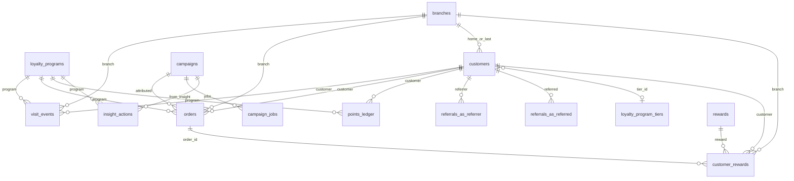

# Backend data contract

**Status:** SPEC-READY (docs-only). Implementation owned by the custom Backend / Database program ([ADR-011](../architecture/decisions/ADR-011-rls-storage-strategy.md) Phase 2, [ADR-014](../architecture/decisions/ADR-014-product-data-ownership.md)).

**Do not** add these tables/columns as migrations in the frontend repo or write them from Next BFF handlers.

**Related:** [api-contract.md](api-contract.md) · [remediation-roadmap.md](remediation-roadmap.md) · [gaps-and-solutions.md](../frontend/gaps-and-solutions.md) · current ER in [system-architecture.md](../frontend/system-architecture.md#database-relationships)

---

## Target ER (additions on top of current schema)



---

## New tables

### `visit_events`

Event-driven check-in / scan log. **Do not** derive Peak Hours, days-between-visits, or return vs first-time from flat `customers.visits` alone.

| Column | Type | Null | Notes |
|--------|------|------|-------|
| `id` | uuid PK | no | default `gen_random_uuid()` |
| `loyalty_program_id` | uuid FK → `loyalty_programs` | no | ON DELETE CASCADE |
| `customer_id` | uuid FK → `customers` | yes | null on anonymous QR view |
| `branch_id` | uuid FK → `branches` | yes | from `?branch=` or staff picker |
| `source` | text | no | `qr_view` \| `check_in` \| `pos` (CHECK constraint) |
| `occurred_at` | timestamptz | no | event time; default `now()` — use for all temporal metrics |
| `created_at` | timestamptz | no | row insert time; default `now()` |

**Required indexes:**

```sql
CREATE INDEX visit_events_program_time_idx
  ON public.visit_events (loyalty_program_id, occurred_at DESC);

CREATE INDEX visit_events_customer_time_idx
  ON public.visit_events (customer_id, occurred_at DESC)
  WHERE customer_id IS NOT NULL;

CREATE INDEX visit_events_branch_time_idx
  ON public.visit_events (branch_id, occurred_at DESC)
  WHERE branch_id IS NOT NULL;

CREATE INDEX visit_events_source_time_idx
  ON public.visit_events (loyalty_program_id, source, occurred_at DESC);
```

**Writer:** join BFF / backend on GET program view (`qr_view`) and on successful enroll/check-in (`check_in`); POS ingest (`pos`).

**Unlocks:** G-01, G-02, parts of G-04, G-12 return rate, Dashboard live activity, Analytics Peak Hours / visit frequency.

#### Standard analytics SQL (visit_events)

Bind `:program_id`, `:from`, `:to`, and optionally `:tz` (IANA zone for peak hours).

**Peak hours**

```sql
SELECT EXTRACT(HOUR FROM occurred_at AT TIME ZONE :tz)::int AS hour,
       COUNT(*) AS visits
FROM visit_events
WHERE loyalty_program_id = :program_id
  AND source = 'check_in'
  AND occurred_at >= :from AND occurred_at < :to
GROUP BY 1
ORDER BY 1;
```

**Average days between visits**

```sql
WITH gaps AS (
  SELECT customer_id,
         EXTRACT(EPOCH FROM (
           occurred_at - LAG(occurred_at) OVER (
             PARTITION BY customer_id ORDER BY occurred_at
           )
         )) / 86400.0 AS days_gap
  FROM visit_events
  WHERE loyalty_program_id = :program_id
    AND source = 'check_in'
    AND customer_id IS NOT NULL
    AND occurred_at >= :from AND occurred_at < :to
)
SELECT AVG(days_gap) AS avg_days_between_visits
FROM gaps
WHERE days_gap IS NOT NULL;
```

**Weekly return vs first-time visitors**

```sql
WITH week_visits AS (
  SELECT customer_id,
         DATE_TRUNC('week', occurred_at) AS wk,
         MIN(occurred_at) AS first_in_week
  FROM visit_events
  WHERE loyalty_program_id = :program_id
    AND source = 'check_in'
    AND customer_id IS NOT NULL
    AND occurred_at >= :from AND occurred_at < :to
  GROUP BY 1, 2
),
first_ever AS (
  SELECT customer_id, MIN(occurred_at) AS first_at
  FROM visit_events
  WHERE loyalty_program_id = :program_id
    AND source = 'check_in'
    AND customer_id IS NOT NULL
  GROUP BY 1
)
SELECT w.wk,
       COUNT(*) FILTER (WHERE w.first_in_week = f.first_at) AS first_time,
       COUNT(*) FILTER (WHERE w.first_in_week > f.first_at) AS returning
FROM week_visits w
JOIN first_ever f USING (customer_id)
GROUP BY 1
ORDER BY 1;
```

These queries are required outputs of [GET `/api/analytics/overview`](api-contract.md#analytics--search) (and/or dedicated analytics endpoints) once Phase 2 ships.

### `orders`

| Column | Type | Null | Notes |
|--------|------|------|-------|
| `id` | uuid PK | no | |
| `loyalty_program_id` | uuid FK | no | |
| `customer_id` | uuid FK | yes | null = non-member ticket |
| `branch_id` | uuid FK | yes | |
| `amount_cents` | integer | no | ≥ 0 |
| `occurred_at` | timestamptz | no | |
| `attributed_channel` | text | yes | `email` \| `sms` \| `in_store` \| … |
| `campaign_id` | uuid FK → `campaigns` | yes | tracking link / promo |

**Writer:** POS integration or manual entry API — **never** the campaign send path.

**Unlocks:** G-06 and all Revenue / LTV widgets. `campaigns.revenue_cents` becomes a **rollup** of attributed orders, not a write target.

### `points_ledger`

| Column | Type | Null | Notes |
|--------|------|------|-------|
| `id` | uuid PK | no | |
| `loyalty_program_id` | uuid FK | no | |
| `customer_id` | uuid FK | no | |
| `delta` | integer | no | positive = issued, negative = redeemed |
| `reason` | text | no | `check_in` \| `redeem` \| `referral` \| `signup_bonus` \| `adjustment` |
| `occurred_at` | timestamptz | no | |
| `order_id` | uuid FK → `orders` | yes | when spend drives points |
| `customer_reward_id` | uuid FK | yes | when redeem |

**Writer:** same transaction as check-in / redeem / referral credit.

**Unlocks:** Analytics points chart, Dashboard “Points Redeemed” truthfulness (with G-20).

### `referrals`

| Column | Type | Null | Notes |
|--------|------|------|-------|
| `id` | uuid PK | no | |
| `loyalty_program_id` | uuid FK | no | |
| `referrer_id` | uuid FK → `customers` | no | |
| `referred_id` | uuid FK → `customers` | yes | set when enroll completes |
| `code` | text | no | unique per program |
| `status` | text | no | `pending` \| `completed` \| `rejected` |
| `points_awarded` | integer | yes | |
| `created_at` | timestamptz | no | |

**Writer:** enroll with `?ref=` / code; credits `referrer_bonus_points` from `referral_settings`.

**Unlocks:** G-14, Customer detail Referrals.

### `campaign_jobs`

| Column | Type | Null | Notes |
|--------|------|------|-------|
| `id` | uuid PK | no | |
| `campaign_id` | uuid FK | no | |
| `status` | text | no | `queued` \| `running` \| `succeeded` \| `failed` |
| `enqueued_at` | timestamptz | no | |
| `started_at` / `finished_at` | timestamptz | yes | |
| `error` | text | yes | |

**Writer:** Backend enqueue API (Next may call it; must not fan-out in-request — [ADR-013](../architecture/decisions/ADR-013-campaign-messaging-runtime.md)). Also written when insight actions `send` / `nudge` enqueue.

**Unlocks:** G-09 send reliability; pairs with ESP webhooks for `opened_count` and automation runner; insight CTAs ([api-contract.md](api-contract.md#insights--nudge-automation)).

### `insight_actions`

Audit log for Analytics Engagement insight CTAs (Send / Nudge / Create). Prevents dead UI buttons; every click must create a campaign draft and optionally enqueue a job.

| Column | Type | Null | Notes |
|--------|------|------|-------|
| `id` | uuid PK | no | default `gen_random_uuid()` |
| `loyalty_program_id` | uuid FK → `loyalty_programs` | no | ON DELETE CASCADE |
| `owner_id` | uuid | no | acting owner (`auth.uid()` / profiles) |
| `insight_key` | text | no | e.g. `at_risk_churn`, `one_visit_from_reward`, `tier_upgrade` |
| `action` | text | no | `send` \| `nudge` \| `create` (CHECK) |
| `campaign_id` | uuid FK → `campaigns` | yes | draft or launched campaign created from the insight |
| `campaign_job_id` | uuid FK → `campaign_jobs` | yes | set when action enqueues send |
| `audience_filter` | jsonb | no | default `{}` — snapshot of segment SQL params used |
| `created_at` | timestamptz | no | default `now()` |

**Writer:** `POST /api/insights/:key/actions` only.

**Unlocks:** Analytics insight CTAs; ties dynamic audience queries to messaging ([api-contract.md](api-contract.md#insights--nudge-automation)).

---

## Changes to existing tables

### `customers` — tier linkage (required)

| Column | Type | Null | Notes |
|--------|------|------|-------|
| `tier` | text | yes | denormalized display name from ladder; **must be written** |
| `tier_id` | uuid FK → `loyalty_program_tiers` | yes | ON DELETE SET NULL — canonical ladder link |
| `branch_id` | uuid FK → `branches` | yes | home / last check-in branch |

`tier_id` is **required in the target schema** (not optional “or keep text only”). Keep `tier` text for filters/ILIKE audiences (VIP/Gold) but always set both from `assign_customer_tier`.

### `rewards` — cash cost (required)

| Column | Type | Null | Notes |
|--------|------|------|-------|
| `point_cost` | integer | yes | points the **customer** burns (already exists) |
| `cost_cents` | integer | no | **mandatory**; default `0`; CHECK `>= 0` — merchant cash cost of honouring one redemption |

`point_cost` ≠ money. ROI uses `cost_cents` only.

### `customer_rewards` — order + branch linkage

| Column | Type | Null | Notes |
|--------|------|------|-------|
| `order_id` | uuid FK → `orders` | yes | ticket linked at redeem; **required for ROI inclusion** |
| `branch_id` | uuid FK → `branches` | yes | where reward was earned/redeemed |

Prefer extending `customer_rewards` over a second `redemptions` table.

### Summary table

| Change | Purpose | Gaps |
|--------|---------|------|
| `customers.tier_id` uuid FK → `loyalty_program_tiers` + write `tier` | Dynamic ladder; analytics donut | G-03 |
| `customers.branch_id` nullable | Home / last check-in branch | G-04, G-13 |
| `customer_rewards.branch_id` nullable | Where reward was earned/redeemed | G-04 |
| `customer_rewards.order_id` nullable FK → `orders` | ROI / redeem ticket link | G-06, G-20 |
| `rewards.cost_cents` integer NOT NULL DEFAULT 0 | Cash cost (`point_cost` ≠ money) | Analytics ROI |
| Enforce writers for `campaigns.opened_count`, rollup for `revenue_cents` | Stop dead performance columns | G-06, G-09 |

---

## Database functions — dynamic tier progression

Tier must update automatically whenever `customers.points` or `customers.visits` change (check-in, redeem, referral, adjustment, POS), not only when application code remembers to call a writer. Ladder edits must recompute the whole program.

### `assign_customer_tier(p_customer_id uuid)`

Sets `customers.tier_id` and `customers.tier` to the highest `loyalty_program_tiers` row for that program where `points_threshold` ≤ current metric:

- Metric = `customers.visits` when `loyalty_programs.tier_measured_by = 'visits'`
- Otherwise metric = `customers.points`

```sql
CREATE OR REPLACE FUNCTION public.assign_customer_tier(p_customer_id uuid)
RETURNS void
LANGUAGE plpgsql
SECURITY DEFINER
SET search_path = public
AS $$
DECLARE
  v_program_id uuid;
  v_points int;
  v_visits int;
  v_measured text;
  v_tier_id uuid;
  v_tier_name text;
BEGIN
  SELECT c.loyalty_program_id, c.points, c.visits, lp.tier_measured_by
  INTO v_program_id, v_points, v_visits, v_measured
  FROM customers c
  JOIN loyalty_programs lp ON lp.id = c.loyalty_program_id
  WHERE c.id = p_customer_id
  FOR UPDATE OF c;

  SELECT t.id, t.name
  INTO v_tier_id, v_tier_name
  FROM loyalty_program_tiers t
  WHERE t.loyalty_program_id = v_program_id
    AND t.points_threshold <= CASE
          WHEN v_measured = 'visits' THEN v_visits
          ELSE v_points
        END
  ORDER BY t.points_threshold DESC
  LIMIT 1;

  UPDATE customers
  SET tier_id = v_tier_id,
      tier = v_tier_name,
      updated_at = now()
  WHERE id = p_customer_id;
END;
$$;
```

Call explicitly on enroll (base tier) and inside multi-table transactions if useful; the trigger below covers point/visit updates.

### Trigger `customers_reassign_tier`

```sql
CREATE OR REPLACE FUNCTION public.trg_customers_reassign_tier()
RETURNS trigger
LANGUAGE plpgsql
AS $$
BEGIN
  IF NEW.points IS DISTINCT FROM OLD.points
     OR NEW.visits IS DISTINCT FROM OLD.visits THEN
    PERFORM public.assign_customer_tier(NEW.id);
  END IF;
  RETURN NEW;
END;
$$;

CREATE TRIGGER customers_reassign_tier
AFTER UPDATE OF points, visits ON public.customers
FOR EACH ROW
EXECUTE FUNCTION public.trg_customers_reassign_tier();
```

### `recompute_program_tiers(p_program_id uuid)`

Bulk reassignment after ladder CRUD (threshold / name / measured-by changes):

```sql
CREATE OR REPLACE FUNCTION public.recompute_program_tiers(p_program_id uuid)
RETURNS void
LANGUAGE sql
AS $$
  SELECT public.assign_customer_tier(c.id)
  FROM customers c
  WHERE c.loyalty_program_id = p_program_id;
$$;
```

**Backend:** invoke `recompute_program_tiers` after any insert/update/delete on `loyalty_program_tiers` for that program (or defer via a short job for large member bases).

**Analytics:** Members-by-tier donut / filters read assigned `customers.tier` / `tier_id` (updated by the mechanism above), not hardcoded zeros or null-only buckets.

---

## Reward ROI (formula + SQL)

**Meaning:** Did honouring rewards produce net profit?

```text
ROI % = (Attributed Revenue − Total Reward Cost) / Total Reward Cost × 100
```

| Factor | Source |
|--------|--------|
| **Attributed Revenue** | `SUM(orders.amount_cents)` on tickets linked via `customer_rewards.order_id` |
| **Total Reward Cost** | `SUM(rewards.cost_cents)` for those same redemption rows |

**Rules:**

1. Include only redemptions with `redeemed_at IS NOT NULL` and `order_id IS NOT NULL`.
2. `point_cost` must never enter the ROI formula.
3. If `Total Reward Cost = 0`, return `NULL` (UI shows `"—"`) — never fake `0%`.
4. Redeem path should create/attach an `orders` row and set `customer_rewards.order_id` in the same transaction when a ticket exists; redemptions without `order_id` are excluded from ROI until linked.

**Canonical SQL** (also required by Analytics API):

```sql
WITH reward_metrics AS (
  SELECT
    SUM(r.cost_cents) AS total_investment,
    SUM(o.amount_cents) AS total_return
  FROM customer_rewards red
  JOIN rewards r ON red.reward_id = r.id
  JOIN orders o ON red.order_id = o.id
  WHERE r.loyalty_program_id = :program_id
    AND red.redeemed_at IS NOT NULL
    AND red.order_id IS NOT NULL
    AND red.redeemed_at >= :from
    AND red.redeemed_at < :to
)
SELECT
  CASE
    WHEN COALESCE(total_investment, 0) = 0 THEN NULL
    ELSE ((total_return - total_investment)::numeric / total_investment) * 100
  END AS roi_percentage,
  COALESCE(total_return, 0) AS attributed_revenue_cents,
  COALESCE(total_investment, 0) AS total_reward_cost_cents
FROM reward_metrics;
```

---

## Binding write rules

1. **`visit_events` + denormalized counters:** when `customer_id` is set on check-in, insert the event and update `customers.visits` + `last_activity_at` in the **same transaction**. Temporal analytics always query `visit_events`, not the counter alone.
2. **Tier assignment:** `assign_customer_tier` + trigger `customers_reassign_tier` keep `tier` / `tier_id` in sync on every points/visits change. Enroll calls the function for the base tier. Ladder edits call `recompute_program_tiers`.
3. **`campaigns.revenue_cents`:** derived/rollup from `orders` where `campaign_id` matches — not a column the UI or send path writes.
4. **Earn vs redeem:** check-in may insert `customer_rewards` with `status=earned`; only an explicit redeem path sets `redeemed_at`, increments `rewards.redeemed_count`, and attaches `order_id` (+ optional `branch_id`) when a ticket is present.
5. **ROI exclusion:** redemptions without `order_id` or with `cost_cents` totaling 0 do not produce a numeric ROI.
6. **Insight CTAs:** Send / Nudge / Create must call `POST /api/insights/:key/actions`, insert `insight_actions`, create a draft campaign from the insight audience, and enqueue `campaign_jobs` for `send` / `nudge` — never no-op UI.
7. **Plan / billing:** checkout + webhook are the only writers of `profiles.plan`. Branch insert and enroll must enforce `PLAN_LIMITS` / contact caps server-side.
8. **Authz:** owner-scoped to `loyalty_program_id` / `owner_id`. Service-role only in workers and public enroll ([ADR-006](../architecture/decisions/ADR-006-server-boundaries.md)).

---

## Unified glossary

One meaning everywhere (Dashboard, Customers, Analytics, Campaigns). Do not mix the previous colliding labels.

| Term | Canonical meaning | Source of truth |
|------|-------------------|-----------------|
| **At risk** | No `last_activity_at` in the last **30 days** (configurable later, same module) | Shared rules module; optionally nightly job writes `customers.status = 'at_risk'` |
| **Active (member)** | `customers.status = 'active'` **or** activity within the at-risk window — pick one and document in the rules module | Same module; Campaigns audience string must be `at_risk` (underscore), not `at-risk` |
| **Champion / Gold / VIP** | Loyalty **tier** from `loyalty_program_tiers` / assigned `customers.tier` + `tier_id` | Not visit-count engagement buckets |
| **Engagement buckets** (Champions / Loyal / … on Analytics Engagement) | Visit + recency heuristics — **labels must not reuse tier names** if cutoffs differ | Shared module; exclusive buckets |
| **Revenue** | `sum(orders.amount_cents)` in period | Never `campaigns.revenue_cents` as GMV |
| **ROI from Rewards** | `(attributed order revenue − Σ cost_cents) / Σ cost_cents` for linked redemptions | [Reward ROI](#reward-roi-formula--sql) |
| **Active (campaign)** | `campaigns.status` | Unrelated to member status |

Full collision history: [analytics-page.md](../frontend/analytics-page.md#three-different-systems-do-not-mix-them).

---

## What already exists (do not rebuild)

See [gaps-and-solutions.md § What already exists](../frontend/gaps-and-solutions.md#what-already-exists-do-not-rebuild). Reuse `customers`, `loyalty_programs`, `loyalty_program_tiers`, `rewards`, `customer_rewards`, `qr_page_settings`, `referral_settings`, `branches`, notifications, integrations, join `recordCheckIn`, and email RPCs.
