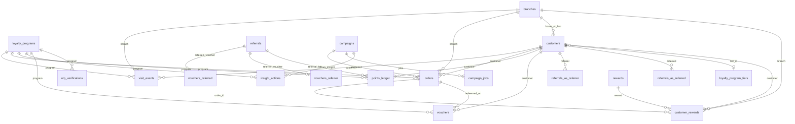
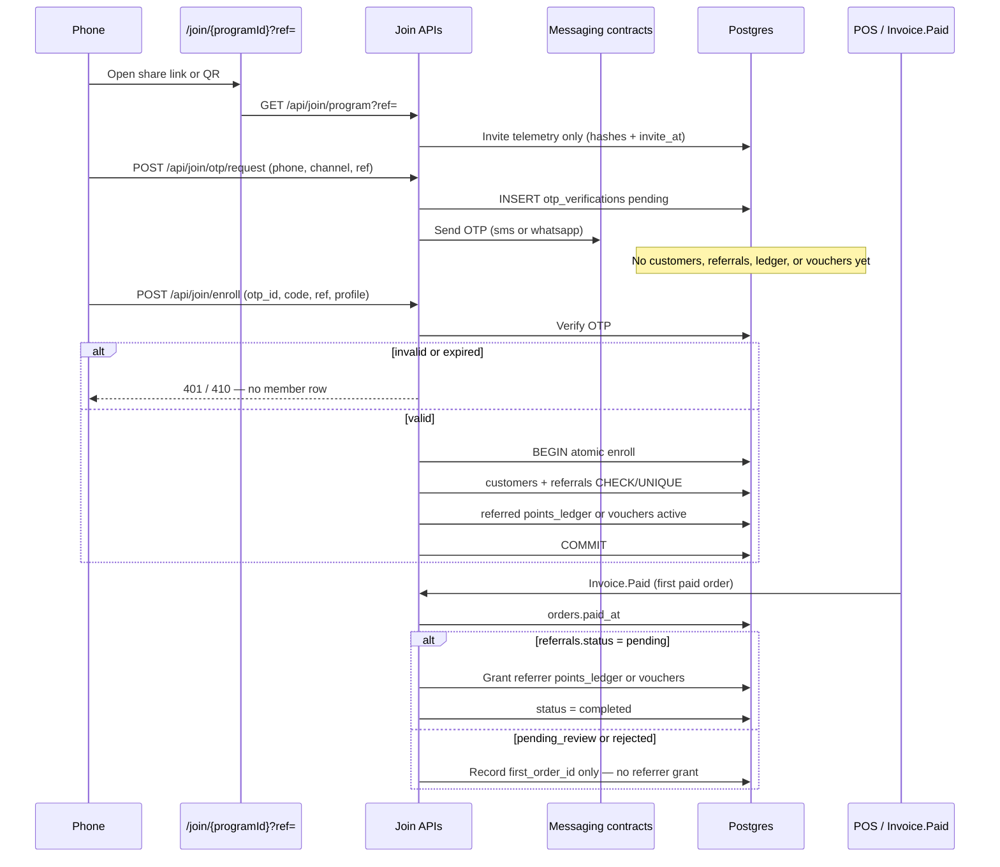

# Backend data contract

**Status:** SPEC-READY (docs-only). Implementation owned by the custom Backend / Database program ([ADR-011](../architecture/decisions/ADR-011-rls-storage-strategy.md) Phase 2, [ADR-014](../architecture/decisions/ADR-014-product-data-ownership.md)).

**Do not** add these tables/columns as migrations in the frontend repo or write them from Next BFF handlers.

**Related:** [api-contract.md](api-contract.md) · [remediation-roadmap.md](remediation-roadmap.md) · [gaps-and-solutions.md](../frontend/gaps-and-solutions.md) · current ER in [system-architecture.md](../frontend/system-architecture.md#database-relationships)

---

## Target ER (additions on top of current schema)



---

## New tables

### `visit_events`

Event-driven check-in / scan log. **Do not** derive Peak Hours, days-between-visits, or return vs first-time from flat `customers.visits` alone.

| Column | Type | Null | Notes |
|--------|------|------|-------|
| `id` | uuid PK | no | default `gen_random_uuid()` |
| `loyalty_program_id` | uuid FK → `loyalty_programs` | no | ON DELETE CASCADE |
| `customer_id` | uuid FK → `customers` | yes | null on anonymous QR view |
| `branch_id` | uuid FK → `branches` | yes | from `?branch=` or staff picker |
| `source` | text | no | `qr_view` \| `check_in` \| `pos` (CHECK constraint) |
| `occurred_at` | timestamptz | no | event time; default `now()` — use for all temporal metrics |
| `created_at` | timestamptz | no | row insert time; default `now()` |

**Required indexes:**

```sql
CREATE INDEX visit_events_program_time_idx
  ON public.visit_events (loyalty_program_id, occurred_at DESC);

CREATE INDEX visit_events_customer_time_idx
  ON public.visit_events (customer_id, occurred_at DESC)
  WHERE customer_id IS NOT NULL;

CREATE INDEX visit_events_branch_time_idx
  ON public.visit_events (branch_id, occurred_at DESC)
  WHERE branch_id IS NOT NULL;

CREATE INDEX visit_events_source_time_idx
  ON public.visit_events (loyalty_program_id, source, occurred_at DESC);
```

**Writer:** join BFF / backend on GET program view (`qr_view`) and on successful enroll/check-in (`check_in`); POS ingest (`pos`).

**Unlocks:** G-01, G-02, parts of G-04, G-12 return rate, Dashboard live activity, Analytics Peak Hours / visit frequency.

#### Standard analytics SQL (visit_events)

Bind `:program_id`, `:from`, `:to`, and optionally `:tz` (IANA zone for peak hours).

**Peak hours**

```sql
SELECT EXTRACT(HOUR FROM occurred_at AT TIME ZONE :tz)::int AS hour,
       COUNT(*) AS visits
FROM visit_events
WHERE loyalty_program_id = :program_id
  AND source = 'check_in'
  AND occurred_at >= :from AND occurred_at < :to
GROUP BY 1
ORDER BY 1;
```

**Average days between visits**

```sql
WITH gaps AS (
  SELECT customer_id,
         EXTRACT(EPOCH FROM (
           occurred_at - LAG(occurred_at) OVER (
             PARTITION BY customer_id ORDER BY occurred_at
           )
         )) / 86400.0 AS days_gap
  FROM visit_events
  WHERE loyalty_program_id = :program_id
    AND source = 'check_in'
    AND customer_id IS NOT NULL
    AND occurred_at >= :from AND occurred_at < :to
)
SELECT AVG(days_gap) AS avg_days_between_visits
FROM gaps
WHERE days_gap IS NOT NULL;
```

**Weekly return vs first-time visitors**

```sql
WITH week_visits AS (
  SELECT customer_id,
         DATE_TRUNC('week', occurred_at) AS wk,
         MIN(occurred_at) AS first_in_week
  FROM visit_events
  WHERE loyalty_program_id = :program_id
    AND source = 'check_in'
    AND customer_id IS NOT NULL
    AND occurred_at >= :from AND occurred_at < :to
  GROUP BY 1, 2
),
first_ever AS (
  SELECT customer_id, MIN(occurred_at) AS first_at
  FROM visit_events
  WHERE loyalty_program_id = :program_id
    AND source = 'check_in'
    AND customer_id IS NOT NULL
  GROUP BY 1
)
SELECT w.wk,
       COUNT(*) FILTER (WHERE w.first_in_week = f.first_at) AS first_time,
       COUNT(*) FILTER (WHERE w.first_in_week > f.first_at) AS returning
FROM week_visits w
JOIN first_ever f USING (customer_id)
GROUP BY 1
ORDER BY 1;
```

These queries are required outputs of [GET `/api/analytics/overview`](api-contract.md#analytics--search) (and/or dedicated analytics endpoints) once Phase 2 ships.

### `orders`

| Column | Type | Null | Notes |
|--------|------|------|-------|
| `id` | uuid PK | no | |
| `loyalty_program_id` | uuid FK | no | |
| `customer_id` | uuid FK | yes | null = non-member ticket |
| `branch_id` | uuid FK | yes | |
| `amount_cents` | integer | no | ≥ 0 |
| `occurred_at` | timestamptz | no | ticket time |
| `paid_at` | timestamptz | yes | set **only** by the `Invoice.Paid` writer. Null = unpaid / draft — **must not** grant the referrer |
| `attributed_channel` | text | yes | `email` \| `sms` \| `in_store` \| … |
| `campaign_id` | uuid FK → `campaigns` | yes | tracking link / promo |

**Writer:** POS integration or manual entry API — **never** the campaign send path. Creating an unpaid `orders` row does **not** grant referral rewards. The **first** row for that customer in the program with `paid_at IS NOT NULL` (`Invoice.Paid`) grants the **referrer** in the same transaction **if** `referrals.status = pending` ([write rule 12](#binding-write-rules)).

**Index:** `(customer_id, paid_at)` WHERE `paid_at IS NOT NULL` — first-paid lookup.

**Unlocks:** G-06 and all Revenue / LTV widgets. `campaigns.revenue_cents` becomes a **rollup** of attributed **paid** orders, not a write target.

### `points_ledger`

| Column | Type | Null | Notes |
|--------|------|------|-------|
| `id` | uuid PK | no | |
| `loyalty_program_id` | uuid FK | no | |
| `customer_id` | uuid FK | no | |
| `delta` | integer | no | positive = issued, negative = redeemed |
| `reason` | text | no | `check_in` \| `redeem` \| `referral` \| `signup_bonus` \| `adjustment` |
| `occurred_at` | timestamptz | no | |
| `expires_at` | timestamptz | yes | required on **issued** lots (`delta > 0`) when that source has an expiry window; null only if that source’s expiry is 0 / off. Spend/adjust rows may be null |
| `order_id` | uuid FK → `orders` | yes | when spend drives points; also the referred customer’s **first paid invoice** when crediting the referrer |
| `customer_reward_id` | uuid FK | yes | when redeem |
| `referral_id` | uuid FK → `referrals` | yes | when `reason = referral` |

**Writer:** same transaction as check-in / redeem / referral credit.

**Expiry source (DECIDED):**

| Lot `reason` | `expires_at` |
|--------------|--------------|
| `referral` | grant time + `referral_settings.points_expiry_days` |
| `check_in`, `signup_bonus`, other issued | grant time + `loyalty_programs.points_expiry_months` when that value is `> 0`; else null |
| `redeem` / negative `adjustment` | null (they consume lots; they do not expire) |

Lots are **program-scoped**. Program 1’s 100 points and program 2’s 200 points are different `loyalty_program_id` values and must never be summed for spend or for the customer wallet.

**Unlocks:** Analytics points chart, Dashboard “Points Redeemed” truthfulness (with G-20). Do not spend a lot after `expires_at`. Customer wallet: [loyalty-page.md](../frontend/loyalty-page.md#customer-wallet-per-program-decided).

### `referrals`

Attribution event: one row per **new** member who joined via a referrer’s share. Product rules: [loyalty-page.md — referral rewards](../frontend/loyalty-page.md#referral-rewards-decided) · [fraud controls](../frontend/loyalty-page.md#referral-fraud-controls-decided).

| Column | Type | Null | Notes |
|--------|------|------|-------|
| `id` | uuid PK | no | |
| `loyalty_program_id` | uuid FK | no | |
| `referrer_id` | uuid FK → `customers` | no | existing member who shared |
| `referred_id` | uuid FK → `customers` | no | new member; set when enroll/register completes |
| `code` | text | no | snapshot of `customers.referral_code` used at join |
| `status` | text | no | `pending` (referred granted; waiting first **paid** invoice) \| `pending_review` (device/IP match — **Pending Review**; referrer grant blocked) \| `completed` (referrer granted) \| `rejected` |
| `first_order_id` | uuid FK → `orders` | yes | referred customer’s first **paid** invoice; may be set while `pending_review` without granting |
| `referred_granted_at` | timestamptz | yes | when the **new** member’s reward was issued (OTP-verified enroll) |
| `referrer_granted_at` | timestamptz | yes | when the **existing** member’s reward was issued (`Invoice.Paid`, and not `pending_review`) |
| `referred_voucher_id` | uuid FK → `vouchers` | yes | when referred kind = `discount` |
| `referrer_voucher_id` | uuid FK → `vouchers` | yes | when referrer kind = `discount` |
| `otp_verification_id` | uuid FK → `otp_verifications` | yes | the verified challenge that authorized this enroll |
| `invite_at` | timestamptz | yes | join-page open with this `ref` (or equivalent share open) |
| `enroll_at` | timestamptz | no | registration time (usually `created_at`) |
| `invite_ip_hash` | text | yes | hashed public IP at invite open |
| `enroll_ip_hash` | text | yes | hashed public IP at enroll |
| `invite_device_hash` | text | yes | device fingerprint hash at invite open |
| `enroll_device_hash` | text | yes | device fingerprint hash at enroll |
| `flag_reason` | text | yes | `same_device` \| `same_network` \| `same_device_and_network` when `pending_review` |
| `created_at` | timestamptz | no | |

**Constraints (hard — INSERT fails; do not write a `rejected` row instead):**

```sql
ALTER TABLE referrals
  ADD CONSTRAINT referrals_not_self_chk
    CHECK (referrer_id <> referred_id),
  ADD CONSTRAINT referrals_status_chk
    CHECK (status IN ('pending', 'pending_review', 'completed', 'rejected')),
  ADD CONSTRAINT referrals_referred_id_uidx UNIQUE (referred_id);

CREATE INDEX referrals_referrer_idx ON referrals (referrer_id);
CREATE INDEX referrals_program_status_idx ON referrals (loyalty_program_id, status);
```

**Writer:**

1. **Join GET** with `?ref=`: persist invite telemetry (`invite_at`, `invite_ip_hash`, `invite_device_hash`) keyed by code + program so enroll can compare. Hash IP and device; do not store raw IP as the product field. **Do not** insert `customers` / `referrals` / rewards.
2. **OTP request** (`POST /api/join/otp/request`): insert `otp_verifications` only. Still no customer, referral, ledger, or voucher rows.
3. **Enroll / register** (`POST /api/join/enroll`) **after OTP verify**: in **one transaction** — mark OTP verified → INSERT `customers` → INSERT `referrals` (DB refuses `referrer_id = referred_id` or a second `referred_id`) → grant **referred** reward ([write rule 12](#binding-write-rules)). Set `status = pending_review` when invite and enroll share the **same device hash** or the **same IP hash** and `date_trunc('minute', invite_at) = date_trunc('minute', enroll_at)` (UTC). If no invite-open row exists, compare enroll hashes to the referrer’s last known device/IP and that activity’s minute. Else `status = pending`. **Never** finalize those rows if OTP is missing, expired, or failed.
4. **`Invoice.Paid`** (first `orders.paid_at` for that `referred_id`): set `first_order_id`. Grant the **referrer** reward, set `referrer_granted_at`, `status = completed` **only if** current status is `pending` (not `pending_review`, not `rejected`). Unpaid `orders` inserts do **not** grant.
5. **Review** of `pending_review`: `pending` (eligible — if `first_order_id` is already a **paid** order, grant referrer and set `completed` in the same transaction) or `rejected` (never grant referrer).

Returning check-in with `?ref=` does **not** create a referral (already a member). Check-in does **not** require a new OTP.

**Unlocks:** G-14, Customer detail Referrals, referral leaderboard.

### `otp_verifications`

Pending identity challenge for **new** public registration (join / shop-customer self-register). This is the **only** persistence allowed before OTP succeeds. Product: [loyalty-page.md — OTP](../frontend/loyalty-page.md#otp-verification-decided).

| Column | Type | Null | Notes |
|--------|------|------|-------|
| `id` | uuid PK | no | default `gen_random_uuid()` |
| `loyalty_program_id` | uuid FK → `loyalty_programs` | no | ON DELETE CASCADE |
| `phone` | text | no | E.164 |
| `channel` | text | no | `sms` \| `whatsapp` (CHECK) |
| `code_hash` | text | no | hashed OTP — **never** store the plaintext code |
| `expires_at` | timestamptz | no | challenge TTL (duration **not** locked; backend-owned) |
| `verified_at` | timestamptz | yes | set when enroll consumes a valid code |
| `consumed_at` | timestamptz | yes | one-time use; set in the enroll transaction |
| `attempts` | integer | no | default `0`; cap is backend-owned |
| `status` | text | no | `pending` \| `verified` \| `expired` \| `failed` (CHECK) |
| `ref` | text | yes | snapshot of `?ref=` / body `ref` at request time |
| `ip_hash` | text | yes | hashed public IP at request |
| `device_hash` | text | yes | device fingerprint hash at request |
| `created_at` | timestamptz | no | default `now()` |

**Constraints / indexes:**

```sql
ALTER TABLE otp_verifications
  ADD CONSTRAINT otp_verifications_channel_chk
    CHECK (channel IN ('sms', 'whatsapp')),
  ADD CONSTRAINT otp_verifications_status_chk
    CHECK (status IN ('pending', 'verified', 'expired', 'failed'));

CREATE INDEX otp_verifications_phone_program_idx
  ON otp_verifications (loyalty_program_id, phone, created_at DESC);

CREATE UNIQUE INDEX otp_verifications_one_pending_idx
  ON otp_verifications (loyalty_program_id, phone)
  WHERE status = 'pending';
```

**Writer:** `POST /api/join/otp/request` inserts `pending`. Enroll marks `verified` + `consumed_at` in the same transaction as `customers` insert. Send the code through [messaging contracts](../frontend/17-messaging-templates.md) (`sms` or `whatsapp` adapter) — do not bind a vendor. Rate-limit with enroll ([ADR-012](../architecture/decisions/ADR-012-public-enrollment-rate-limiting.md)).

**Unlocks:** G-14 integrity, G-33 self-register.

### `vouchers`

Discount **award / coupon** for future use. Referral `discount` kind **must** write here — **not** `customer_rewards`, and **not** a percent on the join bill or current cart. Catalog earn/redeem (Rewards tab) stays on `customer_rewards`.

| Column | Type | Null | Notes |
|--------|------|------|-------|
| `id` | uuid PK | no | default `gen_random_uuid()` |
| `loyalty_program_id` | uuid FK → `loyalty_programs` | no | ON DELETE CASCADE |
| `customer_id` | uuid FK → `customers` | no | |
| `referral_id` | uuid FK → `referrals` | yes | set when issued from a referral discount grant |
| `discount_pct` | integer | no | CHECK `> 0` |
| `status` | text | no | `active` \| `used` \| `expired` (CHECK) |
| `expires_at` | timestamptz | no | grant time + `referral_settings.voucher_expiry_days` for referral awards |
| `used_at` | timestamptz | yes | set when redeemed |
| `order_id` | uuid FK → `orders` | yes | ticket linked **at redeem**; never auto-applied at issue |
| `created_at` | timestamptz | no | default `now()` |

**State:** `active` → `used` (redeem) or `expired` (`now() >= expires_at`; job or check-on-read). `used` / `expired` are terminal. Redeem of `expired` or `used` is a no-op / `409`.

**Constraints / indexes:**

```sql
ALTER TABLE vouchers
  ADD CONSTRAINT vouchers_status_chk
    CHECK (status IN ('active', 'used', 'expired')),
  ADD CONSTRAINT vouchers_discount_pct_chk
    CHECK (discount_pct > 0),
  ADD CONSTRAINT vouchers_used_order_chk
    CHECK (
      (status = 'used' AND used_at IS NOT NULL AND order_id IS NOT NULL)
      OR (status <> 'used')
    );

CREATE INDEX vouchers_customer_active_idx
  ON vouchers (customer_id, loyalty_program_id)
  WHERE status = 'active';

CREATE INDEX vouchers_expires_idx
  ON vouchers (expires_at)
  WHERE status = 'active';
```

**Writer:** referral grant transaction (referred at OTP-verified enroll; referrer on `Invoice.Paid`). Redeem path sets `used` + `order_id` — do **not** mutate a cart/invoice at grant time.

**Unlocks:** G-14 discount kind; customer wallet vouchers.

### Referral lifecycle (atomic)



Illustrative enroll transaction (backend-owned; **do not** add this migration in the frontend repo):

```sql
BEGIN;

UPDATE otp_verifications
SET status = 'verified', verified_at = now(), consumed_at = now()
WHERE id = :otp_id
  AND status = 'pending'
  AND expires_at > now()
  AND code_hash = crypt(:otp_code, code_hash);

-- 0 rows → ROLLBACK (OTP not finalized)

INSERT INTO customers (/* ... */, phone, referral_code, loyalty_program_id)
VALUES (/* ... */)
RETURNING id AS referred_id;

INSERT INTO referrals (
  loyalty_program_id, referrer_id, referred_id, code, status,
  otp_verification_id, enroll_at, enroll_ip_hash, enroll_device_hash
) VALUES (
  :program_id, :referrer_id, :referred_id, :ref, :status, -- pending | pending_review
  :otp_id, now(), :enroll_ip_hash, :enroll_device_hash
);

-- kind = points:
INSERT INTO points_ledger (
  loyalty_program_id, customer_id, delta, reason, expires_at, referral_id
) VALUES (
  :program_id, :referred_id, :pts, 'referral',
  now() + (:points_expiry_days || ' days')::interval, :referral_id
);

-- kind = discount:
INSERT INTO vouchers (
  loyalty_program_id, customer_id, referral_id, discount_pct,
  status, expires_at
) VALUES (
  :program_id, :referred_id, :referral_id, :pct,
  'active', now() + (:voucher_expiry_days || ' days')::interval
);

COMMIT;
```

`CHECK (referrer_id <> referred_id)` and `UNIQUE (referred_id)` abort the transaction on self-invite or a second attribution.

Illustrative `Invoice.Paid` (same transaction as setting `paid_at`):

```sql
UPDATE orders SET paid_at = now() WHERE id = :order_id AND paid_at IS NULL;

-- Grant referrer only on the customer's first paid invoice in this program
-- and only if referrals.status = 'pending'. See write rule 12.
```

**Unlocks:** G-14, Customer detail Referrals, referral leaderboard.

### `campaign_jobs`

| Column | Type | Null | Notes |
|--------|------|------|-------|
| `id` | uuid PK | no | |
| `campaign_id` | uuid FK | no | |
| `status` | text | no | `queued` \| `running` \| `succeeded` \| `failed` |
| `enqueued_at` | timestamptz | no | |
| `started_at` / `finished_at` | timestamptz | yes | |
| `error` | text | yes | |

**Writer:** Backend enqueue API (Next may call it; must not fan-out in-request — [ADR-013](../architecture/decisions/ADR-013-campaign-messaging-runtime.md)). Also written when insight actions `send` / `nudge` enqueue.

**Unlocks:** G-09 send reliability; pairs with ESP webhooks for `opened_count` and automation runner; insight CTAs ([api-contract.md](api-contract.md#insights--nudge-automation)).

### `insight_actions`

Audit log for Analytics Engagement insight CTAs (Send / Nudge / Create). Prevents dead UI buttons; every click must create a campaign draft and optionally enqueue a job.

| Column | Type | Null | Notes |
|--------|------|------|-------|
| `id` | uuid PK | no | default `gen_random_uuid()` |
| `loyalty_program_id` | uuid FK → `loyalty_programs` | no | ON DELETE CASCADE |
| `owner_id` | uuid | no | acting owner (`auth.uid()` / profiles) |
| `insight_key` | text | no | e.g. `at_risk_churn`, `one_visit_from_reward`, `tier_upgrade` |
| `action` | text | no | `send` \| `nudge` \| `create` (CHECK) |
| `campaign_id` | uuid FK → `campaigns` | yes | draft or launched campaign created from the insight |
| `campaign_job_id` | uuid FK → `campaign_jobs` | yes | set when action enqueues send |
| `audience_filter` | jsonb | no | default `{}` — snapshot of segment SQL params used |
| `created_at` | timestamptz | no | default `now()` |

**Writer:** `POST /api/insights/:key/actions` only.

**Unlocks:** Analytics insight CTAs; ties dynamic audience queries to messaging ([api-contract.md](api-contract.md#insights--nudge-automation)).

---

## Changes to existing tables

### `customers` — tier linkage (required)

| Column | Type | Null | Notes |
|--------|------|------|-------|
| `tier` | text | yes | denormalized display name from ladder; **must be written** |
| `tier_id` | uuid FK → `loyalty_program_tiers` | yes | ON DELETE SET NULL — canonical ladder link |
| `branch_id` | uuid FK → `branches` | yes | home / last check-in branch |
| `referral_code` | text | no | stable per member; unique per program; generated at enroll. Share URL `/join/{programId}?ref={referral_code}` and personal QR encode that URL |
| `phone` | text | no* | E.164. *Required on public join / self-register (OTP). Owner Add Customer may still omit until filled |
| `phone_verified_at` | timestamptz | yes | set in the OTP-verified enroll transaction; null for owner-typed rows until the customer verifies |

`tier_id` is **required in the target schema** (not optional “or keep text only”). Keep `tier` text for filters/ILIKE audiences (VIP/Gold) but always set both from `assign_customer_tier`.

Unique: `(loyalty_program_id, referral_code)`.

### `rewards` — cash cost (required)

| Column | Type | Null | Notes |
|--------|------|------|-------|
| `point_cost` | integer | yes | points the **customer** burns (already exists) |
| `cost_cents` | integer | no | **mandatory**; default `0`; CHECK `>= 0` — merchant cash cost of honouring one redemption |

`point_cost` ≠ money. ROI uses `cost_cents` only.

### `customer_rewards` — order + branch linkage

| Column | Type | Null | Notes |
|--------|------|------|-------|
| `order_id` | uuid FK → `orders` | yes | ticket linked at redeem; **required for ROI inclusion** |
| `branch_id` | uuid FK → `branches` | yes | where reward was earned/redeemed |

Prefer extending `customer_rewards` over a second **catalog** redemptions table. **Referral / coupon discounts do not live here** — they are `vouchers` (`active` → `used` / `expired`). Do not auto-apply a % on the join bill or current cart. Do not add `referral_id` on `customer_rewards`.

### `referral_settings` — both-party kinds + expiry

Existing row (one per program): `enabled`, `referrer_bonus_points`, `new_customer_discount_pct`. Target additions:

| Column | Type | Null | Notes |
|--------|------|------|-------|
| `referrer_reward_kind` | text | no | `points` \| `discount`. Default `points` (today’s UI) |
| `referred_reward_kind` | text | no | `points` \| `discount`. Default `discount` (today’s UI) |
| `referrer_bonus_points` | integer | no | used when referrer kind = `points` (already exists; default 300) |
| `referred_bonus_points` | integer | no | used when referred kind = `points`; default `0` until set |
| `referrer_discount_pct` | integer | no | used when referrer kind = `discount`; default `0` until set |
| `new_customer_discount_pct` | integer | no | used when referred kind = `discount` (already exists; default 15) |
| `points_expiry_days` | integer | no | `> 0`; `expires_at` on referral point lots = grant time + this |
| `voucher_expiry_days` | integer | no | `> 0`; `expires_at` on referral vouchers = grant time + this |

Default **day counts are not locked** (shop configures). Amounts keep today’s 300 / 15% defaults. Kind must match the amount field used (`points` → bonus points > 0; `discount` → pct > 0).

### Summary table

| Change | Purpose | Gaps |
|--------|---------|------|
| `customers.tier_id` uuid FK → `loyalty_program_tiers` + write `tier` | Dynamic ladder; analytics donut | G-03 |
| `customers.branch_id` nullable | Home / last check-in branch | G-04, G-13 |
| `customers.referral_code` unique per program | Personal share link / QR | G-14 |
| `referrals` CHECK `referrer_id <> referred_id` + UNIQUE `referred_id` + device/IP hashes | Hard self-invite reject; once-in-lifetime attribution; Pending Review | G-14 |
| `otp_verifications` | OTP via SMS/WhatsApp before customer/referral/reward rows | G-14, G-33 |
| `vouchers` (`active` \| `used` \| `expired`) | Referral discount award; not cart auto-apply; not `customer_rewards` | G-14 |
| `customers.phone_verified_at` | OTP-verified public enroll | G-14, G-33 |
| `orders.paid_at` | `Invoice.Paid` — first paid invoice grants referrer | G-14, G-06 |
| `customer_rewards.branch_id` nullable | Where reward was earned/redeemed | G-04 |
| `customer_rewards.order_id` nullable FK → `orders` | ROI / redeem ticket link | G-06, G-20 |
| `points_ledger.expires_at` + `referral_id` | Referral point lot expiry | G-14 |
| `referral_settings` kinds + expiry days | Points vs voucher per side | G-14 |
| `rewards.cost_cents` integer NOT NULL DEFAULT 0 | Cash cost (`point_cost` ≠ money) | Analytics ROI |
| Enforce writers for `campaigns.opened_count`, rollup for `revenue_cents` | Stop dead performance columns | G-06, G-09 |

---

## Database functions — dynamic tier progression

Tier must update automatically whenever `customers.points` or `customers.visits` change (check-in, redeem, referral, adjustment, POS), not only when application code remembers to call a writer. Ladder edits must recompute the whole program.

### `assign_customer_tier(p_customer_id uuid)`

Sets `customers.tier_id` and `customers.tier` to the highest `loyalty_program_tiers` row for that program where `points_threshold` ≤ current metric:

- Metric = `customers.visits` when `loyalty_programs.tier_measured_by = 'visits'`
- Otherwise metric = `customers.points`

```sql
CREATE OR REPLACE FUNCTION public.assign_customer_tier(p_customer_id uuid)
RETURNS void
LANGUAGE plpgsql
SECURITY DEFINER
SET search_path = public
AS $$
DECLARE
  v_program_id uuid;
  v_points int;
  v_visits int;
  v_measured text;
  v_tier_id uuid;
  v_tier_name text;
BEGIN
  SELECT c.loyalty_program_id, c.points, c.visits, lp.tier_measured_by
  INTO v_program_id, v_points, v_visits, v_measured
  FROM customers c
  JOIN loyalty_programs lp ON lp.id = c.loyalty_program_id
  WHERE c.id = p_customer_id
  FOR UPDATE OF c;

  SELECT t.id, t.name
  INTO v_tier_id, v_tier_name
  FROM loyalty_program_tiers t
  WHERE t.loyalty_program_id = v_program_id
    AND t.points_threshold <= CASE
          WHEN v_measured = 'visits' THEN v_visits
          ELSE v_points
        END
  ORDER BY t.points_threshold DESC
  LIMIT 1;

  UPDATE customers
  SET tier_id = v_tier_id,
      tier = v_tier_name,
      updated_at = now()
  WHERE id = p_customer_id;
END;
$$;
```

Call explicitly on enroll (base tier) and inside multi-table transactions if useful; the trigger below covers point/visit updates.

### Trigger `customers_reassign_tier`

```sql
CREATE OR REPLACE FUNCTION public.trg_customers_reassign_tier()
RETURNS trigger
LANGUAGE plpgsql
AS $$
BEGIN
  IF NEW.points IS DISTINCT FROM OLD.points
     OR NEW.visits IS DISTINCT FROM OLD.visits THEN
    PERFORM public.assign_customer_tier(NEW.id);
  END IF;
  RETURN NEW;
END;
$$;

CREATE TRIGGER customers_reassign_tier
AFTER UPDATE OF points, visits ON public.customers
FOR EACH ROW
EXECUTE FUNCTION public.trg_customers_reassign_tier();
```

### `recompute_program_tiers(p_program_id uuid)`

Bulk reassignment after ladder CRUD (threshold / name / measured-by changes):

```sql
CREATE OR REPLACE FUNCTION public.recompute_program_tiers(p_program_id uuid)
RETURNS void
LANGUAGE sql
AS $$
  SELECT public.assign_customer_tier(c.id)
  FROM customers c
  WHERE c.loyalty_program_id = p_program_id;
$$;
```

**Backend:** invoke `recompute_program_tiers` after any insert/update/delete on `loyalty_program_tiers` for that program (or defer via a short job for large member bases).

**Analytics:** Members-by-tier donut / filters read assigned `customers.tier` / `tier_id` (updated by the mechanism above), not hardcoded zeros or null-only buckets.

---

## Reward ROI (formula + SQL)

**Meaning:** Did honouring rewards produce net profit?

```text
ROI % = (Attributed Revenue − Total Reward Cost) / Total Reward Cost × 100
```

| Factor | Source |
|--------|--------|
| **Attributed Revenue** | `SUM(orders.amount_cents)` on tickets linked via `customer_rewards.order_id` |
| **Total Reward Cost** | `SUM(rewards.cost_cents)` for those same redemption rows |

**Rules:**

1. Include only redemptions with `redeemed_at IS NOT NULL` and `order_id IS NOT NULL`.
2. `point_cost` must never enter the ROI formula.
3. If `Total Reward Cost = 0`, return `NULL` (UI shows `"—"`) — never fake `0%`.
4. Redeem path should create/attach an `orders` row and set `customer_rewards.order_id` in the same transaction when a ticket exists; redemptions without `order_id` are excluded from ROI until linked.

**Canonical SQL** (also required by Analytics API):

```sql
WITH reward_metrics AS (
  SELECT
    SUM(r.cost_cents) AS total_investment,
    SUM(o.amount_cents) AS total_return
  FROM customer_rewards red
  JOIN rewards r ON red.reward_id = r.id
  JOIN orders o ON red.order_id = o.id
  WHERE r.loyalty_program_id = :program_id
    AND red.redeemed_at IS NOT NULL
    AND red.order_id IS NOT NULL
    AND red.redeemed_at >= :from
    AND red.redeemed_at < :to
)
SELECT
  CASE
    WHEN COALESCE(total_investment, 0) = 0 THEN NULL
    ELSE ((total_return - total_investment)::numeric / total_investment) * 100
  END AS roi_percentage,
  COALESCE(total_return, 0) AS attributed_revenue_cents,
  COALESCE(total_investment, 0) AS total_reward_cost_cents
FROM reward_metrics;
```

---

## Binding write rules

1. **`visit_events` + denormalized counters:** when `customer_id` is set on check-in, insert the event and update `customers.visits` + `last_activity_at` in the **same transaction**. Temporal analytics always query `visit_events`, not the counter alone.
2. **Tier assignment:** `assign_customer_tier` + trigger `customers_reassign_tier` keep `tier` / `tier_id` in sync on every points/visits change. Enroll calls the function for the base tier. Ladder edits call `recompute_program_tiers`.
3. **`campaigns.revenue_cents`:** derived/rollup from `orders` where `campaign_id` matches — not a column the UI or send path writes.
4. **Earn vs redeem:** check-in may insert `customer_rewards` with `status=earned`; only an explicit redeem path sets `redeemed_at`, increments `rewards.redeemed_count`, and attaches `order_id` (+ optional `branch_id`) when a ticket is present.
5. **ROI exclusion:** redemptions without `order_id` or with `cost_cents` totaling 0 do not produce a numeric ROI.
6. **Insight CTAs:** Send / Nudge / Create must call `POST /api/insights/:key/actions`, insert `insight_actions`, create a draft campaign from the insight audience, and enqueue `campaign_jobs` for `send` / `nudge` — never no-op UI.
7. **Plan / billing:** checkout + webhook are the only writers of `profiles.plan`. Branch insert and enroll must enforce `PLAN_LIMITS` / contact caps server-side.
8. **Authz:** owner-scoped to `loyalty_program_id` / `owner_id`. Service-role only in workers and public enroll ([ADR-006](../architecture/decisions/ADR-006-server-boundaries.md)). Merchant roles: **`admin`** (buyer) and **`staff`** (**same permissions as `admin` for now**). Do not use stored name `purchaser`.
9. **Shop-customer identity (DECIDED, not shipped):** customers of the shop will register/login (role **customer**) to persist their data. KPIs must be **calculated** from stored activity, not only from owner **Add Customer**. Customer session must not be an `admin` / `staff` `/app` session. Identity schema is backend-owned. Owner manual add remains allowed.
10. **Multiple loyalty programs (DECIDED, not shipped):** a shop has many `loyalty_programs`. Each has `status` = `draft` \| `active` \| `disabled`. Drop `UNIQUE (owner_id)`. Join/check-in only when the program is `active`. [loyalty-page.md](../frontend/loyalty-page.md#multiple-programs-and-status-decided).
11. **Account status (DECIDED, not shipped):** `admin` sets `staff` and `customer` to `active` \| `inactive`. Inactive cannot log in to their surface. Distinct from `customers.status`. **One page, two tabs:** Team (`admin` + `staff`) and Customers (`customer`). Filters: role (Team tab), email, name, phone; active/inactive on both. [11-authentication-migration.md](../frontend/11-authentication-migration.md#account-active--inactive-decided).
12. **Referral grants (DECIDED, not shipped):** both parties get a reward. **OTP first:** do not INSERT `customers`, `referrals`, `points_ledger`, or `vouchers` until SMS/WhatsApp OTP is verified ([write rule 14](#binding-write-rules)). **Referred** (new): grant in the same transaction as OTP-verified **new** enroll/register with valid `?ref=` / code — never on returning check-in. **Referrer** (existing): grant **only** on the referred customer’s **first `Invoice.Paid`** (`orders.paid_at` set) in that program **and** `referrals.status = pending` (not `pending_review`). Unpaid order inserts do not grant. That paid-invoice gate is the primary economic anti-fraud control. Kind per side from `referral_settings`: **`points`** → `customers.points` + `points_ledger` (`reason = referral`, `expires_at` **required**) in the same transaction; **`discount`** → `vouchers` row (`status = active`, `expires_at` required) to redeem later — do **not** auto-apply a % on the join, cart, or first bill; do **not** write referral discounts to `customer_rewards`. Share is that member’s **link** or **QR** of `/join/{programId}?ref={referral_code}` on **that program’s customer wallet card**. **DB + app:** `CHECK (referrer_id <> referred_id)` and `UNIQUE (referred_id)` — self-invite and a second attribution **fail the insert**. **Device/IP:** same device or same public IP in the same minute → `pending_review`; do not grant the referrer until review clears to `pending` (then grant on first **paid** invoice, or immediately if `paid_at` already exists). [loyalty-page.md](../frontend/loyalty-page.md#referral-rewards-decided) · [fraud controls](../frontend/loyalty-page.md#referral-fraud-controls-decided) · [OTP](../frontend/loyalty-page.md#otp-verification-decided).
13. **Program-scoped point lots (DECIDED, not shipped):** issued lots always carry `loyalty_program_id`. Stamp `expires_at` per [expiry source](#points_ledger). `customers.points` is the **spendable** sum for **that** membership only (unexpired lots). Never add program 1 + program 2 for a customer total. Customer wallet lists one card per program: spendable points, expiry groups, vouchers (`vouchers` table), share link/QR. [loyalty-page.md](../frontend/loyalty-page.md#customer-wallet-per-program-decided).
14. **OTP before member finalization (DECIDED, not shipped):** public **new** enroll and shop-customer self-register require a verified `otp_verifications` row (`channel` = `sms` \| `whatsapp`). Store `code_hash` only. Failed / expired / missing OTP → no `customers` row, no referral, no reward. Owner **Add Customer** does not require this OTP. Send via messaging contracts; do not bind an SMS/WhatsApp vendor. [api-contract join](api-contract.md#join--otp--enroll).

---

## Unified glossary

One meaning everywhere (Dashboard, Customers, Analytics, Campaigns). Do not mix the previous colliding labels.

| Term | Canonical meaning | Source of truth |
|------|-------------------|-----------------|
| **At risk** | No `last_activity_at` in the last **30 days** (configurable later, same module) | Shared rules module; optionally nightly job writes `customers.status = 'at_risk'` |
| **Active (member)** | `customers.status = 'active'` **or** activity within the at-risk window — pick one and document in the rules module | Same module; Campaigns audience string must be `at_risk` (underscore), not `at-risk` |
| **Champion / Gold / VIP** | Loyalty **tier** from `loyalty_program_tiers` / assigned `customers.tier` + `tier_id` | Not visit-count engagement buckets |
| **Engagement buckets** (Champions / Loyal / … on Analytics Engagement) | Visit + recency heuristics — **labels must not reuse tier names** if cutoffs differ | Shared module; exclusive buckets |
| **Revenue** | `sum(orders.amount_cents)` in period | Never `campaigns.revenue_cents` as GMV |
| **ROI from Rewards** | `(attributed order revenue − Σ cost_cents) / Σ cost_cents` for linked redemptions | [Reward ROI](#reward-roi-formula--sql) |
| **Admin** (`admin`) | Buys Loyollo. Uses `/app`. Same as today’s **owner**. Never a shop customer. | Implicit on `profiles`; `owner_id`. [locked role matrix](../frontend/11-authentication-migration.md#locked-role-matrix) |
| **Owner** | Alias of **`admin`** (legacy `owner_id` column) | `profiles.id` = `auth.uid()`; resources keyed by `owner_id` |
| **Staff** (`staff`) | Works for that shop. Uses `/app`. **For now: same permissions as `admin`.** Subtypes and a later permission split are not locked. Not a loyalty customer. | [G-32](../frontend/gaps-and-solutions.md#g-32--contact--admin-plan-limits-unused) |
| **Customer** (`customer`) | Shops at that business. Customer register/login (will exist), not `/app`. Data in `customers`. Status/tier are not roles. KPIs calculated from stored activity. | `customers` table; customer auth TBD. [G-33](../frontend/gaps-and-solutions.md#g-33--shop-customers-have-no-registerlogin-kpis-rely-on-owner-typed-rows) |
| **Active (campaign)** | Campaign is **currently running** (send in progress). Must **not** be the starting status (that is Draft). Unrelated to member `active` | `campaigns.status` = `active` (UI Active tab also includes transient `sending`) |
| **Completed (campaign)** | Send is **finished**: every email/SMS for that launch has been processed (`sent_count > 0`) | `campaigns.status` = `completed` (writer not implemented yet; send still writes `active`) |
| **Campaign performance** | Results column, not a status: email `{opened/sent}% Open`; SMS `{opened/sent}% Redeemed`; unsent `"—"` | `opened_count / sent_count`; [campaigns-page.md](../frontend/campaigns-page.md#product-meanings-decided) |
| **Program status** | Loyalty program lifecycle: `draft` (not live) \| `active` (live) \| `disabled` (off). A shop has **many** programs. | `loyalty_programs.status` (not shipped; today one row per owner). [loyalty-page.md](../frontend/loyalty-page.md#multiple-programs-and-status-decided) |
| **Account status** | Can this **`staff`** or **`customer`** use the product: `active` (نشط) \| `inactive` (غير نشط). **Not** member `customers.status`, not program status. `admin` sets it on **one page, two tabs** (Team / Customers). | [11-authentication-migration.md](../frontend/11-authentication-migration.md#account-active--inactive-decided) |
| **Referrer** | Existing member who shared a personal link or QR | `referrals.referrer_id` |
| **Referred** | New member who joined via that share (first enroll/register only). Attributed **once in their lifetime**. | `referrals.referred_id` (UNIQUE) |
| **First invoice** / **Invoice.Paid** | First `orders` row for that referred customer in the program with `paid_at` set — the moment the **referrer** is granted, **if** status is `pending` (not `pending_review`) | `orders.paid_at`; `referrals.first_order_id` |
| **Pending Review** | Invite and enroll from the same device or same Wi-Fi/IP in the same minute. Referrer grant is blocked until cleared. | `referrals.status = pending_review` |
| **Referral voucher** | Discount-kind grant: a `vouchers` row (`active` → `used` / `expired`). Has `expires_at`. Not an automatic checkout %. Not `customer_rewards`. | `vouchers` where `referral_id` set |
| **OTP verification** | SMS or WhatsApp code that must succeed before a new public member row is finalized | `otp_verifications` |
| **Spendable points** | Unexpired lots for **one** `loyalty_program_id` membership. Not a cross-program total | `points_ledger`; customer wallet |

Full collision history: [analytics-page.md](../frontend/analytics-page.md#three-different-systems-do-not-mix-them).

---

## What already exists (do not rebuild)

See [gaps-and-solutions.md § What already exists](../frontend/gaps-and-solutions.md#what-already-exists-do-not-rebuild). Reuse `customers`, `loyalty_programs`, `loyalty_program_tiers`, `rewards`, `customer_rewards` (catalog earn/redeem only), `qr_page_settings`, `referral_settings`, `branches`, notifications, integrations, join `recordCheckIn`, and email RPCs. Do **not** reuse `customer_rewards` for referral coupons — that is `vouchers`.
