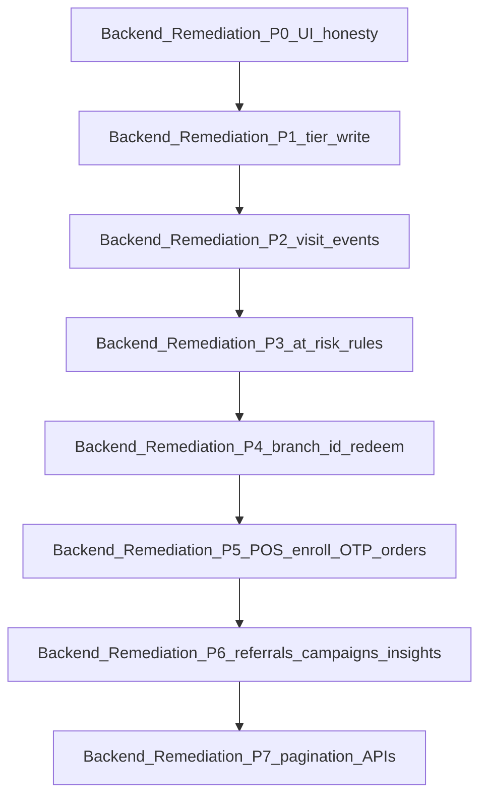

# Remediation roadmap

**Status:** SPEC-READY. Execution owned by the backend program except Backend Remediation P0 (and presentational pieces marked Frontend). See [ADR-014](../architecture/decisions/ADR-014-product-data-ownership.md).

**Terminology:** Phases here are **Backend Remediation P[N]** — not [Product MVP (Ship 1)](../product/phase-1-scope.md) and not [Frontend Migration (ADR-011 Phase 1)](../architecture/decisions/ADR-011-rls-storage-strategy.md). The gaps index `Phase` column refers to this ladder only.

**Stack (DECIDED):** NestJS 11.x, Prisma 7.x, PostgreSQL 18.x — latest stable patches at implementation ([ADR-015](../architecture/decisions/ADR-015-backend-stack.md)). Not a Next.js migration slice.

**Contracts:** [data-contract.md](data-contract.md) · [api-contract.md](api-contract.md) · backlog [gaps-and-solutions.md](../frontend/gaps-and-solutions.md) · product ship list [phase-1-scope.md](../product/phase-1-scope.md)

---

## Backend Remediation P0 — Honesty in UI

| | |
|--|--|
| **Owner** | Frontend |
| **G-IDs** | G-05 (hide search), G-06 (hide/dash revenue), G-08 (customer status sync — **done**), G-12 (relabel or dash), G-04 (stop even-split; show `"—"`), Analytics/Dashboard dead buttons |
| **Depends on** | Nothing |
| **Acceptance** | No widget shows a fabricated even %, proxy labeled as revenue, or clickable dead search/export without disable/hide. Campaign audience uses `at_risk` consistently with DB. Insight CTAs disabled/hidden until Backend Remediation P6 wires `POST /api/insights/:key/actions`. |

## Backend Remediation P1 — Apply the tier ladder (+ DB automation)

| | |
|--|--|
| **Owner** | Backend (writer) + Frontend (consume) |
| **G-IDs** | G-03 |
| **Depends on** | Existing `loyalty_program_tiers`; schema `customers.tier_id` |
| **Deliverables** | `customers.tier_id` FK; membership `period_points_earned`; `assign_customer_tier` reads **period counter only** (PM-08); trigger on `period_points_earned` (not spendable); `tier_milestone_grants`; `recompute_program_tiers` after ladder CRUD ([data-contract](data-contract.md#database-functions--tier-milestones-pm-08)) |
| **Acceptance** | After enroll and Staff POS **earn**, displayed milestone is set from `period_points_earned`. Redeem does **not** change the period counter or cause a mid-period downgrade. Period job zeros period counter + displayed milestone only — not spendable. Threshold edits recompute display for the current period; historical grants stay. |

## Backend Remediation P2 — Visit / scan events

| | |
|--|--|
| **Owner** | Backend |
| **G-IDs** | G-01, G-02 |
| **Depends on** | `visit_events` table + indexes + join write rules |
| **Deliverables** | Full `visit_events` schema (`occurred_at`, `created_at`, `source`, FKs); indexes on program/time, customer/time, branch/time, source/time; analytics SQL for Peak Hours, Average Days Between Visits, Weekly Return vs First-Time ([data-contract](data-contract.md#standard-analytics-sql-visit_events)); expose via `GET /api/analytics/overview` |
| **Acceptance** | Loyalty “Total scans” / “Scans this week” = `count(visit_events)` (with week filter). Analytics QR / visit-frequency / peak-hour / return metrics have data after traffic. Stamp progress can derive from events or honest `customers.visits` buckets. UI must not rely solely on the flat counter for temporal charts. |

## Backend Remediation P3 — Shared at-risk / segments

| | |
|--|--|
| **Owner** | Backend rules module (+ optional job); Frontend imports same cutoffs |
| **G-IDs** | G-08 |
| **Depends on** | Backend Remediation P0 string fix; preferably P2 for better recency |
| **Acceptance** | Dashboard, Customers, Analytics, Campaigns, and insight audience queries use one definition of “at risk”. Glossary in data-contract is the source of truth. |

## Backend Remediation P4 — `branch_id` + redeem API

| | |
|--|--|
| **Owner** | Backend |
| **G-IDs** | G-04, G-13 (branch detail), G-20, G-28 |
| **Depends on** | Schema columns; redeem endpoint |
| **Deliverables** | `customer_rewards.branch_id`; catalog redeem lifecycle (`pending` + `reward_snapshot` + reserve + QR → atomic scan `completed`, or job `expired` + **PM-04** lot purge); `qr_code` / `qr_expires_at`; idempotency keys on create; scan `UPDATE … WHERE status = 'pending'` with affected rows = 1; expiry worker releases Reserved then purges expired reserved lots; `redeemed_count` only on `completed`; Shop-level staff scan authz; prefers attaching `order_id` when ticket known (full ROI in P5). **Out of Product MVP (Ship 1):** reverse/refund; staff Approve/Reject for physical rewards (superseded). Snapshot / PM-04 / mutation guards are **DECIDED**. |
| **Acceptance** | Per-branch cards use `GROUP BY branch_id` (or `"—"` if null). Redeem path is explicit (earn ≠ redeem). Combined pending cannot exceed available; create refuses when Available < cost (no row). Duplicate scan / retry does not double-deduct (second scan → `already_redeemed`). Duplicate create does not insert a second row, reserve twice, or issue a second QR. Past-due `pending` is `expired` by the job and Reserved is released without the customer reopening the app. Earn retry does not double-credit. Concurrent earn+redeem is consistent. Dashboard redemption donut uses `completed` events, not earn. Main branch uniqueness enforced server-side. Do not ship staff Approve/Reject for physical catalog rewards. |

## Backend Remediation P5 — Orders + Staff POS + public enroll OTP + ROI columns

| | |
|--|--|
| **Owner** | Backend |
| **G-IDs** | G-06, G-07, G-10 (rules needing spend), G-14 (enroll path only), G-19, G-32, G-33 (enroll + wallet QR — **not** customer portal sessions) |
| **Depends on** | `orders`, billing webhook; `otp_verifications` + PM-06; public join/enroll writers |
| **Deliverables** | **`POST /auth/otp/send`** + **`POST /auth/otp/verify`** + **`POST /api/join/enroll`** (PM-06, UX-75) **before** Staff POS can identify members; wallet QR issued at enroll. `orders` (+ `invoice_number`, `currency_code`, `attributed_channel`, `campaign_id`); staff POS `POST /api/pos/scan` + `/api/pos/transactions`; `rewards.cost_cents` NOT NULL DEFAULT 0; `customer_rewards.order_id`; ROI SQL in analytics overview ([data-contract](data-contract.md#reward-roi-formula--sql), [api-contract](api-contract.md#analytics-overview-response)). Square/Clover still **out of Product MVP (Ship 1)**. |
| **Acceptance** | OTP **PM-06** (180s TTL, 3 guesses, 60s resend, 5/24h per phone) succeeds **before** `customers` / membership rows on **new** public enroll. Returning member check-in at door QR does **not** re-OTP. Revenue widgets read `orders.amount_cents`. Cashier Bill Amount + Invoice Number; migrate-then-earn on customer wallet QR. Duplicate invoice → `INVOICE_DUPLICATE`. Currency is display metadata; snapshot `currency_code` at write. ROI card uses `(revenue − cost) / cost` with `null` when cost is 0. Customer portal login/recovery sessions remain **out of Product MVP (Ship 1)** ([phase-1-scope.md](../product/phase-1-scope.md#otp-vs-staff-pos--resolved-split)). |

## Backend Remediation P6 — Referrals + campaigns + insight nudges + search

| | |
|--|--|
| **Owner** | Backend (+ Frontend wire-up) |
| **G-IDs** | G-05, G-09, G-14 (referral grants), G-21 |
| **Depends on** | PM-06 store from P5; `referrals`, `campaign_jobs` / worker, search API, `insight_actions` |
| **Deliverables** | Referral `?ref=` attribution and both-party grants (reuses P5 OTP). `POST /api/insights/:key/actions` (`send` \| `nudge` \| `create`); `insight_actions` audit table; CTA → draft campaign → optional `campaign_jobs` enqueue ([api-contract](api-contract.md#insights--nudge-automation)) |
| **Acceptance** | Enroll with `?ref=` creates a `referrals` row and grants the **referred** reward (**PM-07:** `points` \| `voucher`). The **referrer** is granted only on first `Invoice.Paid` **and** only if status is `pending`. Voucher awards are `vouchers` (`active`/`used`/`expired`), not cart auto-apply. `UNIQUE (referred_id)` lifetime. Campaign send returns 202 job; **Scheduled Automations hidden** in Product MVP (Ship 1) (PM-18 / 503). Analytics Send / Nudge / Create create real campaigns (not automations). Header search returns results. G-09 send/opens still deferred. |

## Backend Remediation P7 — Analytics / customers APIs + pagination

| | |
|--|--|
| **Owner** | Backend + Frontend |
| **G-IDs** | G-11 and scale for Dashboard/Analytics |
| **Depends on** | Prior phases for meaningful aggregates |
| **Acceptance** | Customers list is cursor-paginated; Dashboard/Analytics do not `select` all customers into the browser for cards. Overview response includes visit metrics + ROI fields from P2 and P5. |

---

## Notes

- Backend Remediation P0–P1 need little new infrastructure beyond tier functions/triggers; P2 is highest leverage for Loyalty + Analytics + Dashboard; P5 is required before Staff POS and public enroll OTP ship in **Product MVP (Ship 1)**; P6 closes dead insight CTAs and referral grants.
- This roadmap is **not** a Next.js migration slice and **does not** gate TanStack/Lovable retirement ([12-migration-plan.md](../frontend/12-migration-plan.md)).
