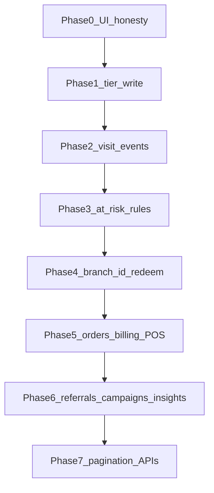

# Remediation roadmap

**Status:** SPEC-READY. Execution owned by the backend program except Phase 0 (and presentational pieces marked Frontend). See [ADR-014](../architecture/decisions/ADR-014-product-data-ownership.md).

**Stack (DECIDED):** NestJS 11.x, Prisma 7.x, PostgreSQL 18.x — latest stable patches at implementation ([ADR-015](../architecture/decisions/ADR-015-backend-stack.md)). Not a Next.js migration slice.

**Contracts:** [data-contract.md](data-contract.md) · [api-contract.md](api-contract.md) · backlog [gaps-and-solutions.md](../frontend/gaps-and-solutions.md)

---

## Phase 0 — Honesty in UI

| | |
|--|--|
| **Owner** | Frontend |
| **G-IDs** | G-05 (hide search), G-06 (hide/dash revenue), G-08 (fix `at-risk` string), G-12 (relabel or dash), G-04 (stop even-split; show `"—"`), Analytics/Dashboard dead buttons |
| **Depends on** | Nothing |
| **Acceptance** | No widget shows a fabricated even %, proxy labeled as revenue, or clickable dead search/export without disable/hide. Campaign audience uses `at_risk` consistently with DB. Insight CTAs disabled/hidden until Phase 6 wires `POST /api/insights/:key/actions`. |

## Phase 1 — Apply the tier ladder (+ DB automation)

| | |
|--|--|
| **Owner** | Backend (writer) + Frontend (consume) |
| **G-IDs** | G-03 |
| **Depends on** | Existing `loyalty_program_tiers`; schema `customers.tier_id` |
| **Deliverables** | `customers.tier_id` FK; `assign_customer_tier(p_customer_id)`; trigger `customers_reassign_tier` on `points`/`visits` update; `recompute_program_tiers(p_program_id)` after ladder CRUD ([data-contract](data-contract.md#database-functions--dynamic-tier-progression)) |
| **Acceptance** | After enroll and any points/visits change, `customers.tier` **and** `tier_id` are set. Threshold edits recompute the program. Customers filter, Analytics donut, Campaigns VIP/Gold, Loyalty tier stats show non-zero when members qualify. |

## Phase 2 — Visit / scan events

| | |
|--|--|
| **Owner** | Backend |
| **G-IDs** | G-01, G-02 |
| **Depends on** | `visit_events` table + indexes + join write rules |
| **Deliverables** | Full `visit_events` schema (`occurred_at`, `created_at`, `source`, FKs); indexes on program/time, customer/time, branch/time, source/time; analytics SQL for Peak Hours, Average Days Between Visits, Weekly Return vs First-Time ([data-contract](data-contract.md#standard-analytics-sql-visit_events)); expose via `GET /api/analytics/overview` |
| **Acceptance** | Loyalty “Total scans” / “Scans this week” = `count(visit_events)` (with week filter). Analytics QR / visit-frequency / peak-hour / return metrics have data after traffic. Stamp progress can derive from events or honest `customers.visits` buckets. UI must not rely solely on the flat counter for temporal charts. |

## Phase 3 — Shared at-risk / segments

| | |
|--|--|
| **Owner** | Backend rules module (+ optional job); Frontend imports same cutoffs |
| **G-IDs** | G-08 |
| **Depends on** | Phase 0 string fix; preferably Phase 2 for better recency |
| **Acceptance** | Dashboard, Customers, Analytics, Campaigns, and insight audience queries use one definition of “at risk”. Glossary in data-contract is the source of truth. |

## Phase 4 — `branch_id` + redeem API

| | |
|--|--|
| **Owner** | Backend |
| **G-IDs** | G-04, G-13 (branch detail), G-20, G-28 |
| **Depends on** | Schema columns; redeem endpoint |
| **Deliverables** | `customer_rewards.branch_id`; catalog redeem lifecycle (`pending` reserve → atomic `completed` / `rejected`); idempotency keys on create and approve; `redeemed_count` only on `completed`; Shop-level staff authz; prefers attaching `order_id` when ticket known (full ROI in Phase 5). **Not Phase 1:** reverse/refund; pending PO items (price change / reward or program disable / reserved-lot expiry while PENDING) |
| **Acceptance** | Per-branch cards use `GROUP BY branch_id` (or `"—"` if null). Redeem path is explicit (earn ≠ redeem). Combined pending cannot exceed available. Duplicate approve / retry does not double-deduct. Duplicate create does not insert a second row or reserve twice. Earn retry does not double-credit. Concurrent earn+redeem is consistent. Dashboard redemption donut uses `completed` events, not earn. Main branch uniqueness enforced server-side. |

## Phase 5 — Orders + billing + POS + ROI columns

| | |
|--|--|
| **Owner** | Backend |
| **G-IDs** | G-06, G-07, G-10 (rules needing spend), G-19, G-32 |
| **Depends on** | `orders`, billing webhook, first integration |
| **Deliverables** | `orders` (+ `attributed_channel`, `campaign_id`); `rewards.cost_cents` NOT NULL DEFAULT 0; `customer_rewards.order_id`; ROI SQL in analytics overview ([data-contract](data-contract.md#reward-roi-formula--sql), [api-contract](api-contract.md#analytics-overview-response)) |
| **Acceptance** | Revenue widgets read `orders.amount_cents`. Revenue by channel groups `attributed_channel`. ROI card uses `(revenue − cost) / cost` with `null` when cost is 0. `profiles.plan` only changes via checkout webhook. Branch/contact caps enforced on insert/enroll. POS or manual entry can create orders. Redeem attaches `order_id` when a ticket exists. |

## Phase 6 — Referrals + campaigns + insight nudges + search

| | |
|--|--|
| **Owner** | Backend (+ Frontend wire-up) |
| **G-IDs** | G-05, G-09, G-14, G-21 |
| **Depends on** | `referrals`, `campaign_jobs` / worker, search API, `insight_actions` |
| **Deliverables** | `POST /api/insights/:key/actions` (`send` \| `nudge` \| `create`); `insight_actions` audit table; CTA → draft campaign → optional `campaign_jobs` enqueue ([api-contract](api-contract.md#insights--nudge-automation)) |
| **Acceptance** | OTP (SMS/WhatsApp) succeeds **before** `customers` / `referrals` / rewards exist. Enroll with `?ref=` then creates a `referrals` row and grants the **referred** reward. The **referrer** is granted only on first `Invoice.Paid` (`orders.paid_at`) **and** only if status is `pending`. Discount awards are `vouchers` (`active`/`used`/`expired`), not cart auto-apply. DB `CHECK (referrer_id <> referred_id)` and `UNIQUE (referred_id)` reject bad inserts. Same device or same public IP in the same minute → `pending_review`. Points lots carry `expires_at`. Campaign send returns 202 job; opens via ESP webhook. Header search returns results. Birthday automation can run. Analytics Send / Nudge / Create create real campaigns (and jobs for send/nudge), not no-ops. |

## Phase 7 — Analytics / customers APIs + pagination

| | |
|--|--|
| **Owner** | Backend + Frontend |
| **G-IDs** | G-11 and scale for Dashboard/Analytics |
| **Depends on** | Prior phases for meaningful aggregates |
| **Acceptance** | Customers list is cursor-paginated; Dashboard/Analytics do not `select` all customers into the browser for cards. Overview response includes visit metrics + ROI fields from Phases 2 and 5. |

---

## Notes

- Phases 0–1 need little new infrastructure beyond tier functions/triggers; Phase 2 is highest leverage for Loyalty + Analytics + Dashboard; Phase 5 is required before any Revenue/ROI widget is more than a mock; Phase 6 closes dead insight CTAs.
- This roadmap is **not** a Next.js migration slice and does **not** gate TanStack/Lovable retirement ([12-migration-plan.md](../frontend/12-migration-plan.md)).
