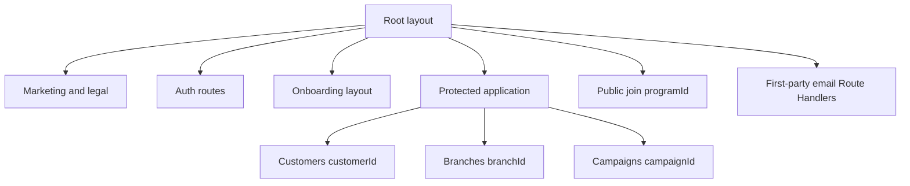

# Route Migration

**Observed count:** 31 page URLs, three API URLs, and two structural route modules. `src/routeTree.gen.ts` is authoritative.

| Next.js URL                     | Current file                                  | Access           | Domain     | Rendering                    | Notes                      |
| ------------------------------- | --------------------------------------------- | ---------------- | ---------- | ---------------------------- | -------------------------- |
| `/`                             | `src/routes/index.tsx`                        | Public           | Marketing  | Static                       | Root metadata override     |
| `/about`                        | `src/routes/about.tsx`                        | Public           | Marketing  | Static                       | Preserve metadata          |
| `/features`                     | `src/routes/features.tsx`                     | Public           | Marketing  | Static + client island       | IntersectionObserver       |
| `/pricing`                      | `src/routes/pricing.tsx`                      | Public           | Marketing  | Static + client island       | Auth-aware navigation      |
| `/guide`                        | `src/routes/guide.tsx`                        | Public           | Guide      | Static                       | Illustrations              |
| `/contact`                      | `src/routes/contact.tsx`                      | Public           | Marketing  | Static + client island       | Map; form is placeholder   |
| `/terms`                        | `src/routes/terms.tsx`                        | Public           | Legal      | Static                       | Preserve URL               |
| `/privacy`                      | `src/routes/privacy.tsx`                      | Public           | Legal      | Static                       | Preserve URL               |
| `/signin`                       | `src/routes/signin.tsx`                       | Public           | Auth       | Dynamic client form          | Redirect signed-in users   |
| `/signup`                       | `src/routes/signup.tsx`                       | Public           | Auth       | Dynamic client form          | Supabase signup            |
| `/verify`                       | `src/routes/verify.tsx`                       | Public           | Auth       | Dynamic client form          | OTP timers                 |
| `/verified`                     | `src/routes/verified.tsx`                     | Public           | Auth       | Dynamic                      | Post-verification          |
| `/forgot-password`              | `src/routes/forgot-password.tsx`              | Public           | Auth       | Dynamic client form          | Recovery redirect          |
| `/reset-password`               | `src/routes/reset-password.tsx`               | Recovery session | Auth       | Dynamic client form          | Token/session handling     |
| `/change-password`              | `src/routes/change-password.tsx`              | Authenticated    | Auth       | Dynamic                      | ProtectedRoute today       |
| `/onboarding`                   | `src/routes/onboarding.index.tsx`             | Authenticated    | Onboarding | Dynamic                      | Nested layout              |
| `/onboarding/business-category` | `src/routes/onboarding.business-category.tsx` | Authenticated    | Onboarding | Dynamic                      | Preserve sequence          |
| `/onboarding/business-type`     | `src/routes/onboarding.business-type.tsx`     | Authenticated    | Onboarding | Dynamic                      | Preserve sequence          |
| `/onboarding/plan`              | `src/routes/onboarding.plan.tsx`              | Authenticated    | Onboarding | Dynamic                      | No real billing            |
| `/onboarding/success`           | `src/routes/onboarding.success.tsx`           | Authenticated    | Onboarding | Dynamic                      | Completion gate            |
| `/dashboard`                    | `src/routes/dashboard.tsx`                    | Authenticated    | Dashboard  | Dynamic/no-store             | Client effect data today   |
| `/customers`                    | `src/routes/customers.index.tsx`              | Authenticated    | Customers  | Dynamic/no-store             | CSV/browser APIs           |
| `/customers/[customerId]`       | `src/routes/customers.$customerId.tsx`        | Authenticated    | Customers  | Dynamic/no-store             | Validate ownership         |
| `/loyalty-program`              | `src/routes/loyalty-program.tsx`              | Authenticated    | Loyalty    | Dynamic/no-store             | QR/print/share             |
| `/branches`                     | `src/routes/branches.index.tsx`               | Authenticated    | Branches   | Dynamic/no-store             | CRUD                       |
| `/branches/[branchId]`          | `src/routes/branches.$branchId.tsx`           | Authenticated    | Branches   | Dynamic/no-store             | Map/client UI              |
| `/campaigns`                    | `src/routes/campaigns.index.tsx`              | Authenticated    | Campaigns  | Dynamic/no-store             | Server send workflow       |
| `/campaigns/[campaignId]`       | `src/routes/campaigns.$campaignId.tsx`        | Authenticated    | Campaigns  | Dynamic/no-store             | Validate ownership         |
| `/analytics`                    | `src/routes/analytics.tsx`                    | Authenticated    | Analytics  | Dynamic/no-store             | Revenue placeholder        |
| `/settings`                     | `src/routes/settings.tsx`                     | Authenticated    | Settings   | Dynamic/no-store             | MFA/uploads/account delete |
| `/join/[programId]`             | `src/routes/join.$programId.tsx`              | Public           | Join       | Server initial + client form | Public mutation/rate limit |

## Server API routes

Lovable withdrawal is decided. Do **not** preserve `/lovable/*` paths in the Next.js app. Keep behavior and templates; move to first-party APIs.

| Current URL                    | Target URL                 | Authentication after withdrawal                       |
| ------------------------------ | -------------------------- | ----------------------------------------------------- |
| `/lovable/email/auth/webhook`  | `/api/email/auth/webhook`  | Signed webhook secret owned by the app (provider TBD) |
| `/lovable/email/auth/preview`  | `/api/email/auth/preview`  | App-owned bearer/admin secret                         |
| `/lovable/email/queue/process` | `/api/email/queue/process` | Service-role or app scheduler secret                  |

`src/routes/__root.tsx` maps to root layout, global error/not-found files, and providers. `src/routes/onboarding.tsx` maps to the onboarding layout.

