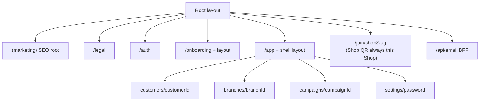

# Route Migration

**Status:** APPROVED production URL contract (2026-08-11)  
**Observed legacy count:** 31 page URLs, three API URLs, and two structural route modules. `src/routeTree.gen.ts` is authoritative for the current TanStack app.

## Route map policy ([ADR-002](../architecture/decisions/ADR-002-app-router.md))

- Use Next.js App Router.
- Legacy URLs were never indexed and are not a product contract; this document defines the cleaned production map.
- After this approval, URL changes require an explicit contract update.
- Use native App Router route typing; no custom route-type generator unless a concrete need emerges.
- Use `error.tsx`, `not-found.tsx`, and `loading.tsx` for consistent failure and loading behavior.
- Use the Metadata API (static metadata or `generateMetadata`); public pages are the primary SEO target.
- Prefer route groups `(marketing)`, `(auth)`, `(app)` for shared layouts when the URL segment is not needed; keep URL prefixes where they improve domain clarity (`/auth`, `/app`, `/legal`).

## Design principles (approved)

1. **Domain prefixes** for auth, legal, and the authenticated product shell.
2. **Nested routes** for multi-step flows (onboarding, settings).
3. **Dynamic segments** as App Router folders: `[customerId]`, `[branchId]`, `[campaignId]`, `[programId]`.
4. **Kebab-case** public path segments (`sign-in`, not `signin`).
5. **Short SEO paths** for marketing remain at the site root.
6. **No `/lovable/*`** — first-party `/api/email/*` only.

## Approved production route map

| Approved URL                    | App Router path (under `src/app`)             | Legacy URL                      | Access           | Domain     | Rendering                    | Notes                               |
| ------------------------------- | --------------------------------------------- | ------------------------------- | ---------------- | ---------- | ---------------------------- | ----------------------------------- |
| `/`                             | `(marketing)/page.tsx`                        | `/`                             | Public           | Marketing  | Static                       | Root metadata                       |
| `/about`                        | `(marketing)/about/page.tsx`                  | `/about`                        | Public           | Marketing  | Static                       |                                     |
| `/features`                     | `(marketing)/features/page.tsx`               | `/features`                     | Public           | Marketing  | Static + client island       | IntersectionObserver                |
| `/pricing`                      | `(marketing)/pricing/page.tsx`                | `/pricing`                      | Public           | Marketing  | Static + client island       | Auth-aware navigation               |
| `/guide`                        | `(marketing)/guide/page.tsx`                  | `/guide`                        | Public           | Marketing  | Static                       | Illustrations                       |
| `/contact`                      | `(marketing)/contact/page.tsx`                | `/contact`                      | Public           | Marketing  | Static + client island       | Map; form is placeholder            |
| `/legal/terms`                  | `legal/terms/page.tsx`                        | `/terms`                        | Public           | Legal      | Static                       | Grouped under `/legal`              |
| `/legal/privacy`                | `legal/privacy/page.tsx`                      | `/privacy`                      | Public           | Legal      | Static                       | Grouped under `/legal`              |
| `/auth/sign-in`                 | `auth/sign-in/page.tsx`                       | `/signin`                       | Public           | Auth       | Dynamic client form          | Redirect signed-in users            |
| `/auth/sign-up`                 | `auth/sign-up/page.tsx`                       | `/signup`                       | Public           | Auth       | Dynamic client form          | Supabase signup                     |
| `/auth/verify`                  | `auth/verify/page.tsx`                        | `/verify`                       | Public           | Auth       | Dynamic client form          | OTP timers                          |
| `/auth/verified`                | `auth/verified/page.tsx`                      | `/verified`                     | Public           | Auth       | Dynamic                      | Post-verification                   |
| `/auth/forgot-password`         | `auth/forgot-password/page.tsx`               | `/forgot-password`              | Public           | Auth       | Dynamic client form          | Recovery redirect                   |
| `/auth/reset-password`          | `auth/reset-password/page.tsx`                | `/reset-password`               | Recovery session | Auth       | Dynamic client form          | Token/session handling              |
| `/onboarding`                   | `onboarding/page.tsx`                         | `/onboarding`                   | Authenticated    | Onboarding | Dynamic                      | Nested `onboarding/layout.tsx`      |
| `/onboarding/business-category` | `onboarding/business-category/page.tsx`       | `/onboarding/business-category` | Authenticated    | Onboarding | Dynamic                      | Preserve sequence                   |
| `/onboarding/business-type`     | `onboarding/business-type/page.tsx`           | `/onboarding/business-type`     | Authenticated    | Onboarding | Dynamic                      | Preserve sequence                   |
| `/onboarding/plan`              | `onboarding/plan/page.tsx`                    | `/onboarding/plan`              | Authenticated    | Onboarding | Dynamic                      | No real billing                     |
| `/onboarding/success`           | `onboarding/success/page.tsx`                 | `/onboarding/success`           | Authenticated    | Onboarding | Dynamic                      | Completion gate                     |
| `/app`                          | `app/(shell)/page.tsx`                        | —                               | Authenticated    | Dashboard  | Dynamic/no-store             | Redirect to `/app/dashboard`        |
| `/app/dashboard`                | `app/(shell)/dashboard/page.tsx`              | `/dashboard`                    | Authenticated    | Dashboard  | Dynamic/no-store             |                                     |
| `/app/customers`                | `app/(shell)/customers/page.tsx`              | `/customers`                    | Authenticated    | Customers  | Dynamic/no-store             | CSV/browser APIs                    |
| `/app/customers/[customerId]`   | `app/(shell)/customers/[customerId]/page.tsx` | `/customers/$customerId`        | Authenticated    | Customers  | Dynamic/no-store             | Validate ownership                  |
| `/app/loyalty`                  | `app/(shell)/loyalty/page.tsx`                | `/loyalty-program`              | Authenticated    | Loyalty    | Dynamic/no-store             | QR/print/share; shortened path      |
| `/app/branches`                 | `app/(shell)/branches/page.tsx`               | `/branches`                     | Authenticated    | Branches   | Dynamic/no-store             | CRUD                                |
| `/app/branches/[branchId]`      | `app/(shell)/branches/[branchId]/page.tsx`    | `/branches/$branchId`           | Authenticated    | Branches   | Dynamic/no-store             | Map/client UI                       |
| `/app/campaigns`                | `app/(shell)/campaigns/page.tsx`              | `/campaigns`                    | Authenticated    | Campaigns  | Dynamic/no-store             | Server send via messaging contracts |
| `/app/campaigns/[campaignId]`   | `app/(shell)/campaigns/[campaignId]/page.tsx` | `/campaigns/$campaignId`        | Authenticated    | Campaigns  | Dynamic/no-store             | Validate ownership                  |
| `/app/analytics`                | `app/(shell)/analytics/page.tsx`              | `/analytics`                    | Authenticated    | Analytics  | Dynamic/no-store             | Revenue placeholder                 |
| `/app/settings`                 | `app/(shell)/settings/page.tsx`               | `/settings`                     | Authenticated    | Settings   | Dynamic/no-store             | MFA/uploads/account delete          |
| `/app/settings/password`        | `app/(shell)/settings/password/page.tsx`      | `/change-password`              | Authenticated    | Settings   | Dynamic                      | Nested under settings               |
| `/join/[programId]`             | `join/[programId]/page.tsx`                   | `/join/$programId`              | Public           | Join       | Server initial + client form | Public mutation/rate limit          |

`(marketing)` and `app/(shell)` are **route groups** (no extra URL segment). The `/app` URL segment comes from the `app/` folder that is not parenthesized.

**Product note (not yet on this approved map):** Shop QR **always this Shop** ([counter-qr-and-program-membership.md](../product/counter-qr-and-program-membership.md)). Target join URL is Shop-scoped (`/join/shop/{shopSlug}` or equivalent). Today’s `/join/[programId]` remains the shipped join page until cutover. Implementation still requires ADR-014 / slice gates — this note does not authorize Next work.

## Approved server API routes

Lovable withdrawal is decided. Do **not** preserve `/lovable/*` paths. Keep behavior and templates under `src/lib/server/messaging/`; move to first-party APIs only where a BFF/frontend-specific server requirement exists ([ADR-006](../architecture/decisions/ADR-006-server-boundaries.md)).

| Approved URL               | App Router path                    | Legacy URL                     | Authentication                                            |
| -------------------------- | ---------------------------------- | ------------------------------ | --------------------------------------------------------- |
| `/api/email/auth/webhook`  | `api/email/auth/webhook/route.ts`  | `/lovable/email/auth/webhook`  | Signed webhook secret owned by the app (provider stub OK) |
| `/api/email/auth/preview`  | `api/email/auth/preview/route.ts`  | `/lovable/email/auth/preview`  | App-owned bearer/admin secret                             |
| `/api/email/queue/process` | `api/email/queue/process/route.ts` | `/lovable/email/queue/process` | Service-role or app scheduler secret                      |

## Structural modules

| Role                        | App Router target                                                                     |
| --------------------------- | ------------------------------------------------------------------------------------- |
| `src/routes/__root.tsx`     | `src/app/layout.tsx` + root `error.tsx` / `not-found.tsx` / `loading.tsx` + providers |
| `src/routes/onboarding.tsx` | `src/app/onboarding/layout.tsx`                                                       |
| Protected app chrome        | `src/app/app/(shell)/layout.tsx`                                                      |
| Auth chrome (optional)      | `src/app/auth/layout.tsx`                                                             |

## Legacy → approved redirect cheat sheet

Optional for pre-launch: permanent redirects are only needed if a legacy host stayed public; otherwise retire the old host and ship the approved map only ([cutover.md](../architecture/cutover.md)).

| Legacy             | Approved                       |
| ------------------ | ------------------------------ |
| `/signin`          | `/auth/sign-in`                |
| `/signup`          | `/auth/sign-up`                |
| `/verify`          | `/auth/verify`                 |
| `/verified`        | `/auth/verified`               |
| `/forgot-password` | `/auth/forgot-password`        |
| `/reset-password`  | `/auth/reset-password`         |
| `/change-password` | `/app/settings/password`       |
| `/terms`           | `/legal/terms`                 |
| `/privacy`         | `/legal/privacy`               |
| `/dashboard`       | `/app/dashboard`               |
| `/customers`       | `/app/customers`               |
| `/customers/:id`   | `/app/customers/[customerId]`  |
| `/loyalty-program` | `/app/loyalty`                 |
| `/branches`        | `/app/branches`                |
| `/branches/:id`    | `/app/branches/[branchId]`     |
| `/campaigns`       | `/app/campaigns`               |
| `/campaigns/:id`   | `/app/campaigns/[campaignId]`  |
| `/analytics`       | `/app/analytics`               |
| `/settings`        | `/app/settings`                |
| `/lovable/email/*` | `/api/email/*` (see API table) |

Unlisted marketing, onboarding, and join paths keep the same public URL.

