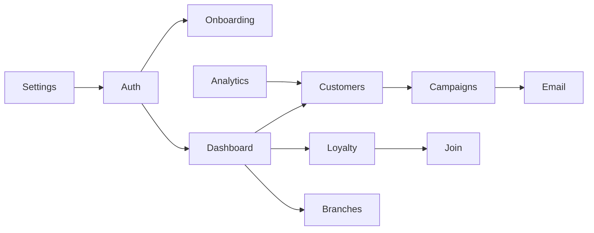

# Frontend Domains

| Domain          | Routes                                                        | Principal code/data                           | Dependencies                  |
| --------------- | ------------------------------------------------------------- | --------------------------------------------- | ----------------------------- |
| Marketing/legal | `/`, about, features, pricing, guide, contact, terms, privacy | landing/guide/map components                  | assets, metadata              |
| Authentication  | signin/signup/verify/recovery/change                          | `use-auth`, Supabase Auth                     | email handlers                |
| Onboarding      | `/onboarding/*`                                               | profiles, business taxonomy, plan selection   | Auth                          |
| Dashboard       | `/dashboard`                                                  | profile/program/customer summaries            | Auth, Supabase                |
| Customers       | `/customers/*`                                                | customers/rewards, CSV                        | Loyalty                       |
| Loyalty         | `/loyalty-program`, `/join/[programId]`                       | programs, rewards, QR settings                | Customers, notifications      |
| Branches        | `/branches/*`                                                 | branches, maps                                | Auth                          |
| Campaigns       | `/campaigns/*`                                                | campaigns, recipients, email queue            | Customers, email              |
| Analytics       | `/analytics`                                                  | customer/reward aggregates                    | Customers                     |
| Settings        | `/settings`                                                   | profile, MFA, uploads, integrations           | Auth, storage                 |
| Messaging       | `/api/email/*` after withdrawal (was `/lovable/email/*`)      | preserved templates, queues, provider adapter | Supabase admin, transport TBD |

Target `features/` modules should follow these observed domains; generic UI remains shared.
