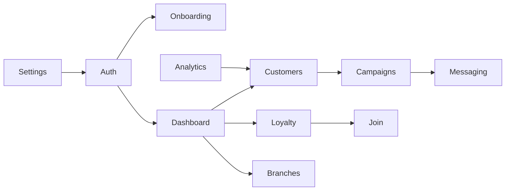

# Frontend Domains

| Domain          | Routes                                                        | Principal code/data                           | Dependencies                  |
| --------------- | ------------------------------------------------------------- | --------------------------------------------- | ----------------------------- |
| Marketing/legal | `/`, about, features, pricing, guide, contact, terms, privacy | landing/guide/map components                  | assets, metadata              |
| Authentication  | signin/signup/verify/recovery/change                          | Auth UX; backend-owned authz                      | messaging contracts, Next route gates |
| Onboarding      | `/onboarding/*`                                               | profiles, business taxonomy, plan selection       | Auth                                  |
| Dashboard       | `/dashboard`                                                  | profile/program/customer summaries                | Auth, backend                         |
| Customers       | `/customers/*`                                                | customers/rewards, CSV                            | Loyalty                               |
| Loyalty         | `/loyalty-program`, `/join/[programId]`                       | programs, rewards, QR settings                    | Customers, notifications              |
| Branches        | `/branches/*`                                                 | branches, maps                                    | Auth                                  |
| Campaigns       | `/campaigns/*`                                                | campaigns, recipients, email queue                | Customers, messaging contracts        |
| Analytics       | `/analytics`                                                  | customer/reward aggregates                        | Customers                             |
| Settings        | `/settings`                                                   | profile, MFA, uploads, integrations               | Auth, storage                         |
| Messaging       | `/api/email/*` BFF after withdrawal (was `/lovable/email/*`)  | `src/lib/server/messaging/` templates + contracts | provider-agnostic adapter; transport TBD |

Target `features/` modules should follow these observed domains; generic UI remains shared. Route paths above are inventory candidates until the production route map is approved ([ADR-002](../architecture/decisions/ADR-002-app-router.md)). Domain features call the existing backend / API layer; they must not own delivery providers.
