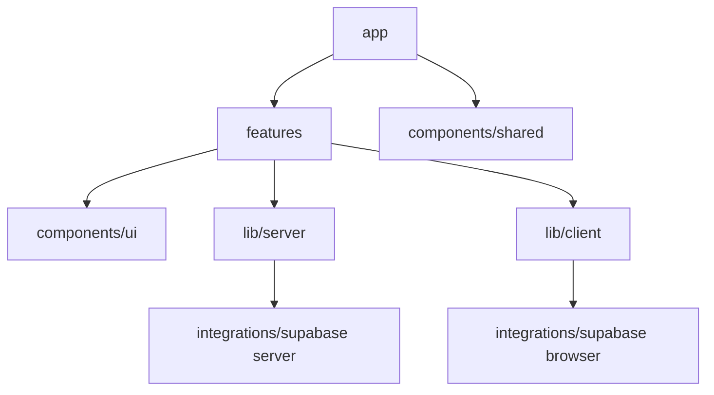

# Dependency Rules

- `app` may import feature public APIs and shared infrastructure.
- Features may import shared UI/lib/integrations, never another feature's internals.
- `components/ui` imports no feature or server code.
- `lib/server` must be guarded server-only and may access secrets/admin clients.
- Client modules must never import server modules, service-role clients, or secret configuration.
- Domain schemas/types live with the feature; generated Supabase types stay in integration code.
- Cross-feature behavior uses an explicit public API or server service, not deep imports.
