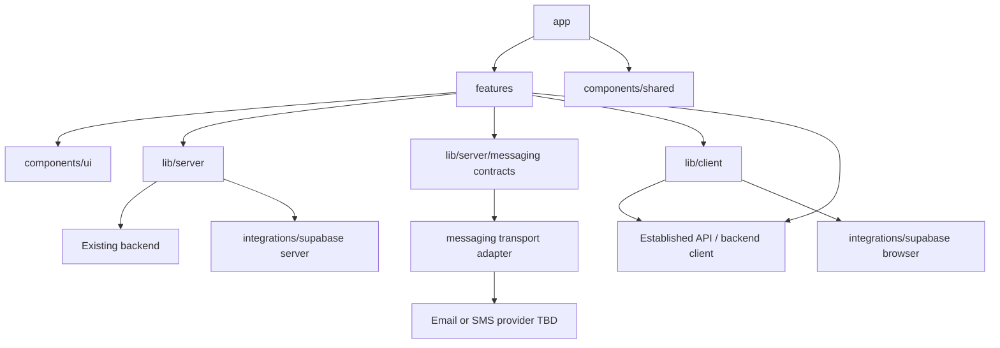

# Dependency Rules

- `app` may import feature public APIs and shared infrastructure; route files stay thin (composition only).
- Features may import shared UI/lib/integrations, never another feature's internals.
- Features talk to the existing backend through the established API layer; Next.js must not become a replacement backend.
- Features may invoke messaging only through provider-agnostic contracts in `lib/server/messaging`; they must not import delivery provider SDKs or concrete transport implementations.
- `components/ui` imports no feature or server code.
- `lib/server` must be guarded server-only and may access secrets/admin clients for orchestration only.
- Messaging templates and transport adapters live under `lib/server/messaging`.
- Client modules must never import server modules, service-role clients, or secret configuration.
- Domain schemas/types live with the feature; generated Supabase types stay in integration code.
- Cross-feature behavior uses an explicit public API or server service, not deep imports.
- Route Handlers and Server Actions are introduced only with clear BFF/frontend-specific justification.
