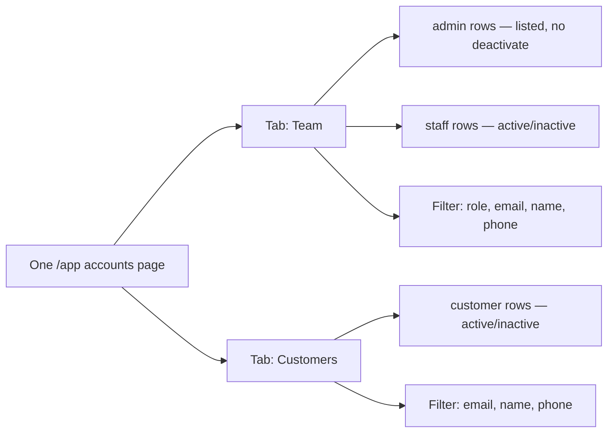

# Authentication Migration

Aligned with [ADR-005](../architecture/decisions/ADR-005-authentication.md).

## Current behavior

The leftover frontend still reflects Supabase browser auth in localStorage, auto-refresh, and `AuthProvider`. That IdP is **withdrawn**. Do not extend it.

## Target behavior

Aligned with [ADR-005](../architecture/decisions/ADR-005-authentication.md) **Option C** (DECIDED 2026-08-17).

1. **Do not use Supabase Auth** even during Frontend Migration. No GoTrue, no `@supabase/ssr`, no Supabase recovery/OTP as the identity provider.
2. Build a **fully independent NestJS auth system** for all roles (`admin`, `staff`, `customer`) with **local JWTs** issued and validated by Nest.
3. NestJS natively handles admin/staff temp-passwords, first-login force-change, email password reset, admin re-issue temp password, and customer OTP (SMS/WhatsApp).
4. Authorization ownership stays in the backend. NestJS is the final source of truth for permissions. Do not duplicate business authorization in the frontend.
5. Use secure HTTP-only cookies on the Next.js host to hold the Nest-issued session; prove cookie/SSR refresh (D-28 retargeted) before relying on authenticated RSC reads.
6. Next.js is responsible for route protection, session-aware rendering, and redirects.
7. Client checks may remain for UX only; they are not authorization.
8. Preserve product behavior for verification, recovery, MFA (if in product scope), onboarding, and sign-out — implemented against Nest, not Supabase.

## Locked role matrix

**DECIDED.** Canonical stored names: `admin` · `staff` · `customer`. There are no other logged-in roles.

This is **not** [ADR-011](../architecture/decisions/ADR-011-rls-storage-strategy.md) “Phase 1 — Frontend migration” and **not** [Backend Remediation P1](../backend/remediation-roadmap.md#backend-remediation-p1--apply-the-tier-ladder--db-automation) (tier ladder).

| Role | Who | Surface | Permissions |
|------|-----|---------|-------------|
| **`admin`** | Buys Loyollo (the shop). Same as today’s **owner** (`owner_id`). | Merchant **`/app`** | Full merchant access. Product MVP (Ship 1): the software-purchase account is this role. |
| **`staff`** | Works for that shop (team). | Merchant **`/app`** | **For now: same permissions as `admin`.** Product MVP (Ship 1) Redemption: any existing Staff or Admin may **scan/verify** redemptions for that **Shop** (`staff.branch.shop_id === redemption.shop_id`); do not add extra redemption role restrictions unless decided later. Scan is verification, not discretionary approval. A later split (limited staff) is not locked. Subtypes (manager / cashier / …) are **not** locked. |
| **`customer`** | Shops at that business (loyalty member). | Customer register/login — **not** `/app` | Customer data + calculated KPIs only. Never merchant `/app`. |

**Today:** there is typically one `/app` login per shop; it is **`admin`**. When `staff` accounts exist, they may use `/app` with **the same permissions as `admin`** until a split is approved. `staff` is a **different role name**, not a different permission set yet.

**Not a role:** marketing-site visitor; QR join before register. **Status** and **tier** on a customer are not roles.

Rules: `admin` / `staff` are never a shop `customer`. `customer` never gets `/app` as merchant. Do not call the buyer role `purchaser` — stored name is **`admin`**.

Today there is no `profiles.role` column. Implicit merchant role is **`admin`**. Do not add a roles table from this frontend repo ([ADR-014](../architecture/decisions/ADR-014-product-data-ownership.md)).

Canonical glossary: [data-contract.md](../backend/data-contract.md#unified-glossary). Product note: [product-manager-meeting-report.md](../product-manager-meeting-report.md).

## Admin adds admin or staff (DECIDED)

**An `admin` will have a form to add another `admin` or `staff`.** This is not shipped. Route in `/app` is **not** locked (likely Settings / team). Backend-owned ([ADR-014](../architecture/decisions/ADR-014-product-data-ownership.md)). Gap: [G-34](gaps-and-solutions.md#g-34--admin-cannot-create-adminstaff-with-emailed-temp-password).

### Form

The `admin` enters the new person’s **information** and chooses role **`admin`** or **`staff`**. Locked fields: at least **name**, **email**, **role**. Other profile fields (phone, etc.) are **not** locked.

This is **not** the shop-`customer` register form.

### Create account

On **Create account** the backend:

1. Creates the `/app` auth user with the chosen role (`admin` | `staff`).
2. Generates a **random temporary password** (the `admin` does not pick it).
3. Sends that person an **email** (messaging contracts only — [17-messaging-templates.md](17-messaging-templates.md), [ADR-010](../architecture/decisions/ADR-010-style-and-template-parity.md)).

### Email (required facts)

The mail must tell them they were **added**, and include:

| Fact | Required |
|------|----------|
| They were added to the shop’s Loyollo `/app` | Yes |
| Their **email** | Yes |
| The **temporary password** (the random one) | Yes |

Exact copy, subject, and layout are **not** locked. The existing auth **`invite`** template is an **accept-link / create-your-account** flow (`You've been invited`). **Do not replace that template’s current meaning.** Add (or extend via contracts) a **teammate-created** email that carries the three facts above.

### Permissions

`staff` still has **the same `/app` permissions as `admin` for now**. The **create teammate** action is described as an **`admin`** action. Whether `staff` can also open this form is **not** locked.

### First login (DECIDED)

On **first login** with the temporary password, the new `admin` / `staff` **must change that password** before using `/app`. They cannot skip it. After they set their own password, later logins are normal. Later self-serve reset ([credential recovery](#credential-recovery-decided)) does **not** re-trigger this gate.

## Account active / inactive (DECIDED)

An **`admin` can set account status** to **`active`** (نشط) or **`inactive`** (غير نشط) for **`staff`** and **`customer`**. This is not shipped. Route in `/app` is **not** locked. Backend-owned. Gap: [G-36](gaps-and-solutions.md#g-36--no-admin-account-list-or-activeinactive-for-staffcustomer).

This is **account** status (can they use the product?), not:

| Other “status” | Meaning |
|----------------|---------|
| Customer **member** status | `active` / `at_risk` / `churned` on `customers` |
| Loyalty **capability** status | `draft` / `active` / `disabled` |
| **Campaign** status | draft / active / completed / … |

| Account status | Effect |
|----------------|--------|
| **`active`** | `staff` may use `/app`; `customer` may use customer login |
| **`inactive`** | `staff` must not use `/app`; `customer` must not use customer login |

Toggling **other `admin`** accounts is **not** in this decision (only `staff` and `customer`). `admin` rows **are listed** (Team tab) so the owner can see teammates; there is **no** deactivate control on another `admin`.

### Management page: one page, two tabs (DECIDED)

**One** `/app` page. The `admin` switches **two tabs** — not two routes:

| Tab | Rows | Role filter |
|-----|------|-------------|
| **Team** | `admin` and `staff` | `admin` \| `staff` |
| **Customers** | `customer` | Not shown — every row is `customer` |

On **both** tabs: **active / inactive** plus filters **email**, **name**, **phone**. Team tab also filters **role** (`admin` \| `staff`).

Exact pixel layout is **not** locked. Same page may host add-teammate (G-34); not locked. Route is **not** locked.

## Shop-customer register and login (DECIDED)

**Product MVP (Ship 1) vs portal (deferred):** Public **enroll OTP** (counter/door QR first join, PM-06) and **wallet QR issuance** are **in Product MVP (Ship 1)** — required before Staff POS can scan. Persistent **customer portal sessions** (register/login/recovery app, `/api/me/wallet` behind customer JWT) are **out of Product MVP (Ship 1)**. Canonical split: [phase-1-scope.md](../product/phase-1-scope.md).

**We will add register and login for Customers of the shop** — not only the current behavior where the shop owner types customers in by hand.

| Who | Auth | Role |
|-----|------|------|
| Buys Loyollo | `/app` sign-up / sign-in (today) | **`admin`** |
| Works for that shop | `/app` (when invited) | **`staff`** — **same permissions as `admin` for now** |
| Customer of that shop | Customer register / login (routes not locked; **not** `/app`) | **`customer`** |

Purpose:

1. **Store their data** on a customer account (profile + activity), not only an owner-created row.
2. **Calculate KPIs** from that stored data (visits, stamps, points, redemptions, recency) — merchant Analytics/Dashboard and customer-facing progress — instead of relying only on fields the owner typed.

**Today:** owner **Add Customer** in `/app/customers`, plus unauthenticated QR join/enroll (`/join/[programId]`). Owner (`admin`) manual add **remains** as a merchant tool (no customer OTP). Join/check-in remains a capture path until (and likely after) customer auth; enroll should **link** to the customer account when that identity exists.

**DECIDED:** public **new** register (join and shop-customer self-register) requires **OTP via SMS or WhatsApp** before the `customers` row is finalized. **PM-06:** 180s TTL, 3 guesses, 60s resend, 5/24h per phone. **UX-75:** name, email, DOB required after new-phone OTP. [OTP](loyalty-page.md#otp-verification-decided).

**DECIDED:** `customer` register, login, and recovery are **passwordless**. They never set or reset a password. Login and lost-access use a new OTP (SMS or WhatsApp). [Credential recovery](#credential-recovery-decided).

Customer auth must **not** grant `admin` / `staff` `/app` access. Rate-limit public signup/enrollment and OTP request ([ADR-012](../architecture/decisions/ADR-012-public-enrollment-rate-limiting.md)). Schema and APIs are backend-owned ([ADR-014](../architecture/decisions/ADR-014-product-data-ownership.md)). Gap: [G-33](gaps-and-solutions.md#g-33--shop-customers-have-no-registerlogin-kpis-rely-on-owner-typed-rows).

**Working journey for design (2026-08-17):** portal register, login, and lost access are **one OTP funnel**. After OTP: inactive → generic block; existing member of **this Shop** → wallet; existing customer **first time in this Shop** → link Shop then wallet (this membership only); new phone → profile then wallet. In-store returning check-in (Shop QR or `/join/{programId}`) stays **without** a new OTP once the **Shop** is known. Full case list: [customer-portal-journey.md](../product/customer-portal-journey.md). `G-33` / `G-36` are gap IDs, not screen names.

### Customer wallet (DECIDED)

After login, the `customer` sees **one card per Shop** they belong to — never a single mixed points total across Shops. Enabled capabilities (Points / Visit / Tier) are **sections on that card**.

Each card must show: Shop name; **by enabled capability** — Points: **available** balance (`total − pending reserved`) + progress to next reward; Visit: stamp-icon counter; Tier: current tier + progress to next; plus expiry (one date if lots share it; otherwise amount + date groups), vouchers with their dates, that Shop’s share **link** + **QR**. [program-model.md](../product/program-model.md#4-customer-membership-and-wallet) · [customer-reward-progress.md](../product/customer-reward-progress.md) · [reward-redemption-flow.md](../product/reward-redemption-flow.md).

Example: 100 points at Shop A and 200 at Shop B = two cards, not 300. Points + Visit at the **same** Shop = **one** card with two sections. [loyalty-page.md](loyalty-page.md#customer-wallet-per-shop-decided). Portal URL still **not** locked.

## Credential recovery (DECIDED)

**Staff and customers do not share one recovery process.** `admin` / `staff` use the owner email-password reset. `customer` has no password — lost access is a new OTP. This is not shipped. Backend-owned ([ADR-014](../architecture/decisions/ADR-014-product-data-ownership.md)). Gaps: [G-33](gaps-and-solutions.md#g-33--shop-customers-have-no-registerlogin-kpis-rely-on-owner-typed-rows), [G-34](gaps-and-solutions.md#g-34--admin-cannot-create-adminstaff-with-emailed-temp-password), [G-36](gaps-and-solutions.md#g-36--no-admin-account-list-or-activeinactive-for-staffcustomer). Audit: [S-03](../audit/2026-08-14-security-ui-product-audit.md#s-03--no-staff-or-customer-recovery-critical--g-33-g-34).

Customer portal URLs stay **not** locked. Do not add recovery routes or APIs from this lock.

### Admin and staff (same as owner)

Once a teammate `/app` user exists ([G-34](gaps-and-solutions.md#g-34--admin-cannot-create-adminstaff-with-emailed-temp-password)), forgotten password is the **same NestJS email-password reset** as the shop owner (not Supabase Auth):

1. `/auth/forgot-password` → NestJS issues a reset token and sends the recovery email via messaging contracts
2. Recovery email (`RecoveryEmail`) with link to `/auth/reset-password`
3. Set a new password → sign in → `/app`

Reset is **per email**, not “the buyer’s account”. The audit warning that staff using that screen resets the buyer applies **today**, while staff have no auth user.

Extra path (not a second forgot-password UI): an `admin` may **re-issue a temporary password** and email it (same teammate-created mail facts as [add admin/staff](#admin-adds-admin-or-staff-decided)). Use that when the person is locked out or email recovery fails. **Do not** treat the existing `invite` accept-link as staff reset.

Gates after reset:

| Gate | Effect |
|------|--------|
| `account_status = inactive` | No `/app` session ([G-36](gaps-and-solutions.md#g-36--no-admin-account-list-or-activeinactive-for-staffcustomer)) |
| First-login force-change | Only the **initial** temp password. A later self-serve reset does not re-trigger it |

Staff must **not** use a customer OTP screen to enter `/app`.

### Customer (passwordless)

Register, login, and recovery **never use a password**. There is no customer forgot-password screen.

Lost access = request a **new OTP** via SMS or WhatsApp — the same channel as join/register ([OTP](loyalty-page.md#otp-verification-decided)). Rate-limit OTP request ([ADR-012](../architecture/decisions/ADR-012-public-enrollment-rate-limiting.md)).

After OTP they land on the **customer portal** (URL still not locked), never `/app`, never `/auth/reset-password`.

Do **not** send customers through `/auth/forgot-password` or the merchant `recovery` email template.

Inactive `customer` must not get a session from a new OTP ([G-36](gaps-and-solutions.md#g-36--no-admin-account-list-or-activeinactive-for-staffcustomer)).

## Backend change required

| Concern                                | Backend change required                                                                                                                                                          |
| -------------------------------------- | -------------------------------------------------------------------------------------------------------------------------------------------------------------------------------- |
| App Router pages/forms                 | No (frontend consumes Nest auth APIs)                                                                                                                                            |
| Independent NestJS auth (Option C)     | **Yes** — local JWT IdP for `admin` / `staff` / `customer`; no Supabase Auth                                                                                                     |
| Admin temp-password + first-login gate | **Yes** — NestJS generates temp password, emails it, enforces change on first login                                                                                              |
| Admin/staff password reset             | **Yes** — NestJS-native reset token + recovery email                                                                                                                             |
| Customer OTP                           | **Yes** — NestJS-native OTP (SMS/WhatsApp) for register, login, lost access                                                                                                      |
| Server verification of current session | **Yes** — NestJS validates JWT; Next may hold HTTP-only cookies and forward the token                                                                                            |
| Cookie-based SSR session               | Next BFF/proxy must prove Nest JWT cookies (D-28 retargeted; `@supabase/ssr` spike superseded)                                                                                   |
| Auth email / OTP delivery              | Messaging contracts only ([17-messaging-templates.md](17-messaging-templates.md)); NestJS triggers send — not Supabase Auth hooks                                                |

## Security gates

CSRF is required if cookie-authenticated mutations are introduced. XSS remains material while leftover tokens are in localStorage; Frontend Migration target is Nest JWT in HTTP-only cookies. Redirect destinations must be allow-listed. Secrets are referenced by name only. Frontend route gates must never substitute for NestJS permission checks.
