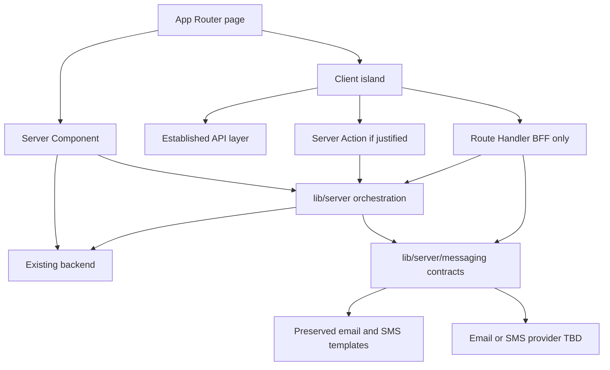

# Target Frontend Architecture

This is the consolidated reference; detailed inventories and decisions remain authoritative in linked documents and ADRs.

## Architecture

Next.js App Router owns URL composition, layouts, metadata, loading/errors, and thin page composition. Features own domain UI and logic. The existing backend remains the primary business/API backend—Next.js does not replace it.

Server Components perform safe initial reads against the backend when appropriate. Client Components use the established API layer and small interactive islands. `lib/server` holds privileged orchestration. Messaging templates and infrastructure live under `src/lib/server/messaging/` with provider-agnostic contracts.

Supabase schema and contracts do not change. Lovable is withdrawn. Visual styles and email/SMS templates are preserved. Initial hosting is Vercel (Node 24 LTS). Target lines: Next.js 16.3.x, React/React DOM 19.2.x, TypeScript 6.0.x.

## Data flow

## Policies

- Server Components by default; smallest practical Client islands ([ADR-003](../architecture/decisions/ADR-003-rendering-strategy.md)).
- Choose static / SSR / ISR per route; avoid full-page CSR defaults.
- Dynamic/no-store for protected data until isolation is proven.
- Hybrid data fetching: RSC initial reads + TanStack Query for interactive server state ([ADR-004](../architecture/decisions/ADR-004-data-and-state.md)).
- Existing backend is primary; Route Handlers only for BFF/proxy or frontend-specific needs ([ADR-006](../architecture/decisions/ADR-006-server-boundaries.md)).
- Server Actions only with clear benefit; orchestrate backend calls; do not become the business API.
- Backend owns authz; Next.js owns route protection, session-aware rendering, redirects ([ADR-005](../architecture/decisions/ADR-005-authentication.md)).
- Thin `app/`; domain logic in `features/` ([ADR-007](../architecture/decisions/ADR-007-project-structure.md)).
- Review/approve route map before freezing URLs ([ADR-002](../architecture/decisions/ADR-002-app-router.md)).
- No visual redesign; messaging under `src/lib/server/messaging/`; no direct provider deps from features ([ADR-010](../architecture/decisions/ADR-010-style-and-template-parity.md)).
- Initial hosting is Vercel; concrete email/SMS providers remain open.

## References

[Routes](02-route-migration.md), [rendering](04-rendering-strategy.md), [data](06-data-fetching.md), [auth](11-authentication-migration.md), [styling](10-styling-and-assets.md), [server mapping](15-server-function-mapping.md), [messaging templates](17-messaging-templates.md), [migration](12-migration-plan.md), [risks](13-migration-risks.md), and [architecture ADRs](../architecture/README.md).
