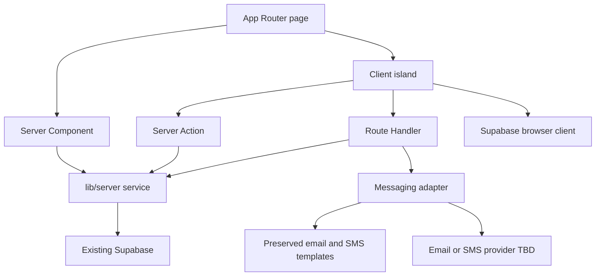

# Target Frontend Architecture

This is the consolidated reference; detailed inventories and decisions remain authoritative in linked documents.

## Architecture

Next.js App Router owns URL composition, layouts, metadata, loading/errors, and route handlers. Features own domain UI and logic. Server Components perform safe initial reads; Client Components contain interactions and browser APIs. `lib/server` contains privileged Supabase and messaging services. Supabase schema and contracts do not change. Lovable is withdrawn. Visual styles and email/SMS templates are preserved.

## Data flow

## Policies

- Server by default; smallest possible client boundary.
- Dynamic/no-store for protected data until isolation is proven.
- Server Actions are not generic API endpoints.
- Route Handlers own public/external/scheduled contracts on first-party `/api/email/*` paths.
- Authorization occurs at every server mutation/read boundary.
- No global state library without new evidence.
- No visual redesign; style parity is an acceptance gate.
- Preserve email/SMS templates; provider choice is deferred behind an adapter.
- Hosting remains unselected pending comparative spikes outside Lovable.

## References

[Routes](02-route-migration.md), [rendering](04-rendering-strategy.md), [data](06-data-fetching.md), [auth](11-authentication-migration.md), [styling](10-styling-and-assets.md), [server mapping](15-server-function-mapping.md), [messaging templates](17-messaging-templates.md), [migration](12-migration-plan.md), and [risks](13-migration-risks.md).
