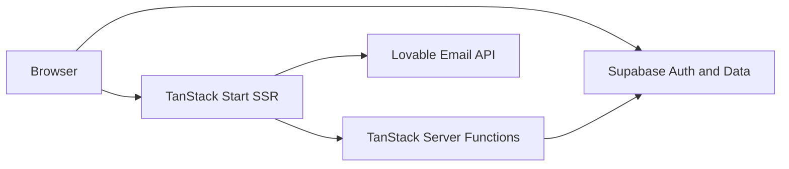
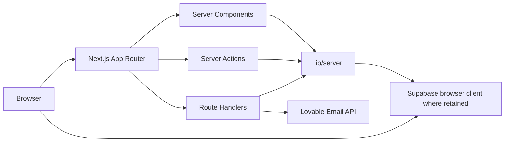

# Frontend Migration Blueprint

This documentation describes migration from TanStack Start to Next.js. It does not authorize implementation.

## Current and target

## Documents

1. [Current frontend](01-current-frontend.md)
2. [Route migration](02-route-migration.md)
3. [Frontend domains](03-frontend-domains.md)
4. [Rendering strategy](04-rendering-strategy.md)
5. [Client boundaries](05-client-boundaries.md)
6. [Data fetching](06-data-fetching.md)
7. [State management](07-state-management.md)
8. [Project structure](08-project-structure.md)
9. [Dependency rules](09-dependency-rules.md)
10. [Styling and assets](10-styling-and-assets.md)
11. [Authentication](11-authentication-migration.md)
12. [Migration plan](12-migration-plan.md)
13. [Migration risks](13-migration-risks.md)
14. [Consolidated architecture](14-frontend-architecture.md)
15. [Server-function mapping](15-server-function-mapping.md)
16. [Dependency compatibility](16-dependency-compatibility.md)

**Next step:** approve or amend Critical ADRs. Do not create the Next.js application yet.
