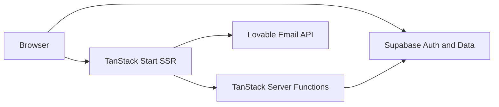
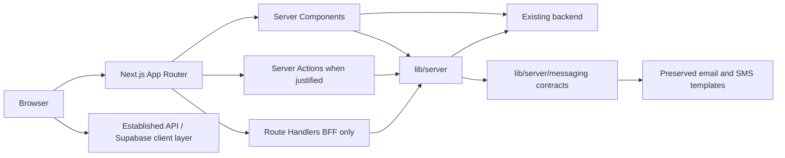

# Frontend Migration Blueprint

This documentation describes migration from TanStack Start to Next.js. It does not authorize implementation. Architecture decisions live in [`docs/architecture/`](../architecture/README.md); this folder is the frontend blueprint.

## Target stack (DECIDED)

| Concern    | Target                                      |
| ---------- | ------------------------------------------- |
| Framework  | Next.js 16.3.x App Router                   |
| UI         | React / React DOM 19.2.x                    |
| Language   | TypeScript 6.0.x                            |
| Hosting    | Vercel (initial); Node.js 24 LTS            |
| Cloudflare | Secondary; `workerd` via OpenNext if chosen |
| Messaging  | `src/lib/server/messaging/` contracts only  |

## Current and target

## Locked / proposed decisions

**DECIDED**

- Visual style parity: no redesign ([ADR-010](../architecture/decisions/ADR-010-style-and-template-parity.md)).
- Preserve email/SMS templates under `src/lib/server/messaging/`; features use provider-agnostic contracts only.
- Withdraw Lovable packages, `/lovable/*` routes, secrets, and host hooks ([ADR-009](../architecture/decisions/ADR-009-lovable-withdrawal.md)).
- Initial hosting: Vercel; Node 24 LTS ([ADR-001](../architecture/decisions/ADR-001-nextjs-version.md), [ADR-008](../architecture/decisions/ADR-008-deployment.md)).
- Next.js 16.3.x, React/React DOM 19.2.x, TypeScript 6.0.x.

**PROPOSED** (ADR-002 through ADR-007)

- App Router; review route inventory; approve route map as production URL contract.
- Native App Router route typing; no custom route-type generator unless required.
- Existing backend remains primary API; Next.js is not a backend replacement.
- Route Handlers only for BFF/proxy or frontend-specific server needs.
- Server Actions only where they provide clear benefit; orchestrate backend, do not replace it.
- Backend owns authz; Next.js handles route protection, session-aware rendering, redirects; HTTP-only cookies where applicable.
- RSC by default; small Client islands; choose static/SSR/ISR per route.
- Hybrid data fetching: RSC for initial reads; TanStack Query for interactive server state.
- Thin `app/`; domain logic in `features/`.

## Documents

1. [Current frontend](01-current-frontend.md)
2. [Route migration](02-route-migration.md)
3. [Frontend domains](03-frontend-domains.md)
4. [Rendering strategy](04-rendering-strategy.md)
5. [Client boundaries](05-client-boundaries.md)
6. [Data fetching](06-data-fetching.md)
7. [State management](07-state-management.md)
8. [Project structure](08-project-structure.md)
9. [Dependency rules](09-dependency-rules.md)
10. [Styling and assets](10-styling-and-assets.md)
11. [Authentication](11-authentication-migration.md)
12. [Migration plan](12-migration-plan.md)
13. [Migration risks](13-migration-risks.md)
14. [Consolidated architecture](14-frontend-architecture.md)
15. [Server-function mapping](15-server-function-mapping.md)
16. [Dependency compatibility](16-dependency-compatibility.md)
17. [Messaging templates](17-messaging-templates.md)

**Next step:** approve proposed ADRs (002–007), production route map, and email/SMS provider (or adapter stub). Do not create the Next.js application yet.
