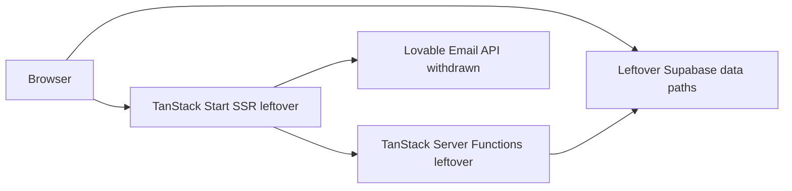
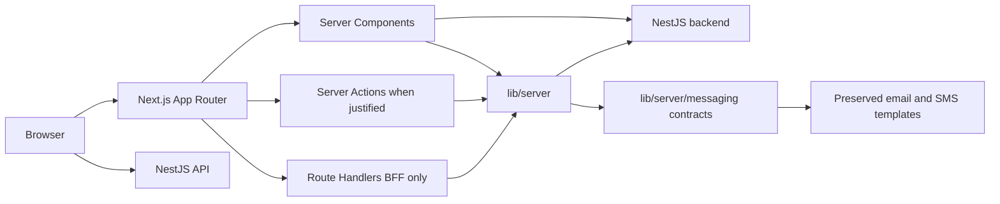

# Frontend Migration Blueprint

This documentation describes migration from TanStack Start to Next.js. It does not authorize implementation. Architecture decisions live in [`docs/architecture/`](../architecture/README.md); this folder is the frontend blueprint.

## Target stack (DECIDED)

| Concern    | Target                                      |
| ---------- | ------------------------------------------- |
| Framework  | Next.js 16.3.x App Router                   |
| UI         | React / React DOM 19.2.x                    |
| Language   | TypeScript 6.0.x                            |
| Hosting    | Vercel (initial); Node.js 24 LTS            |
| Cloudflare | Secondary; `workerd` via OpenNext if chosen |
| Messaging  | `src/lib/server/messaging/` contracts only  |

## Current and target

## Locked decisions

**DECIDED**

- Visual style parity: no redesign ([ADR-010](../architecture/decisions/ADR-010-style-and-template-parity.md)).
- Preserve email/SMS templates under `src/lib/server/messaging/`; features use provider-agnostic contracts only.
- Email/SMS delivery providers: **ACCEPTED RISK** with adapter stubs.
- Withdraw Lovable packages, `/lovable/*` routes, secrets, and host hooks ([ADR-009](../architecture/decisions/ADR-009-lovable-withdrawal.md)).
- Initial hosting: Vercel; Node 24 LTS ([ADR-001](../architecture/decisions/ADR-001-nextjs-version.md), [ADR-008](../architecture/decisions/ADR-008-deployment.md)).
- Next.js 16.3.x, React/React DOM 19.2.x, TypeScript 6.0.x; package manager npm.
- App Router; native route typing; Metadata API; `error`/`not-found`/`loading` ([ADR-002](../architecture/decisions/ADR-002-app-router.md)).
- Existing backend remains primary API; Route Handlers/Server Actions only when justified ([ADR-006](../architecture/decisions/ADR-006-server-boundaries.md)).
- Backend owns authz via **NestJS independent auth** (local JWT for `admin` · `staff` · `customer`); **no Supabase Auth** even in Phase 1 ([ADR-005](../architecture/decisions/ADR-005-authentication.md) Option C). Next.js route protection + session-aware rendering; HTTP-only cookies where applicable. NestJS natively handles admin temp-passwords/resets and customer OTP. Locked roles: `admin` · `staff` (same permissions as `admin` for now) · `customer` ([11-authentication-migration.md](11-authentication-migration.md#locked-role-matrix)).
- Server-function mapping **DECIDED**: Backend API / Server Action / BFF tree ([15-server-function-mapping.md](15-server-function-mapping.md)).
- RSC by default; small Client islands; static/SSR/ISR per route ([ADR-003](../architecture/decisions/ADR-003-rendering-strategy.md)).
- Hybrid data fetching: RSC initial reads; TanStack Query for interactive server state ([ADR-004](../architecture/decisions/ADR-004-data-and-state.md)).
- Thin `app/`; domain logic in `features/` ([ADR-007](../architecture/decisions/ADR-007-project-structure.md)).
- Production route map **APPROVED** ([02-route-migration.md](02-route-migration.md)).
- RLS/storage Phase 1 retain existing policies; Phase 2 Backend-only access **DECIDED** ([ADR-011](../architecture/decisions/ADR-011-rls-storage-strategy.md)).
- Public enrollment rate limits **DECIDED** ([ADR-012](../architecture/decisions/ADR-012-public-enrollment-rate-limiting.md)).
- Campaign/messaging background runtime **DECIDED** ΓÇö outside Next.js ([ADR-013](../architecture/decisions/ADR-013-campaign-messaging-runtime.md)).
- Phase 2 backend stack **DECIDED** — NestJS 11.x, Prisma 7.x, PostgreSQL 18.x ([ADR-015](../architecture/decisions/ADR-015-backend-stack.md)); not a migration slice.

**ACCEPTED RISK (remain open in docs)**

- Cookie/SSR session spike (**BLOCKED** until Nest JWT HTTP-only cookies are proven — [ADR-005](../architecture/decisions/ADR-005-authentication.md); `@supabase/ssr` spike [superseded](../architecture/spikes/auth-ssr-spike.md)).
- Minimal parity baselines ([parity-baselines.md](../architecture/parity-baselines.md)); asset vendoring **done** (slice 2); env confirm at Vercel deploy; rollback owner not a GO gate.

**DECIDED (go-live / cutover)**

- Pre-launch D-23: first production is Next on Vercel; no dual production frontends; first-party email BFF cutover ΓÇö [cutover.md](../architecture/cutover.md).

## Documents

1. [Current frontend](01-current-frontend.md)
2. [Route migration](02-route-migration.md)
3. [Frontend domains](03-frontend-domains.md)
4. [Rendering strategy](04-rendering-strategy.md)
5. [Client boundaries](05-client-boundaries.md)
6. [Data fetching](06-data-fetching.md)
7. [State management](07-state-management.md)
8. [Project structure](08-project-structure.md)
9. [Dependency rules](09-dependency-rules.md)
10. [Styling and assets](10-styling-and-assets.md)
11. [Authentication](11-authentication-migration.md) — including [locked role matrix](11-authentication-migration.md#locked-role-matrix) and [credential recovery](11-authentication-migration.md#credential-recovery-decided)
12. [Migration plan](12-migration-plan.md)
13. [Migration risks](13-migration-risks.md)
14. [Consolidated architecture](14-frontend-architecture.md)
15. [Server-function mapping](15-server-function-mapping.md)
16. [Dependency compatibility](16-dependency-compatibility.md)
17. [Messaging templates](17-messaging-templates.md)

### Page reference

- [Overview / Dashboard (`/app/dashboard`)](dashboard-page.md) — checklist, setup-complete canvas, shell chrome
- [Customers (`/app/customers`)](customers-page.md) — list, filters, CRUD, detail placeholders
- [Loyalty Program (`/app/loyalty`)](loyalty-page.md) — capability types, rewards, referrals, QR, join/check-in; **DECIDED:** Shop capabilities (at most one Points, one Visit, one Tier) + `draft`/`active`/`disabled` per capability; **DECIDED:** OTP then both-party grants + `Invoice.Paid` referrer + `vouchers` + link/QR; Signup Bonus once per Shop (can stack); **DECIDED:** customer wallet per Shop (capability sections). Canonical model: [program-model.md](../product/program-model.md)
- [Branches (`/app/branches`)](branches-page.md) — plan limits, cards, detail placeholders
- [Settings (`/app/settings`)](settings-page.md) — general, notifications, integrations, billing, security
- [Campaigns (`/app/campaigns`)](campaigns-page.md) — list, send, audience, automations, detail; [product meanings](campaigns-page.md#product-meanings-decided) (Draft → Active while sending → Completed)
- [Analytics (`/app/analytics`)](analytics-page.md) — components, conditions, and edge cases
- [System architecture](system-architecture.md) — how pages, BFF, API, and DB communicate
- [Gaps and solutions](gaps-and-solutions.md) — UI vs API vs DB backlog (**G-01…G-36**)
- Backend contracts (separate program, not migration): [../backend/README.md](../backend/README.md) · [ADR-014](../architecture/decisions/ADR-014-product-data-ownership.md) · [ADR-015](../architecture/decisions/ADR-015-backend-stack.md)

**Next step:** slice 15 remainder — production smoke + visual/email HTML parity. Optional: prove Nest JWT cookie/SSR (D-28 retargeted; do not re-run `@supabase/ssr`). Multi-agent roles: [multi-agent-workflow.md](../architecture/multi-agent-workflow.md).

**Migration Go / No-Go:** **GO**.
