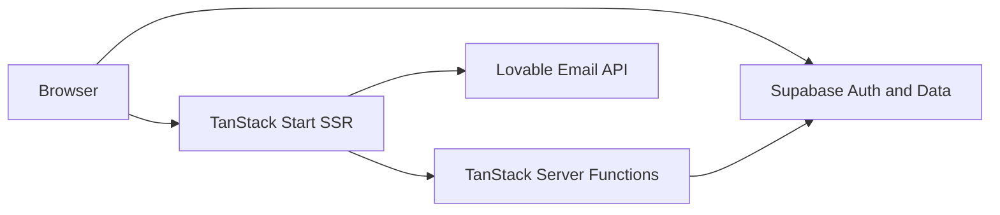
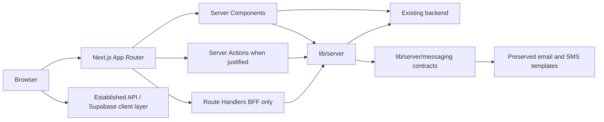

# Frontend Migration Blueprint

This documentation describes migration from TanStack Start to Next.js. It does not authorize implementation. Architecture decisions live in [`docs/architecture/`](../architecture/README.md); this folder is the frontend blueprint.

## Target stack (DECIDED)

| Concern    | Target                                      |
| ---------- | ------------------------------------------- |
| Framework  | Next.js 16.3.x App Router                   |
| UI         | React / React DOM 19.2.x                    |
| Language   | TypeScript 6.0.x                            |
| Hosting    | Vercel (initial); Node.js 24 LTS            |
| Cloudflare | Secondary; `workerd` via OpenNext if chosen |
| Messaging  | `src/lib/server/messaging/` contracts only  |

## Current and target

## Locked decisions

**DECIDED**

- Visual style parity: no redesign ([ADR-010](../architecture/decisions/ADR-010-style-and-template-parity.md)).
- Preserve email/SMS templates under `src/lib/server/messaging/`; features use provider-agnostic contracts only.
- Email/SMS delivery providers: **ACCEPTED RISK** with adapter stubs.
- Withdraw Lovable packages, `/lovable/*` routes, secrets, and host hooks ([ADR-009](../architecture/decisions/ADR-009-lovable-withdrawal.md)).
- Initial hosting: Vercel; Node 24 LTS ([ADR-001](../architecture/decisions/ADR-001-nextjs-version.md), [ADR-008](../architecture/decisions/ADR-008-deployment.md)).
- Next.js 16.3.x, React/React DOM 19.2.x, TypeScript 6.0.x; package manager npm.
- App Router; native route typing; Metadata API; `error`/`not-found`/`loading` ([ADR-002](../architecture/decisions/ADR-002-app-router.md)).
- Existing backend remains primary API; Route Handlers/Server Actions only when justified ([ADR-006](../architecture/decisions/ADR-006-server-boundaries.md)).
- Backend owns authz; Next.js route protection + session-aware rendering; cookies where applicable ([ADR-005](../architecture/decisions/ADR-005-authentication.md)).
- Server-function mapping **DECIDED**: Backend API / Server Action / BFF tree ([15-server-function-mapping.md](15-server-function-mapping.md)).
- RSC by default; small Client islands; static/SSR/ISR per route ([ADR-003](../architecture/decisions/ADR-003-rendering-strategy.md)).
- Hybrid data fetching: RSC initial reads; TanStack Query for interactive server state ([ADR-004](../architecture/decisions/ADR-004-data-and-state.md)).
- Thin `app/`; domain logic in `features/` ([ADR-007](../architecture/decisions/ADR-007-project-structure.md)).
- Production route map **APPROVED** ([02-route-migration.md](02-route-migration.md)).
- RLS/storage Phase 1 retain existing policies; Phase 2 Backend-only access **DECIDED** ([ADR-011](../architecture/decisions/ADR-011-rls-storage-strategy.md)).
- Public enrollment rate limits **DECIDED** ([ADR-012](../architecture/decisions/ADR-012-public-enrollment-rate-limiting.md)).
- Campaign/messaging background runtime **DECIDED** — outside Next.js ([ADR-013](../architecture/decisions/ADR-013-campaign-messaging-runtime.md)).

**ACCEPTED RISK (remain open in docs)**

- Cookie/SSR session spike (**BLOCKED** until PASSED after migration start — [auth-ssr-spike.md](../architecture/spikes/auth-ssr-spike.md)); prove during foundation / server-infra / auth with service-role or confirmed test user.
- Minimal parity baselines ([parity-baselines.md](../architecture/parity-baselines.md)); asset vendoring in slice 2; env confirm at Vercel deploy; rollback owner not a GO gate.

**DECIDED (go-live / cutover)**

- Pre-launch D-23: first production is Next on Vercel; no dual production frontends; first-party email BFF cutover — [cutover.md](../architecture/cutover.md).

## Documents

1. [Current frontend](01-current-frontend.md)
2. [Route migration](02-route-migration.md)
3. [Frontend domains](03-frontend-domains.md)
4. [Rendering strategy](04-rendering-strategy.md)
5. [Client boundaries](05-client-boundaries.md)
6. [Data fetching](06-data-fetching.md)
7. [State management](07-state-management.md)
8. [Project structure](08-project-structure.md)
9. [Dependency rules](09-dependency-rules.md)
10. [Styling and assets](10-styling-and-assets.md)
11. [Authentication](11-authentication-migration.md)
12. [Migration plan](12-migration-plan.md)
13. [Migration risks](13-migration-risks.md)
14. [Consolidated architecture](14-frontend-architecture.md)
15. [Server-function mapping](15-server-function-mapping.md)
16. [Dependency compatibility](16-dependency-compatibility.md)
17. [Messaging templates](17-messaging-templates.md)

**Next step:** slice 2 — Vendor/re-host Lovable/CDN assets (`src/assets/*.asset.json` + CDN URLs); broken-image scan at acceptance. Prove D-28 cookie/SSR session during server-infra / auth; keep [auth-ssr-spike.md](../architecture/spikes/auth-ssr-spike.md) open until PASSED.

**Migration Go / No-Go:** **GO**.
