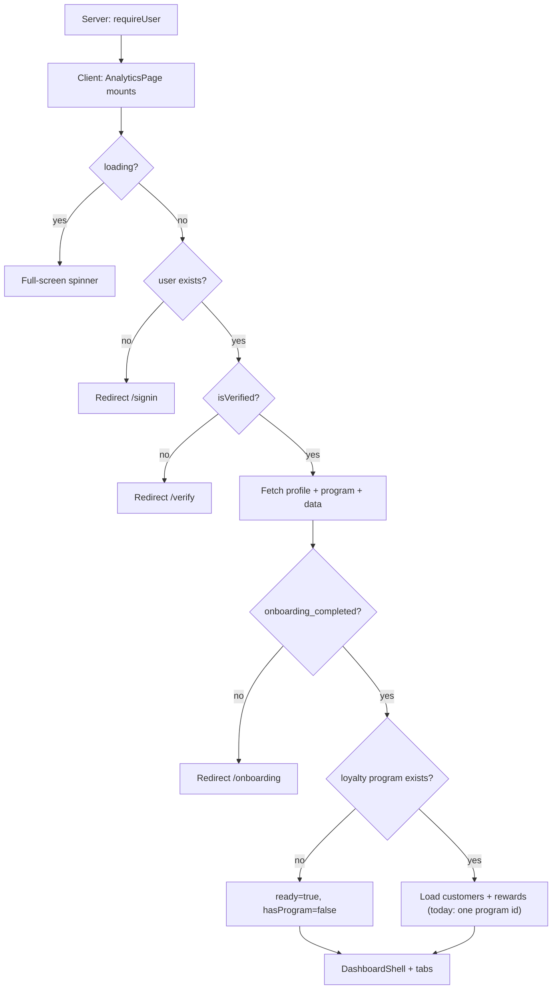

# Analytics Page (`/app/analytics`)

Reference for all components, conditions, and edge cases on the Analytics route. Includes domain notes for frontend + backend work (**today:** one program per owner in shipped code; **DECIDED:** independent programs with one ACTIVE, Analytics **Shop-scoped** — [ADR-016](../architecture/decisions/ADR-016-independent-programs.md) · [loyalty-page.md](loyalty-page.md#independent-programs-decided); how tiers are stored vs assigned, segment cutoffs, revenue placeholders), plus a [UI / API / DB gap analysis](#gaps-ui--api--db-and-recommended-solutions).

**Jump to:** [independent programs](#independent-programs-decided-adr-016) · [one program today](#one-owner--one-loyalty-program-today) · [how tiers work](#how-customer-tiers-actually-work) · [point ranges](#loyalty-page-point-ranges-saved-vs-ui) · [lifecycle](#customer-lifecycle--card) · [members by tier](#members-by-tier--card--donut) · [engagement stats](#stat-cards-4) · [visit frequency](#visit-frequency-over-time--card--emptychart-disabled) · [insights](#engagement-insights--card-suggestion-cards-not-a-report) · [most engaged / tier column](#most-engaged-members--card--table) · [lifecycle states](#lifecycle-states--card--horizontal-bars) · [lifecycle vs tiers](#lifecycle-vs-tiers-do-not-mix) · [revenue tab](#tab-3-revenuetab) · [ROI](#roi-from-rewards) · [channel](#revenue-by-channel--what-channel-means) · [gaps](#gaps-ui--api--db-and-recommended-solutions)

**Source files:**

- Route entry: `src/app/app/(shell)/analytics/page.tsx`
- Feature implementation: `src/features/analytics/analytics-page.tsx`
- Shell layout guard: `src/app/app/(shell)/layout.tsx`
- Dashboard chrome: `src/components/dashboard/DashboardShell.tsx`
- Loyalty program (tier config): `src/features/loyalty/loyalty-page.tsx`
- Tier UI: `src/components/loyalty/TierBasedFlow.tsx`, `src/components/loyalty/TierSection.tsx`
- Unique owner constraint: `supabase/migrations/20260713174353_034cd3b0-2acb-430d-b1d9-14efe9174840.sql`
- Dashboard “at risk” (30-day recency): `src/components/dashboard/SetupCompleteDashboard.tsx`
- Customers status filter: `src/features/customers/customers-page.tsx`
- Independent programs: [ADR-016](../architecture/decisions/ADR-016-independent-programs.md) · [program-model.md](../product/program-model.md)

---

## Independent programs (DECIDED — ADR-016)

**Status:** DECIDED 2026-08-18. **Shipped code on this page still uses the legacy one-row model** until [G-35](gaps-and-solutions.md#g-35--shop-loyalty-is-one-row-not-independent-programs) backend + frontend migration land.

A Shop may own **many independent programs**. **At most one is `ACTIVE`**. Analytics remain **Shop-scoped** — metrics aggregate **all customer identities** for the Shop, not a single program’s FK slice.

| Concern | **Today (shipped code)** | **Target (ADR-016 + G-35)** |
|---------|--------------------------|-----------------------------|
| Program lookup | `loyalty_programs.maybeSingle()` by `owner_id` | Any program row exists → Shop has data; optional ACTIVE badge in chrome later |
| Customers query | `customers` where `loyalty_program_id =` sole program id | `customers` where `loyalty_program_id IN (`all Shop program ids`)` — one identity per Shop |
| Rewards query | `rewards` where `loyalty_program_id =` sole program id | `rewards` where `loyalty_program_id IN (`all Shop program ids`)` — top-redeemed spans all program catalogs |
| Empty state | No program row → “Create a loyalty program…” | No programs at all → same; programs exist but none ACTIVE → still show Shop data (archived enrollments count) |
| Points chart subtitle | “Weekly totals across all programs” | Correct by design once Shop-scoped query ships |

Catalog, wallet, ledger, earn, and referrals are **program-scoped**. Analytics and campaigns are **Shop-scoped**. Do not sum spendable points across Shops; within a Shop, archived-program balances stay in **Archived History**, not ACTIVE spendable ([program-model.md](../product/program-model.md)).

### Frontend migration checklist (Analytics)

When G-35 schema ships, update **`analytics-page.tsx`** only:

1. Replace `maybeSingle()` with fetch all programs for `owner_id`; collect `programIds`.
2. Load `customers` and `rewards` with `.in("loyalty_program_id", programIds)`.
3. Set `hasProgram` from `programIds.length > 0` (Shop has any program), not from a single row id.

---

## Route structure

The URL `/app/analytics` is served by a thin Next.js page that delegates to the feature module:

```tsx
// src/app/app/(shell)/analytics/page.tsx
"use client";

import AnalyticsPage from "@/features/analytics/analytics-page";

export default function Page() {
  return <AnalyticsPage />;
}
```

The page sits under `src/app/app/(shell)/`, which applies a **server-side auth guard** before anything renders:

```tsx
// src/app/app/(shell)/layout.tsx
export default async function AppShellLayout({ children }) {
  await requireUser();
  return <>{children}</>;
}
```

Auth is enforced twice:

1. **Server** — `requireUser()` redirects unauthenticated users to `/auth/sign-in`
2. **Client** — `AnalyticsPage` runs additional checks (verification, onboarding)

---

## High-level page flow



> **Target (ADR-016):** step N loads customers/rewards for **all** Shop program ids. See [Independent programs](#independent-programs-decided-adr-016).

---

## `AnalyticsPage` — root component

### State

| State | Purpose |
|-------|---------|
| `fullName` | Shown in dashboard header |
| `programId` | **Today:** sole program row id (proxy for “has program”). **Target:** remove; use `hasShopPrograms` |
| `customers` | **Today:** customers for one `loyalty_program_id`. **Target:** all Shop customers across program ids |
| `rewards` | **Today:** rewards for one program. **Target:** all Shop rewards across program ids |
| `ready` | Data fetch finished |
| `tab` | `"overview"` \| `"engagement"` \| `"revenue"` |

### Client-side redirects (`useEffect`)

| Condition | Action |
|-----------|--------|
| `loading === true` | Wait (no redirect) |
| `!user` | → `/signin` |
| `!isVerified` | → `/verify?email=...` |
| `!profile.onboarding_completed` | → `/onboarding` |
| No loyalty program | Stay on page, `hasProgram = false` |
| Program exists | **Today:** load `customers` + `rewards` for that program id. **Target:** load for all Shop program ids |

### Data loading sequence

1. Fetch `profiles` (`full_name`, `onboarding_completed`) for current user
2. **Today:** fetch `loyalty_programs` where `owner_id = user.id` with `.maybeSingle()`. **Target:** fetch all programs; derive `programIds` ([Independent programs](#independent-programs-decided-adr-016))
3. If program exists (**today**), parallel fetch:
   - `customers` — `id, full_name, email, tier, points, visits, status, last_activity_at, created_at` where `loyalty_program_id = program.id`
   - `rewards` — `id, name, icon, point_cost, redeemed_count` where `loyalty_program_id = program.id`
4. **Target:** same columns where `loyalty_program_id IN (programIds)`

### Loading UI

While `loading || !ready`, a centered yellow spinner is shown (not `DashboardShell`).

### Main UI (once ready)

Wrapped in `DashboardShell` with sidebar, header, notifications, and mobile nav. Analytics is highlighted under **Growth → Analytics**.

---

## Page chrome (always visible when loaded)

### Header

- **Title:** Analytics
- **Subtitle:** “A deeper look at engagement, retention, and revenue impact”
- **“This month” button** — UI only; no date filtering wired
- **“Export” button** — UI only; no export logic

### Tab bar

> **Product MVP (Ship 1):** **Comment out** the **Revenue Impact** tab entry, `<RevenueTab />` panel branch, and Overview **Revenue impact** card. Trim page subtitle (drop “revenue impact”). See [phase-1-scope.md § Code inventory](../product/phase-1-scope.md#code-inventory--blocks-to-comment-out-for-ship-1).

Three tabs switch `tab` state (Revenue tab present in source until commented):

| Tab | Component | Data dependency |
|-----|-----------|-----------------|
| Overview | `OverviewTab` | `customers`, `rewards`, `hasProgram` |
| Engagement | `EngagementTab` | `customers`, `hasProgram` |
| Revenue Impact | `RevenueTab` | None (all placeholders) |

Active tab gets yellow background (`#feb602`).

---

## Tab 1: `OverviewTab`

### Global condition: no loyalty program

If `hasProgram === false` (`programId` is null), only an empty state is shown — no stat cards or charts:

> “Create a loyalty program to start seeing analytics.”

### Stat cards (4) — `StatCard`

All use real customer/reward data except deltas (always `"—"`).

| Card | Calculation |
|------|-------------|
| **Active members** | `customers.filter(c => c.status === "active").length` |
| **Redemption rate** | `pointsRedeemed / (totalPointsIssued + pointsRedeemed) * 100` — `0%` if denominator is 0 |
| **Avg. points liability** | `totalPointsIssued / activeMembers` — `0` if no active members |
| **Repeat purchase rate** | % of customers with `visits >= 2` — `0%` if no customers |

Where:

- `totalPointsIssued` = sum of all customer `points`
- `pointsRedeemed` = sum of `redeemed_count * point_cost` per reward

### Points issued vs. redeemed chart — `Card` + bar chart

| Condition | Result |
|-----------|--------|
| `customers.length === 0 && pointsRedeemed === 0` | `EmptyChart("No point activity yet.")` |
| Otherwise | 8 weekly buckets (W1–W8) |

Chart behavior:

- **Issued:** customer `points` bucketed by `created_at` (proxy — not a true transaction ledger)
- **Redeemed:** always `0` in weekly buckets (no per-week redemption events tracked)
- Bar height scales to `maxBar` (minimum 1)

### Members by tier — `Card` + `Donut`

Groups **all customers** by the stored `customers.tier` **string**. It does **not** compute tier from points, visits, or `loyalty_program_tiers` thresholds.

**Grouping rules:**

| `customers.tier` | Shown as |
|------------------|----------|
| `null` or blank | **Untiered** |
| Any other text | That exact name (Gold, VIP, …) |

Then:

- Count how many customers share each name
- `%` = count ÷ **all customers** (rounded)
- Slices sorted by count, largest first
- Colors from a **fixed palette** in the page (`#a3a3a3`, `#feb602`, `#0a152f`, `#344f89`, `#c48a5b`) — **not** `loyalty_program_tiers.color`

| Condition | Result |
|-----------|--------|
| `tierBreakdown.total === 0` | `EmptyChart("No members yet.")` |
| Otherwise | SVG donut + legend (count and % per tier) |

**Owner does not assign a customer to a tier in the UI.** They only define the program’s tier ladder (see [How customer tiers actually work](#how-customer-tiers-actually-work)). Enrollment and check-in do not write `customers.tier`, so most members currently land in **Untiered**.

### Top redeemed rewards — `Card` + `RewardIcon`

- Filters rewards with `redeemed_count > 0`, top 5 by redemptions
- **Empty:** “No redemptions yet.”
- **Per row:** icon, name, optional `point_cost`, redemption count

**`RewardIcon` cases:**

| `icon` value | Display |
|--------------|---------|
| Length ≤ 2 (emoji) | Renders emoji |
| Otherwise | Lucide fallback icon by index (`Coffee`, `Percent`, `Cookie`, `Gift`, `Crown`) |

### Customer lifecycle — `Card` (target)

> **Today:** Overview shows overlapping **Customer segments** (Champions, Loyal, New 30d, At risk) — client-side only. **Target:** replace with this card per [customer-lifecycle.md](../backend/customer-lifecycle.md).

Grouped by **`lifecycle_state`** — **mutually exclusive** states from `created_at` and `last_activity_at`. **New + Active + At-Risk always equals 100%** of the customer base.

Percentage is of total customers; shows `"—"` if no customers.

| State | Rule (priority order) | Fields used |
|-------|----------------------|-------------|
| **At-Risk** | `last_activity_at` more than **30 days** ago (priority 1). Fallback: no activity on record and created > **14 days** ago | `last_activity_at`, `created_at` |
| **New** | Joined within the last **14 days** AND not At-Risk | `created_at` |
| **Active** | Activity within the last **30 days** AND not New/At-Risk | `last_activity_at` |

> **Note:** Target segments do **not** overlap. Visit-count buckets (Champions, Loyal, etc.) are **withdrawn** — tier milestones remain on the Members-by-tier donut only.

**Target implementation:** `countByLifecycleState()` in shared module; campaign send uses same rules server-side.

### Revenue impact (within Overview) — `Card`

> **Product MVP (Ship 1):** **Comment out** this entire card block. Do not show `"—"` placeholders in Ship 1.

**No equations run.** Every value is `"—"`. This is a layout for money metrics that need **order/transaction data**, which does not exist yet. Points and visits are **not** used as a stand-in for revenue.

**Intended meaning:** average order value (AOV) for loyalty members vs non-members.

| Box | Shown now | Intended formula (not coded) |
|-----|-----------|------------------------------|
| Loyalty members | `—` | member order totals ÷ member order count |
| Non-members | `—` | non-member order totals ÷ non-member order count |

**Required inputs (missing):** `order.amount`, `order.date`, and whether the buyer is a loyalty customer.

Green banner copy: tracking will appear once orders are linked to loyalty members. Dashes are used instead of `0` so it does not look like “zero revenue.”

Full intended metrics for the Revenue tab: [Revenue impact — intended equations](#revenue-impact--intended-equations-not-coded).

---

## Tab 2: `EngagementTab`

### Global condition: no program

Same pattern as Overview:

> “Create a loyalty program to start seeing engagement analytics.”

### Stat cards (4)

Only **two** cards calculate. The other two are always `"—"`. The “This month” header does not filter any of them.

| Card | Calculated? | Factors | Formula |
|------|-------------|---------|---------|
| **Avg. visits per member** | Yes | `customers.visits`, member count | `sum(visits) / customers.length` as `1.5x`. `"—"` if no customers. All-time; not only `status === "active"` |
| **QR scans this period** | No | none | Always `"—"`. Needs a scan/event log |
| **Avg. days between visits** | No | none | Always `"—"`. Needs visit events with timestamps |
| **30-day retention rate** | Yes, if eligible | `created_at`, `last_activity_at` | See below |

**Retention logic:**

- **Eligible:** `now - created_at >= 30 days`
- **Retained:** among those, `last_activity_at` exists and is within the last 30 days
- **Rate:** `retained / eligible * 100` (rounded)
- No eligible members → `"—"` (“Needs members ≥ 30 days old”)
- Does **not** use points, tier, or QR scans

### Visit frequency over time — `Card` + `EmptyChart` (disabled)

**Today:** no inputs, no numbers. Always empty:

> “Visit-level tracking coming soon — data will appear once scans are logged.”

The Returning / First-time legend is **decoration only**.

**Intended (not coded):** weekly bars on the X-axis, two series:

| Series | Intended meaning |
|--------|------------------|
| **First-time** | That customer’s first check-in/scan **that week** |
| **Returning** | Extra visits by the same customer later in the week |

**Why it is disabled:** needs a scan/visit **event log** (`who` + exact timestamp). The app only stores a running total on `customers.visits`, not each visit’s date. `visits`, `created_at`, and `last_activity_at` cannot tell first-time vs returning **per week**.

### Engagement insights — `Card` (suggestion cards, not a report)

Four always-visible tips. Buttons do **not** open campaigns or member lists.

| Insight | What the number is | CTA | Wired? |
|---------|--------------------|-----|--------|
| At risk of churning | **Target:** `lifecycle_state === 'at_risk'`. **Today:** recency > 30 days on `last_activity_at` | Send | No |
| 1 visit from a reward | `visits > 0 && visits % 5 === 4` (4, 9, 14…). The `5` is hardcoded, **not** program `visits_required` | Nudge | No |
| Peak hour | Static “coming soon” — needs visit timestamps | Explore | No |
| Tier upgrade nudges | Static “coming soon” — would use `loyalty_program_tiers` once wired | Create | No |

Pluralization: `"1 member"` vs `"N members"`.

### Most engaged members — `Card` + table

- Ranked top 5 by `visits`, then `points` (not by tier)
- **Empty:** `EmptyChart("No members yet.")`
- Columns: Customer (initials, name, optional email), **Tier**, visits, points
- Name fallback: `"Unnamed"`
- Initials fallback: `"?"` if no name

**Tier column** = `customers.tier` via `TierPill` (same as Overview donut). Not computed from visits/points or `loyalty_program_tiers`. Usually `"—"` because enroll/check-in never write `tier`.

**`TierPill` cases:**

| `tier` | Display |
|--------|---------|
| null / empty | `"—"` |
| `vip`, `gold`, `silver`, `bronze` | Colored pill + crown icon |
| anything else | Default gray pill |

### Lifecycle states — `Card` + horizontal bars (target)

> **Today:** Engagement tab shows overlapping **Engagement levels** (Champions, Loyal, Occasional, At risk, Dormant). **Target:** replace with this card per [customer-lifecycle.md](../backend/customer-lifecycle.md).

**Mutually exclusive** member states. Same three states as Overview lifecycle card. **New + Active + At-Risk = 100%.**

| State | Rule (priority order) |
|-------|----------------------|
| **At-Risk** | `last_activity_at` **> 30 days** ago (priority 1). Fallback: no activity and created **> 14 days** ago |
| **New** | `created_at` within **14 days** AND not At-Risk |
| **Active** | `last_activity_at` within **30 days** AND not New/At-Risk |

| Condition | Result |
|-----------|--------|
| `totalMembers === 0` | `EmptyChart("No members yet.")` |
| Otherwise | Bar chart + per-state count footer |

**Summary footer:** count per state (not visit averages — visit-count buckets withdrawn).

**Distinct from tiers:** `customers.tier` / Members-by-tier donut is the loyalty ladder, not lifecycle.

| Place | Meaning |
|-------|---------|
| Overview **Customer lifecycle** | `countByLifecycleState()` |
| Engagement **Lifecycle states** | same module |
| Dashboard stat cards | same module |
| Customers tabs / campaign send | same module (server-side in `campaigns-service`) |
| **Tiers** | Loyalty rank (`customers.tier`) — orthogonal to lifecycle |

---

## Tab 3: `RevenueTab`

Entirely placeholder — no `hasProgram` check, no Supabase queries, **no conditions**, **no calculations**. Points, visits, and `customers.tier` are **not** used as money.

Each stat card shows **value `"—"`**, **delta `"—"`** (would be month-over-month later), and a hint that order data is missing. Dashes are used instead of `0` so it does not look like “zero revenue.”

### Six cards

| Card | Intended meaning | Intended factors | Why empty |
|------|------------------|------------------|-----------|
| **Total Revenue Generated** | All sales in the period | `sum(order.amount)` | No orders table |
| **Loyalty-Driven Revenue** | Sales tied to loyalty (member checkout, or after a reward/campaign) | order amount + “from member / campaign” flag | Cannot tag an order as loyalty-driven |
| **ROI from Rewards** | Did rewards pay back? See [ROI from Rewards](#roi-from-rewards) | linked sales − reward **money** cost, then ÷ cost | No money cost on rewards; no linked orders |
| **Avg. revenue per member** | Spend per member | member revenue ÷ member count | No spend per customer |
| **Rewards redeemed revenue** | Sales around a redemption | order totals linked to a `customer_rewards` row | `redeemed_count` is a count, not money |
| **Top-spending member** | Who spent the most | `max(sum of orders per customer)` | No orders |

### Two charts

| Chart | Subtitle | Today | Intended |
|-------|----------|-------|----------|
| **Revenue over time** | Monthly revenue trend | EmptyChart | `sum(order.amount)` by month |
| **Revenue by channel** | Where loyalty-driven revenue comes from | EmptyChart | See [channel](#revenue-by-channel--what-channel-means) |

### Table: Revenue by reward tier

**Subtitle:** “Which tiers drive the most spend.”

| Column | Intended | Today |
|--------|----------|-------|
| **Tier** | Silver / Gold / VIP (or `loyalty_program_tiers.name`) | No rows |
| **Members** | Count in that tier | No rows |
| **Revenue** | Sum of those members’ orders | No rows |

Body copy: **“No revenue data yet.”** Needs (1) assigned tier and (2) orders. Without (2), even a filled `customers.tier` cannot show revenue.

Overview’s **Revenue impact** card is a smaller version: Loyalty members AOV vs Non-members AOV, both `"—"`.

### ROI from Rewards

**Meaning:** did giving gifts/rewards produce **net profit**, or a loss?

The card always shows `"—"`. The system stores reward cost in **points** (`point_cost`, e.g. 200 points). ROI needs a **cash cost** in currency.

**Formula:**

```text
ROI % = (revenue from the redemption ticket − cash cost of the reward)
        ÷ cash cost of the reward
        × 100
```

**Example:** 10 members redeem “free coffee”. Coffee costs the shop 20 each → investment 200. Those tickets also include 800 of extra products.

```text
ROI = (800 − 200) / 200 = 3 → 300%
```

| Factor | Meaning | In the app today |
|--------|---------|------------------|
| **Return** | `orders.amount_cents` on the ticket linked to the redemption | No orders table. `campaigns.revenue_cents` is campaign money, not redemptions |
| **Investment** | What honouring the gift **costs the owner in money** | **Not stored.** `rewards.point_cost` is points the **customer** burns, not cash |

`point_cost` is **not** currency. `redeemed_count` is a count. `customer_rewards` has `earned_at` / `redeemed_at` but no cents and no `order_id`.

Hint on the card: “Requires reward cost + revenue link.”

**How to track (backend):**

1. Cash cost on the reward:

```sql
ALTER TABLE rewards
ADD COLUMN cost_cents INT NOT NULL DEFAULT 0;
```

Owner enters this on `/app/loyalty` (cost of one free coffee, not points).

2. Link each redemption to the ticket. Prefer **extending** existing `customer_rewards` rather than a second table:

```sql
ALTER TABLE customer_rewards
ADD COLUMN order_id UUID REFERENCES orders(id);
```

If a dedicated table is preferred:

```sql
CREATE TABLE redemptions (
  id UUID PRIMARY KEY,
  reward_id UUID REFERENCES rewards(id),
  customer_id UUID REFERENCES customers(id),
  order_id UUID REFERENCES orders(id),
  created_at TIMESTAMPTZ DEFAULT NOW()
);
```

At redeem-in-store: create/attach the `orders` row, set `order_id` on the redemption.

3. Backend aggregation:

`:program_id` below is **Shop identity** (`loyalty_program_id` as a transitional alias — [data-contract](../backend/data-contract.md#shop-capability-model-decided-not-shipped)).

```sql
WITH reward_metrics AS (
  SELECT
    SUM(r.cost_cents) AS total_investment,
    SUM(o.amount_cents) AS total_return
  FROM customer_rewards red
  JOIN rewards r ON red.reward_id = r.id
  JOIN orders o ON red.order_id = o.id
  WHERE r.loyalty_program_id = :program_id
    AND red.order_id IS NOT NULL
)
SELECT
  CASE
    WHEN COALESCE(total_investment, 0) = 0 THEN NULL
    ELSE ((total_return - total_investment) / total_investment::float) * 100
  END AS roi_percentage
FROM reward_metrics;
```

Return `NULL` → UI `"—"` when investment is 0 (avoid fake 0% ROI). Use `amount_cents` consistently (not mixed pounds/cents).

### Revenue by channel — what “channel” means

**Channel is not** customer tiers and **not** visit count. It is the **source of the sale** — the path that led to the purchase.

**Today:** `campaigns.channel` is `"email"` \| `"sms"` (how you **message**). The Analytics chart is **not** bound to that column. There are no orders, so nothing to group.

**Intended:** split **loyalty-driven sales** by what motivated the buy:

| `attributed_channel` | Meaning |
|----------------------|---------|
| `email` | Sale attributed to an email campaign |
| `sms` | Sale attributed to an SMS campaign |
| `in_store` (or `qr`) | Sale at the counter / QR scan, no campaign |

**How to track (attribution):**

1. Orders must carry the source (and optional campaign):

```sql
ALTER TABLE orders
ADD COLUMN attributed_channel VARCHAR(50), -- 'email', 'sms', 'in_store'
ADD COLUMN campaign_id UUID REFERENCES campaigns(id);
```

Also store `loyalty_program_id` (Shop identity, transitional), `amount_cents`, `customer_id` (nullable for non-members), `occurred_at`.

2. **Tracking links / promo codes:** campaign email/SMS includes a URL or discount code with `campaign_id`. Checkout or POS redeem of that code writes `attributed_channel` from `campaigns.channel` and sets `campaign_id`. In-store QR with no code → `in_store`.

3. Backend chart query:

```sql
SELECT attributed_channel, SUM(amount_cents) AS total_revenue
FROM orders
WHERE loyalty_program_id = :program_id
GROUP BY attributed_channel;
```

Do not `GROUP BY campaigns.channel` alone — that is send-channel, not sale-channel, and unsent/unattributed campaigns would skew the chart.

---

## Domain context (loyalty + tiers + revenue)

Use this when wiring frontend and backend. Analytics assumes the current product model below.

### One owner → one loyalty program (today)

**Today (shipped code)** a business **cannot** have more than one loyalty program row:

- DB: `CONSTRAINT loyalty_programs_owner_unique UNIQUE (owner_id)`  
  (`supabase/migrations/20260713174353_034cd3b0-2acb-430d-b1d9-14efe9174840.sql`)
- App fetches with `.eq("owner_id", user.id).maybeSingle()` (expects 0 or 1 row)
- Analytics loads **that single program’s** `customers` and `rewards`

**Target (DECIDED — ADR-016):** independent programs; at most one **ACTIVE** per Shop. Analytics stay **Shop-scoped** — aggregate customers/rewards across **all** Shop program ids. See [Independent programs](#independent-programs-decided-adr-016), [loyalty-page.md](loyalty-page.md#independent-programs-decided), and [G-35](gaps-and-solutions.md#g-35--shop-loyalty-is-one-row-not-independent-programs).

There is **no** (today):

| Capability | Loyalty programs (today) | Intended | Campaigns |
|------------|--------------------------|----------|-----------|
| Draft | No | Yes (`draft`) | Yes (`status: "draft"`) |
| Multiple per shop | No | **Yes** | Yes |
| Status active / disabled | No | `active` \| `disabled` | Campaign has its own machine |
| Switch / select | No | List/select (UI not locked) | Filter by status tabs |

`draft` exists only for **campaigns** today. Opening Loyalty Program is create-or-edit of the same row until G-35 ships.

### How customer tiers actually work

Two different things:

| Layer | Table | What it is |
|-------|-------|------------|
| **Tier ladder (config)** | `loyalty_program_tiers` | Owner-defined names, colors, **minimum** `points_threshold`, benefits |
| **Customer’s current tier** | `customers.tier` (text, nullable) | What Analytics groups on |

**Owner configures the ladder, not each customer.** On `/app/loyalty`, if program type is `tier`, they add/edit/delete `loyalty_program_tiers` rows. There is no “assign this customer to Gold” control.

**The ladder is not applied yet.** Join/enroll does not set `tier`. Check-in does not compare points to thresholds. No trigger writes `customers.tier`. Analytics therefore usually shows **Untiered**.

Loyalty page “Tier stats” even hardcodes member counts as `"0"`.

### Loyalty page point ranges: saved vs UI

Ranges like **“0 – 999 pts”** / **“1,000 – 2,499 pts”** are **not** stored as from–to columns.

**Template cards** (`TierBasedFlow`) hardcode those labels. Selecting a template **saves only the start**:

| Template card (UI text) | Saved `points_threshold` |
|-------------------------|--------------------------|
| `0 – 999 pts` | `0` |
| `1,000 – 2,499 pts` | `1000` |
| `2,500+ pts` | `2500` |

After save, the list **recomputes** a range from neighboring thresholds (sorted):

- Silver `0`, Gold `1000` → shown as `0 – 999 points` / `1,000+` (or next − 1)
- Last tier: `{threshold}+ points`

The owner **can** add, edit, and delete tiers (name, color, threshold, benefits). Changing Gold from `1000` to `800` updates the stored threshold; the range label is recalculated in the UI only.

**Intended rule (copy on the edit dialog, not implemented):** “Customers will enter this tier once they reach the specified point balance.”

### Customer lifecycle (target — single system)

> **Today:** three conflicting systems (see [lifecycle vs tiers](#lifecycle-vs-tiers-do-not-mix)). **Target:** all surfaces below use [customer-lifecycle.md](../backend/customer-lifecycle.md).

| State | Rule |
|-------|------|
| **At-Risk** | Last activity **> 30 days** ago (highest priority) |
| **New** | Joined **≤ 14 days** ago (and not At-Risk) |
| **Active** | Activity **≤ 30 days** ago (and not New/At-Risk) |

### Lifecycle vs tiers (do not mix)

| System | Stored? | Based on | Where |
|--------|---------|----------|-------|
| **`lifecycle_state`** | Computed at query time | `created_at` + `last_activity_at` | Dashboard, Analytics, Customers tabs, campaign audiences |
| **Tiers** (loyalty rank) | Config: `loyalty_program_tiers`. Member label: `customers.tier` | Points ladder (when wired) | `/app/loyalty`, Overview donut, Most engaged **Tier** column |
| **`customers.status`** | Stored on row | Enroll/churn/deleted writers | Operational record status — **not** used for lifecycle segmentation |

**Canonical rule** ([data-contract glossary](../backend/data-contract.md#unified-glossary)): one `lifecycle_state` per customer; campaign targeting filters on computed state so audiences never overlap.

| Place | Rule |
|-------|------|
| Analytics Overview + Engagement | `countByLifecycleState()` |
| Dashboard | same |
| Customers page tabs | same |
| Campaign send (`campaigns-service`) | same (includes `last_activity_at` + `created_at` in query) |

### Missing scan / visit event log

Several Engagement widgets need a table of individual scans (`customer_id` + timestamp), which **does not exist**. Today only `customers.visits` (running total) and `last_activity_at` (last time) exist.

Blocked until that log exists:

- QR scans this period
- Avg. days between visits
- Visit frequency over time (first-time vs returning **per week**)
- Peak hour insight

`visits`, `created_at`, and `last_activity_at` are **not** enough for those four.

---

## Revenue impact — intended equations (not coded)

Detail for each Revenue tab widget: [Tab 3](#tab-3-revenuetab). ROI: [ROI from Rewards](#roi-from-rewards). Channel: [what channel means](#revenue-by-channel--what-channel-means).

**Today:** no factors, no formulas. UI shows `"—"`.

**Needed data source:** orders/transactions with amount, timestamp, and link to a loyalty customer (or “not a member”). Optionally `reward_id` / campaign for ROI and “loyalty-driven” revenue.

Points, visits, and `customers.tier` are **not** inputs to these metrics today.

### Overview card

| Metric | Intended equation |
|--------|-------------------|
| Loyalty members AOV | `sum(member order totals) / count(member orders)` |
| Non-members AOV | `sum(non-member order totals) / count(non-member orders)` |

### Revenue tab cards

| Metric | Intended idea | Factors |
|--------|----------------|---------|
| **Total Revenue Generated** | All sales in the period | `sum(order.amount)` |
| **Loyalty-Driven Revenue** | Sales tied to loyalty (member orders, or after reward/campaign) | order total + “from member / campaign” flag |
| **ROI from Rewards** | Did rewards pay for themselves? | revenue from redeemers ÷ cost of those rewards |
| **Avg. revenue per member** | Spend per member | member revenue ÷ member count |
| **Rewards redeemed revenue** | Sales around redemptions | order totals linked to a redemption |
| **Top-spending member** | Highest spend | `max(sum of orders per customer)` |

### Revenue tab charts

| Chart | Intended |
|-------|----------|
| Revenue over time | Monthly `sum(order.amount)` |
| Revenue by channel | Group by sale channel |
| Revenue by reward tier | Group spend by Silver/Gold/VIP (would need assigned `customers.tier` **or** live threshold matching) |

---

## Data model

### Customer (from `customers` table)

`id`, `full_name`, `email`, `tier`, `points`, `visits`, `status`, `last_activity_at`, `created_at`

- `tier` is a free-text column, not an FK to `loyalty_program_tiers`
- Analytics reads it as-is; empty → Untiered

### Reward (from `rewards` table)

`id`, `name`, `icon`, `point_cost`, `redeemed_count`

### Loyalty program (from `loyalty_programs`)

**Today:** one row per `owner_id` (unique). Analytics loads that single program’s customers and rewards.

**Target:** many rows per Shop; partial unique one `status = 'active'`. Analytics queries all program ids for the Shop ([Independent programs](#independent-programs-decided-adr-016)).

### Program tiers (from `loyalty_program_tiers`) — **not queried by Analytics**

`name`, `color`, `points_threshold` (minimum only), `benefits`, `bonus_percentage`, `points_multiplier`, `sort_order`

Used on `/app/loyalty` for config UI. Not used to classify members on Analytics until backend writes `customers.tier` (or Analytics joins thresholds to `points`).

### Orders / transactions

**Do not exist** in the current schema used by this page. Blocker for all Revenue impact metrics.

### Scan / visit events

**Do not exist.** Blocker for QR scans, days between visits, visit-frequency chart, and peak-hour insight. Only `customers.visits` (counter) and `last_activity_at` (last ping) are available.

---

## Shared building blocks

| Component | Role |
|-----------|------|
| `DashboardShell` | Sidebar, header, mobile drawer, sign out |
| `Card` | White rounded container |
| `CardHeader` | Title + optional subtitle |
| `StatCard` | Metric card with icon, value, delta, hint |
| `EmptyChart` | Dashed bordered placeholder |
| `Donut` | SVG ring chart |
| `RewardIcon` | Emoji or Lucide icon for rewards |
| `TierPill` | Tier badge with colors |
| `initials()` | Avatar initials helper |

---

## Summary of all major cases

| Scenario | What the user sees |
|----------|-------------------|
| Not logged in (server) | Redirect to `/auth/sign-in` |
| Not logged in (client) | Redirect to `/signin` |
| Unverified email | Redirect to `/verify` |
| Onboarding incomplete | Redirect to `/onboarding` |
| Loading auth or data | Full-screen spinner |
| No loyalty program | Tab empty states (Overview/Engagement); Revenue still shows placeholders |
| Program but no customers | Stats at 0/`—`; multiple empty charts |
| Program with customers | Live metrics from Supabase |
| Date range / Export buttons | No effect (not implemented) |
| Insight CTAs (Send, Nudge, etc.) | No handlers |
| Visit frequency chart | Always empty (needs scan event log) |
| QR scans / days between visits | Always `"—"` |
| Most engaged **Tier** column | Usually `"—"` (`customers.tier` unset) |
| Revenue tab | Always placeholder |

---

## Gaps (UI / API / DB) and recommended solutions

Analytics is a **client-side dashboard** over two tables (`customers`, `rewards`). **Today** both are scoped to one program id; **target** both are Shop-scoped across all program ids. Most widgets are either **proxies**, **hardcoded rules**, or **empty shells**. Existing backend remains the primary API ([ADR-006](../architecture/decisions/ADR-006-server-boundaries.md)); do not turn Next.js into an orders/POS backend ([ADR-014](../architecture/decisions/ADR-014-product-data-ownership.md)).

Indexed backlog: [gaps-and-solutions.md](gaps-and-solutions.md) · contracts: [data-contract.md](../backend/data-contract.md) · [api-contract.md](../backend/api-contract.md) · [remediation-roadmap.md](../backend/remediation-roadmap.md).

### Gap map (widget → layer)

| G-ID | Widget | UI gap | API gap | DB gap | Recommended fix |
|------|--------|--------|---------|--------|-----------------|
| [G-35](gaps-and-solutions.md#g-35--shop-loyalty-is-one-row-not-independent-programs) | **Shop-scoped data load** | Reads one program’s customers/rewards | `maybeSingle` + single FK filter | `UNIQUE (owner_id)` | `.in("loyalty_program_id", programIds)` for all Shop programs ([Independent programs](#independent-programs-decided-adr-016)) |
| — | **This month / Export** | Buttons do nothing | No period query / export | All-time counters | Period query + export BFF; hide until then (Phase 0) |
| — | **Stat deltas (↑/↓)** | Always `"—"` | No previous-period totals | No snapshots | Period aggregates (Phase 7) |
| [G-11](gaps-and-solutions.md#g-11--customer-list-will-not-scale) | **Active members / repeat rate** | Works | Client loads **all** customers | OK | Move aggregation to backend |
| [G-20](gaps-and-solutions.md#g-20--rewardsredeemed_count-vs-earn) | **Redemption rate / points chart** | Redeemed series always 0 | No points ledger / pending lifecycle | No per-transaction log | `points_ledger`; donut uses `completed` only |
| [G-03](gaps-and-solutions.md#g-03--customer-tier-is-never-assigned) | **Members by tier / Most engaged Tier** | Usually Untiered | Check-in never sets `tier` | Free text, ladder unused | Write `tier` / `tier_id` |
| [G-08](gaps-and-solutions.md#g-08--customer-lifecycle-single-state-decided-not-shipped) | **Customer lifecycle** | Overlapping segments today | No shared module / API field | No DB function yet | [customer-lifecycle.md](../backend/customer-lifecycle.md) |
| [G-08](gaps-and-solutions.md#g-08--customer-lifecycle-single-state-decided-not-shipped) | **Campaign lifecycle audiences** | Send uses `status` / 30d New | Wrong filters in BFF | — | Shared module + optional RPC |
| [G-02](gaps-and-solutions.md#g-02--visit--stamp-progress-is-always-empty) | **Avg. visits per member** | All-time; ignores period | No | `visits` counter | All-time or derive from events |
| [G-01](gaps-and-solutions.md#g-01--qr-scan-tracking-is-always-0) | **QR scans / days between / frequency / peak** | Empty | Check-in does not append events | No event table | `visit_events` |
| — | **Insights CTAs** | Send / Nudge / Explore / Create do nothing | No create-from-insight | N/A | Prefill campaign or hide |
| [G-02](gaps-and-solutions.md#g-02--visit--stamp-progress-is-always-empty) | **1 visit from a reward** | Uses `visits % 5 === 4` | Ignores program rules | Rules exist | Compare to `visits_required` / `point_cost` |
| [G-06](gaps-and-solutions.md#g-06--revenue-is-a-dead-column-everywhere) | **Revenue tab (all)** | Layout only | Never queries money | **No orders table** | [data-contract](../backend/data-contract.md) |
| [G-06](gaps-and-solutions.md#g-06--revenue-is-a-dead-column-everywhere) | **Revenue by channel** | Chart empty | Not joined to orders | No `attributed_channel` | See [channel](#revenue-by-channel--what-channel-means) |
| [G-06](gaps-and-solutions.md#g-06--revenue-is-a-dead-column-everywhere) / [G-20](gaps-and-solutions.md#g-20--rewardsredeemed_count-vs-earn) | **ROI from Rewards** | `"—"` | No cost + ticket join | No `cost_cents` / `order_id` | See [ROI](#roi-from-rewards) |
| [G-03](gaps-and-solutions.md#g-03--customer-tier-is-never-assigned) | **Loyalty page Tier stats = 0** | Hardcoded | Same missing assignment | Same as tier write | Same check-in assignment |

### What already exists (do not rebuild)

| Exists | Use for |
|--------|---------|
| `customers` (points, visits, last_activity_at, created_at, status, tier) | Current Overview/Engagement proxies |
| `rewards` + `redeemed_count` + `point_cost` | Top rewards (count only) |
| `loyalty_program_tiers.points_threshold` | Assign member tier |
| `customer_rewards` (earned_at, redeemed_at) | Redemption events **without money** |
| `campaigns.channel` (`email` \| `sms`), `campaigns.revenue_cents` | Messaging channel; **not** a substitute for orders |
| Check-in in join/enroll service | **Write path** for visit events + tier updates |
| One program per owner **today** | Single FK scope until G-35. **Target:** Shop-scoped `.in(programIds)` ([Independent programs](#independent-programs-decided-adr-016)) |

### Recommended revenue + visit data model

**Canonical copy:** [data-contract.md](../backend/data-contract.md). This page keeps domain notes on [ROI](#roi-from-rewards) and [channel](#revenue-by-channel--what-channel-means); do not invent a parallel schema here.

Minimum new facts (backend-owned, not Next-only): `visit_events`, `points_ledger`, `orders` (+ `attributed_channel`, `campaign_id`), `rewards.cost_cents`, `customer_rewards.order_id`, write `customers.tier` / `tier_id`.

### Recommended API shape / delivery order

See [api-contract.md](../backend/api-contract.md) (`GET /api/analytics/overview`) and [remediation-roadmap.md](../backend/remediation-roadmap.md). Do **not** keep loading every customer into the browser for analytics.

---

## Known limitations

Documented in source via `TODO(feature)` comments. Full UI / API / DB analysis and phased fixes: [Gaps](#gaps-ui--api--db-and-recommended-solutions).

Short list:

1. **Points chart** — issued is proxied from `created_at`; redeemed weekly series is not tracked
2. **Visit frequency chart** — needs timestamped scan/visit events
3. **QR scans / days between visits** — not wired
4. **Peak hour / tier nudges** — coming soon
5. **Revenue metrics** — need orders/transactions linked to members (no equations today)
6. **Month-over-month deltas** on stat cards — need historical snapshots
7. **`customers.tier` never written** — enroll/check-in do not apply `loyalty_program_tiers.points_threshold`; Analytics donut will stay Untiered until backend assigns tiers (or Analytics computes from points)
8. **One program per owner (today)** — Analytics reads one program’s customers/rewards. **DECIDED (ADR-016):** Shop-scoped queries across all program ids ([Independent programs](#independent-programs-decided-adr-016), [G-35](gaps-and-solutions.md#g-35--shop-loyalty-is-one-row-not-independent-programs))
9. **Lifecycle cutoffs** — 14-day new / 30-day windows **DECIDED** in [customer-lifecycle.md](../backend/customer-lifecycle.md); not implemented
10. **Loyalty “Tier stats”** — member counts hardcoded `"0"` on `/app/loyalty`
11. **Insight CTAs** — Send / Nudge / Explore / Create have no handlers; “1 visit from a reward” uses hardcoded `visits % 5 === 4`, not program `visits_required`
12. **Engagement level overlap** — Champions/Loyal/Occasional/Dormant overlap today; **target:** lifecycle states only
13. **`customers.status` vs recency** — Dashboard/Analytics compute at-risk; Customers/campaigns read stored `status` (G-08)

---

## Component tree

```
Page (analytics/page.tsx)
└── AnalyticsPage
    ├── [loading] Spinner
    └── DashboardShell
        ├── DashboardSidebar
        ├── DashboardHeader
        ├── MobileNavDrawer
        └── Main content
            ├── Header (title, date picker*, export*)
            ├── Tab bar (Overview | Engagement | Revenue)
            └── Active tab:
                ├── OverviewTab
                │   ├── StatCard × 4
                │   ├── Card (points chart) + EmptyChart?
                │   ├── Card (tier donut) + Donut + EmptyChart?
                │   ├── Card (top rewards) + RewardIcon
                │   ├── Card (lifecycle)
                │   └── Card (revenue placeholder)
                ├── EngagementTab
                │   ├── StatCard × 4
                │   ├── Card (visit chart) + EmptyChart
                │   ├── Card (insights)
                │   ├── Card (most engaged) + TierPill
                │   └── Card (lifecycle states)
                └── RevenueTab
                    ├── StatCard × 6
                    ├── Card (revenue over time) + EmptyChart
                    ├── Card (revenue by channel) + EmptyChart
                    └── Card (revenue by tier table)

* UI only — not functional
```
