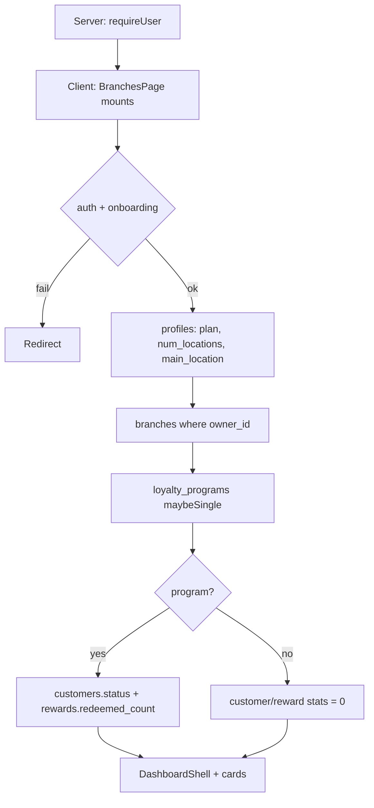

# Branches Page (`/app/branches`)

Reference for all components, conditions, and edge cases on the Branches list route, plus the linked detail page (`/app/branches/[branchId]`). Includes plan limits, placeholder performance, and a [UI / API / DB gap analysis](#gaps-ui--api--db-and-recommended-solutions).

**Jump to:** [route](#route-structure) · [page flow](#high-level-page-flow) · [plan limits](#plan-limits) · [onboarding target](#onboarding-location-target) · [cards](#branch-cards) · [add--edit](#add--edit) · [active toggle](#active-toggle) · [delete](#delete) · [performance](#performance--card) · [stats](#branches-stats) · [detail](#detail-page-appbranchesbranchid) · [gaps](#gaps-ui--api--db-and-recommended-solutions)

**Source files:**

- Route entry: `src/app/app/(shell)/branches/page.tsx`
- Feature implementation: `src/features/branches/branches-page.tsx`
- Detail route: `src/app/app/(shell)/branches/[branchId]/page.tsx`
- Detail feature: `src/features/branches/branch-detail-page.tsx`
- Plan constants: `src/lib/plans.ts`
- Notify: `src/lib/notify-client.ts` → `notifyBranchAdded`
- Related: [settings-page.md](settings-page.md) (billing / `profiles.plan`), [loyalty-page.md](loyalty-page.md), [customers-page.md](customers-page.md)

---

## Route structure

```tsx
// src/app/app/(shell)/branches/page.tsx
"use client";

import BranchesPage from "@/features/branches/branches-page";

export default function Page() {
  return <BranchesPage />;
}
```

Same shell `requireUser()` + client verification + onboarding redirects. Legacy `/branches` → `/app/branches`. Detail: `/app/branches/[branchId]`.

`branches` rows are scoped by `owner_id`, **not** by `loyalty_program_id`. There is no FK from `customers` or `customer_rewards` to `branches`.

---

## High-level page flow



---

## `BranchesPage` — root component

### State

| State | Purpose |
|-------|---------|
| `firstName` | Shell greeting |
| `numLocations` | Onboarding string (`"1"`, `"2-5"`, `"10+"`, …) |
| `mainLocation` | Onboarding main location label (placeholder card / add preset) |
| `plan` | `"starter"` \| `"growth"` \| `"premium"` from `profiles.plan` (default starter) |
| `programId` | For global customer/reward counts |
| `branches` | All locations for the owner |
| `customerCount` / `activeCustomers` / `rewardsRedeemed` | **Program-wide**, not per branch |
| `query` / `sort` | Client filter (`newest` \| `name`) |
| Dialogs | add / edit / delete |

### Data loading

1. `profiles` — `full_name, onboarding_completed, num_locations, main_location, plan`
2. `branches` — all columns used by the card, `eq owner_id`, main first then `created_at`
3. `loyalty_programs.id` for owner
4. If program: all `customers.status` and all `rewards.redeemed_count` (full arrays, summed in JS)

---

## Plan limits

From `src/lib/plans.ts`:

| Plan | Max branches (`PLAN_LIMITS`) |
|------|------------------------------|
| starter | 1 |
| growth | 3 |
| premium | 8 |

Enforced **in the UI only**:

- `atLimit` (`branches.length >= planLimit`) hides **Add Branch** and shows a blue banner + upgrade CTA → `/pricing`
- `oneAway` shows a yellow “Upgrade to {next} to add up to N locations” banner

A client can still `insert` via the Supabase anon key if RLS does not cap row count. There is **no** CHECK constraint or BFF.

`profiles.plan` is switched in Settings → Billing with a **placeholder** (no Stripe). Limits follow whatever is stored.

---

## Onboarding location target

`parseTargetCount(num_locations)` uses the **low end** of a range (`"2-5"` → 2). Placeholder dashed cards fill `min(missingCount, planLimit - branches.length)` when search is empty.

`canAddBeyondTarget` only shows a note: the owner may add more than they declared in onboarding, until the **plan** cap.

First add with zero branches presets `is_main` and may prefill `name` from `main_location`.

---

## Search / sort

| Control | Actual behavior |
|---------|-----------------|
| Search placeholder “name, email, or phone” | Filters **name, city, address** — not email/phone |
| Sort toggle | `newest` (insert order as loaded) vs `name` A–Z |

---

## Branch cards

Each card: name, Main badge, city/address, **active switch**, then:

- `{perBranchCustomers} customers` = `round(customerCount / branches.length)` — **same number on every card**
- `{perBranchRedemptions} rewards redeemed` = `round(rewardsRedeemed / branches.length)` — same

Actions: **View Details**, menu Edit / Delete.

---

## Add / edit

`BranchDialog` fields: name, address, city, email, phone, manager_name, `is_main`. **Not** `is_active` (defaults true in DB).

If `is_main` is set, existing mains for this owner are flipped to `false` first (client two-step, not a transaction).

Insert calls `notifyBranchAdded` → `POST /api/notifications/owner` (in-app row; preferences not checked).

---

## Active toggle

`handleToggleActive` updates `branches.is_active`. Exposed on the **card** and on the **detail** header, not inside the edit dialog. Inactive branches still appear in the grid (no status filter).

---

## Delete

No special block for `is_main`. Confirm dialog then `delete`. Because customers are not linked to branches, delete does not reassign members.

---

## Performance — card

Donut “By revenue”. `perfSlices` splits **100% evenly** across branches (remainder to the first). Center label `"—"`. **This month** button has no handler.

Empty when `branches.length === 0`.

---

## Branches stats

| Tile | Source |
|------|--------|
| Total Branches | `branches.length` |
| Total Customers | Program-wide `customers` count |
| Active Loyalty Members | `status === "active"` program-wide |
| Rewards Redeemed | `Σ rewards.redeemed_count` program-wide |

These numbers do **not** change if you add a second branch except the even-split on cards.

---

## Detail page (`/app/branches/[branchId]`)

Loads profile + branch by id. Missing → “Branch not found”.

**Auth quirk:** unauthenticated redirect is `navigate({ to: "/auth" })` (not `/signin`). Unverified → `/verify` without email search. **No onboarding_completed check.**

Header: name, active toggle, Main badge, contact, **Edit**.

### Placeholders (all TODOs in source)

| Widget | Shown |
|--------|--------|
| Customer Engagement | Grey fake bars (Jan 01–08), not data |
| Branch Stats | Customers / Visits / Rewards / Revenue Influenced all `"—"` |
| Top Customers | Empty copy — needs `branch_id` on enrollment |
| Top Rewards | Empty copy — needs `branch_id` on redemptions |
| This month | Dead button |

---

## Gaps — UI / API / DB and recommended solutions

Indexed backlog + ownership: [gaps-and-solutions.md](gaps-and-solutions.md) · contracts: [data-contract.md](../backend/data-contract.md) · [api-contract.md](../backend/api-contract.md) · [remediation-roadmap.md](../backend/remediation-roadmap.md) · [ADR-014](../architecture/decisions/ADR-014-product-data-ownership.md).

| G-ID | Widget | UI gap | API gap | DB gap | Recommended fix |
|------|--------|--------|---------|--------|-----------------|
| [G-04](gaps-and-solutions.md#g-04--branch-metrics-are-even-splits--em-dashes) | **Per-branch customers / redemptions** | Even split of program totals | No | **No `branch_id`** | Nullable `branch_id`; set on enroll/check-in |
| [G-04](gaps-and-solutions.md#g-04--branch-metrics-are-even-splits--em-dashes) / [G-06](gaps-and-solutions.md#g-06--revenue-is-a-dead-column-everywhere) | **Performance donut** | Even %; center `"—"` | No orders | No `orders.branch_id` | Same orders model |
| [G-07](gaps-and-solutions.md#g-07--plan-limits-are-ui-only-billing-is-a-placeholder) | **Plan limit** | UI hide Add | Direct insert possible | No max-rows policy | `POST /api/branches` with plan cap |
| [G-29](gaps-and-solutions.md#g-29--search-placeholder-on-branches) | **Search copy** | Says email/phone | — | Columns exist | Match copy to filter |
| [G-01](gaps-and-solutions.md#g-01--qr-scan-tracking-is-always-0) / [G-06](gaps-and-solutions.md#g-06--revenue-is-a-dead-column-everywhere) | **This month** | Dead | No period | No events | Hide until events/orders |
| [G-13](gaps-and-solutions.md#g-13--detail-pages-are-shells) | **Detail charts / top lists** | Fake bars / em dashes | Detail never queries | No branch linkage | Aggregate after `branch_id` |
| [G-28](gaps-and-solutions.md#g-28--main-branch-uniqueness--delete) | **Main uniqueness** | Two-step client update | Race | No unique partial index | `UNIQUE (owner_id) WHERE is_main` |
| [G-28](gaps-and-solutions.md#g-28--main-branch-uniqueness--delete) | **Delete main** | Allowed | — | — | Block or force reassign |
| [G-07](gaps-and-solutions.md#g-07--plan-limits-are-ui-only-billing-is-a-placeholder) | **Upgrade CTA** | → `/pricing` | Billing placeholder | `profiles.plan` free-form | Stripe (or hide until paid) |
| — | **Detail auth** | `/auth` path | — | — | Same `/signin` + onboarding guard |

---

## Known limitations

1. Branches are owner-level; loyalty data is program-level — **no join key**
2. Card stats and donut are placeholders
3. Plan cap is client-only
4. Search placeholder does not match filter fields
5. Detail page is chrome + empty states
6. One main branch is a convention, not a DB constraint

---

## Component tree

```
Page (branches/page.tsx)
└── BranchesPage
    ├── [loading] Spinner
    └── DashboardShell
        ├── Plan banners (oneAway / atLimit)
        ├── Header + Add Branch†
        ├── Card grid (search, sort, BranchCard, placeholders)
        ├── Performance donut* + Branches stats
        ├── BranchDialog add/edit
        └── Delete AlertDialog

Page (branches/[branchId]/page.tsx)
└── BranchDetailPage
    ├── Header (toggle, Edit)
    ├── Engagement chart* + stats —
    ├── Top Customers empty
    ├── Top Rewards empty
    └── BranchDialog edit

* Placeholder  † Hidden at plan limit
```
