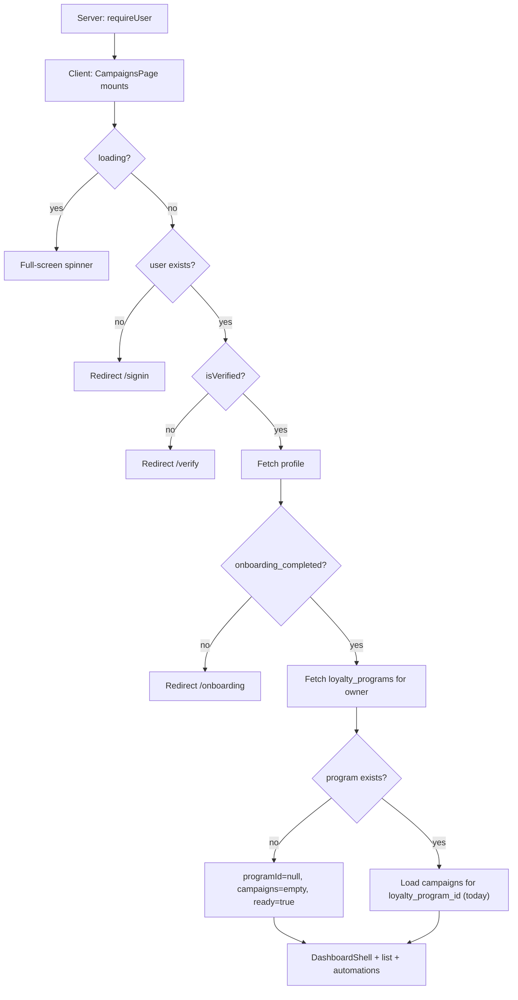
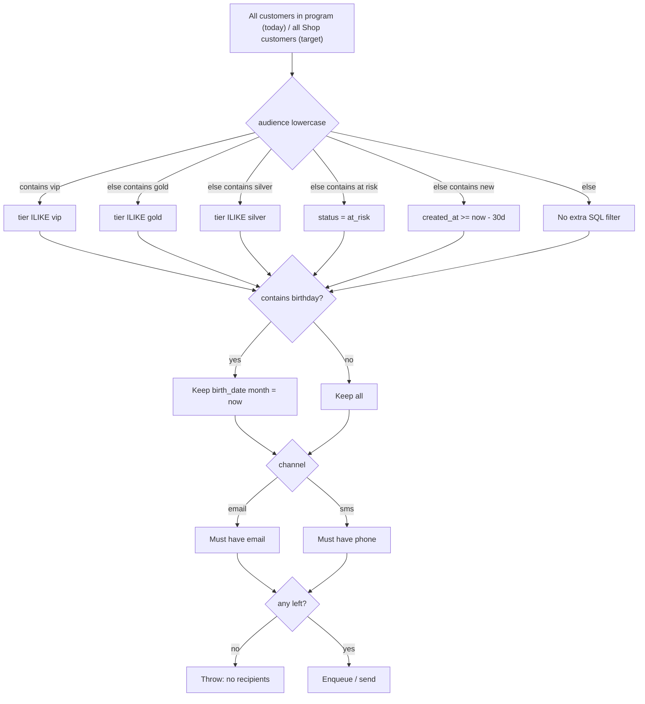
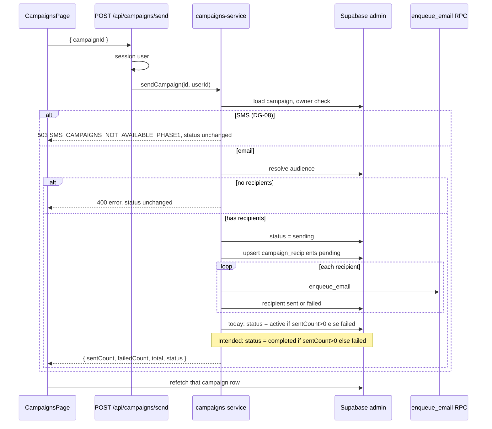
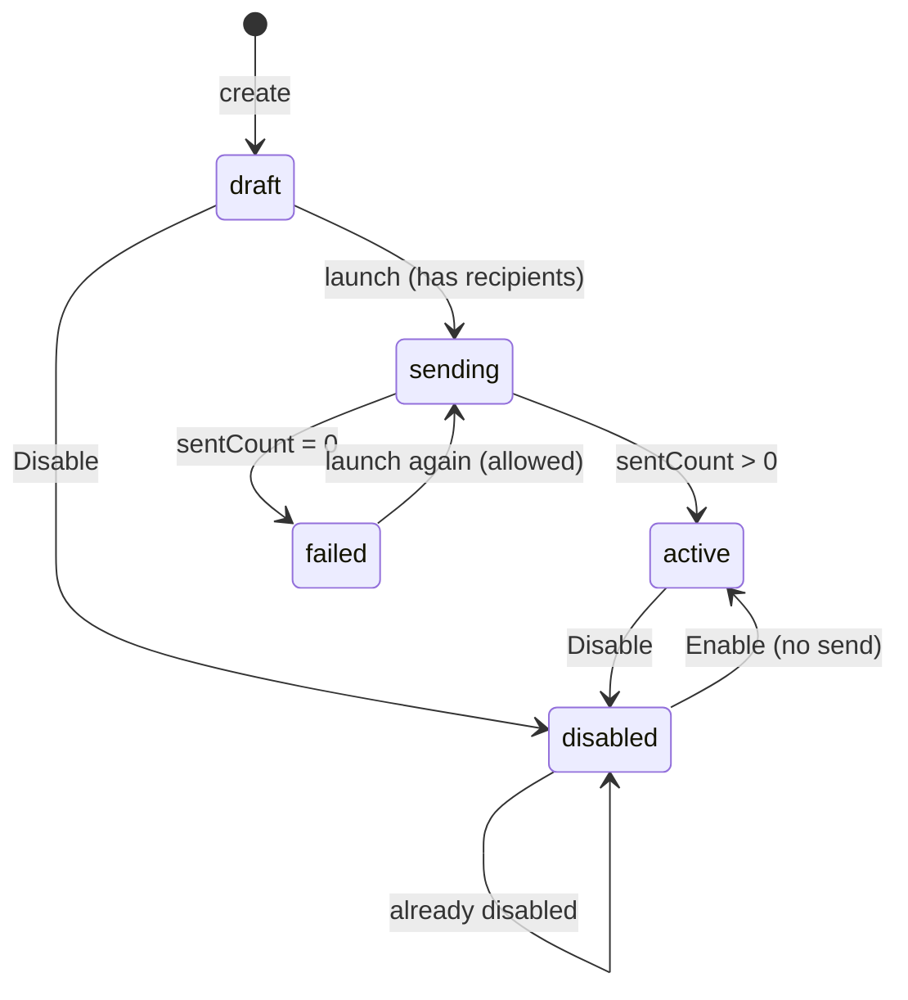

# Campaigns Page (`/app/campaigns`)

Reference for all components, conditions, and edge cases on the Campaigns list route, plus the linked detail page (`/app/campaigns/[campaignId]`), send pipeline, audience matching, and automations. Includes domain notes for frontend + backend work, plus a [UI / API / DB gap analysis](#gaps-ui--api--db-and-recommended-solutions). **Today** campaigns hang off the owner’s single `loyalty_programs` row. **DECIDED:** campaigns are **Shop-scoped** (`owner_id`; `loyalty_program_id` is a transitional alias — [data-contract](../backend/data-contract.md#independent-programs-decided-not-shipped)). **PM-18:** hide **Scheduled Automations** in Product MVP (Ship 1); do **not** hide campaign list / Launch. **DG-08:** SMS channel stays **visible**; bulk send is a **visible-fail stub** (shared trial message).

**Jump to:** [independent programs](#independent-programs-decided-adr-016) · [product meanings](#product-meanings-decided) · [DG-08 SMS visible-fail](#dg-08--sms-campaigns-visible-fail-product-mvp-ship-1) · [route](#route-structure) · [page flow](#high-level-page-flow) · [stat cards](#stat-cards-4) · [status tabs](#status-tabs) · [filters](#search--filters--sort) · [table](#campaign-table) · [row menu](#row-menu) · [create / edit](#create--edit-dialog) · [send](#launch--send-pipeline) · [audience](#how-audience-actually-resolves) · [status machine](#campaign-status-machine) · [automations](#scheduled-automations) · [detail page](#detail-page-appcampaignscampaignid) · [performance](#performance--open--redeemed) · [personalization](#personalization-tokens) · [gaps](#gaps-ui--api--db-and-recommended-solutions)

**Source files:**

- Route entry: `src/app/app/(shell)/campaigns/page.tsx`
- Feature implementation: `src/features/campaigns/campaigns-page.tsx`
- Detail route: `src/app/app/(shell)/campaigns/[campaignId]/page.tsx`
- Detail feature: `src/features/campaigns/campaign-detail-page.tsx`
- Automations UI: `src/components/campaigns/AutomationsSection.tsx`
- Shell layout guard: `src/app/app/(shell)/layout.tsx`
- Dashboard chrome: `src/components/dashboard/DashboardShell.tsx`
- Client send helper: `src/lib/client/campaigns-api.ts`
- Send BFF: `src/app/api/campaigns/send/route.ts`
- Send service: `src/lib/server/campaigns-service.ts`
- Messaging contracts (not yet used by send): `src/lib/server/messaging/templates/campaign/`
- Owner notification: `src/lib/notify-client.ts` → `/api/notifications/owner`
- Schema: `supabase/migrations/20260715131154_*.sql`, `20260715135406_*.sql`, `20260722203955_*.sql`
- Runtime ownership: [ADR-013](../architecture/decisions/ADR-013-campaign-messaging-runtime.md)
- Mapping: [15-server-function-mapping.md](15-server-function-mapping.md) (`sendCampaign`)
- Related: [analytics-page.md](analytics-page.md) (tiers, “at risk”, `revenue_cents`)
- Glossary: [data-contract.md § Unified glossary](../backend/data-contract.md#unified-glossary)
- Product note: [product-manager-meeting-report.md](../product-manager-meeting-report.md)
- Independent programs: [ADR-016](../architecture/decisions/ADR-016-independent-programs.md) · [program-model.md](../product/program-model.md)

---

## Independent programs (DECIDED — ADR-016)

**Status:** DECIDED 2026-08-18. **Shipped code on this page still uses the legacy one-row model** until [G-35](gaps-and-solutions.md#g-35--shop-loyalty-is-one-row-not-independent-programs) backend + frontend migration land.

A Shop may own **many independent programs** (Points, Visit, Tier, …). **At most one is `ACTIVE`** (the default). Counter QR and `?ref=` resolve only to ACTIVE. Customers stay locked on `enrolled_program` until deferred POS migration.

**Campaigns stay Shop-scoped** — they belong to the **Shop** (`owner_id`), not to a single program. `loyalty_program_id` on `campaigns` is a **transitional FK** only (required by today’s schema).

| Concern | **Today (shipped code)** | **Target (ADR-016 + G-35)** |
|---------|--------------------------|-----------------------------|
| List campaigns | `campaigns` where `loyalty_program_id =` owner’s sole program row | `campaigns` where `owner_id = user.id` (all Shop campaigns) |
| Resolve program for create | `loyalty_programs.maybeSingle()` by `owner_id` | Require an **`ACTIVE`** program; set `loyalty_program_id` to that row (transitional alias) |
| Create gate | Toast if **no program row** | Toast if **no ACTIVE program** (draft-only Shop cannot launch) |
| Send audience (`campaigns-service`) | Customers where `loyalty_program_id = campaign.loyalty_program_id` | **Shop-scoped:** customers across **all** of the owner’s programs (`loyalty_program_id IN (shop program ids)`) — one identity per Shop, members may be enrolled on different programs |
| Automations | Already `owner_id`-scoped | Unchanged |

Canonical product: [program-model.md](../product/program-model.md) · [loyalty-page.md](loyalty-page.md#independent-programs-decided) · [data-contract](../backend/data-contract.md#independent-programs-decided-not-shipped).

### Frontend migration checklist (Campaigns)

When G-35 schema ships, update **these files only** (do not invent a parallel plan):

1. **`campaigns-page.tsx`** — load list by `owner_id`; resolve `activeProgramId` via `status = 'active'` (partial unique); gate create/launch on ACTIVE, not “any row”.
2. **`campaigns-service.ts`** — audience query joins all Shop program ids, not `campaign.loyalty_program_id` alone.
3. **`campaign-detail-page.tsx`** — no program switcher; ownership remains `owner_id` RLS.

---

## Product meanings (DECIDED)

Recorded **2026-08-14**. This is the intended product language for `/app/campaigns`. The UI labels already exist; **writers have not been updated yet**. Current behavior stays documented below as “today.”

**Completed** and **Performance** are different things. Completed is a **status**. Performance is a **results column**.

### Completed campaign

A **Completed** campaign is one whose send is **finished**: every email or SMS for that launch has been processed. It is no longer running.

It is not a performance score. A completed campaign can still show `0% Open` until open tracking exists.

### Performance

**Performance** is how well a **sent** campaign did with recipients:

| Channel | Meaning | Formula |
|---------|---------|---------|
| Email | Share of sent messages that were **opened** | `round(opened_count / sent_count * 100)` → `{n}% Open` |
| SMS | Share of sent messages that were **redeemed** | same formula → `{n}% Redeemed` |
| Never sent (`sent_count` is 0) | No results yet | `"—"` |

Highest / lowest performance sorts use that same percent. Drafts and unsent campaigns should sort as 0% / display `"—"`.

SMS “Redeemed” is the **intended** label for SMS results. Today it is a label only (no redemption join). Opens are not incremented today, so a sent campaign shows `0% Open` / `0% Redeemed` rather than `"—"`.

### Intended lifecycle

A campaign **must not start as Active**. Create always starts as **Draft**. **Active** means the campaign is **working** (send in progress). When all emails/SMS have been processed, status becomes **Completed**.

| Status | Product meaning |
|--------|-----------------|
| **Draft** | Saved, not started. Starting status. |
| **Active** | Launch started; messages are going out. The campaign is working. |
| **Completed** | All emails/SMS for this send have been processed (`sent_count > 0`). Finished. |
| **Failed** | Launch ran; nothing was sent (`sent_count === 0`). |
| **Disabled** | Owner turned it off. |
| **Scheduled** | Set to start later (`scheduled_at`). Tab exists; scheduling is not wired yet. |

Internal `sending` may still be written during fan-out. The **Active** tab/pill should treat `sending` as Active (working). Do not leave a successful send as Active after fan-out finishes.

**Enable** must not write `active` without sending. Enable on a disabled draft should restore **draft**, not Active. Send should refuse `completed` as already finished, and refuse `active` / `sending` as already running.

---

## Route structure

The URL `/app/campaigns` is served by a thin Next.js page that delegates to the feature module:

```tsx
// src/app/app/(shell)/campaigns/page.tsx
"use client";

import CampaignsPage from "@/features/campaigns/campaigns-page";

export default function Page() {
  return <CampaignsPage />;
}
```

The page sits under `src/app/app/(shell)/`, which applies a **server-side auth guard** before anything renders:

```tsx
// src/app/app/(shell)/layout.tsx
export default async function AppShellLayout({ children }) {
  await requireUser();
  return <>{children}</>;
}
```

Auth is enforced twice:

1. **Server** — `requireUser()` redirects unauthenticated users to `/auth/sign-in`
2. **Client** — `CampaignsPage` runs additional checks (verification, onboarding)

Legacy TanStack path `/campaigns` maps to `/app/campaigns` (`src/lib/navigation/paths.ts`). In-app `Link` / `navigate({ to: "/campaigns" })` resolve to the approved URL.

Detail: `/app/campaigns/[campaignId]` → `CampaignDetailPage`. Same shell guard. See [detail page](#detail-page-appcampaignscampaignid).

---

## High-level page flow



> **Target (ADR-016):** step O becomes `Load campaigns where owner_id = user.id`. Create requires an **ACTIVE** program, not merely any row. See [Independent programs](#independent-programs-decided-adr-016).

Unlike Analytics, there is **no empty-state for “no loyalty program”** on the main canvas. The list is simply empty. Create/Launch then toasts “Create your loyalty program first.” (**Target:** “Activate a loyalty program first” when programs exist but none are ACTIVE.)

---

## `CampaignsPage` — root component

### State

| State | Purpose |
|-------|---------|
| `firstName` | Dashboard header greeting (first token of `full_name`, else email local-part) |
| `programId` | **Today:** owner’s sole `loyalty_programs` row id, or `null`. **Target:** ACTIVE program id (transitional FK for insert only) |
| `campaigns` | **Today:** campaigns for that one `loyalty_program_id`. **Target:** all campaigns for `owner_id` |
| `ready` | Data fetch finished |
| `tab` | `"all"` \| `"active"` \| `"scheduled"` \| `"draft"` \| `"completed"` |
| `search` | Free-text filter |
| `sort` | `"newest"` \| `"oldest"` \| `"name"` \| `"highest"` \| `"lowest"` |
| `typeFilter` | `"all"` \| `"email"` \| `"sms"` |
| `audienceFilter` | `"all"` or an [audience option](#audience-options) |
| `createOpen` | Create dialog |
| `editTarget` | Campaign being edited, or `null` |
| `deleteTarget` | Campaign pending delete confirm, or `null` |
| `deleting` | Delete in flight |
| `launchingId` | Campaign id currently sending, or `null` |

### Client-side redirects (`useEffect`)

| Condition | Action |
|-----------|--------|
| `loading === true` | Wait (no redirect) |
| `!user` | → `/signin` |
| `!isVerified` | → `/verify?email=...` |
| `!profile.onboarding_completed` | → `/onboarding` |
| No loyalty program | Stay on page, `programId = null`, `campaigns = []` |
| Program exists | **Today:** load `campaigns` for `loyalty_program_id`. **Target:** load by `owner_id` |

### Data loading sequence

1. Fetch `profiles` (`full_name`, `onboarding_completed`) for current user
2. **Today:** fetch `loyalty_programs` where `owner_id = user.id` with `.maybeSingle()` (expects 0 or 1 — `UNIQUE (owner_id)`). **Target:** fetch all programs; resolve **ACTIVE** (`status = 'active'`); list campaigns by **`owner_id`**, not program FK ([Independent programs](#independent-programs-decided-adr-016))
3. If program exists (**today**), fetch `campaigns` where `loyalty_program_id = program.id`, ordered by `created_at` descending

Columns loaded:

`id, name, description, channel, status, audience, subject, message, sent_count, opened_count, revenue_cents, failed_count, created_at`

**Not loaded on the list:** `scheduled_at`, `sent_at`, `clicked_count`, `updated_at`.

### Loading UI

While `loading || !ready`, a centered yellow spinner is shown (not `DashboardShell`).

### Main UI (once ready)

Wrapped in `DashboardShell` with sidebar, header, notifications, and mobile nav. Campaigns is highlighted under **Growth → Campaigns**.

---

## Page chrome (always visible when loaded)

### Header

- **Title:** Campaigns
- **Subtitle:** “Create, manage, and track campaigns that drive customer engagement and repeat visits.”
- **“Create Campaign” button** — only rendered when `campaigns.length > 0`. On a true empty list, the CTA lives inside the empty state instead.

### Stat cards (4)

All four always render when revenue card is not commented out. They use **all loaded campaigns**, not the current tab/search/filter.

> **Product MVP (Ship 1):** **Comment out** the **Campaign Revenue** stat card ([phase-1-scope.md](../product/phase-1-scope.md)).

| Card | Calculation |
|------|-------------|
| **Total Campaigns** | `campaigns.length` |
| **Emails Sent** | sum of `sent_count` where `channel === "email"` |
| **SMS Sent** | sum of `sent_count` where `channel === "sms"` |
| **Campaign Revenue** | `sum(revenue_cents) / 100` formatted as `$X.XX` |

`sent_count` is written by the send service after a launch. `revenue_cents` is **never written** by send or the UI — it stays `0`, so the card shows **`$0.00`**, not `"—"`. That looks like “zero revenue” rather than “not tracked.” Analytics uses dashes for the same reason; this page does not.

No date range. Totals are all-time for this program.

---

## Status tabs

Five pills. Each shows a **count badge**. Active pill is navy (`#0a152f`).

| Tab value | Label | Count rule |
|-----------|-------|------------|
| `all` | All Campaigns | `campaigns.length` |
| `active` | Active | **Today:** `status === "active"` only. **Intended:** `active` or `sending` (working) |
| `scheduled` | Scheduled | `status === "scheduled"` |
| `draft` | Drafts | `status === "draft"` |
| `completed` | Completed | `status === "completed"` |

Filtering is **exact string match** on `campaigns.status`. **Intended** meanings: [product meanings](#product-meanings-decided). **Today**, tabs that the send pipeline never writes stay at **0** unless something else wrote that status:

| Status in DB / UI | Intended meaning | Who writes it today |
|-------------------|------------------|---------------------|
| `draft` | Saved, not started | Insert on create |
| `sending` | Working (treat as Active in UI) | Send service, briefly, during fan-out |
| `active` | Working — send in progress | Send service if `sentCount > 0`; also **Enable** / detail toggle (**wrong** vs intended: successful send should become `completed`, Enable must not set `active`) |
| `failed` | Launch ran, nothing sent | Send service if `sentCount === 0` |
| `disabled` | Owner turned it off | Row menu Disable / detail toggle |
| `scheduled` | Starts later | **Nobody** (`scheduled_at` unused) |
| `completed` | Send finished; all messages processed | **Nobody** (gap vs intended) |

`StatusPill` also styles `sending` and `failed` if they appear in the table (All tab). Until writers change, **Completed** stays empty and a successful launch stays **Active**.

---

## Search / filters / sort

All three filters plus search apply **client-side** on the already-loaded array. Changing them does not re-query Supabase.

### Search

Case-insensitive substring on `name + description + audience`. Empty query = no extra filter.

### Type filter

| Value | Rule |
|-------|------|
| `all` | No channel filter |
| `email` | `channel === "email"` |
| `sms` | `channel === "sms"` |

### Audience filter

Exact match on stored `campaigns.audience` string (the label saved from the create dialog), or `all`.

### Sort

| Option | Rule |
|--------|------|
| Newest first | `created_at` descending (default) |
| Oldest first | `created_at` ascending |
| Name (A–Z) | `localeCompare` on `name` |
| Highest performance | `performancePct` descending |
| Lowest performance | `performancePct` ascending |

`performancePct` = `round(opened_count / sent_count * 100)`, or **0** if `sent_count` is 0. Unsent campaigns therefore sort as 0% for highest/lowest.

---

## Empty states

| Condition | Title | Body | CTA |
|-----------|-------|------|-----|
| `campaigns.length === 0` | “No Campaigns Yet!” | Create-your-first copy | Create Campaign (opens dialog) |
| Campaigns exist but filters match none | “No matching campaigns” | “Try a different search or status filter.” | None |

Telescope illustration (`telescope-empty-state.png`) in both cases.

---

## Campaign table

Shown when `filtered.length > 0`. Columns:

| Column | Source |
|--------|--------|
| Campaign | `name` |
| Audience | `audience` or `"—"` |
| Type | `"SMS"` if `channel === "sms"`, else `"Email"` |
| Performance | [formatPerformance](#performance--open--redeemed) |
| Status | `StatusPill` |
| Actions | `RowMenu` |

Row click does **not** navigate. View is only via the ⋮ menu.

### `StatusPill` cases

| `status` | Label | Colors |
|----------|-------|--------|
| `active` | Active | Green |
| `sending` | Sending | Yellow |
| `scheduled` | Scheduled | Yellow |
| `draft` | Draft | Gray |
| `completed` | Completed | Blue |
| `failed` | Failed | Red |
| `disabled` | Disabled | Red |
| anything else | Draft styling | Gray |

---

## Performance (“% Open” / “% Redeemed”)

Product meaning: [Performance](#performance) under product meanings. This is **not** the Completed status. It is the results column for sent campaigns.

```text
performancePct = sent_count === 0 ? 0 : round(opened_count / sent_count * 100)
```

| Condition | Display |
|-----------|---------|
| `sent_count` is 0 | `"—"` |
| Email + sent | `"{pct}% Open"` |
| SMS + sent | `"{pct}% Redeemed"` |

`opened_count` is **never incremented**. After a successful send it stays 0, so the cell shows **`0% Open`** (or `0% Redeemed` for SMS), not `"—"`. Performance belongs on Active (while sending) and **Completed** rows; drafts stay `"—"`.

SMS “Redeemed” is a **label only**. It does not join `customer_rewards` or orders. There is no redemption event tied to a campaign.

---

## Row menu

| Item | When shown | Action |
|------|------------|--------|
| View | Always | Navigate to `/campaigns/$campaignId` |
| Edit | Always | Opens edit dialog (does **not** change status) |
| Launch Campaign | Only if `status === "draft"` | [Send pipeline](#launch--send-pipeline) |
| Disable | If not `disabled` | `status → "disabled"` |
| Enable | If `disabled` | **Today:** `status → "active"` (**does not send**). **Intended:** restore **draft** (or prior non-running status), never Active without a send |
| Delete | Always | Confirm, then hard delete |

Launch is disabled while `launchingId === campaign.id` (“Launching…”).

### Trap: Disable a draft, then Enable (today)

1. Draft → Disable → `disabled` (Launch item disappears)
2. Enable → `active` without sending
3. Send refuses `active` campaigns (“already sending or has been sent”)
4. Campaign looks Active, `sent_count` stays 0

**Intended:** there is still no manual “mark completed” or “unsend.” Completion is written by the send pipeline when all messages are processed. Enable must not impersonate Active.

---

## Create / edit dialog

Shared `CreateCampaignDialog` (also used on the detail page).

### Fields

| Field | Required | Notes |
|-------|----------|-------|
| Campaign name | Yes | Trimmed |
| Description | No | Internal note; empty → `null` |
| Channel | Yes | `"email"` \| `"sms"` (default email). **DG-08:** SMS stays selectable; selecting it shows the shared trial failure copy. Subject is hidden for SMS. |
| Audience | Yes | One of the [audience options](#audience-options); default `"All customers"` |
| Subject | No | **Only rendered when channel is email** |
| Message | Yes | Body; personalization tokens are **not** documented in the dialog |

Submit is blocked until `name.trim()` and `message.trim()` are non-empty.

### Create actions

| Button | Result |
|--------|--------|
| Save as draft | Insert `status: "draft"`, toast “Campaign saved as draft” |
| Launch campaign | Insert draft, then immediately `runSend(id)` |

Insert always starts as **draft**, even when launching. `owner_id` and `loyalty_program_id` are set from the session / loaded program (**target:** `loyalty_program_id` = ACTIVE program id — transitional alias only).

If `programId` is null (**today:** no program row; **target:** no ACTIVE program):

> **Today:** “Create your loyalty program first” — toast action navigates to `/loyalty-program`.  
> **Target:** “Activate a loyalty program first” when draft/archived programs exist but none is ACTIVE.

On success, `notifyCampaignCreated` fires a best-effort POST to `/api/notifications/owner` (`prefKey: campaign_created`, link `/app/campaigns/{id}`).

### Edit actions

Single **Save changes**. Updates name, description, channel, audience, subject, message. **Does not** change status, counts, or `sent_at`. Editing a sent campaign does **not** re-send.

If the stored `audience` is not in `AUDIENCE_OPTIONS`, the form falls back to `"All customers"` (saving would overwrite the old string).

---

## Audience options

Hardcoded labels stored as **free text** on `campaigns.audience`. Not an enum, not an FK.

| UI label | Send-time match (see [resolution](#how-audience-actually-resolves)) |
|----------|---------------------------------------------------------------------|
| All customers | No extra customer filter |
| Birthday Customers | `birth_date` month = current month |
| At Risk | `customers.status === "at_risk"` |
| VIP Members | `tier` ILIKE `vip` |
| Gold Members | `tier` ILIKE `gold` |
| Silver Members | `tier` ILIKE `silver` |
| New Customers | `created_at` within last **30 days** |

Matching on send uses `audience.toLowerCase()` **substring** checks (`includes("vip")`, `includes("at risk")`, …), not the exact label. Order in code: vip → gold → silver → at risk → new; birthday is an extra filter after the query.

---

## How audience actually resolves

**Today:** send loads customers for `campaign.loyalty_program_id` only.

**Target (ADR-016):** send loads customers **Shop-scoped** — all rows whose `loyalty_program_id` belongs to `campaign.owner_id` (one customer identity per Shop; members may be enrolled on archived or ACTIVE programs). Then applies **one** of the SQL filters (if-else), then optional birthday filter, then channel contact filter.



### Important mismatches

**At Risk vs recency vs lifecycle (G-08).** **Today:** Dashboard and Analytics compute at-risk from `last_activity_at` (> 30 days). Customers tabs and campaign send query `customers.status === 'at_risk'` — but nothing writes that value. **Target:** all surfaces use computed `lifecycle_state` per [customer-lifecycle.md](../backend/customer-lifecycle.md). **`churned`** remains manual-only on `customers.status`.

| Place | Rule today | Target rule |
|-------|------------|-------------|
| Analytics Overview segments | Overlapping visit/recency buckets | `lifecycle_state` (exclusive) |
| Analytics Engagement levels | Overlapping Champions/Loyal/Dormant | `lifecycle_state` (exclusive) |
| Dashboard | `last_activity_at` > 30 days | `lifecycle_state === 'at_risk'` |
| Customers UI / **Campaign send** | `customers.status === "at_risk"` | `lifecycle_state === 'at_risk'` |
| **New Customers** audience | `created_at` >= 30 days | `lifecycle_state === 'new'` (14 days) |

**All customers.** Includes every row regardless of lifecycle. Only the channel contact field is required.

**VIP / Gold / Silver.** `customers.tier` is usually **null** — tier audiences empty until ladder writer ships.

**Birthday.** `isCurrentMonth(birth_date)` — month only; server local timezone.

**No recipients** → send throws before marking `sending`. Toast: “No recipients match this audience with an email address” (or phone). Campaign stays **draft**.

---

## Launch / send pipeline



### Client (`runSend`)

1. `setLaunchingId`
2. `POST /api/campaigns/send` with `{ campaignId }`
3. Refetch that campaign row and patch local state
4. Toast:
   - all ok → “Sent to N of T customers”
   - partial → same plus “(F failed)”
   - none sent (HTTP 200 with `sentCount === 0`) → “Send failed for all T recipients”
   - thrown error → `err.message`

Create+Launch uses the same path after insert.

### BFF (`/api/campaigns/send`)

- Node runtime
- Requires session user (401 otherwise)
- Delegates to `sendCampaign` in `lib/server/campaigns-service.ts`
- Errors → 400 + `{ error }`, except **DG-08 SMS** → **503** `{ code: SMS_CAMPAIGNS_NOT_AVAILABLE_PHASE1, message }` (campaign stays draft)

### Service rules

| Check | Result |
|-------|--------|
| Invalid UUID | Zod throw |
| Campaign missing | “Campaign not found” |
| `owner_id !== userId` | “Forbidden” |
| `status` is `sending` or `active` | “Campaign is already sending or has been sent” (**today**). **Intended:** refuse `active`/`sending` as already running; refuse `completed` as already finished |
| SMS channel | Every recipient fails with “SMS provider not configured” (**today, superseded**). **DG-08:** refuse **before** audience/fan-out with **503** `SMS_CAMPAIGNS_NOT_AVAILABLE_PHASE1`; campaign status unchanged (stays draft) |
| Email | Personalize subject/body, wrap HTML, `mint_unsubscribe_token`, `enqueue_email` |

From-name: `profiles.business_name` → else `full_name` → else `"Loyollo"`.  
From address: `{businessName} <noreply@loyollo.com>`.  
Default subject if blank: `A message from {businessName}`.

Final campaign update **today**:

```text
status     = sentCount > 0 ? "active" : "failed"
sent_at    = now()
sent_count = sentCount
failed_count = failedCount
```

**Intended** final status ([product meanings](#product-meanings-decided)):

```text
status     = sentCount > 0 ? "completed" : "failed"
```

`opened_count`, `clicked_count`, `revenue_cents` are **not** updated.

Recipient rows: unique `(campaign_id, customer_id)`. Upsert uses `ignoreDuplicates`. On **retry of a failed campaign**, existing recipient rows are reused and the loop **sends again** (including previously `sent` customers) — duplicate-email risk.

### ADR-013 vs today

[ADR-013](../architecture/decisions/ADR-013-campaign-messaging-runtime.md) and the server-function map say: Next **must not** run unbounded recipient fan-out in the request lifecycle. The current BFF **does** loop every recipient inside `POST /api/campaigns/send`. That is a known cutover gap (timeout, partial send, duplicate worker). Intended: Next only **starts** a backend/messaging job.

Send also **inlines** `personalize` / `buildHtml` instead of calling `src/lib/server/messaging/` contracts (duplicates live in `templates/campaign/`).

---

## Personalization tokens

Preserved tokens ([17-messaging-templates.md](17-messaging-templates.md)):

| Token | Value |
|-------|--------|
| `{{name}}` | Customer `full_name` |
| `{{first_name}}` | First whitespace token of `full_name` |
| `{{business_name}}` | Owner business / full name / Loyollo |

Unknown tokens become `""`. The create dialog does **not** mention tokens. Preview on the detail page shows the **raw** template, not personalized HTML.

HTML wrapper: navy heading = business name, escaped paragraphs, footer “Sent by {business} via Loyollo.”

---

## Campaign status machine

### Intended (DECIDED)

```mermaid
stateDiagram-v2
  [*] --> draft: create
  draft --> active: launch (has recipients; working)
  draft --> scheduled: schedule (not wired)
  draft --> disabled: Disable
  active --> completed: all emails/SMS processed and sentCount > 0
  active --> failed: sentCount = 0
  failed --> active: launch again (allowed)
  disabled --> draft: Enable (no send)
  active --> disabled: Disable
  scheduled --> active: due time
```



Internal `sending` may exist during fan-out; UI Active includes it. A campaign **does not start as Active**. Successful send **must** end as **Completed**, not stay Active.

### Today (as implemented)



Nothing writes `scheduled` or `completed`. `active` after a real send **and** `active` after Enable-without-send are the same stored value. Send treats both as “already sent.”

---

## Delete

Alert dialog. Hard `DELETE` from `campaigns`. Recipients cascade (`ON DELETE CASCADE`). Cannot be undone. Automations are a separate table and are unaffected.

---

## PM-18 — Hide Scheduled Automations (Product MVP (Ship 1))

**PM-18 / DG-10 (DECIDED Product MVP (Ship 1)):** **hide** this section in merchant UI. Writes to `campaign_automations` return **503** `AUTOMATIONS_NOT_AVAILABLE_PHASE1` (or omit routes → 404). Do **not** hide the campaign list or Launch. G-09 send/opens stay deferred.

`AutomationsSection` today is always rendered when `user` exists (including when there is no loyalty program). It is **CRUD for config rows only**. No worker, no schedule, no send. Until Product MVP (Ship 1) hide ships, treat the UI as dishonest.

Table: `campaign_automations`. Unique `(owner_id, type)` — **one row per type per owner**.

### Types (enum in DB check)

| `type` | UI label | Default name |
|--------|----------|--------------|
| `birthday_rewards` | Birthday Rewards | Birthday Rewards |
| `welcome_new_customers` | Welcome New Customers | Welcome New Customers |
| `vip_tier_upgrade` | VIP Tier Upgrade | VIP Tier Upgrade |
| `re_engagement` | Re-engagement | Re-engagement |
| `points_expiry` | Points Expiry | Points Expiry Reminder |
| `promotional_offer` | Promotional Offer | Promotional Offer |
| `feedback_request` | Feedback Request | Feedback Request |

`config` jsonb exists and is **never read or written** by the UI (inserts omit it).

### UI behavior

| Action | Behavior |
|--------|----------|
| Load | All automations for `owner_id`, oldest first |
| Search | Name or type label |
| New automation | Disabled when all 7 types already exist |
| Create | Insert `enabled: true`; type picker only shows unused types |
| Edit | Rename only (type locked) |
| Toggle | Optimistic `enabled`; toast enabled / paused |
| Delete | Confirm, hard delete |

Empty: “No automations yet” + New automation. Filter miss: “No matching automations.”

**Enabled does not send mail.** There is no job that reads `enabled` and fans out to customers.

---

## DG-08 — SMS campaigns visible-fail (Product MVP (Ship 1))

**DG-08 (DECIDED 2026-08-18, option 2 — show failure):** keep **SMS** visible in the channel picker, type filter, table Type column, SMS Sent stat, and detail channel. Do **not** hide the option (rejected option 3) and do **not** treat bulk SMS as a live send path (rejected option 1).

During the trial / Product MVP (Ship 1):

| Surface | Behavior |
|---------|----------|
| Create / edit dialog | Channel `sms` stays selectable. Selecting it shows the **shared** failure copy. Draft save is allowed. Launch still calls send. |
| Detail page | Same shared copy when `channel === "sms"`. |
| `POST /api/campaigns/send` (and Nest `POST /api/campaigns/:id/send`) | If `channel === "sms"`: **503** `SMS_CAMPAIGNS_NOT_AVAILABLE_PHASE1` with that same message. **No** audience query, **no** recipient rows, **no** status change (stays **draft**). |
| Insight CTAs `channel: "sms"` | `create` may insert a draft; `send` / `nudge` must not enqueue — same 503. |
| OTP SMS / WhatsApp | **Out of scope** for DG-08. Still messaging-adapter stub until a provider is chosen. |

Canonical copy (English UI): *SMS sending isn't available during the trial. You can save this campaign as a draft; messages will not be delivered until SMS is enabled.* Source: `src/lib/campaigns/sms-campaigns-policy.ts`.

Consent, frequency caps, quiet hours, preferred channel, and stored opt-in remain **open** under [UX-24](../product/ui-ux-team-requests.md#ux-24--communication-policy--sms-in-product-mvp-ship-1).

---

## Detail page (`/app/campaigns/[campaignId]`)

Thin route unwraps `params.campaignId` and renders `CampaignDetailPage`.

### Auth / load differences vs list

| Check | List | Detail |
|-------|------|--------|
| Server `requireUser` | Yes | Yes |
| Client `!user` / `!isVerified` | Yes | Yes |
| `onboarding_completed` | Redirect `/onboarding` | **Not checked** |
| Ownership | RLS on `owner_id` | RLS; no extra `owner_id` filter in the query |
| Missing row | n/a | “Campaign not found” card + back link |

Loads `campaigns` (includes `sent_at`) and `campaign_recipients` with nested `customers(full_name, email, tier)`.

### Header card

- Breadcrumb: Campaigns / `{name}`
- Toggle: green if `status` is `active` **or** `sending`; otherwise gray. Click **today:** `disabled` ↔ `active` (same Enable trap as the list). **Intended:** green only while working (`active`/`sending`); Enable restores draft, not Active without a send; Completed stays completed (not toggled to Active)
- Created date · Last Sent (`sent_at` or `"—"`)
- Channel icon + audience
- Edit → same `CreateCampaignDialog` in edit mode

### Customers Reached — donut

Counts **only** recipients with `status === "sent"` (not `campaign.sent_count`, not pending/failed).

Groups nested `customers.tier` (lowercased):

| Bucket | Match |
|--------|-------|
| Silver | `silver` |
| Gold | `gold` |
| VIP | `vip` |
| Other | anything else, including null — legend only if count > 0 |

Colors are **hardcoded** (`#20386b`, `#feb602`, `#a3a3a3`, `#d4d4d4`) — not `loyalty_program_tiers.color`. Untiered members inflate **Other** (usually most of them).

Center: `{total}` / “Total customers.” Empty send → 0 and a gray ring.

### Campaign Stats

> **Product MVP (Ship 1):** **Comment out** the **Revenue Influenced** tile ([phase-1-scope.md](../product/phase-1-scope.md)).

| Tile | Today |
|------|--------|
| Recipients | Count of `status === "sent"` |
| Revenue Influenced | `$` + `revenue_cents / 100` *(comment out Ship 1)* |
| Rewards Redeemed | **Hardcoded `0`** |

Green banner if `total > 0`: “Delivered to N recipient(s) (F failed).” `failed_count` comes from the campaign row.

Source comment: open/click tracking, revenue attribution, and per-customer engagement scoring are **not implemented**.

### Top Engaged Customers

Always empty copy:

> “Engagement tracking isn't available yet…”

`topEngaged` is hardcoded `[]`.

### Campaign Message

Raw `subject` (email only) + `message` preview. Not the wrapped HTML, not token-substituted.

---

## Data model

### `campaigns`

| Column | Used by list UI | Written by send | Notes |
|--------|-----------------|-----------------|-------|
| `id` | Yes | — | PK |
| `loyalty_program_id` | Load filter | — | FK; cascade with program |
| `owner_id` | Insert | Ownership check | RLS |
| `name`, `description` | Yes | — | |
| `channel` | Yes | Audience contact filter | `"email"` \| `"sms"` — **send medium**, not sale channel |
| `status` | Tabs / pills | **Today:** `sending` → `active`/`failed`. **Intended:** working → `completed`/`failed` | Free text, no DB enum. See [product meanings](#product-meanings-decided) |
| `audience` | Display + filter | Substring match | Free text |
| `subject`, `message` | Dialog | Personalize | |
| `scheduled_at` | **No** | **No** | Column unused |
| `sent_at` | Detail only | Yes | |
| `sent_count` | Stats / performance | Yes | Successful recipient updates |
| `opened_count` | Performance | **No** | Stays 0 |
| `clicked_count` | **No** | **No** | Not in SELECT |
| `revenue_cents` | Revenue card | **No** | Stays 0; not orders |
| `failed_count` | Detail banner | Yes | |
| `created_at` / `updated_at` | Sort | Trigger on update | |

RLS: owner CRUD. Authenticated role; service-role for send.

### `campaign_recipients`

`campaign_id`, `customer_id` (unique pair), `channel`, `status` (`pending` \| `sent` \| `failed`), `error_message`, `sent_at`.

Owners **SELECT** only via campaign ownership. Inserts/updates go through **service-role** in send. No open/click columns.

### `campaign_automations`

`owner_id`, `type` (check constraint), `name`, `enabled`, `config` (unused), timestamps. Unique `(owner_id, type)`.

### Related (not owned by this page)

- `customers` — audience + detail donut (`tier`, `status`, `email`, `phone`, `birth_date`, `created_at`)
- `loyalty_programs` — **today:** one per owner (`UNIQUE owner_id`). **Target:** many per Shop; partial unique one ACTIVE
- `email_send_log` + `enqueue_email` / `mint_unsubscribe_token` RPCs — email path
- `loyalty_program_tiers` — **not queried**; intended ladder for VIP/Gold/Silver audiences

---

## Shared building blocks

| Component | Role |
|-----------|------|
| `DashboardShell` | Sidebar (Growth → Campaigns), header, mobile drawer |
| `StatCard` | List metric tiles |
| `StatusPill` | Status badge |
| `RowMenu` | Per-campaign actions |
| `CreateCampaignDialog` | Create + edit (list and detail) |
| `AutomationsSection` | Automation CRUD |
| `TierDonut` / `TierLegend` | Detail reached-by-tier |
| `StatTile` | Detail stats |
| `sendCampaign` (client) | `fetch` to BFF |
| `notifyCampaignCreated` | Best-effort owner notification |

---

## Summary of all major cases

| Scenario | What the user sees |
|----------|-------------------|
| Not logged in (server) | Redirect to `/auth/sign-in` |
| Not logged in (client) | Redirect to `/signin` |
| Unverified email | Redirect to `/verify` |
| Onboarding incomplete (list) | Redirect to `/onboarding` |
| Onboarding incomplete (detail) | Page still loads if campaign exists |
| Loading | Full-screen spinner |
| No loyalty program | Empty campaigns + automations; create toasts “create program first” |
| Program, no campaigns | Telescope empty state + Create |
| Filters match nothing | “No matching campaigns” |
| Save as draft | Row with Draft pill, performance `"—"` |
| Launch with recipients (email) | **Today:** status Active, sent counts, toast. **Intended:** Active while sending, then **Completed** |
| Launch with zero matching customers | Error toast; stays draft |
| Launch SMS | Shared trial toast (`SMS_CAMPAIGNS_NOT_AVAILABLE_PHASE1`); stays **draft**; no recipients written |
| Re-launch `active` | **Today:** error (treated as already sent). **Intended:** error as already running |
| Re-launch `completed` | **Intended:** error as already finished (no writer today) |
| Re-launch `failed` | Allowed; may duplicate emails to prior recipients |
| Disable then Enable | **Today:** looks Active, never sent, cannot Launch. **Intended:** back to Draft, Launch available |
| Edit after send | Saves copy; does not re-send |
| Delete | Row gone; recipients cascade |
| Scheduled tab | Stays 0 unless scheduling is wired |
| Completed tab | **Today:** always 0. **Intended:** successful sends after fan-out |
| Performance after send | `0% Open` / `0% Redeemed` (`opened_count` unused). Unrelated to Completed status |
| Campaign Revenue | `$0.00` |
| Automations enabled | Config only; no messages go out |
| Detail, never sent | Donut 0, stats 0, empty engagement |
| Detail, sent, untiered members | Donut “Other” (or empty Other legend if all mapped) |
| Detail missing id | Not found card |

---

## Gaps (UI / API / DB) and recommended solutions

Campaigns is a **client-side list** over `campaigns` plus a **synchronous fan-out BFF** for send. Automations are **config-only**. Existing backend remains the primary API ([ADR-006](../architecture/decisions/ADR-006-server-boundaries.md)); do not grow Next into a campaign worker ([ADR-013](../architecture/decisions/ADR-013-campaign-messaging-runtime.md)). Product data ownership: [ADR-014](../architecture/decisions/ADR-014-product-data-ownership.md).

Indexed backlog: [gaps-and-solutions.md](gaps-and-solutions.md) · contracts: [data-contract.md](../backend/data-contract.md) · [api-contract.md](../backend/api-contract.md) · [remediation-roadmap.md](../backend/remediation-roadmap.md).

### Gap map (widget → layer)

| G-ID | Widget / flow | UI gap | API gap | DB gap | Recommended fix |
|------|---------------|--------|---------|--------|-----------------|
| — | **Create without program** | Toast only | n/a | One program per owner **today** | **Today:** keep. **Target:** gate on ACTIVE program ([G-35](gaps-and-solutions.md#g-35--shop-loyalty-is-one-row-not-independent-programs)) |
| [G-35](gaps-and-solutions.md#g-35--shop-loyalty-is-one-row-not-independent-programs) | **Program scope (list + send)** | List + send tied to one program row | Send filters one `loyalty_program_id` | `UNIQUE (owner_id)` | Shop-scoped list (`owner_id`); Shop-scoped send audience; ACTIVE gate on create |
| [G-09](gaps-and-solutions.md#g-09--campaign-send--opens--automations) | **Scheduled tab / `scheduled_at`** | Tab always 0 | No schedule job | Column unused | Hide tab or schedule worker |
| [G-09](gaps-and-solutions.md#g-09--campaign-send--opens--automations) | **Completed tab** | Always 0 | Send writes `active` | No lifecycle | **DECIDED:** after all messages processed, write `completed` (do not drop the tab; do not leave successful sends as Active) |
| [G-09](gaps-and-solutions.md#g-09--campaign-send--opens--automations) | **Enable / Disable vs Launch** | Enable sets `active` without sending | Send blocks `active` | One status, two meanings | **DECIDED:** Active = working only; Enable restores draft; send refuses `completed` as finished |
| [G-09](gaps-and-solutions.md#g-09--campaign-send--opens--automations) | **Performance % Open** | Shows `0%` after send | No open webhook | `opened_count` unused | ESP/pixel; until then `"—"` |
| [G-20](gaps-and-solutions.md#g-20--rewardsredeemed_count-vs-earn) | **SMS “% Redeemed”** | Misleading label | No redemption join | No `campaign_id` on rewards | Hide until tracked |
| [G-06](gaps-and-solutions.md#g-06--revenue-is-a-dead-column-everywhere) | **Campaign Revenue** | `$0.00` looks real | Never written | No orders | Ship 1: **comment out**; post–Ship 1: orders + `campaign_id` |
| [G-08](gaps-and-solutions.md#g-08--three-at-risk-definitions) | **At Risk audience** | Query uses stored `at_risk` status | Synced nightly + on activity | — | — |
| [G-03](gaps-and-solutions.md#g-03--customer-tier-is-never-assigned) | **VIP / Gold / Silver audience** | Options exist | `ilike` on empty `tier` | `tier` unset | Write tier on enroll/check-in |
| [G-21](gaps-and-solutions.md#g-21--birthday-stored-automation-unused) | **Birthday audience** | Month-only, server TZ | Filter in JS | `birth_date` optional | SQL + owner TZ |
| [G-09](gaps-and-solutions.md#g-09--campaign-send--opens--automations) | **SMS send** | Channel stays visible; shared trial notice | **DG-08:** 503 `SMS_CAMPAIGNS_NOT_AVAILABLE_PHASE1`; no fan-out | n/a | Keep visible-fail until SMS provider + worker; then send via messaging contracts |
| [G-09](gaps-and-solutions.md#g-09--campaign-send--opens--automations) | **Fan-out in Next** | Launch waits on HTTP | Unbounded loop | n/a | Enqueue job; `202` ([ADR-013](../architecture/decisions/ADR-013-campaign-messaging-runtime.md)) |
| [G-09](gaps-and-solutions.md#g-09--campaign-send--opens--automations) | **Retry / idempotency** | Re-launch resends all | `ignoreDuplicates` then send | Unique pair exists | Skip already-`sent` |
| — | **Messaging contracts** | n/a | Duplicate `buildHtml` | n/a | Call messaging contracts only |
| — | **Lovable `enqueue_email`** | n/a | Still RPC | Queue TBD | Withdraw per ADR-009/013 |
| — | **Personalization UX** | Tokens undocumented | Tokens work on send | n/a | Hint + sample preview |
| — | **Edit after send** | Allowed, silent | No versioning | Message overwritten | Freeze or snapshot |
| [G-09](gaps-and-solutions.md#g-09--campaign-send--opens--automations) | **Automations** | Look live | No runner | `config` unused | **PM-18:** **hide** in Product MVP (Ship 1); writes **503** `AUTOMATIONS_NOT_AVAILABLE_PHASE1`. Do not hide campaign list / Launch |
| [G-09](gaps-and-solutions.md#g-09--campaign-send--opens--automations) | **Detail Top Engaged / Rewards** | Empty / `0` | No events | No opens/clicks | Engagement events |
| [G-03](gaps-and-solutions.md#g-03--customer-tier-is-never-assigned) | **Detail donut** | Other = untiered | Uses stored `tier` | Same as Analytics | Tier-write |
| — | **List loads all campaigns** | Client filter/sort | No list API | OK at small N | Paginated list when volume grows |
| — | **Insight CTAs on Analytics** | Send/Nudge unwired | No “create from insight” | n/a | Prefill create dialog |

### What already exists (do not rebuild)

| Exists | Use for |
|--------|---------|
| `campaigns` + RLS owner CRUD | List/create/edit/delete |
| `campaign_recipients` unique pair | Delivery log |
| `sendCampaign` audience + enqueue | Starting point for a **worker**, not the long-term Next loop |
| `{{name}}` / `{{first_name}}` / `{{business_name}}` + HTML wrapper | Content parity |
| `campaign_automations` unique type | Config store once a worker exists |
| `enqueue_email` / `email_send_log` / unsubscribe token | Observability until queue product is chosen |
| One program per owner **today** | Scope all campaigns to that row until G-35. **Target:** Shop-scoped list + audience ([Independent programs](#independent-programs-decided-adr-016)) |

### Recommended send + attribution model

Canonical schema and API: [data-contract.md](../backend/data-contract.md) (`campaign_jobs`, `orders.campaign_id`) · [api-contract.md](../backend/api-contract.md) (`POST .../send` → 202). Summary:

1. **Job, not request:** enqueue `campaign_jobs`; worker sends via messaging contracts.
2. **Status enum:** `draft` \| `scheduled` \| `sending` \| `sent` \| `failed` \| `cancelled`.
3. **Audience as structured filter** shared with Customers + Analytics; glossary in data-contract.
4. **Opens/clicks:** ESP webhook / pixel.
5. **Revenue:** `orders.campaign_id` + `attributed_channel`; `revenue_cents` is a rollup.
6. **Automations:** worker reads `enabled` + `config`.

### Recommended API shape / delivery order

See [api-contract.md](../backend/api-contract.md) and [remediation-roadmap.md](../backend/remediation-roadmap.md) (Phases 0–6 for campaigns). Do not keep fan-out in the browser or in a Vercel request.

---

## Known limitations

Documented in source via `TODO(feature)` on the detail page and by ADR-013. Full analysis: [Gaps](#gaps-ui--api--db-and-recommended-solutions).

Short list:

1. **Open/click tracking** — `opened_count` / `clicked_count` unused; list shows `0% Open` after send
2. **Revenue** — `revenue_cents` never written; UI shows `$0.00`
3. **SMS** — **DG-08 visible-fail:** channel visible; launch 503 with shared trial message; no recipient loop. OTP SMS still uses the transport stub.
4. **Fan-out in Next** — violates ADR-013; timeout / partial send risk
5. **At Risk audience** — queries stored `status = 'at_risk'` (populated by nightly sync + check-in)
6. **Tier audiences** — `customers.tier` usually null
7. **Scheduled / Completed** — tabs with no writer
8. **Enable without send** — sets `active` and blocks Launch
9. **Automations** — CRUD only; `config` unused; no worker
10. **Birthday** — month only, server timezone
11. **Retry** — re-sends already-sent recipients
12. **Messaging** — send service duplicates campaign HTML helpers instead of contracts
13. **Detail engagement / rewards redeemed** — placeholders
14. **Personalization tokens** — work on send, hidden in the UI
15. **One program per owner (today)** — list + send scoped to that program’s `loyalty_program_id`. **DECIDED (ADR-016):** Shop-scoped campaigns + Shop-scoped send audience; `loyalty_program_id` is transitional ([Independent programs](#independent-programs-decided-adr-016), [G-35](gaps-and-solutions.md#g-35--shop-loyalty-is-one-row-not-independent-programs))

---

## Component tree

```
Page (campaigns/page.tsx)
└── CampaignsPage
    ├── [loading] Spinner
    └── DashboardShell
        ├── DashboardSidebar (Growth → Campaigns)
        ├── DashboardHeader
        ├── MobileNavDrawer
        └── Main content
            ├── Header (title, Create Campaign*)
            ├── StatCard × 4
            ├── List card
            │   ├── Status tabs + counts
            │   ├── Search + type + audience + sort
            │   ├── Empty (telescope) OR table
            │   │   └── Row: name, audience, type, performance, StatusPill, RowMenu
            │   └── RowMenu → View | Edit | Launch† | Disable/Enable | Delete
            ├── AutomationsSection
            │   ├── Search + New automation
            │   ├── Empty OR list (icon, name, Active/Paused, Switch, menu)
            │   ├── AutomationDialog (create/edit)
            │   └── Delete AlertDialog
            ├── CreateCampaignDialog (create)
            ├── CreateCampaignDialog (edit)
            └── Delete AlertDialog

Page (campaigns/[campaignId]/page.tsx)
└── CampaignDetailPage
    ├── [loading] Spinner
    ├── [not found] DashboardShell + back link
    └── DashboardShell
        ├── Breadcrumb
        ├── Header card (toggle, dates, channel, audience, Edit)
        ├── Customers Reached (TierDonut + legend)
        ├── Campaign Stats (banner, StatTile × 3)
        ├── Top Engaged (always empty)
        ├── Campaign Message (raw preview)
        └── CreateCampaignDialog (edit)

* Header Create only if campaigns.length > 0
† Launch only if status === "draft"
```
