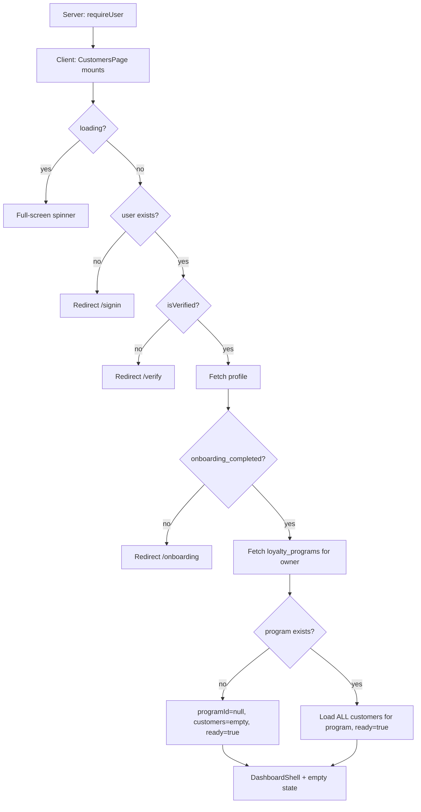

# Customers Page (`/app/customers`)

Reference for all components, conditions, and edge cases on the Customers list route, plus the linked detail page (`/app/customers/[customerId]`). Includes domain notes for frontend + backend work, plus a [UI / API / DB gap analysis](#gaps-ui--api--db-and-recommended-solutions).

**Jump to:** [route](#route-structure) · [how customers are created](#how-customers-are-created-today-vs-intended) · [page flow](#high-level-page-flow) · [stat cards](#stat-cards-5) · [status tabs](#status-tabs) · [filters](#search--filters--sort) · [table](#customer-table) · [row menu](#row-menu) · [add / edit](#add--edit-dialog) · [delete](#delete) · [export](#csv-export) · [detail](#detail-page-appcustomerscustomerid) · [how status works](#how-customer-status-actually-works) · [how tiers work](#how-customer-tiers-actually-work) · [gaps](#gaps-ui--api--db-and-recommended-solutions)

**Source files:**

- Route entry: `src/app/app/(shell)/customers/page.tsx`
- Feature implementation: `src/features/customers/customers-page.tsx`
- Detail route: `src/app/app/(shell)/customers/[customerId]/page.tsx`
- Detail feature: `src/features/customers/customer-detail-page.tsx`
- Shell layout guard: `src/app/app/(shell)/layout.tsx`
- Dashboard chrome: `src/components/dashboard/DashboardShell.tsx`
- Public enroll (creates rows): `src/lib/server/join-service.ts` → `/api/join/enroll`
- Schema: `supabase/migrations/20260714191332_*.sql`
- Related: [loyalty-page.md](loyalty-page.md) (tier config), [analytics-page.md](analytics-page.md) (segments vs status), [campaigns-page.md](campaigns-page.md) (audience), [dashboard-page.md](dashboard-page.md) (30-day recency)
- Product: [shop-customer register/login](11-authentication-migration.md#shop-customer-register-and-login-decided) (DECIDED; not shipped)

---

## How customers are created (today vs intended)

**Today** a `customers` row comes from:

1. Shop owner **Add Customer** in this page (manual)
2. Public QR **join/enroll** (`POST /api/join/enroll`) — no customer login

**Intended (DECIDED):** shop customers **register and log in** (role **customer**) so we **store their data** and **calculate KPIs** from activity — not only from owner-typed rows. Public **new** join requires OTP (SMS/WhatsApp) before the member row exists. Register, login, and recovery are **passwordless** (new OTP; never `/auth/forgot-password`). Owner (`admin`) manual add stays as a merchant tool (no OTP). Customer login is **not** `/app` `admin` / `staff` auth. Portal case map (direct vs referral, first-shop link, profile setup): [customer-portal-journey.md](../product/customer-portal-journey.md). See [G-33](gaps-and-solutions.md#g-33--shop-customers-have-no-registerlogin-kpis-rely-on-owner-typed-rows) · [OTP](loyalty-page.md#otp-verification-decided) · [credential recovery](11-authentication-migration.md#credential-recovery-decided).

---

## Route structure

```tsx
// src/app/app/(shell)/customers/page.tsx
"use client";

import CustomersPage from "@/features/customers/customers-page";

export default function Page() {
  return <CustomersPage />;
}
```

Same shell guard as other `/app/*` pages: `requireUser()` then client verification + onboarding checks.

Legacy `/customers` → `/app/customers`. Detail: `/app/customers/[customerId]` → `CustomerDetailPage`.

---

## High-level page flow



Unlike Analytics, there is **no dedicated “create a program first” empty canvas**. With no program, the list is empty and **Add Customer** toasts “Create your loyalty program first.”

---

## `CustomersPage` — root component

### State

| State | Purpose |
|-------|---------|
| `firstName` | Dashboard header greeting |
| `ready` | Data fetch finished |
| `programId` | Owner’s single loyalty program, or `null` |
| `customers` | All customers for that program (no pagination) |
| `addOpen` / `editTarget` / `deleteTarget` | Dialogs |
| `search` | Name / email / phone substring |
| `tier` | `"all"` \| `"vip"` \| `"gold"` \| `"silver"` \| `"bronze"` |
| `status` | `"all"` \| `"active"` \| `"at_risk"` \| `"churned"` |
| `sort` | Name / revenue / points |
| `dateRange` | Filter on `last_activity_at` |

### Client-side redirects

| Condition | Action |
|-----------|--------|
| `loading === true` | Wait |
| `!user` | → `/signin` |
| `!isVerified` | → `/verify?email=...` |
| `!profile.onboarding_completed` | → `/onboarding` |
| No loyalty program | Stay, empty list |
| Program exists | Load all `customers` rows |

### Data loading sequence

1. `profiles` — `full_name, onboarding_completed`
2. `loyalty_programs` — `id` where `owner_id = user.id`
3. `customers` — `id, full_name, email, phone, birth_date, tier, points, visits, status, last_activity_at` where `loyalty_program_id = pid`, `order created_at desc`

**Today** customers are loaded from the owner’s single program row. **Intended:** one membership per Shop (all capability balances on that row). `loyalty_program_id` is a transitional alias for Shop identity ([data-contract](../backend/data-contract.md#shop-capability-model-decided-not-shipped)).

**Entire table is pulled into the browser.** Filters, sort, and CSV run client-side.

### Customer type (UI)

```ts
type Customer = {
  id: string;
  full_name: string;
  email: string | null;
  phone: string | null;
  birth_date: string | null;
  tier: string | null;
  points: number;
  visits: number;
  status: string;
  last_activity_at: string | null;
};
```

DB also has `city`, `gender`, `custom_field_value`, `created_at` — not selected on the list (detail selects `created_at`).

---

## Stat cards (5)

Computed from the **unfiltered** `customers` array.

| Label in UI | Actual formula | Problem |
|-------------|----------------|---------|
| Total Customers | `customers.length` | OK |
| Active Customers | `status === "active"` | OK vs stored status |
| **New this month** | Count of `tier` gold **or** vip | **Wrong metric** — not `created_at` this month |
| **Returning Rate** | Count of `tier === "silver"` | **Wrong metric** — not a rate |
| At-Risk Customers | `status === "at_risk"` | Differs from Dashboard 30-day recency |

Gold/VIP and Silver counts are useful, but the **labels do not match the math**. Until `customers.tier` is written (almost always `null`), both cards show `0`.

---

## Empty state

When `customers.length === 0`:

- Illustration + “Build Your Customer Community!”
- **Add Customer** in the empty card (header Add/Export hidden)
- Stat cards still render as zeros

---

## Status tabs

| Tab | Filter | Count badge |
|-----|--------|-------------|
| All | none | `customers.length` |
| Active | `status === "active"` | matching rows |
| At-Risk | `status === "at_risk"` | matching rows |
| Churned | `status === "churned"` | matching rows |

Manual add always inserts `status: "active"`. Join enroll also inserts `"active"`. **Nothing in the app writes `at_risk` or `churned`.** Those tabs stay at `0` unless rows are edited in SQL.

Dashboard “at risk” uses 30-day `last_activity_at` and **does not** set `status`. Campaigns audience `"at-risk"` queries a **different string** than `"at_risk"` ([campaigns-page.md](campaigns-page.md)).

---

## Search / filters / sort

All client-side on the already-loaded array.

| Control | Behavior |
|---------|----------|
| Search | Case-insensitive substring on `full_name`, `email`, `phone` |
| Tier dropdown | `(c.tier ?? "").toLowerCase() === filter` (`all` skips) |
| Last visit calendar | Requires `last_activity_at`; range inclusive of from 00:00 / to 23:59 |
| Sort | See below |

### Sort keys

| Value | Label | Actual sort |
|-------|-------|-------------|
| `name_asc` / `name_desc` | A–Z / Z–A | `full_name` |
| `revenue_desc` / `revenue_asc` | Highest / Lowest revenue | **`points`** (TODO in source) |
| `points_desc` / `points_asc` | Highest / Lowest points | `points` |

Date filter **excludes** customers with null `last_activity_at`.

---

## Customer table

Columns: Customer (avatar + name + email), Phone, Tier, Points, **Revenue (`—`)**, Visits, Last Visit, Status, menu.

| Field | Render |
|-------|--------|
| Tier | Badge from free-text `tier`; empty → default styling |
| Revenue | Always em dash |
| Last Visit | Formatted `last_activity_at` or empty |
| Status | Pill from `status` string |

No pagination. No bulk select.

---

## Row menu

| Item | Action |
|------|--------|
| View profile | → `/customers/$customerId` |
| Edit | Opens edit dialog |
| Send Campaign | → `/campaigns` (no prefilled audience / customer) |
| Delete | Opens confirm dialog |

---

## Add / edit dialog

Shared `AddCustomerDialog`. Fields: `full_name`, `email`, `phone`, `birth_date`.

**Insert** (requires `programId`):

```ts
{
  loyalty_program_id: programId,
  full_name, email, phone, birth_date,
  status: "active",
}
```

`points` / `visits` default in DB. `tier` stays null. `last_activity_at` is **not** set on manual add (null until a QR check-in).

**Update** only writes name, email, phone, birth date — not status, tier, points, visits.

Join enroll **does** persist `gender`, `city`, `custom_field_value`. The owner dialog cannot view or edit those fields.

---

## Delete

`AlertDialog` then `customers.delete().eq("id", …)`. Copy says points and activity history are removed. Related `customer_rewards` / `campaign_recipients` depend on FK `ON DELETE` in migrations (cascade vs restrict — confirm before relying on this in production).

---

## CSV export

Client-side Blob of the **filtered** set. Columns: Name, Email, Phone, Tier, Points, Visits, Status, Last Visit Date, Birth Date. Filename `customers.csv`. Empty filtered set → toast “No customers to export.”

Not a server export; no period param; no revenue column.

---

## How customer status actually works

| Writer | `status` value |
|--------|----------------|
| Manual add | `"active"` |
| `/api/join/enroll` new member | `"active"` |
| Check-in (`recordCheckIn`) | **does not change status** |
| Owner UI | **cannot change status** |
| Job / trigger | **none** |

So `at_risk` and `churned` are schema values with **no product writer**. Dashboard and Analytics compute “at risk” from recency instead.

**Do not mix with account status (DECIDED):** an `admin` can set a `customer` **account** to `active` / `inactive` (login) on the **Customers** tab of the one accounts page (Team tab is `admin`/`staff`). That is separate from this member `status` column. See [account active/inactive](11-authentication-migration.md#account-active--inactive-decided).

---

## How customer tiers actually work

`customers.tier` is **free text**, not an FK to `loyalty_program_tiers`.

| Writer | Sets `tier`? |
|--------|----------------|
| Manual add / edit | No |
| Enroll | No |
| Check-in | Updates `points` / `visits` only — **does not** apply the ladder |
| Loyalty page | Saves thresholds on `loyalty_program_tiers` only |

Until check-in/enroll writes `tier` from `points_threshold`, the tier filter, Gold/VIP card, Analytics donut, and campaign VIP/Gold audiences stay empty. Full write-path recommendation: [analytics-page.md](analytics-page.md#how-customer-tiers-actually-work).

---

## Detail page (`/app/customers/[customerId]`)

Thin route unwraps `params.customerId` and renders `CustomerDetailPage`.

### Load

- Profile `full_name` for the shell
- `customers` by `id` (includes `created_at`)
- **Does not** verify the row belongs to this owner’s program beyond RLS
- Missing row → “Customer not found” + back link
- **Does not** redirect on missing onboarding (only sign-in / verify)

### Hero

Initials avatar, green/gray status dot (`active` vs anything else), email • phone • “Member since {Mon YYYY}”. Tier chip defaults to **“Bronze”** when `tier` is null (list page shows empty instead — inconsistent).

Actions: **Edit** (same dialog), **Send Campaign** → `/campaigns`.

### Stat tiles

| Label | Value |
|-------|-------|
| Total Points | `c.points` |
| Total Visits | `c.visits` |
| Rewards Redeemed | **hardcoded `0`** |
| Lifetime Value | **hardcoded `$0`** |
| Referrals | **hardcoded `0`** |

`customer_rewards` exists and is written on check-in earn, but the detail page never queries it.

### Panels (placeholders)

| Panel | Behavior |
|-------|----------|
| Customer Engagement | Empty chart copy |
| Recent Transactions | Empty table; View all → toast “Coming soon” |
| Rewards History | Empty table; View all → toast “Coming soon” |
| Loyalty Status | Current tier + points; progress bar `width: 0%`; “Tier progression coming soon” |
| Customer Health | `"—"` and 0% bar |
| Recent Activity | “No recent activity yet” |

---

## Gaps — UI / API / DB and recommended solutions

Indexed backlog + ownership: [gaps-and-solutions.md](gaps-and-solutions.md) · contracts: [data-contract.md](../backend/data-contract.md) · [api-contract.md](../backend/api-contract.md) · [remediation-roadmap.md](../backend/remediation-roadmap.md) · [ADR-014](../architecture/decisions/ADR-014-product-data-ownership.md).

| G-ID | Widget | UI gap | API gap | DB gap | Recommended fix |
|------|--------|--------|---------|--------|-----------------|
| [G-12](gaps-and-solutions.md#g-12--stat-card-label-bugs-on-customers) | **New this month / Returning Rate** | Labels ≠ formulas (Gold/VIP and Silver counts) | No | OK | Relabel or compute correctly; return rate from `visit_events` |
| [G-08](gaps-and-solutions.md#g-08--three-at-risk-definitions) | **At-risk tab vs Dashboard** | Tab uses `status`; Overview uses 30-day recency | No shared rules | `status` never updated | One module; optional job from recency |
| [G-06](gaps-and-solutions.md#g-06--revenue-is-a-dead-column-everywhere) | **Revenue column / sort** | `"—"`; sort uses points | No spend API | No `orders` | Orders per customer; until then hide |
| [G-03](gaps-and-solutions.md#g-03--customer-tier-is-never-assigned) | **Tier column / filter** | Usually empty / Bronze-on-detail | Enroll/check-in never set `tier` | Free text, not FK | Write `tier` / `tier_id` on check-in |
| [G-08](gaps-and-solutions.md#g-08--three-at-risk-definitions) | **Churned / At-Risk tabs** | Always 0 | No writer | Enum unused | Job or drop tabs until written |
| [G-36](gaps-and-solutions.md#g-36--no-admin-account-list-or-activeinactive-for-staffcustomer) | **Account active/inactive** | No login gate | No account status | Distinct from member `status` | One page, two tabs (Team / Customers); `active`/`inactive` + filters |
| [G-11](gaps-and-solutions.md#g-11--customer-list-will-not-scale) | **Pagination** | Full table in browser | List is client `select *` | OK at small N | `GET /api/customers?cursor=` |
| [G-17](gaps-and-solutions.md#g-17--join-only-customer-fields-hidden-from-owner) | **Manual add fields** | No gender/city/custom | Join API has them | Columns exist | Add to dialog or show on detail |
| [G-13](gaps-and-solutions.md#g-13--detail-pages-are-shells) | **Detail rewards / LTV / referrals** | Hardcoded 0 | Detail never queries `customer_rewards` | No LTV/referral events | Query rewards; LTV from orders; `referrals` count + `referral_code` ([referral rewards](loyalty-page.md#referral-rewards-decided)) |
| — | **Send Campaign** | No audience prefills | — | — | Prefill create dialog |
| [G-11](gaps-and-solutions.md#g-11--customer-list-will-not-scale) | **CSV** | Client-only snapshot | No export endpoint | — | BFF export when paginated |
| [G-21](gaps-and-solutions.md#g-21--birthday-stored-automation-unused) | **birth_date** | Stored | Birthday automation unused | OK | Automation worker |
| [G-33](gaps-and-solutions.md#g-33--shop-customers-have-no-registerlogin-kpis-rely-on-owner-typed-rows) | **Customer register / login** | Owner add + anonymous join only | No customer session | No customer auth identity | Customer register/login; KPIs from stored activity; owner add remains |

---

## Known limitations

1. **Stat card labels** — “New this month” and “Returning Rate” are tier counts
2. **Revenue** — column and sort are fake/proxy
3. **Status tabs At-Risk / Churned** — no writer
4. **`customers.tier` never written** on enroll/check-in
5. **No pagination**
6. **Detail analytics** — rewards, LTV, referrals, charts, health all placeholders
7. **Join-only fields** not visible to the owner
8. **One program per owner (today)** — all customers hang off that program; no branch_id. **DECIDED:** one Shop membership with up to three capabilities ([loyalty-page.md](loyalty-page.md#shop-loyalty-capabilities-decided))

---

## Component tree

```
Page (customers/page.tsx)
└── CustomersPage
    ├── [loading] Spinner
    └── DashboardShell
        ├── Header (Export*, Add Customer†)
        ├── StatCard × 5
        ├── Empty illustration OR CustomersTable
        │   ├── Status tabs + counts
        │   ├── Search + tier + date + sort
        │   └── Row: name, phone, tier, points, revenue—, visits, last visit, status, menu
        ├── AddCustomerDialog (add)
        ├── AddCustomerDialog (edit)
        └── Delete AlertDialog

Page (customers/[customerId]/page.tsx)
└── CustomerDetailPage
    ├── [loading] Spinner
    ├── [not found] back link
    └── DashboardShell
        ├── Breadcrumb
        ├── Hero (edit, Send Campaign)
        ├── StatTile × 5 (3 hardcoded 0)
        ├── Engagement / Transactions / Rewards History (empty)
        ├── Loyalty Status / Health / Activity (placeholders)
        └── AddCustomerDialog (edit)

* Client CSV of filtered rows
† Hidden when list is empty (empty-state button still adds)
```
