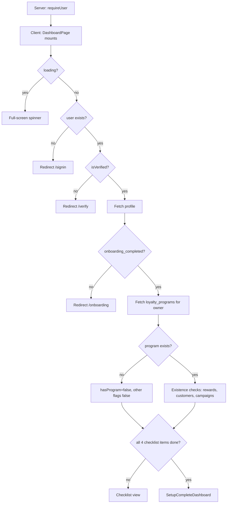

# Overview Page (`/app/dashboard`)

Reference for all components, conditions, and edge cases on the Overview (Dashboard) route. Covers the setup checklist, the post-setup “Welcome Back” dashboard, shared chrome (`DashboardShell`), and a [UI / API / DB gap analysis](#gaps-ui--api--db-and-recommended-solutions).

**Jump to:** [route](#route-structure) · [page flow](#high-level-page-flow) · [checklist](#setup-checklist-view) · [setup complete](#setupcompletedashboard) · [stat cards](#stat-cards-5) · [growth chart](#customer-growth--card) · [redemptions](#redemption-breakdown--card) · [live activity](#live-activity--card) · [campaigns](#active-campaigns--card) · [top customers](#top-customers--card) · [at risk](#customers-at-risk--card) · [shell](#dashboardshell-shared-chrome) · [gaps](#gaps-ui--api--db-and-recommended-solutions)

**Source files:**

- Route entry: `src/app/app/(shell)/dashboard/page.tsx`
- Feature implementation: `src/features/dashboard/dashboard-page.tsx`
- Post-setup canvas: `src/components/dashboard/SetupCompleteDashboard.tsx`
- Shell layout guard: `src/app/app/(shell)/layout.tsx`
- Dashboard chrome: `src/components/dashboard/DashboardShell.tsx`
- Owner notification insert: `src/lib/notify-client.ts` → `/api/notifications/owner`
- Unique owner constraint: `supabase/migrations/20260713174353_034cd3b0-2acb-430d-b1d9-14efe9174840.sql`
- Related: [customers-page.md](customers-page.md), [loyalty-page.md](loyalty-page.md), [campaigns-page.md](campaigns-page.md), [analytics-page.md](analytics-page.md), [system-architecture.md](system-architecture.md)

---

## Route structure

The URL `/app/dashboard` is served by a thin Next.js page that delegates to the feature module:

```tsx
// src/app/app/(shell)/dashboard/page.tsx
"use client";

import DashboardPage from "@/features/dashboard/dashboard-page";

export default function Page() {
  return <DashboardPage />;
}
```

The page sits under `src/app/app/(shell)/`, which applies a **server-side auth guard** before anything renders:

```tsx
// src/app/app/(shell)/layout.tsx
export default async function AppShellLayout({ children }) {
  await requireUser();
  return <>{children}</>;
}
```

Auth is enforced twice:

1. **Server** — `requireUser()` redirects unauthenticated users to `/auth/sign-in`
2. **Client** — `DashboardPage` runs additional checks (verification, onboarding)

Legacy TanStack path `/dashboard` maps to `/app/dashboard` (`src/lib/navigation/paths.ts`). Sidebar label is **Overview**.

---

## High-level page flow



---

## `DashboardPage` — root component

### State

| State | Purpose |
|-------|---------|
| `fullName` | Greeting (full `full_name`, else email local-part) |
| `ready` | Data fetch finished |
| `programId` | Owner’s single loyalty program, or `null` |
| `hasProgram` | At least one `loyalty_programs` row for this owner |
| `hasRewards` | At least one `rewards` row for that program |
| `hasCustomers` | At least one `customers` row for that program |
| `hasCampaigns` | At least one `campaigns` row for that program |

### Client-side redirects (`useEffect`)

| Condition | Action |
|-----------|--------|
| `loading === true` | Wait (no redirect) |
| `!user` | → `/signin` |
| `!isVerified` | → `/verify?email=...` |
| `!profile.onboarding_completed` | → `/onboarding` |
| Otherwise | Load program + existence flags, `ready = true` |

### Data loading sequence

1. `profiles` — `full_name, business_name, onboarding_completed` where `id = user.id`
2. `loyalty_programs` — `id` where `owner_id = user.id` (`maybeSingle` — **today** one program per owner). **DECIDED:** many programs; [loyalty-page.md](loyalty-page.md#multiple-programs-and-status-decided)
3. If a program exists, `Promise.all` of three `select("id").limit(1).maybeSingle()`:
   - `rewards` where `loyalty_program_id = program.id`
   - `customers` where `loyalty_program_id = program.id`
   - `campaigns` where `loyalty_program_id = program.id`

These are **existence checks**, not full table loads. The post-setup dashboard then loads full rows itself.

### Render switch

```ts
const setupComplete = completedCount === total && !!programId;
```

- `setupComplete && programId` → `<SetupCompleteDashboard fullName programId />`
- otherwise → checklist canvas

---

## Setup checklist view

Shown until the owner has a program **and** at least one reward, one customer, and one campaign.

### Checklist items

| id | Title | `done` when | `href` |
|----|-------|-------------|--------|
| `program` | Create Loyalty Program | `hasProgram` | `/loyalty-program` |
| `reward` | Create Your First Reward | `hasRewards` | `/loyalty-program` |
| `customer` | Add Your First Customer | `hasCustomers` | `/customers` |
| `campaign` | Launch Your First Campaign | `hasCampaigns` | `/campaigns` |

`completedCount` / `total` drive the “N/4 Completed” label and the green progress bar. `nextStep` is the first incomplete item; **Continue Setup** navigates to that `href` (fallback `/loyalty-program`).

Each row is a button that navigates even when already done. Done rows show a green check; incomplete rows show an empty circle.

### Edge cases

- A program with zero rewards/customers/campaigns stays on the checklist.
- Creating a campaign **draft** (not sent) still sets `hasCampaigns` — the check is “row exists”, not “status = sent”.
- Deleting the last customer/reward/campaign after setup complete would drop the owner **back** to the checklist on next load.

---

## `SetupCompleteDashboard`

Rendered only when all four checklist items are true. Loads **all** customers, rewards, and campaigns for `programId` in one `Promise.all`.

### State

| State | Purpose |
|-------|---------|
| `loading` | Inner spinner until the three queries finish |
| `customers` | All members for the program |
| `rewards` | All rewards (`id, name, point_cost, redeemed_count`) |
| `campaigns` | All campaigns, ordered by `sent_at` then `created_at` desc |

Header: “Welcome Back, {fullName}”. Right side: a **This month** button (no handler) and **Create Reward** → `/loyalty-program?tab=rewards`.

---

## Stat cards (5)

Computed in the browser from the three arrays. Every card shows `delta = "—"` (“vs last month”).

| Label | Formula | Source of truth |
|-------|---------|-----------------|
| Total Customers | `customers.length` | `customers` rows |
| Active Customers | `status === "active"` | `customers.status` |
| At-Risk Customers | `last_activity_at` older than **30 days** | recency, **not** `status` |
| Points Redeemed | `Σ redeemed_count × (point_cost ?? 0)` | `rewards` counters, not a ledger |
| Total Revenue | `Σ campaigns.revenue_cents / 100` formatted USD | campaign column, **not** orders |

### Conditions / edge cases

- At-risk here is **30-day recency**. Customers page “At-Risk” tab filters `status === "at_risk"`. Analytics uses yet another cutoff. See [analytics-page.md](analytics-page.md#three-different-systems-do-not-mix-them).
- Members with `last_activity_at = null` are **not** counted as at-risk.
- Revenue is USD hardcoded (`en-US`), ignoring `profiles.currency`.
- `campaigns.revenue_cents` is never written by send ([campaigns-page.md](campaigns-page.md)) — card stays `$0`.
- Month-over-month deltas need historical snapshots (TODO in source).

---

## Customer Growth — card

Last **8 weeks** of new members, bucketed by `customers.created_at`. Bar height is relative to the busiest week.

| Condition | Render |
|-----------|--------|
| `totalCustomers === 0` | “No customers yet.” |
| Otherwise | 8 bars labeled W1…W8 |

Legend shows “New Customers” only. Returning-customer series is omitted (`TODO(feature): no returning-customer event stream`).

---

## Redemption Breakdown — card

Top 3 rewards by `redeemed_count`, plus an “Other” slice. Donut center = total redemptions.

| Condition | Render |
|-----------|--------|
| No reward with `redeemed_count > 0` | “No redemptions yet.” |
| Otherwise | Donut + legend (`count redemptions · pct%`) |

`redeemed_count` is a denormalized integer on `rewards`. There is no per-redemption event with timestamp, so this cannot be filtered to “this month”.

---

## Live Activity — card

Always the dashed empty state: “Activity log will appear here as customers scan QR codes, earn points, and redeem rewards.”

**View All** has no handler. There is no `activity_events` / `visit_events` table.

---

## Active campaigns — card

Filters campaigns where `status` is `"sent"` \| `"active"` \| `"scheduled"`, then takes the first 3 (already ordered by `sent_at`).

**Intended** (2026-08-14, [campaigns-page.md](campaigns-page.md#product-meanings-decided)): this card is **currently running** campaigns only — `active` / `sending` (and `scheduled` if scheduling is wired). **Completed** means the send is finished and must **not** appear here. Today a successful send stays `active`, so finished campaigns still show in this card.

| Condition | Render |
|-----------|--------|
| None match | “No active campaigns.” |
| Otherwise | Name (link to detail), `{sent_count} recipients · {CHANNEL}`, open rate `%` |

Open rate = `round(opened_count / sent_count * 100)` or `0` if `sent_count === 0`. Opens are not tracked ([campaigns-page.md](campaigns-page.md)), so this is `0%` after a real send.

**Create New** → `/campaigns`. Subtitle `{n} running now` uses the filtered length, not a live worker.

---

## Top Customers — card

Sorts all customers by `points` desc, takes 5. Avatar color from `tier` (`vip` / `gold` / `silver` / `bronze`). Link to `/customers/$customerId`.

| Condition | Render |
|-----------|--------|
| No customers | “No customers yet.” |
| `tier` null | Subtitle “Member · N Visits” (no tier name) |

**View All** → `/customers`. Ranking is points, not spend.

---

## Customers at Risk — card

Same 30-day recency as the stat card. Sorted oldest activity first, max 3. **Send Campaign** → `/campaigns` (does not prefill audience).

| Condition | Render |
|-----------|--------|
| Empty | “No at-risk customers 🎉” |
| `last_activity_at` null | Excluded |

---

## `DashboardShell` (shared chrome)

Used by every authenticated product page. Not unique to Overview, but this is the home of its behavior.

### Sidebar

| Section | Items | Approved URLs |
|---------|-------|----------------|
| Main | Overview, Customers, Loyalty Program, Branches | `/app/dashboard`, `/app/customers`, `/app/loyalty`, `/app/branches` |
| Growth | Campaigns, Analytics | `/app/campaigns`, `/app/analytics` |
| Footer | Settings, Logout | `/app/settings` |

Active state: pathname equals the resolved href or is a child (`/app/customers/xyz` highlights Customers).

### Header

- Mobile hamburger → drawer (same nav)
- **Search** `<input>` — no `onChange` handler, no query, no results
- **NotificationsBell** — see below
- Avatar button → `/dashboard` (not a menu). Avatar from `profiles.avatar_url`

### Notifications bell

| Action | Behavior |
|--------|----------|
| Mount / open | `notifications` where `recipient_id = user.id`, newest 10 |
| Unread badge | Count of `read === false` (caps at `9+`) |
| Click row | Mark read, navigate to `link` if set |
| Mark all as read | Update those ids |

Inserts happen via `POST /api/notifications/owner` (campaign created, branch added, join enroll). The BFF **does not** check `notification_preferences` before insert. Email enqueue on that route is not implemented (in-app row only).

---

## Gaps — UI / API / DB and recommended solutions

Indexed backlog + ownership: [gaps-and-solutions.md](gaps-and-solutions.md) · contracts: [data-contract.md](../backend/data-contract.md) · [api-contract.md](../backend/api-contract.md) · [remediation-roadmap.md](../backend/remediation-roadmap.md) · [ADR-014](../architecture/decisions/ADR-014-product-data-ownership.md).

| G-ID | Widget | UI gap | API gap | DB gap | Recommended fix |
|------|--------|--------|---------|--------|-----------------|
| [G-05](gaps-and-solutions.md#g-05--header-search-does-nothing) | **Header Search** | Input does nothing | No search endpoint | No `tsvector` / FTS | Shared search BFF, or hide until then |
| — | **This month** | Button, no period | No period query | All-time counters | Same period model as Analytics; until then hide/disable (Phase 0 honesty) |
| — | **Stat deltas** | Always `"—"` | No previous-period totals | No daily snapshots | Store period aggregates (Phase 7) |
| [G-08](gaps-and-solutions.md#g-08--three-at-risk-definitions) | **At-risk** | 30-day recency here; `status` on Customers | Three different rules | `status` vs computed recency | One shared module ([data-contract glossary](../backend/data-contract.md#unified-glossary)) |
| [G-06](gaps-and-solutions.md#g-06--revenue-is-a-dead-column-everywhere) | **Total Revenue** | Shows campaign `revenue_cents` | No orders API | No `orders` table | Orders + attribution; don’t use campaign column as GMV |
| [G-20](gaps-and-solutions.md#g-20--rewardsredeemed_count-vs-earn) | **Points Redeemed** | `redeemed_count × point_cost` | No ledger / pending lifecycle | No `points_ledger` | Ledger on earn/redeem; donut uses `completed` only |
| [G-01](gaps-and-solutions.md#g-01--qr-scan-tracking-is-always-0) | **Live Activity** | Empty forever | No activity API | No event log | `visit_events` + reward events; feed last 24h |
| [G-09](gaps-and-solutions.md#g-09--campaign-send--opens--automations) | **Open rate** | `0%` after send | Opens unused | No `opened_at` on recipients | ESP webhook / pixel |
| [G-02](gaps-and-solutions.md#g-02--visit--stamp-progress-is-always-empty) | **Returning customers** | Legend omitted | No | No return-visit stream | Derive from `visit_events` |
| [G-05](gaps-and-solutions.md#g-05--header-search-does-nothing) / [G-22](gaps-and-solutions.md#g-22--header-avatar-goes-to-dashboard-not-settings) | **Avatar / search / bell** | Search dead; avatar → dashboard | — | — | Wire search or remove; avatar → `/settings` |

---

## Known limitations

1. **Header search** — decorative
2. **This month / MoM deltas** — not wired
3. **Revenue** — campaign column, usually `$0`
4. **Live activity** — no event table
5. **At-risk definition** — disagrees with Customers / Analytics / Campaigns
6. **Open rate** — opens never incremented
7. **One program per owner (today)** — **DECIDED:** many programs + `draft`/`active`/`disabled` ([loyalty-page.md](loyalty-page.md#multiple-programs-and-status-decided))
8. **Checklist is existence-only** — a draft campaign counts as “launched”

---

## Component tree

```
Page (dashboard/page.tsx)
└── DashboardPage
    ├── [loading] Spinner
    └── DashboardShell
        ├── DashboardSidebar (Main → Overview)
        ├── DashboardHeader (search*, bell, avatar)
        ├── MobileNavDrawer
        └── Main content
            ├── [incomplete] Checklist canvas
            │   ├── Welcome + Continue Setup
            │   └── Getting Started (4 items + progress)
            └── [complete] SetupCompleteDashboard
                ├── Header (This month*, Create Reward)
                ├── StatCard × 5
                ├── Customer Growth + Redemption donut
                ├── Live Activity* + Active campaigns
                └── Top Customers + Customers at Risk

* UI only — not functional
```
