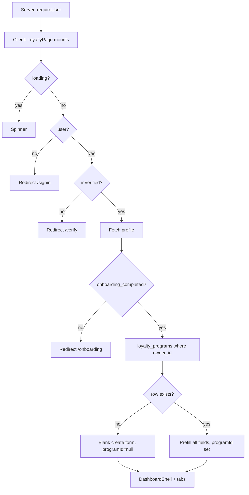

# Loyalty Program Page (`/app/loyalty`)

Reference for all components, conditions, and edge cases on the Loyalty Program route (create + edit of the owner’s single program). Covers the four tabs, program types, QR join URL, and a [UI / API / DB gap analysis](#gaps-ui--api--db-and-recommended-solutions).

**Jump to:** [route](#route-structure) · [page flow](#high-level-page-flow) · [one program](#one-owner--one-loyalty-program) · [tabs](#tabs) · [points](#points-system) · [visit](#visit-based) · [tier](#tier-based) · [save](#save--upsert) · [qr](#qr-on-the-programs-tab) · [rewards](#rewards-tab) · [referrals](#referrals-tab) · [qr experience](#qr-experience-tab) · [join](#public-join--check-in) · [gaps](#gaps-ui--api--db-and-recommended-solutions)

**Source files:**

- Route entry: `src/app/app/(shell)/loyalty/page.tsx`
- Feature implementation: `src/features/loyalty/loyalty-page.tsx`
- Tiers: `src/components/loyalty/TierBasedFlow.tsx`, `src/components/loyalty/TierSection.tsx`
- Visit UI: `src/components/loyalty/VisitsProgressSection.tsx`, `src/components/loyalty/StampCardPreview.tsx`
- Rewards: `src/components/loyalty/RewardsSection.tsx`
- Referrals: `src/components/loyalty/ReferralsSection.tsx`
- QR page builder: `src/components/loyalty/QRExperienceSection.tsx`
- Public join: `src/features/join/join-page.tsx`, `src/lib/server/join-service.ts`, `/api/join/program`, `/api/join/enroll`
- Unique owner constraint: `supabase/migrations/20260713174353_034cd3b0-2acb-430d-b1d9-14efe9174840.sql`
- Related: [customers-page.md](customers-page.md), [analytics-page.md](analytics-page.md), [dashboard-page.md](dashboard-page.md)

---

## Route structure

```tsx
// src/app/app/(shell)/loyalty/page.tsx
"use client";

import LoyaltyPage from "@/features/loyalty/loyalty-page";

export default function Page() {
  return <LoyaltyPage />;
}
```

Approved URL: `/app/loyalty`. Legacy `/loyalty-program` maps here. Tab is a query string (`?tab=rewards`), parsed client-side from `window.location.search` (not Next `searchParams`).

Valid tabs: `programs` (default) \| `rewards` \| `referrals` \| `qr-experience`.

---

## High-level page flow



The same page is **create and edit**. There is no dedicated management overview (TODO in source).

---

## One owner · one loyalty program

`loyalty_programs.owner_id` is unique. Saves use:

```ts
.upsert(payload, { onConflict: "owner_id" })
```

There is no program switcher, archive, or second program. Changing `program_type` after customers exist is allowed in the UI (“You can change this anytime”) but **does not migrate** points/visits/tiers.

---

## `LoyaltyPage` — root component

### State (high level)

| Area | State |
|------|--------|
| Identity | `firstName`, `businessName`, `ready`, `programId` |
| Type | `programType`: `"points"` \| `"visit"` \| `"tier"` |
| Points rules | `spendAmount`, `pointsEarned`, `minSpend`, `pointsExpiry`, `gracePeriod`, `bonusSignup`, `doubleBirthdays` |
| Visit rules | `visitsRequired`, `rewardOnCompletion`, `minSpendPerVisit`, `cardExpiryDays`, `maxVisitsPerDay`, `afterRewardAction`, `bonusStampSignup`, `doubleStampWeekends`, `notifyOneVisitAway` |
| Tier rules | `tierMeasuredBy`, `tierResetPeriod`, `notifyTierUpgrade`, `tierDowngradeProtection`, `tiers[]` |
| QR | `qrDataUrl`, `totalScans`, `scansThisWeek` (always 0) |
| Visit stats | `stampsIssuedThisMonth`, `cardsCompleted`, `customersOneVisitAway` (always 0) |

### Data loading

1. `profiles` — `full_name, business_name, onboarding_completed`
2. `loyalty_programs.select("*")` where `owner_id = user.id`
3. If found, copy every column into form state
4. `reloadTiers()` — `loyalty_program_tiers` ordered by `points_threshold`

QR PNG is generated in the browser (`qrcode`) from `{origin}/join/{programId}`.

Scan and visit analytics effects **set zeros** and never query (TODOs in source).

---

## Tabs

| Tab | Content |
|-----|---------|
| Programs | Type picker + rules form + QR sidebar + type-specific extras |
| Rewards | `RewardsSection` catalog CRUD |
| Referrals | `ReferralsSection` settings + empty leaderboard |
| QR Experience | `QRExperienceSection` join-page branding |

Rewards / Referrals / QR call `ensureProgramSaved()` so a **tier** program can be auto-inserted (minimal `program_type: "tier"` upsert) before those tabs write child rows. Points/visit programs are **not** auto-saved that way unless the owner already has a row.

---

## Points system

Required: `spendAmount > 0`, `pointsEarned > 0`. Optional: minimum spend, expiry months, grace months, bonus signup points, double points on birthdays.

**What check-in actually uses** (`join-service` `recordCheckIn`):

- Adds `program.points_earned` to `customers.points` (flat, **not** `spend_amount` / ticket size)
- Does **not** enforce `minimum_spend` (no order amount on check-in)
- Does **not** apply expiry, grace, birthday double, or signup bonus

Signup bonus and birthday double are stored flags only.

---

## Visit based

Required: `visitsRequired > 0`, `rewardOnCompletion` (select: free item / discount / custom — **string labels**, not a `rewards.id`).

Optional: min spend per visit, card expiry days, max visits per day, after-reward action (`reset` \| `continue`), bonus stamp on signup, double stamp weekends, notify one visit away.

**What check-in actually uses:**

- Increments `customers.visits` (weekend double if `double_stamp_weekends`)
- `max_visits_per_day > 0` blocks a second stamp the same **UTC** day via `last_activity_at`
- When `visits >= visits_required`, inserts `customer_rewards` with `reward_name_snapshot` from `reward_on_completion` (`reward_id` null)
- `after_reward_action === "reset"` subtracts `visits_required` from `visits`

**Not used:** `min_spend_per_visit`, `card_expiry_days`, `bonus_stamp_signup`, `notify_one_visit_away`.

### Visit UI extras (always empty)

| Widget | Data |
|--------|------|
| Visit stats (stamps this month, cards completed, one visit away) | Hardcoded `0` |
| `VisitsProgressSection` | Intentionally returns `[]` — empty telescope state |
| Stamp card preview | Visual only from `visitsRequired` + reward label |

---

## Tier based

**Screen 1** (`tiers.length === 0`): `TierBasedFlow` template picker. Selecting a template or “custom” calls `ensureProgramSaved()` then inserts `loyalty_program_tiers` rows.

**Screen 2**: rules (`tier_measured_by`, `tier_reset_period`, notify upgrade, downgrade protection) + `TierSection` CRUD + QR sidebar + **Tier stats** (each tier member count hardcoded `"0"`).

`MembersCloseToUpgradingPanel` uses an empty array; **Send Upgrade Nudge** would toast success if the list were non-empty.

**What check-in actually does for `program_type === "tier"`:** treats it like **visit** (increment visits, maybe earn `reward_on_completion`). It does **not**:

- Read `loyalty_program_tiers`
- Write `customers.tier`
- Apply `points_multiplier` / `bonus_percentage`
- Honor `tier_measured_by` or reset period

---

## Save / upsert

`buildProgramPayload()` zeros out columns that do not belong to the selected type, then upserts on `owner_id`. First save toasts “Your QR code is ready” and navigates to `/dashboard`. Later saves toast “Program updated” and also navigate to `/dashboard`.

Validation: points and visit required fields; **tier type has `canSubmit === true`** with no extra field checks (tiers live in a child table).

---

## QR on the Programs tab

When `programId` exists: PNG, join URL, Download PNG, Print PDF (popup), Share (`navigator.share` or clipboard).

`Total scans` / `Scans this week` are always `"0"`. There is no `qr_scan_events` table. Opening `/join/{id}` does not increment a counter.

---

## Rewards tab

`RewardsSection` loads `rewards` for `programId`. CRUD: name, description, icon, `point_cost`, `monthly_limit`, `status` (`live` / paused), `sort_order`, `redeemed_count`.

| Action | DB |
|--------|-----|
| Create / edit | `insert` / `update` |
| Pause / live | `status` update |
| Delete | `delete` |
| Export PDF | Client `jspdf` of the catalog |

Reward performance dialog: `redeemed_count` is real; **revenue and per-tier redemption counts are 0**. Check-in can insert `customer_rewards` and increment nothing on `rewards.redeemed_count` unless some other path does (join-service earn path does **not** bump `redeemed_count` — it inserts `status: "earned"`, not redeemed).

---

## Referrals tab

Reads/writes `referral_settings` (one row per program): `enabled`, `referrer_bonus_points`, `new_customer_discount_pct`.

**Top referrers** is a hardcoded empty array. Join enroll does **not** accept a referral code or write a referral event. Settings are stored only.

---

## QR Experience tab

Loads/upserts `qr_page_settings` (1:1 with program). Branding colors, copy, form field toggles, logo/cover upload to Storage bucket `qr-branding`.

`getJoinProgram` **does** return `qr` settings to the public join page — this tab **is** wired for branding. Scan **counts** are still missing.

---

## Public join / check-in

Unauthenticated `/join/[programId]`:

1. `GET /api/join/program?programId=` → program + `qr_page_settings` + business name
2. `POST /api/join/enroll` → create customer **or** `recordCheckIn` if email/phone already in that program

New customer: `status: "active"`, `points: 0`, `last_activity_at` now, optional birth/gender/city/custom. Owner notification best-effort.

Returning scan: updates points or visits as above; may insert `customer_rewards`; may email customer. **Does not** write `customers.tier`, visit events, or scan events. **Does not** attach `branch_id`.

Rate limit: in-memory per IP (ADR-012). Replace with Redis/Upstash in production.

**Intended (DECIDED):** shop customers will **register and log in** (role **customer**) so their data is stored on an account and KPIs are **calculated** from that activity — not only from owner **Add Customer**. This join page stays a public capture/check-in path; when customer auth exists, enroll/check-in should attach to that account. Customer login is not `admin` / `staff` `/app` auth. See [11-authentication-migration.md](11-authentication-migration.md#shop-customer-register-and-login-decided) and [G-33](gaps-and-solutions.md#g-33--shop-customers-have-no-registerlogin-kpis-rely-on-owner-typed-rows).

---

## Gaps — UI / API / DB and recommended solutions

Indexed backlog + ownership: [gaps-and-solutions.md](gaps-and-solutions.md) · contracts: [data-contract.md](../backend/data-contract.md) · [api-contract.md](../backend/api-contract.md) · [remediation-roadmap.md](../backend/remediation-roadmap.md) · [ADR-014](../architecture/decisions/ADR-014-product-data-ownership.md).

| G-ID | Widget | UI gap | API gap | DB gap | Recommended fix |
|------|--------|--------|---------|--------|-----------------|
| [G-01](gaps-and-solutions.md#g-01--qr-scan-tracking-is-always-0) | **QR scan stats** | Always 0 | Join GET does not log | No scan table | `visit_events` (`source=qr_view` / check-in) |
| [G-02](gaps-and-solutions.md#g-02--visit--stamp-progress-is-always-empty) | **Visit progress / stamp stats** | Empty / 0 | Check-in only bumps `customers.visits` | No stamp ledger | `visit_events`; derive buckets until then |
| [G-03](gaps-and-solutions.md#g-03--customer-tier-is-never-assigned) | **Tier stats / members close to upgrade** | `"0"` / empty | Check-in never sets `tier` | `tier` free text | Assign from `loyalty_program_tiers` |
| [G-10](gaps-and-solutions.md#g-10--check-in-ignores-most-loyalty-rules) / [G-06](gaps-and-solutions.md#g-06--revenue-is-a-dead-column-everywhere) | **Points earn vs spend** | Implies $1 → N from ticket | Flat `points_earned` | No order amount | POS / `orders.amount_cents` |
| [G-10](gaps-and-solutions.md#g-10--check-in-ignores-most-loyalty-rules) | **Min spend, expiry, birthday, signup bonus** | Saved | Unused in join-service | Columns exist | Implement or hide until POS |
| [G-10](gaps-and-solutions.md#g-10--check-in-ignores-most-loyalty-rules) | **Visit min spend / card expiry / notify 1 away** | Saved | Unused | Columns exist | Ticket amount + jobs |
| — | **Reward on completion** | Not tied to `rewards.id` | Snapshot string only | `reward_id` null | FK to catalog reward |
| [G-20](gaps-and-solutions.md#g-20--rewardsredeemed_count-vs-earn) | **`redeemed_count`** | Catalog shows it | Earn ≠ redeem | No redeem API | Redeem endpoint |
| [G-14](gaps-and-solutions.md#g-14--referrals-settings-without-attribution) | **Referrals** | Settings only | Enroll has no `referredBy` | No `referrals` table | Codes + rows; credit bonus |
| [G-31](gaps-and-solutions.md#g-31--program-type-change-after-members-exist) | **Program type change** | Copy says anytime | No migration | One row | Lock or migrate |
| [G-10](gaps-and-solutions.md#g-10--check-in-ignores-most-loyalty-rules) | **Tier multipliers** | Saved on tier rows | Unused | OK | Apply on earn once orders exist |

---

## Known limitations

1. One program per owner
2. Same page is create + edit; save always returns to dashboard
3. Scan / visit / tier member stats are zeros
4. Check-in ignores most saved rules
5. `customers.tier` never assigned
6. Referrals config without attribution
7. Reward “redeemed” vs “earned” not distinguished in UI
8. Tab query parsed from `window.location.search` (not typed Next searchParams)

---

## Component tree

```
Page (loyalty/page.tsx)
└── LoyaltyPage
    ├── [loading] Spinner
    └── DashboardShell
        ├── Title
        ├── Tab bar (Programs | Rewards | Referrals | QR Experience)
        ├── Programs
        │   ├── Program type radios
        │   ├── [points] spend/points rules + QR sidebar
        │   ├── [visit] visit rules + StampCardPreview + VisitsProgressSection (empty)
        │   ├── [tier, no rows] TierBasedFlow screen 1
        │   └── [tier, has rows] TierBasedFlow screen 2 + QR + Tier stats (0)
        ├── Rewards → RewardsSection
        ├── Referrals → ReferralsSection
        └── QR Experience → QRExperienceSection
```
