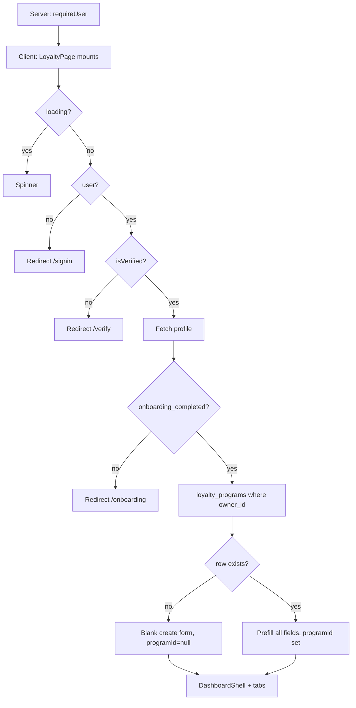

# Loyalty Program Page (`/app/loyalty`)

Reference for all components, conditions, and edge cases on the Loyalty Program route (create + edit). **Today** this is the owner’s single `loyalty_programs` row (`UNIQUE owner_id`). **DECIDED:** a Shop has **one loyalty system** with up to three optional **capabilities** (Points, Visit, Tier), **at most one config per type** ([Shop loyalty capabilities](#shop-loyalty-capabilities-decided) · [program-model.md](../product/program-model.md)). Shop QR always resolves to that Shop — the old “multiple ACTIVE programs / picker” pending item is **resolved**. **DECIDED:** catalog redeem is pending + reserved points + staff **QR verification** ([redemption](#reward-redemption-lifecycle-decided)); four redemption edge cases remain pending Product Owner ([redemption §14](../product/reward-redemption-flow.md#14-pending-owner-decisions-do-not-implement-yet)). Covers the four tabs, capability types, QR join URL, and a [UI / API / DB gap analysis](#gaps-ui--api--db-and-recommended-solutions).

**Jump to:** [route](#route-structure) · [page flow](#high-level-page-flow) · [Shop capabilities](#shop-loyalty-capabilities-decided) · [counter QR](#counter-qr--shop-membership-decided) · [one program today](#one-owner--one-loyalty-program-today) · [tabs](#tabs) · [points](#points-system) · [visit](#visit-based) · [tier](#tier-based) · [save](#save--upsert) · [qr](#qr-on-the-programs-tab) · [rewards](#rewards-tab) · [referrals](#referrals-tab) · [referral rewards](#referral-rewards-decided) · [signup vs referral](#signup-bonus-vs-referral-bonus-decided) · [referral fraud](#referral-fraud-controls-decided) · [otp](#otp-verification-decided) · [customer wallet](#customer-wallet-per-shop-decided) · [reward progress](#reward-progress-on-the-card-decided) · [redemption](#reward-redemption-lifecycle-decided) · [qr experience](#qr-experience-tab) · [join](#public-join--check-in) · [gaps](#gaps-ui--api--db-and-recommended-solutions)

**Source files:**

- Route entry: `src/app/app/(shell)/loyalty/page.tsx`
- Feature implementation: `src/features/loyalty/loyalty-page.tsx`
- Tiers: `src/components/loyalty/TierBasedFlow.tsx`, `src/components/loyalty/TierSection.tsx`
- Visit UI: `src/components/loyalty/VisitsProgressSection.tsx`, `src/components/loyalty/StampCardPreview.tsx`
- Rewards: `src/components/loyalty/RewardsSection.tsx`
- Referrals: `src/components/loyalty/ReferralsSection.tsx`
- QR page builder: `src/components/loyalty/QRExperienceSection.tsx`
- Public join: `src/features/join/join-page.tsx`, `src/lib/server/join-service.ts`, `/api/join/program`, `/api/join/enroll`
- Unique owner constraint: `supabase/migrations/20260713174353_034cd3b0-2acb-430d-b1d9-14efe9174840.sql`
- Related: [customers-page.md](customers-page.md), [analytics-page.md](analytics-page.md), [dashboard-page.md](dashboard-page.md), [program-model.md](../product/program-model.md), [counter-qr-and-program-membership.md](../product/counter-qr-and-program-membership.md), [reward-redemption-flow.md](../product/reward-redemption-flow.md)

---

## Route structure

```tsx
// src/app/app/(shell)/loyalty/page.tsx
"use client";

import LoyaltyPage from "@/features/loyalty/loyalty-page";

export default function Page() {
  return <LoyaltyPage />;
}
```

Approved URL: `/app/loyalty`. Legacy `/loyalty-program` maps here. Tab is a query string (`?tab=rewards`), parsed client-side from `window.location.search` (not Next `searchParams`).

Valid tabs: `programs` (default) \| `rewards` \| `referrals` \| `qr-experience`.

---

## High-level page flow



The same page is **create and edit**. There is no dedicated management overview (TODO in source).

---

## Shop loyalty capabilities (DECIDED)

**A Shop has one loyalty system** with up to three optional **capabilities**: Points, Visit, Tier. **At most one config of each type.** Same-type duplicates are invalid. Canonical product model: [program-model.md](../product/program-model.md). Schema/API are backend-owned ([ADR-014](../architecture/decisions/ADR-014-product-data-ownership.md)). Gap: [G-35](gaps-and-solutions.md#g-35--shop-loyalty-is-one-row-not-one-config-per-capability).

This **supersedes** the 2026-08-16 lock that allowed many independent Programs (including same type) and left Shop QR pending Business Owner.

Each **capability row** may still carry a **status** when the Shop wants to pause one earn path without deleting config:

| Status | Meaning |
|--------|---------|
| **`draft`** | Saved, not live. That capability does not earn / is not shown as live until activated. |
| **`active`** | Live. That capability earns for Shop members. |
| **`disabled`** | Turned off. Config kept; not live. |

Stored names: `draft` · `active` · `disabled`. Do not use other spellings (`disable`, `inactive`). Join/check-in for the **Shop** is available when the Shop has **at least one** `active` capability. No live capability → unavailable.

**Today vs intended**

| | Today | Intended |
|--|--------|----------|
| How many rows | One per `owner_id` (`UNIQUE`) | **Up to three** per Shop — one `points`, one `visit`, one `tier`. Constraint: **`UNIQUE (owner_id, program_type)`** |
| Status | None (the one row is always “the” program) | `draft` \| `active` \| `disabled` per capability |
| Save | `upsert` on `owner_id` (overwrite; changing type wipes the other type’s columns) | Insert/update **that** capability; never a second row of the same type; do not overwrite a sibling capability |
| Join | `/join/{programId}` identifies the one row | **Shop QR** identifies the Shop. Membership is **one per Shop**. Legacy `/join/{programId}` may still load that Shop while a capability id is in the URL — backend-owned. [counter QR](#counter-qr--shop-membership-decided) |

Customers, rewards, campaigns, referrals, and the wallet are **Shop-scoped**. The customer has **one membership per Shop** with independent Points / Visits / Tier state. `/app/loyalty` is the capabilities settings surface (three sections / toggles), not a program list/switcher. [UX-10](../product/ui-ux-team-requests.md#ux-10--loyalty-capabilities-settings).

**Create-flow guidance (admin UI):** enable or configure Points, Visit, and/or Tier on this Shop. Do **not** offer “create another Points program.” Happy Hour–style multipliers remain **earning rules inside Points** (one balance) — how those rules are stored is backend-owned.

**Not locked:** default status on create; who besides `admin` can edit capabilities (`staff` has the same `/app` permissions for now); exact Shop QR path (`/join/shop/{shopSlug}` vs keep today’s UUID); how earning **rules** are stored (backend-owned).

Product note: [program-model.md](../product/program-model.md) · [product-manager-meeting-report.md](../product-manager-meeting-report.md) · [counter-qr-and-program-membership.md](../product/counter-qr-and-program-membership.md).

---

## Counter QR + Shop membership (DECIDED)

**Status:** Shop-scoped membership is DECIDED (not shipped). Shop QR **always** resolves to this Shop — there is no program picker. **Full lock:** [counter-qr-and-program-membership.md](../product/counter-qr-and-program-membership.md). Schema/API/Next routes are backend-owned ([ADR-014](../architecture/decisions/ADR-014-product-data-ownership.md)).

One scope. Do not invent a second membership per capability.

| Scope | What it identifies | What it must not do |
| ----- | ------------------ | ------------------- |
| **Shop QR** | The **Shop** (one loyalty system) | Create a second membership for Points vs Visit vs Tier |
| **Membership** | One **Shop** (`owner_id` / shop identity) | Mix balances **across Shops** |

Scan a Shop QR → land on **this Shop** → enroll or check in. If no capability is `active` → unavailable. First scan of a Shop the account is not in → create **that Shop’s** membership. Returning scan of the same Shop → check-in, no duplicate membership.

Rewards on the Rewards tab stay **this Shop’s catalog**. Catalog redeem is pending → staff QR scan (verification, not approval) with point reservation ([redemption](#reward-redemption-lifecycle-decided)).

Personal `?ref=` shares stay Shop-scoped (URL shape backend-owned; today `/join/{programId}?ref=`). Referral never creates a second Shop membership.

---

## One owner · one loyalty program (today)

`loyalty_programs.owner_id` is unique. Saves use:

```ts
.upsert(payload, { onConflict: "owner_id" })
```

There is no capability switcher, archive, or second type. Changing `program_type` after customers exist is allowed in the UI (“You can change this anytime”) but **does not migrate** points/visits/tiers.

This uniqueness **must become** `UNIQUE (owner_id, program_type)` so a Shop can enable Points **and** Visit **and** Tier without overwriting siblings (G-35). Do not drop uniqueness entirely.

---

## `LoyaltyPage` — root component

### State (high level)

| Area | State |
|------|--------|
| Identity | `firstName`, `businessName`, `ready`, `programId` |
| Type | `programType`: `"points"` \| `"visit"` \| `"tier"` |
| Points rules | `spendAmount`, `pointsEarned`, `minSpend`, `pointsExpiry`, `gracePeriod`, `bonusSignup`, `doubleBirthdays` |
| Visit rules | `visitsRequired`, `rewardOnCompletion`, `minSpendPerVisit`, `cardExpiryDays`, `maxVisitsPerDay`, `afterRewardAction`, `bonusStampSignup`, `doubleStampWeekends`, `notifyOneVisitAway` |
| Tier rules | `tierMeasuredBy`, `tierResetPeriod`, `notifyTierUpgrade`, `tierDowngradeProtection`, `tiers[]` |
| QR | `qrDataUrl`, `totalScans`, `scansThisWeek` (always 0) |
| Visit stats | `stampsIssuedThisMonth`, `cardsCompleted`, `customersOneVisitAway` (always 0) |

### Data loading

1. `profiles` — `full_name, business_name, onboarding_completed`
2. `loyalty_programs.select("*")` where `owner_id = user.id`
3. If found, copy every column into form state
4. `reloadTiers()` — `loyalty_program_tiers` ordered by `points_threshold`

QR PNG is generated in the browser (`qrcode`) from `{origin}/join/{programId}` (**today** — the only row’s id). Intended: Shop / door QR identifies the **Shop** ([counter QR](#counter-qr--shop-membership-decided)). Exact URL is backend-owned.

Scan and visit analytics effects **set zeros** and never query (TODOs in source).

---

## Tabs

| Tab | Content |
|-----|---------|
| Programs | Type picker + rules form + QR sidebar + type-specific extras |
| Rewards | `RewardsSection` catalog CRUD |
| Referrals | `ReferralsSection` settings + empty leaderboard |
| QR Experience | `QRExperienceSection` join-page branding |

Rewards / Referrals / QR call `ensureProgramSaved()` so a **tier** program can be auto-inserted (minimal `program_type: "tier"` upsert) before those tabs write child rows. Points/visit programs are **not** auto-saved that way unless the owner already has a row.

---

## Points system

**Intended (DECIDED, v1 in-store):** the Shop’s **Points capability** is a numeric balance earned via a **currency-to-point** conversion rate (example: every 100 EGP = 10 points) and **spent** on the Shop’s catalog rewards. Points require a purchase amount from a paid invoice / POS / cashier-entered purchase. Time-of-day / category multipliers (e.g. Happy Hour 3x) are **earning rules inside Points**, sharing one balance — not a second Points config ([program-model.md](../product/program-model.md)). No delivery / online channel logic in v1.

Required: `spendAmount > 0`, `pointsEarned > 0`. Optional: minimum spend, expiry months, grace months, bonus signup points, double points on birthdays.

**Minimum spend to earn (`minimum_spend`) — product intent:** ticket floor for Points. No points awarded when the paid invoice is **below** this amount. Parallel Visit gate: [Minimum invoice amount](../product/program-model.md#qualifying-visit--minimum-invoice-amount-min_spend_per_visit).

**What check-in actually uses** (`join-service` `recordCheckIn`):

- Adds `program.points_earned` to `customers.points` (flat, **not** `spend_amount` / ticket size)
- Does **not** enforce `minimum_spend` (no order amount on check-in)
- Does **not** apply expiry, grace, birthday double, or signup bonus

Signup bonus and birthday double are stored flags only.

**Intended (DECIDED):** every **issued** lot for this Shop writes `points_ledger.expires_at` from the Points capability’s `points_expiry_months` (0 = no expiry, `expires_at` null). Referral lots use `referral_settings.points_expiry_days` instead. Points never mix with another Shop. Customer view: [customer wallet](#customer-wallet-per-shop-decided).

---

## Visit based

**Intended (DECIDED, v1 in-store):** the Shop’s **Visit capability** is a counter incremented per qualifying in-store visit / check-in. **It does not require Points.** At the target count (e.g. 10 visits = free item) the Shop **grants a reward and the counter resets**. A Shop has **one** Visit config — not two punch cards as two programs ([program-model.md](../product/program-model.md)). No delivery / online channel logic in v1.

Required: `visitsRequired > 0`, `rewardOnCompletion` (select: free item / discount / custom — **string labels**, not a `rewards.id`).

Optional: **Minimum invoice amount** (`min_spend_per_visit`; UI label today “Minimum spend per visit”), card expiry days, max visits per day, after-reward action (`reset` \| `continue`), bonus stamp on signup, double stamp weekends, notify one visit away.

**Minimum invoice amount — product intent:**

| Setting | Effect |
| ------- | ------ |
| none / `0` | QR/check-in alone → +1 Visit |
| `> 0` (e.g. 200 EGP) | QR/check-in **and** purchase ≥ minimum → +1 Visit. Purchase below → no Visit |

Full lock: [program-model.md](../product/program-model.md#visit). Max visits per day and weekend multipliers remain configurable.

**Intended v1:** at the target count the counter **resets** (see above). Today’s `after_reward_action === "continue"` is stored UI, **not** the v1 product lock.

**What check-in actually uses:**

- Increments `customers.visits` (weekend double if `double_stamp_weekends`)
- `max_visits_per_day > 0` blocks a second stamp the same **UTC** day via `last_activity_at`
- When `visits >= visits_required`, inserts `customer_rewards` with `reward_name_snapshot` from `reward_on_completion` (`reward_id` null)
- `after_reward_action === "reset"` subtracts `visits_required` from `visits`

**Not used:** `min_spend_per_visit` (Minimum invoice amount — saved, **not** enforced until ticket amount exists), `card_expiry_days`, `bonus_stamp_signup`, `notify_one_visit_away`.

### Visit UI extras (always empty)

| Widget | Data |
|--------|------|
| Visit stats (stamps this month, cards completed, one visit away) | Hardcoded `0` |
| `VisitsProgressSection` | Intentionally returns `[]` — empty telescope state |
| Stamp card preview | Visual only from `visitsRequired` + reward label |

---

## Tier based

**Intended (DECIDED, v1 in-store):** the Shop’s **Tier capability** is a **status** (e.g. Bronze / Silver / Gold) derived from a cumulative metric (annual spend or visit count). **Only one Tier config per Shop.** It does not require Points or Visit to be enabled. It unlocks **standing perks** (discounts, priority). It is **not** redeemed or spent. Wallet: current tier + progress to the next threshold. **Open:** whether the member **downgrades** if activity drops — do not treat `tierDowngradeProtection` as a product lock. **Open:** whether the ladder reads spendable `points`/`visits` or a lifetime cumulative metric ([program-model.md](../product/program-model.md#open--tier-metric-source)). No delivery / online channel logic in v1.

**Screen 1** (`tiers.length === 0`): `TierBasedFlow` template picker. Selecting a template or “custom” calls `ensureProgramSaved()` then inserts `loyalty_program_tiers` rows.

**Screen 2**: rules (`tier_measured_by`, `tier_reset_period`, notify upgrade, downgrade protection) + `TierSection` CRUD + QR sidebar + **Tier stats** (each tier member count hardcoded `"0"`).

`MembersCloseToUpgradingPanel` uses an empty array; **Send Upgrade Nudge** would toast success if the list were non-empty.

**What check-in actually does for `program_type === "tier"`:** treats it like **visit** (increment visits, maybe earn `reward_on_completion`). It does **not**:

- Read `loyalty_program_tiers`
- Write `customers.tier`
- Apply `points_multiplier` / `bonus_percentage`
- Honor `tier_measured_by` or reset period

---

## Save / upsert

`buildProgramPayload()` zeros out columns that do not belong to the selected type, then upserts on `owner_id`. First save toasts “Your QR code is ready” and navigates to `/dashboard`. Later saves toast “Program updated” and also navigate to `/dashboard`.

Validation: points and visit required fields; **tier type has `canSubmit === true`** with no extra field checks (tiers live in a child table).

---

## QR on the Programs tab

When `programId` exists: PNG, join URL, Download PNG, Print PDF (popup), Share (`navigator.share` or clipboard). **Today** that URL is `/join/{programId}` (the one row). Intended Shop / door QR identifies the Shop ([counter QR](#counter-qr--shop-membership-decided)).

`Total scans` / `Scans this week` are always `"0"`. There is no `qr_scan_events` table. Opening `/join/{id}` does not increment a counter.

---

## Rewards tab

`RewardsSection` loads `rewards` for `programId`. CRUD: name, description, icon, `point_cost`, `monthly_limit`, `status` (`live` / paused), `sort_order`, `redeemed_count`.

| Action | DB |
|--------|-----|
| Create / edit | `insert` / `update` |
| Pause / live | `status` update |
| Delete | `delete` |
| Export PDF | Client `jspdf` of the catalog |

Reward performance dialog: `redeemed_count` is real; **revenue and per-tier redemption counts are 0**. Check-in can insert `customer_rewards` and increment nothing on `rewards.redeemed_count` unless some other path does (join-service earn path does **not** bump `redeemed_count` — it inserts `status: "earned"`, not redeemed). **Intended:** catalog redeem is `pending` → `completed` (staff QR scan) / `expired` (10-minute job) ([redemption](#reward-redemption-lifecycle-decided)); only `completed` increments `redeemed_count`. **Gap:** no lifecycle shipped; previous spec was staff approve/reject — do not implement that.

---

## Referrals tab

Reads/writes `referral_settings` (one row per Shop): `enabled`, `referrer_bonus_points`, `new_customer_discount_pct`.

**Top referrers** is a hardcoded empty array. Join enroll does **not** accept a referral code or write a referral event. Settings are stored only.

**Intended (DECIDED):** both parties are rewarded; share is a personal **link** or **QR**; points vs discount voucher; both expire. See [referral rewards](#referral-rewards-decided). Schema/API are backend-owned ([ADR-014](../architecture/decisions/ADR-014-product-data-ownership.md)). Gap: [G-14](gaps-and-solutions.md#g-14--referrals-settings-without-attribution).

---

## Referral rewards (DECIDED)

**Status:** DECIDED (not shipped). **Today** the Referrals tab only saves settings; enroll ignores `ref`.

Both the **referred** (new) member and the **referrer** (existing) member receive a reward. Timing and form are fixed:

| Party | When granted | If kind = **points** | If kind = **discount** |
|-------|----------------|----------------------|------------------------|
| **Referred** (new) | Successful **new** enroll/register **after OTP verify** with a valid `?ref=` / code | Credit wallet **immediately** (`points_ledger`, `expires_at` required) | Issue a **`vouchers`** row (`active`, `expires_at`) they redeem later — not an automatic % on join or the current cart |
| **Referrer** (existing) | Referred member’s **first paid invoice** (`Invoice.Paid` / `orders.paid_at`) | Credit wallet **then** (same lot rules) | Issue a **`vouchers`** row **then** (same redeem-later rules) |

**Share mechanic:** each member has a stable `customers.referral_code`. They share:

- a **link** `/join/{programId}?ref={referral_code}`, or
- a **QR code** that encodes that same URL

This personal QR is not the shop’s **counter** QR and is not a substitute for the Shop join QR. The customer sees **this Shop’s** link and QR on **that Shop’s wallet card** ([customer wallet](#customer-wallet-per-shop-decided)). Pixel layout is **not** locked; the facts are.

**Expiry:** every referral **point lot** and every referral **voucher** has `expires_at`. After that instant, points in that lot cannot be spent and the voucher cannot be redeemed. Durations: `referral_settings.points_expiry_days` and `voucher_expiry_days` (shop-configured; default day counts **not** locked). Non-referral lots in the same program follow `loyalty_programs.points_expiry_months`.

**Integrity:** OTP before any member row; hard database constraints plus device/IP review — see [OTP](#otp-verification-decided) and [referral fraud controls](#referral-fraud-controls-decided). Returning check-in with `?ref=` does not create a referral. Signup Bonus vs Referral Bonus: [section below](#signup-bonus-vs-referral-bonus-decided). Referral grants are **points-wallet or voucher**. **Open:** if the Shop has **no** Points capability, whether a `points` referral kind is allowed or must be voucher-only — [deferred-decisions.md](../architecture/deferred-decisions.md).

Shop configures **kind per side** (`points` \| `discount`). Today’s columns map to defaults: referrer → points (`referrer_bonus_points`), referred → discount (`new_customer_discount_pct`). Extra amount columns for the other kind: [data-contract `referral_settings`](../backend/data-contract.md#referral_settings--both-party-kinds--expiry).

Writers: [data-contract write rule 12](../backend/data-contract.md#binding-write-rules) · [write rule 14](../backend/data-contract.md#binding-write-rules). Enroll: [api-contract join](../backend/api-contract.md#join--otp--enroll).

---

## Signup Bonus vs Referral Bonus (DECIDED)

**Status:** DECIDED (not shipped). Confirms and tightens the existing `signup_bonus` vs referral split. Canonical program scope: [program-model.md](../product/program-model.md). Referral timing, kinds, fraud, and `Invoice.Paid` referrer grant stay in [referral rewards](#referral-rewards-decided) — this section does not replace them.

Both bonuses are **Shop-scoped**. They never credit another Shop’s wallet.

| Bonus | When it fires | Independent of |
| ----- | ------------- | -------------- |
| **Signup Bonus** | **Once per customer per Shop** on **first membership join** of that Shop | Referral. Fires whether or not `?ref=` was present, **if** this Shop has Signup Bonus configured |
| **Referral Bonus** | Requires a valid referral link/code (`?ref=`) **and** successful **OTP** verification | Signup. Referred-party grant is in the OTP-verified enroll transaction; **referrer** grant still waits for first **paid** invoice ([referral rewards](#referral-rewards-decided)) |

**Stacking:** if both are configured **and intentional**, they **can stack** on the same first join (Signup Bonus + referred-party Referral Bonus). Do not treat stacking as a bug. Returning check-in never fires either.

If **both** Points signup bonus **and** Visit signup stamp are configured, they **can both fire** on that first Shop join ([program-model.md](../product/program-model.md#5-signup-bonus-when-several-capabilities-are-enabled)).

**Welcome screens are UX only.** An existing customer joining a **new Shop** (UX-76 “Welcome & link Shop”) does **not** imply a bonus. Grant Signup Bonus only when **that Shop’s** Signup Bonus is configured. Pixel welcome copy must not promise points/stamps that the Shop does not award.

Today `bonus_signup_points` / `bonus_stamp_signup` are stored flags; join-service does not apply them (G-10). Intended writers still follow [write rule 12](../backend/data-contract.md#binding-write-rules) / ledger `reason = signup_bonus`.

---

## Referral fraud controls (DECIDED)

**Status:** DECIDED (not shipped). Backend-owned ([ADR-014](../architecture/decisions/ADR-014-product-data-ownership.md)). Schema: [data-contract `referrals`](../backend/data-contract.md#referrals).

These rules stack. OTP blocks fake numbers. The first-**paid**-invoice grant is the main economic control. DB constraints stop self-invite and duplicate attribution. Device/IP flags same-minute self-joins.

### 1. Referrer reward only after a real paid invoice

The **existing** member (referrer) is **not** granted at enroll. Points (or the referrer voucher) land **only** when the new member’s **first paid invoice** is recorded (`Invoice.Paid` sets `orders.paid_at`). An unpaid / draft `orders` row does **not** grant.

That condition alone removes most fake-referral value: the cheater does not profit until someone pays a real order. The referred (new) member can still receive their enroll grant immediately **after OTP**, as in [referral rewards](#referral-rewards-decided).

### 2. Database constraints (hard reject — no row)

The database **must refuse** the insert. Application code must not write a `rejected` row as a substitute.

| Constraint | Rule |
|------------|------|
| `CHECK (referrer_id <> referred_id)` | `referrer_id` (who invited) **cannot** be the same as `referred_id` (who was invited). Self-referral is impossible at the DB. |
| `UNIQUE (referred_id)` | A customer is attributed as referred **once in their lifetime**. They cannot be invited again. |

Returning check-in with `?ref=` still does not insert (already a member). Unique `referred_id` covers a second enroll attempt with a different code.

### 3. Device / IP matching → Pending Review

If the **invite** (join page opened with `?ref=`, or equivalent share open) and the **registration** (enroll/register) happen from the **same device** or the **same Wi-Fi / public IP**, **in the same minute**, the backend **does not treat the referral as clean**. It inserts the row with `status = pending_review` (**Pending Review**).

| Signal | How it is judged |
|--------|------------------|
| Same device | Enroll device fingerprint hash equals the invite-open (or referrer’s last known) device hash |
| Same Wi-Fi / network | Enroll hashed public IP equals the invite-open (or referrer’s last known) IP hash |
| Same minute | `date_trunc('minute', invite_at) = date_trunc('minute', enroll_at)` (UTC) |

Store **hashes** of IP and device fingerprint — not raw IPs in product logs. Fingerprint algorithm is backend-owned.

**While `pending_review`:** do **not** grant the **referrer**. A later first **paid** invoice must not auto-complete the grant. A reviewer (backend/admin; merchant UI **not** locked) either clears the row to `pending` (eligible — grant on first paid invoice, or immediately if `first_order_id` is already a paid order) or sets `rejected` (no referrer grant). The referred enroll grant is unchanged unless the reviewer rejects before it was issued.

Writers: [data-contract write rule 12](../backend/data-contract.md#binding-write-rules).

---

## OTP verification (DECIDED)

**Status:** DECIDED (not shipped). Backend-owned. Schema: [data-contract `otp_verifications`](../backend/data-contract.md#otp_verifications). APIs: [api-contract join](../backend/api-contract.md#join--otp--enroll).

A **new** customer (including a referred join) **must** complete OTP via **SMS** or **WhatsApp** during registration **before** any of these rows are finalized: `customers`, `referrals`, `points_ledger`, `vouchers`. Failed or skipped OTP → no member, no referral, no reward.

| Step | Allowed writes |
|------|----------------|
| Open `/join/{programId}?ref=` | Invite telemetry hashes only |
| `POST /api/join/otp/request` | `otp_verifications` (`pending`, `code_hash`) + send via messaging contracts |
| `POST /api/join/enroll` with valid OTP | Atomic: verify OTP → `customers` + optional `referrals` + referred grant |
| Invalid / expired OTP | **No** member row |

Owner **Add Customer** does not use this OTP. Returning check-in does not require a new OTP. Channel is `sms` \| `whatsapp`; provider stays adapter-stub until chosen ([17-messaging-templates.md](17-messaging-templates.md)). Challenge TTL and attempt cap are backend-owned (**not** locked).

Shop-customer self-register, login, and lost-access recovery (G-33) use the same OTP gate. Customers never set a password. [Credential recovery](11-authentication-migration.md#credential-recovery-decided).

---

## Customer wallet (per Shop, DECIDED)

**Status:** DECIDED (not shipped). Exact portal **URL** is still not locked ([G-33](gaps-and-solutions.md#g-33--shop-customers-have-no-registerlogin-kpis-rely-on-owner-typed-rows)). What the logged-in **`customer`** sees **is** locked.

Points, visits, and tier live on **one membership** (`customers` row for that Shop). They never share a pool with **another Shop**. A customer may belong to **several Shops**; the wallet lists **one card per Shop** — never aggregate across Shops. Within a Shop, enabled capabilities appear as **sections on that one card**, not as separate program cards ([program-model.md](../product/program-model.md#4-customer-membership-and-wallet)).

Example that must stay true: **100** spendable points at Shop A and **200** spendable points at Shop B are **two wallets**. The UI must **not** show **300**. Example that must **not** be true anymore: two cards for the same Shop because Points and Visit are both enabled.

### Each Shop card (required facts)

One card / row per Shop the account is a member of:

| Fact | Source |
|------|--------|
| Shop / business name | `profiles.business_name` (Shop identity) |
| **Spendable / available points** | Unexpired issued lots minus spends **minus points reserved by `pending` redemptions** for this Shop. `Available = Total − Reserved`. Shown only if Points is enabled. Not the raw `customers.points` counter unless it is kept equal to this available sum. [redemption](#reward-redemption-lifecycle-decided) |
| **Expiry** | If remaining lots share one `expires_at`, show that date. If mixed (e.g. check-in month vs referral days), group: amount + date per lot group. Never a single date that hides a sooner-expiring lot |
| Vouchers | `vouchers` for that Shop with `status = active`. `used` / `expired` = not redeemable; do not count as spendable points |
| Share **link** + **QR** | This membership’s Shop join URL with `?ref={referral_code}` |
| **Reward progress** | This Shop only, by **enabled capability**. Points: numeric **available** + progress to next unearned **live** catalog `point_cost` (cheapest first). Visit: filled / empty stamp icons (`customers.visits` / `visits_required`). Tier: current tier + remaining to next threshold. Ready-to-show-at-counter when earned/available — earn ≠ redeem. [customer-reward-progress.md](../product/customer-reward-progress.md) · [program-model.md](../product/program-model.md#4-customer-membership-and-wallet) |

Pixel layout (sections vs tabs on the card; bar vs stamp row) is **not** locked. Combining balances or **progress** across Shops **is forbidden**. Do not use the merchant stamp-card preview as the customer view (it always fills 3 stamps).

Spend inside a Shop uses unexpired lots **FIFO** after reservations ([api-contract redeem](../backend/api-contract.md)). A `pending` redemption must not let available go negative.

Schema: [data-contract write rule 13](../backend/data-contract.md#binding-write-rules). Session shape: [api-contract customer wallet](../backend/api-contract.md#customer-wallet-session).

### Reward progress on the card (DECIDED)

**Status:** DECIDED (not shipped). Full lock: [customer-reward-progress.md](../product/customer-reward-progress.md).

The customer sees progress **on this Shop’s wallet card**, not as a mixed tracker across Shops.

| Capability | Numerator | Target | Primary copy |
|------|-----------|--------|--------------|
| Visit | Membership stamps (`customers.visits` until a stamp ledger exists) | `visits_required` | Stamp icons: `3 / 8` toward this Shop’s completion reward |
| Points | **Available** unexpired lots (total − pending reserved) | Next unearned `live` catalog `rewards.point_cost` (lowest cost) | Numeric balance + `120 / 200 · 80 to {name}` |
| Tier | Progress toward next `loyalty_program_tiers` threshold | Next tier | `{current} · {n} to {next}` (status, not spendable) |

No live reward configured → honest empty. Several catalog rewards → one primary on the card + optional “See all” **for this Shop**. Check-in success (journey B) shows the **same** figures plus this-visit delta. `visit_events` is not required for this customer view.

---

## Reward redemption lifecycle (DECIDED)

**Status:** DECIDED for Phase 1 lifecycle and agreed edge cases (not shipped). Five items remain pending owner decision. **Full lock:** [reward-redemption-flow.md](../product/reward-redemption-flow.md). Schema/API are backend-owned ([ADR-014](../architecture/decisions/ADR-014-product-data-ownership.md)). Gap: [G-20](gaps-and-solutions.md#g-20--rewardsredeemed_count-vs-earn).

Catalog redeem is **not** an immediate point burn (physical / in-person handoff). The customer taps Redeem **in this Shop**; if `Available < cost` the request is refused with a clear error (no row). If valid, the row starts `pending`, **reserves** `points_cost`, and issues a **single-use QR** (10-minute expiry). Staff **scans** the QR at checkout (verification, not approval) → atomic `PENDING → COMPLETED` and reserved points are deducted from Total. Unscanned QRs expire via a **scheduled job** (`expired`, release Reserved). Earn ≠ redeem still holds. Purely digital catalog rewards may complete instantly ([§16](../product/reward-redemption-flow.md#16-digital-rewards-exception)).

```text
Select this Shop’s reward → PENDING + reserve + QR → Staff scan (COMPLETED) or job (EXPIRED)
```

Locked (Phase 1):

- Redeem only rewards on the membership’s Shop. The row stays on that Shop forever — joining Shop B must not transfer it or spend Shop B points.
- `Available = Total − Reserved`. Combined pending cost cannot exceed available. Concurrent Redeems check Available, not Total. Reservation happens at Redeem time, not at staff-scan time.
- Create is idempotent (double-click / tabs / devices / retry return the same row; do not reserve twice or issue a second QR). Viewing the same pending QR on two devices is allowed.
- Scan is one Backend transaction: `UPDATE … WHERE status = 'pending'` (QR still valid) with affected rows = 1 → `COMPLETED` + consume reserved. Already `COMPLETED` → error **“already redeemed”**. `EXPIRED` / past `qr_expires_at` → error **“expired”**. Frontend button disable / countdown is UX only.
- A scheduled job marks `pending` past 10 minutes as `expired` and releases Reserved. Do not rely on client-side / lazy expiry.
- Staff cannot reject a valid, unexpired, un-redeemed QR. Do not implement staff Approve/Reject for physical catalog rewards (previous spec — superseded; [Gaps](../product/reward-redemption-flow.md#gaps-design-vs-implementation)).
- Earn events (check-in / POS / `Invoice.Paid`) are idempotent on a unique business reference. Concurrent earn and redeem use the same consistency model (no negative balance, lost update, or double deduct).
- Reward eligibility / expiry is evaluated **at create**. Later reward `expires_at` must not auto-invalidate an existing pending redemption. QR TTL (10 minutes) is independent of reward `expires_at`.
- Authz is **Shop-level**: `staff.branch.shop_id === redemption.shop_id` (today: owner of the capability rows). Any authorized Staff from any Branch of that Shop may scan. Staff from another Shop must not. Backend enforces independently of Frontend.
- Phase 1: any existing Staff or Admin role may perform Redemption scan/verify. Do not add extra role restrictions unless decided later.
- Refund / reversal is **not** Phase 1.

**Pending Product Owner — do not implement:** (1) reward price change while PENDING; (2) reward disabled/deleted while PENDING; (3) Shop loyalty disabled while PENDING redemptions exist; (14) point expiry while reserved. [§14](../product/reward-redemption-flow.md#14-pending-owner-decisions-do-not-implement-yet).

---

## QR Experience tab

Loads/upserts `qr_page_settings` (1:1 with program). Branding colors, copy, form field toggles, logo/cover upload to Storage bucket `qr-branding`.

`getJoinProgram` **does** return `qr` settings to the public join page — this tab **is** wired for branding. Scan **counts** are still missing.

---

## Public join / check-in

**Intended entry:** Shop QR always resolves to **this Shop** ([counter QR](#counter-qr--shop-membership-decided)). Enroll/check-in creates or uses **one membership per Shop**. Existing account, first time at this Shop → create this membership and link it; already a member → check-in, no second row.

Unauthenticated `/join/[programId]` (**today**; intended Shop QR may use a shop slug — backend-owned):

1. `GET /api/join/program?programId=` → program + `qr_page_settings` + business name (and invite telemetry if `ref`)
2. **Intended:** `POST /api/join/otp/request` → SMS or WhatsApp OTP (`otp_verifications` only)
3. `POST /api/join/enroll` → **after OTP**, create customer **or** `recordCheckIn` if email/phone already in that program

New customer: `status: "active"`, `points: 0`, `last_activity_at` now, optional birth/gender/city/custom. Owner notification best-effort.

Returning scan: updates points or visits as above; may insert `customer_rewards`; may email customer. **Does not** write `customers.tier`, visit events, or scan events. **Does not** attach `branch_id`.

Rate limit: in-memory per IP (ADR-012). Replace with Redis/Upstash in production.

**Intended (DECIDED):** new enroll requires OTP ([OTP](#otp-verification-decided)). Enroll accepts `ref` (query or body). A **new** member with a valid code is attributed and granted the referred reward **in the OTP-verified transaction**. Same device or same Wi-Fi/IP in the same minute → `pending_review`. Returning scan with `ref` is check-in only — no second attribution. [referral rewards](#referral-rewards-decided) · [fraud controls](#referral-fraud-controls-decided).

**Intended (DECIDED):** shop customers will **register and log in** (role **customer**) so their data is stored on an account and KPIs are **calculated** from that activity — not only from owner **Add Customer**. This join page stays a public capture/check-in path; when customer auth exists, enroll/check-in should attach to that account. Customer login is not `admin` / `staff` `/app` auth. See [11-authentication-migration.md](11-authentication-migration.md#shop-customer-register-and-login-decided) and [G-33](gaps-and-solutions.md#g-33--shop-customers-have-no-registerlogin-kpis-rely-on-owner-typed-rows).

Do **not** treat this page as the portal login diagram. Opening the **customer portal** always uses OTP. A returning scan **at this Shop** is check-in only. Success copy must show **this Shop’s** reward progress (stamps and/or spendable vs next reward), not a mixed total across Shops. Case map: [customer-portal-journey.md](../product/customer-portal-journey.md). Shop-door scan is journey B.

---

## Gaps — UI / API / DB and recommended solutions

Indexed backlog + ownership: [gaps-and-solutions.md](gaps-and-solutions.md) · contracts: [data-contract.md](../backend/data-contract.md) · [api-contract.md](../backend/api-contract.md) · [remediation-roadmap.md](../backend/remediation-roadmap.md) · [ADR-014](../architecture/decisions/ADR-014-product-data-ownership.md).

| G-ID | Widget | UI gap | API gap | DB gap | Recommended fix |
|------|--------|--------|---------|--------|-----------------|
| [G-01](gaps-and-solutions.md#g-01--qr-scan-tracking-is-always-0) | **QR scan stats** | Always 0 | Join GET does not log | No scan table | `visit_events` (`source=qr_view` / check-in) |
| [G-02](gaps-and-solutions.md#g-02--visit--stamp-progress-is-always-empty) | **Visit progress / stamp stats** | Empty / 0 | Check-in only bumps `customers.visits` | No stamp ledger | `visit_events`; derive buckets until then |
| [G-03](gaps-and-solutions.md#g-03--customer-tier-is-never-assigned) | **Tier stats / members close to upgrade** | `"0"` / empty | Check-in never sets `tier` | `tier` free text | Assign from `loyalty_program_tiers` |
| [G-10](gaps-and-solutions.md#g-10--check-in-ignores-most-loyalty-rules) / [G-06](gaps-and-solutions.md#g-06--revenue-is-a-dead-column-everywhere) | **Points earn vs spend** | Implies $1 → N from ticket | Flat `points_earned` | No order amount | POS / `orders.amount_cents` |
| [G-10](gaps-and-solutions.md#g-10--check-in-ignores-most-loyalty-rules) | **Min spend, expiry, birthday, signup bonus** | Saved | Unused in join-service | Columns exist | Implement or hide until POS |
| [G-10](gaps-and-solutions.md#g-10--check-in-ignores-most-loyalty-rules) | **Visit min spend / card expiry / notify 1 away** | Saved | Unused | Columns exist | Ticket amount + jobs |
| — | **Reward on completion** | Not tied to `rewards.id` | Snapshot string only | `reward_id` null | FK to catalog reward |
| [G-20](gaps-and-solutions.md#g-20--rewardsredeemed_count-vs-earn) | **`redeemed_count` / catalog redeem** | Catalog shows it | Earn ≠ redeem; no pending/reserve/QR | No redeem lifecycle | Pending + reserve + QR scan (atomic `WHERE status = pending`); expiry job; [redemption](#reward-redemption-lifecycle-decided) |
| [G-14](gaps-and-solutions.md#g-14--referrals-settings-without-attribution) | **Referrals** | Settings only | Enroll has no OTP/`ref` | No `referrals` / `otp_verifications` / `vouchers` | OTP then atomic enroll; referred grant; referrer on `Invoice.Paid`; CHECK self-invite; UNIQUE `referred_id`; device/IP → `pending_review` |
| [G-31](gaps-and-solutions.md#g-31--program-type-change-after-members-exist) | **Program type change** | Copy says anytime | No migration | One row | Lock or migrate |
| [G-35](gaps-and-solutions.md#g-35--shop-loyalty-is-one-row-not-one-config-per-capability) | **Shop capabilities + status** | One upsert row; door QR is program UUID | Unique `owner_id` | No `status` | Up to 3 rows (`UNIQUE (owner_id, program_type)`); `draft` \| `active` \| `disabled` per capability; Shop QR → this Shop ([program-model.md](../product/program-model.md) · [counter QR](../product/counter-qr-and-program-membership.md)) |
| [G-10](gaps-and-solutions.md#g-10--check-in-ignores-most-loyalty-rules) | **Tier multipliers** | Saved on tier rows | Unused | OK | Apply on earn once orders exist |

---

## Known limitations

1. One program row per owner **today** — **DECIDED:** up to three capability rows per Shop (`UNIQUE (owner_id, program_type)`), each `draft` \| `active` \| `disabled`. Same-type duplicates are invalid. Shop QR always resolves to the Shop ([Shop capabilities](#shop-loyalty-capabilities-decided), [program-model.md](../product/program-model.md), [counter QR](#counter-qr--shop-membership-decided))
2. Same page is create + edit; save always returns to dashboard
3. Scan / visit / tier member stats are zeros
4. Check-in ignores most saved rules
5. `customers.tier` never assigned
6. Referrals config without attribution — **DECIDED** product rules ([referral rewards](#referral-rewards-decided), [fraud controls](#referral-fraud-controls-decided)); not shipped
7. Reward “redeemed” vs “earned” not distinguished in UI — **DECIDED:** catalog redeem is `pending` → `completed` (QR scan) / `expired` (job) with reservation ([redemption](#reward-redemption-lifecycle-decided)); not shipped. **Gap:** previous spec was staff approve/reject — do not implement that.
8. Tab query parsed from `window.location.search` (not typed Next searchParams)

---

## Component tree

```
Page (loyalty/page.tsx)
└── LoyaltyPage
    ├── [loading] Spinner
    └── DashboardShell
        ├── Title
        ├── Tab bar (Programs | Rewards | Referrals | QR Experience)
        ├── Programs
        │   ├── Program type radios
        │   ├── [points] spend/points rules + QR sidebar
        │   ├── [visit] visit rules + StampCardPreview + VisitsProgressSection (empty)
        │   ├── [tier, no rows] TierBasedFlow screen 1
        │   └── [tier, has rows] TierBasedFlow screen 2 + QR + Tier stats (0)
        ├── Rewards → RewardsSection
        ├── Referrals → ReferralsSection
        └── QR Experience → QRExperienceSection
```
