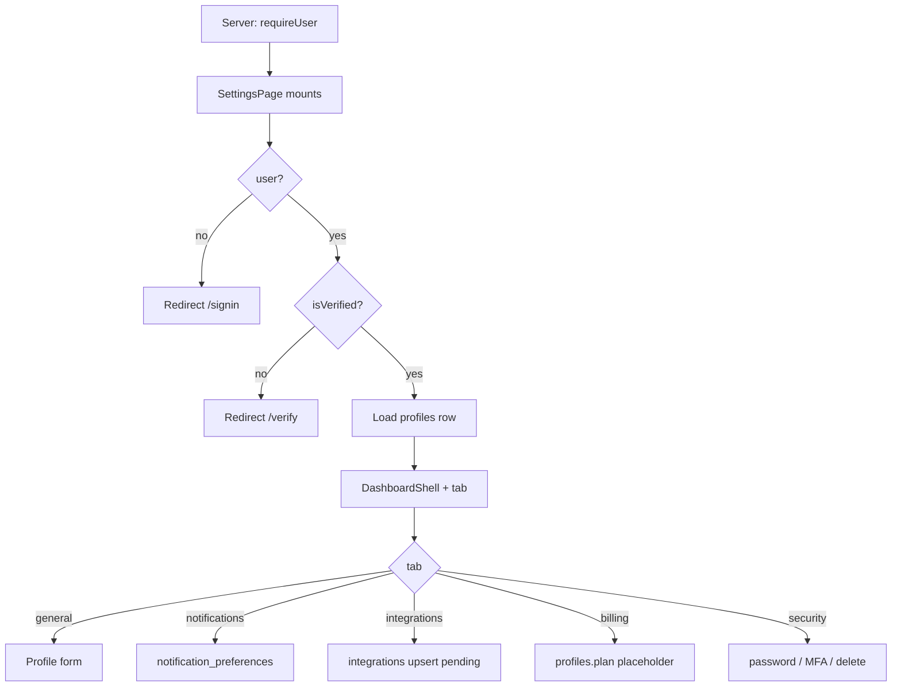

# Settings Page (`/app/settings`)

Reference for all components, conditions, and edge cases on Settings (`/app/settings`) and the standalone password route (`/app/settings/password`). Includes a [UI / API / DB gap analysis](#gaps-ui--api--db-and-recommended-solutions).

**Jump to:** [route](#route-structure) · [page flow](#high-level-page-flow) · [general](#general-tab) · [notifications](#notifications-tab) · [integrations](#integrations-tab) · [billing](#billing-tab) · [security](#security-tab) · [password page](#password-page-appsettingspassword) · [gaps](#gaps-ui--api--db-and-recommended-solutions)

**Source files:**

- Route entry: `src/app/app/(shell)/settings/page.tsx`
- Feature: `src/features/settings/settings-page.tsx`
- Password route: `src/app/app/(shell)/settings/password/page.tsx`
- Password feature: `src/features/settings/password-page.tsx`
- Client BFF helpers: `src/lib/client/security-api.ts`
- BFF: `src/app/api/account/delete/route.ts`, `src/app/api/account/password-changed-email/route.ts`
- Service: `src/lib/server/security-service.ts`
- Plans: `src/lib/plans.ts`
- Related: [branches-page.md](branches-page.md) (plan limits), [dashboard-page.md](dashboard-page.md) (avatar, notifications bell)

---

## Route structure

```tsx
// src/app/app/(shell)/settings/page.tsx
"use client";
import SettingsPage from "@/features/settings/settings-page";
export default function Page() {
  return <SettingsPage />;
}
```

Tabs are **React state**, not URL (`general` default). Deep-linking to Notifications is not supported.

`/app/settings/password` is a separate full-page form (no `DashboardShell`). Legacy `/change-password` maps here.

Shell still runs `requireUser()`. Settings **does not** check `onboarding_completed` (unlike Dashboard / Customers / Loyalty / Branches).

---

## High-level page flow



---

## `SettingsPage` — root (General)

### Profile fields loaded

`full_name, email, phone, business_name, business_category, business_type, industry, website, currency, avatar_url`

Email falls back to `user.email`. Email input is **disabled** and **not** included in save payload (Auth email change is a different flow).

### Label vs column mismatch

| UI label | Writes |
|----------|--------|
| Business Type | `business_category` |
| Industry | `business_type` |

`industry` is loaded into `ProfileRow` but **has no input**. Save sends `industry: form.industry` (stale from DB).

### Save

`profiles.update` where `id = user.id`. Dirty check is JSON stringify of the form vs `initial`. Cancel restores `initial`.

### Avatar

Upload to Storage bucket `avatars` at `{userId}/avatar-{ts}.{ext}` (image, ≤ 5 MB). Then **signed URL, 365 days**. That URL is stored on `profiles.avatar_url` and shown in `DashboardShell`.

**Remove** only clears `form.avatar_url` until Save — does not delete the storage object. After 365 days the header avatar breaks unless re-uploaded.

---

## Notifications tab

Loads `notification_preferences` where `id = userId` (1:1 with `profiles`). Missing row → UI defaults (not the same as DB defaults).

Each toggle `upsert`s the full prefs object.

| Key | UI group |
|-----|----------|
| `new_customer_joined` | Email |
| `reward_earned` | Email |
| `reward_redeemed` | Email |
| `campaign_created` | Email |
| `branch_added` | Email |
| `weekly_summary` | Weekly reports |
| `monthly_report` | Monthly reports |

**What actually respects these flags**

| Event | In-app `notifications` | Email | Reads pref? |
|-------|------------------------|-------|-------------|
| Branch added | Yes (`notifyBranchAdded`) | BFF does not enqueue | **No** — `prefKey` sent but `/api/notifications/owner` ignores it |
| Campaign created | Yes | No | **No** |
| New customer / reward earned | Join-service owner notify (best-effort) | Reward email to **customer** | Owner prefs not consistently applied |
| Weekly / monthly | RPCs `send_weekly_summary_emails` / `send_monthly_report_emails` exist | Cron must call them | Pref columns exist for those RPCs |

Toggles can be saved and still have **no effect** on in-app inserts.

---

## Integrations tab

Catalog (UI only until credentials exist):

| Category | Providers |
|----------|-----------|
| POS | Square, Clover, Toast, Lightspeed, Shopify POS |
| Marketing | Mailchimp, Klaviyo |
| Communication | Twilio (SMS) |
| QR & Wallet | Apple Wallet, Google Wallet |

Toggle **does not connect**. It upserts `integrations` (`owner_id, provider, status`) flipping `pending` ↔ `not_configured`. Modal: “not configured… recorded your interest.” Status `connected` is never set by this UI.

No OAuth, no secrets, no POS ingest. Needed later for `orders` / Analytics revenue.

---

## Billing tab

Reads `profiles.plan`. Cards for starter / growth / premium (`PLAN_PRICES` 99 / 299 / 499, limits from `src/lib/plans.ts`).

**Switch plan** writes `profiles.plan` directly. Confirm copy: “placeholder until real billing is connected — no payment will be charged.” Toast repeats that.

This is what Branches uses for `PLAN_LIMITS`. An owner can set Premium with no payment.

No invoices, no Stripe customer id, no webhook, no seat/contact enforcement beyond the Branches Add button.

---

## Security tab

Three cards on the settings page (password can also be changed on `/app/settings/password`).

### Change password (in Settings)

1. `signInWithPassword` with current password (re-auth)
2. `auth.updateUser({ password })`
3. `POST /api/account/password-changed-email` → `enqueue_email` transactional

Does **not** navigate away. Strength via `passwordFeedback`.

### 2FA (`TwoFactorCard`)

Supabase `auth.mfa`: `listFactors` → `enroll({ factorType: "totp" })` → QR + secret → `challenge` + `verify`. Disable `unenroll`s all TOTP factors.

This is **real** Auth MFA, not a stub. Completeness depends on Supabase project MFA being enabled. Login challenge UX on `/auth/sign-in` must also handle AAL2 (verify separately).

### Delete account

Confirm by typing `business_name` or `"DELETE"`. `POST /api/account/delete` → `auth.admin.deleteUser`. Then client `signOut`.

Cascade of `profiles` / programs / customers depends on DB FKs `ON DELETE`. Service does not explicitly wipe storage (`avatars`, `qr-branding`) or email queue rows.

---

## Password page (`/app/settings/password`)

Standalone layout (logo, no sidebar). Same re-auth + `updatePassword` pattern. On success, redirects to `/` after 1.5s.

**Does not** call `sendPasswordChangedEmail` (only the Settings Security card does). Wrapped in `ProtectedRoute` in the feature file; Next shell still `requireUser()`.

---

## Gaps — UI / API / DB and recommended solutions

Indexed backlog + ownership: [gaps-and-solutions.md](gaps-and-solutions.md) · contracts: [data-contract.md](../backend/data-contract.md) · [api-contract.md](../backend/api-contract.md) · [remediation-roadmap.md](../backend/remediation-roadmap.md) · [ADR-014](../architecture/decisions/ADR-014-product-data-ownership.md).

| G-ID | Widget | UI gap | API gap | DB gap | Recommended fix |
|------|--------|--------|---------|--------|-----------------|
| [G-16](gaps-and-solutions.md#g-16--avatar-signed-urls-expire) | **Avatar URL** | Signed URL expires | — | Private bucket + stored token | Public bucket or path + sign on read |
| [G-24](gaps-and-solutions.md#g-24--settings-field-labels-vs-columns) | **Business Type / Industry labels** | Swapped vs columns | — | Columns exist | Align labels |
| — | **Email change** | Disabled | No change-email BFF | Auth identities | Supabase email-change + messaging template |
| [G-15](gaps-and-solutions.md#g-15--notification-preferences-are-mostly-cosmetic) | **Notification prefs** | Toggles save | Owner BFF ignores `prefKey` | Prefs table OK | Gate insert + email; cron reports |
| [G-19](gaps-and-solutions.md#g-19--integrations-never-connect) | **Integrations** | Pending ≠ connected | No OAuth/BFF | `metadata` unused | Per-provider connect; POS → `orders` |
| [G-07](gaps-and-solutions.md#g-07--plan-limits-are-ui-only-billing-is-a-placeholder) | **Billing** | Free plan switch | No Stripe | `profiles.plan` only | Checkout + webhook |
| [G-07](gaps-and-solutions.md#g-07--plan-limits-are-ui-only-billing-is-a-placeholder) / [G-32](gaps-and-solutions.md#g-32--contact--admin-plan-limits-unused) | **Plan vs Branches** | Limits UI-only | Direct `branches.insert` | No cap | Server enforce |
| [G-27](gaps-and-solutions.md#g-27--delete-account-cleanup) | **Delete account** | Auth user deleted | No storage cleanup | FK cascade TBD | Cascades + buckets + suppress |
| [G-25](gaps-and-solutions.md#g-25--two-password-uis) | **Password page vs Security** | Duplicate UX | Two paths | — | One flow; always enqueue mail |
| [G-23](gaps-and-solutions.md#g-23--settings-tabs-not-in-the-url-onboarding-not-gated) | **Tabs not in URL** | Refresh loses tab | — | — | `?tab=` |
| [G-23](gaps-and-solutions.md#g-23--settings-tabs-not-in-the-url-onboarding-not-gated) | **Onboarding skip** | Reachable mid-onboarding | — | — | Same onboarding redirect |
| [G-26](gaps-and-solutions.md#g-26--mfa-enroll-vs-login-challenge) | **MFA at login** | Enroll works | Sign-in may not challenge | Auth | Handle `mfa_challenge` |

---

## Known limitations

1. Billing is a DB field, not a subscription
2. Integrations record interest only
3. Notification switches are mostly cosmetic for in-app toasts
4. Avatar signed URLs expire
5. Field labels vs `profiles` columns are inconsistent
6. Two password UIs; only one sends the email
7. No team-members UI despite page subtitle mentioning “team members” — **DECIDED:** add admin/staff (G-34); **account `active`/`inactive` for staff and customer**; filters role / email / name / phone ([account status](11-authentication-migration.md#account-active--inactive-decided), [G-36](gaps-and-solutions.md#g-36--no-admin-account-list-or-activeinactive-for-staffcustomer))

---

## Component tree

```
Page (settings/page.tsx)
└── SettingsPage
    └── DashboardShell
        ├── Tab bar (General | Notifications | Integrations | Billing | Security)
        ├── General: avatar, currency, basic info, Save
        ├── NotificationsTab
        ├── IntegrationsTab (+ pending modal)
        ├── BillingTab (+ switch confirm)
        └── SecurityTab
            ├── ChangePasswordCard
            ├── TwoFactorCard
            └── DeleteAccountCard

Page (settings/password/page.tsx)
└── ChangePasswordPage (no shell)
```
