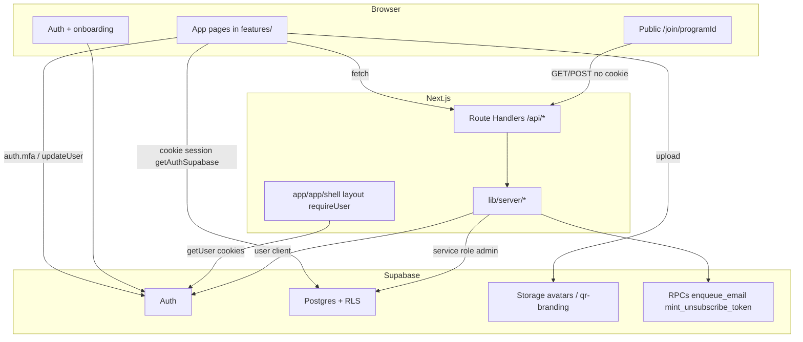
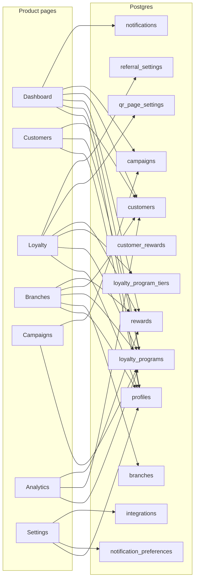
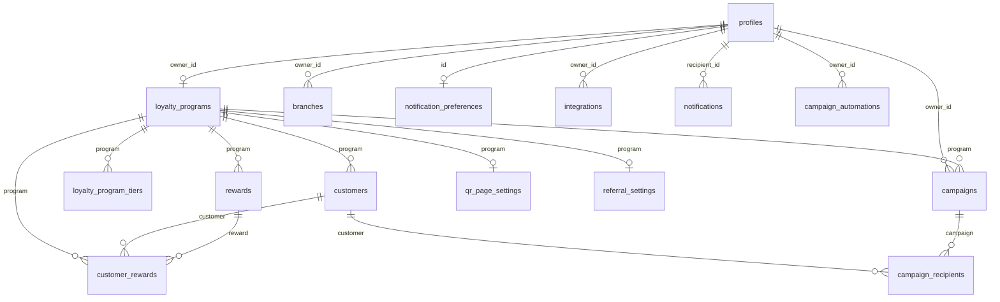
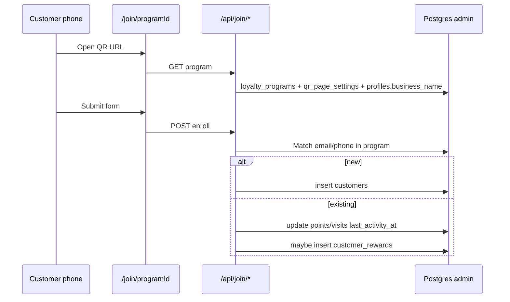
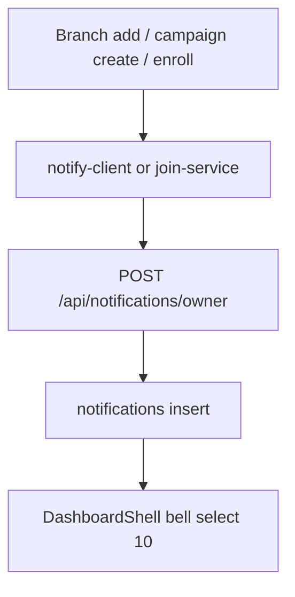

# System architecture — how the app communicates

How authenticated product pages, public join, Next.js BFF routes, Supabase (Auth + Postgres + Storage + RPCs), and the email queue talk to each other **today**. Page-level UI is in the per-route docs. Gaps and the recommended data model are in [gaps-and-solutions.md](gaps-and-solutions.md); target schema/API for backend remediation: [../backend/README.md](../backend/README.md) ([ADR-014](../architecture/decisions/ADR-014-product-data-ownership.md)).

**Jump to:** [layers](#layers) · [auth](#auth-flow) · [who-talks-to-what](#who-talks-to-what) · [api inventory](#api-route-inventory) · [direct supabase](#client-side-supabase-inventory) · [er](#database-relationships) · [join](#public-join-and-check-in) · [email](#email-pipeline) · [notifications](#notifications) · [plans](#plans-and-limits)

**Related:** [ADR-005](../architecture/decisions/ADR-005-authentication.md), [ADR-006](../architecture/decisions/ADR-006-server-boundaries.md), [ADR-011](../architecture/decisions/ADR-011-rls-storage-strategy.md), [ADR-012](../architecture/decisions/ADR-012-public-enrollment-rate-limiting.md), [ADR-013](../architecture/decisions/ADR-013-campaign-messaging-runtime.md), [15-server-function-mapping.md](15-server-function-mapping.md), generated types `src/integrations/supabase/types.ts`.

---

## Layers



**Rule of thumb today:** most owner CRUD is **browser → Supabase (anon key + user JWT + RLS)**. Next BFF is used when the browser must not hold the service role: public enroll, campaign send, account delete, password-changed email, owner notification insert, email webhooks/queue.

ADR-006 still says the **existing backend remains the primary API**. These BFF routes are the residual mediation layer from the TanStack server functions ([15-server-function-mapping.md](15-server-function-mapping.md)).

---

## Auth flow

```mermaid
flowchart TD
  Req[Request /app/*] --> Proxy[proxy.ts session refresh]
  Proxy --> Layout[requireUser getCurrentUser]
  Layout -->|no user| SignIn[/auth/sign-in]
  Layout -->|user| RSC[Render children]
  RSC --> Client[Client page useAuth]
  Client -->|!user| SignIn2[/signin mapped]
  Client -->|!isVerified| Verify[/verify]
  Client -->|!onboarding_completed| Onboard[/onboarding]
  Client -->|ok| Data[Supabase selects]
```

| Layer | Mechanism |
|-------|-----------|
| Proxy | Cookie refresh (D-28 still documented until proven) |
| Server | `requireUser()` in `src/app/app/(shell)/layout.tsx` |
| Client | `useAuth()`: session, `email_confirmed_at` → `isVerified` |
| Onboarding | Each feature page (except Settings) reads `profiles.onboarding_completed` |
| Authorization | RLS on tables. Locked roles: **`admin`** (`/app`), **`staff`** (`/app`, same permissions as `admin` for now), **`customer`** (customer login, not `/app`). BFF uses `getUser()` then **admin** client for writes that bypass RLS. [locked role matrix](11-authentication-migration.md#locked-role-matrix) |

Settings skips the onboarding redirect. Branch detail redirects unauthenticated users to `/auth` instead of `/signin`.

---

## Who talks to what



Solid lines are **direct client reads/writes**. Campaigns **send** additionally hits `/api/campaigns/send`. Branches add hits `/api/notifications/owner`. Settings security hits `/api/account/*`.

---

## API route inventory

| Method | Path | Auth | Service | Purpose |
|--------|------|------|---------|---------|
| POST | `/api/campaigns/send` | Session | `campaigns-service` | Fan-out send (should be a worker — ADR-013) |
| GET | `/api/join/program` | Public | `join-service` | Program + QR settings for join page |
| POST | `/api/join/enroll` | Public + IP rate limit | `join-service` | Enroll or check-in |
| POST | `/api/notifications/owner` | Session | inline admin insert | In-app notification row |
| POST | `/api/account/delete` | Session | `security-service` | Auth admin `deleteUser` |
| POST | `/api/account/password-changed-email` | Session | `security-service` | `enqueue_email` |
| POST | `/api/email/auth/webhook` | Provider | messaging | Auth email webhook |
| GET | `/api/email/auth/preview` | Secret | messaging | Template preview |
| POST | `/api/email/queue/process` | Scheduler | queue | Drain `enqueue_email` (should move off Next) |

**There is no** `/api/customers`, `/api/branches`, `/api/loyalty`, `/api/analytics`, `/api/settings`.

Client helpers: `src/lib/client/campaigns-api.ts`, `join-api.ts`, `security-api.ts`. `src/lib/client/index.ts` is empty (ADR-007 placeholder).

---

## Client-side Supabase inventory

| Page | Tables (and storage) |
|------|----------------------|
| Dashboard | `profiles`, `loyalty_programs`, existence on `rewards` / `customers` / `campaigns`; SetupComplete loads full `customers`, `rewards`, `campaigns` |
| DashboardShell | `profiles.avatar_url`, `notifications` |
| Customers list/detail | `profiles`, `loyalty_programs`, `customers` CRUD |
| Loyalty | `loyalty_programs` upsert, `loyalty_program_tiers`, `rewards`, `referral_settings`, `qr_page_settings`, storage `qr-branding` |
| Branches list/detail | `profiles`, `branches` CRUD, program-wide `customers` + `rewards` |
| Campaigns | `campaigns` CRUD + send BFF; `campaign_automations` |
| Analytics | `customers`, `rewards` (aggregates in the browser) |
| Settings | `profiles`, storage `avatars`, `notification_preferences`, `integrations`, `auth.mfa.*` |
| Join (via BFF) | admin: `loyalty_programs`, `profiles`, `qr_page_settings`, `customers`, `customer_rewards`, `rewards` |

---

## Database relationships



### Ownership vs program

- **Owner-scoped:** `profiles`, `branches`, `integrations`, `notifications`, `campaign_automations`
- **Program-scoped:** customers, rewards, tiers, QR, referrals, campaigns, `customer_rewards`
- **Not linked:** `branches` ↛ `customers` / `rewards` / `campaigns` (no `branch_id`)

### Unique / enum

- One `loyalty_programs` row per `owner_id`
- `loyalty_program_type`: `points` \| `visit` \| `tier`
- `customers.tier` is **text**, not FK to `loyalty_program_tiers`

### Tables with no product writer (or unused by UI)

Target schema for these gaps: [data-contract.md](../backend/data-contract.md). Ownership: [ADR-014](../architecture/decisions/ADR-014-product-data-ownership.md).

| Table / column | Notes | G-ID |
|----------------|--------|------|
| Scan / visit event log | **Does not exist** | [G-01](gaps-and-solutions.md#g-01--qr-scan-tracking-is-always-0), [G-02](gaps-and-solutions.md#g-02--visit--stamp-progress-is-always-empty) |
| `orders` / points ledger | **Does not exist** | [G-06](gaps-and-solutions.md#g-06--revenue-is-a-dead-column-everywhere) |
| `referrals` events | **Does not exist** — only `referral_settings` | [G-14](gaps-and-solutions.md#g-14--referrals-settings-without-attribution) |
| `customers.tier` | Column exists; enroll/check-in never set it | [G-03](gaps-and-solutions.md#g-03--customer-tier-is-never-assigned) |
| `campaigns.revenue_cents`, `opened_count` | Columns exist; send path does not maintain them | [G-06](gaps-and-solutions.md#g-06--revenue-is-a-dead-column-everywhere), [G-09](gaps-and-solutions.md#g-09--campaign-send--opens--automations) |
| `integrations.status=connected` | UI only writes `pending` | [G-19](gaps-and-solutions.md#g-19--integrations-never-connect) |
| `branch_id` on customers / events / rewards / orders | **Missing** — branches unlinked from loyalty facts | [G-04](gaps-and-solutions.md#g-04--branch-metrics-are-even-splits--em-dashes) |

Email infra (not page-owned): `email_send_log`, `email_send_state`, `email_unsubscribe_tokens`, `suppressed_emails`.

---

## Public join and check-in



No scan row is written on GET. No `branch_id`. Rate limit is an in-memory `Map` per instance (ADR-012: replace with Redis/Upstash).

**Intended (DECIDED):** shop customers will register/login (role **customer**) so data is stored on an account and KPIs are calculated from activity — not only owner **Add Customer**. Join remains a public capture path; customer session is not `admin` / `staff` `/app` auth. [G-33](gaps-and-solutions.md#g-33--shop-customers-have-no-registerlogin-kpis-rely-on-owner-typed-rows).

---

## Email pipeline

```mermaid
flowchart LR
  App[BFF or join-service] --> Mint[mint_unsubscribe_token]
  Mint --> Enq[enqueue_email RPC]
  Enq --> Q[queue transactional_emails]
  Q --> Proc[/api/email/queue/process]
  Proc --> Provider[Transport adapter]
  Provider --> Log[email_send_log]
```

Used today for password-changed and some join/reward mail. Campaign send currently builds HTML in the send service rather than only messaging contracts ([campaigns-page.md](campaigns-page.md), ADR-013). Queue process inside Next is a **known duration risk**.

---

## Notifications



`notification_preferences` is **not** consulted by the owner BFF. Bell updates `read` client-side. No pagination beyond 10. Email fields on the POST body are unused.

---

## Plans and limits

Defined in `src/lib/plans.ts`:

| Plan | Branches | Admins (unused in UI) | Contacts (unused in UI) | Price (display) |
|------|----------|----------------------|-------------------------|-----------------|
| starter | 1 | 1 | 1_000 | 99 |
| growth | 3 | 3 | 10_000 | 299 |
| premium | 8 | 8 | 50_000 | 499 |

`profiles.plan` is the source of truth. Settings Billing **writes it without payment**. Branches hides Add at `PLAN_LIMITS[plan]`. Contact/admin limits are **not** enforced on `customers` insert.

---

## Shared chrome

Every `/app/*` page except the password screen wraps `DashboardShell`: sidebar (Main + Growth + Settings), mobile drawer, header search (**unwired**), notifications bell, avatar (`profiles.avatar_url`).

Path mapping: `src/lib/navigation/paths.ts` (`LEGACY_TO_APPROVED`). In-app `Link` / `navigate({ to: "/customers" })` resolve to `/app/customers` under Next.

---

## What “the system” cannot do yet

Because there is no event/order graph, these UI regions cannot be truthful without new tables or writers (backend program — not Next migrations):

| Capability | Primary G-IDs |
|------------|---------------|
| QR scan counts, visit-frequency charts, live activity, peak hour | [G-01](gaps-and-solutions.md#g-01--qr-scan-tracking-is-always-0), [G-02](gaps-and-solutions.md#g-02--visit--stamp-progress-is-always-empty) |
| Per-branch performance and detail stats | [G-04](gaps-and-solutions.md#g-04--branch-metrics-are-even-splits--em-dashes) |
| Customer revenue column, LTV, Analytics Revenue tab | [G-06](gaps-and-solutions.md#g-06--revenue-is-a-dead-column-everywhere), [G-13](gaps-and-solutions.md#g-13--detail-pages-are-shells) |
| Auto-assigned tiers and “members close to upgrading” | [G-03](gaps-and-solutions.md#g-03--customer-tier-is-never-assigned) |
| Referral leaderboards | [G-14](gaps-and-solutions.md#g-14--referrals-settings-without-attribution) |
| Month-over-month deltas and “This month” filters | Phase 7 in [remediation-roadmap.md](../backend/remediation-roadmap.md) |

Full backlog: [gaps-and-solutions.md](gaps-and-solutions.md). Target schema/API: [data-contract.md](../backend/data-contract.md), [api-contract.md](../backend/api-contract.md).
