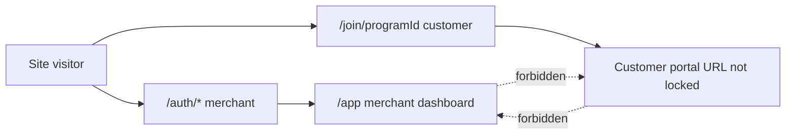
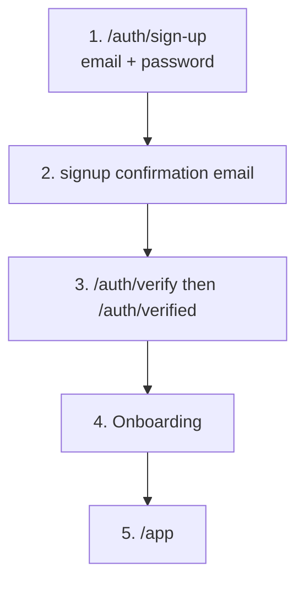
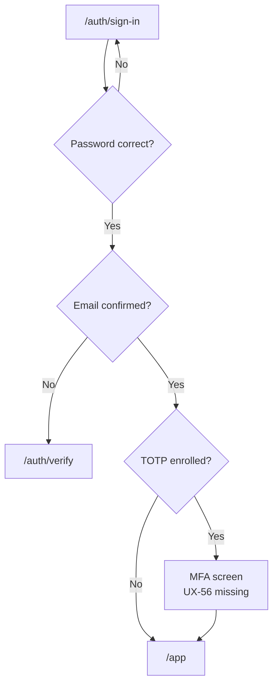
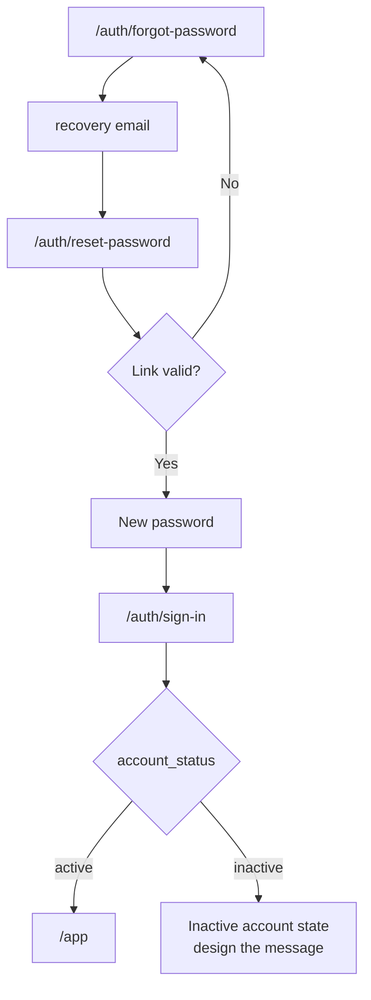
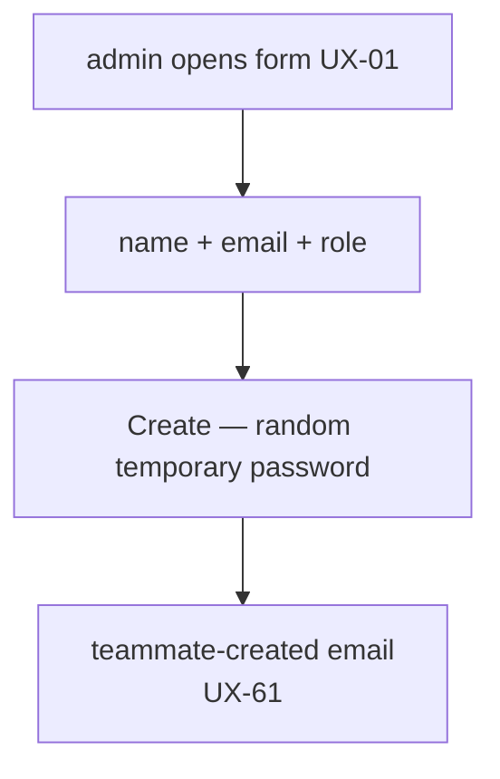
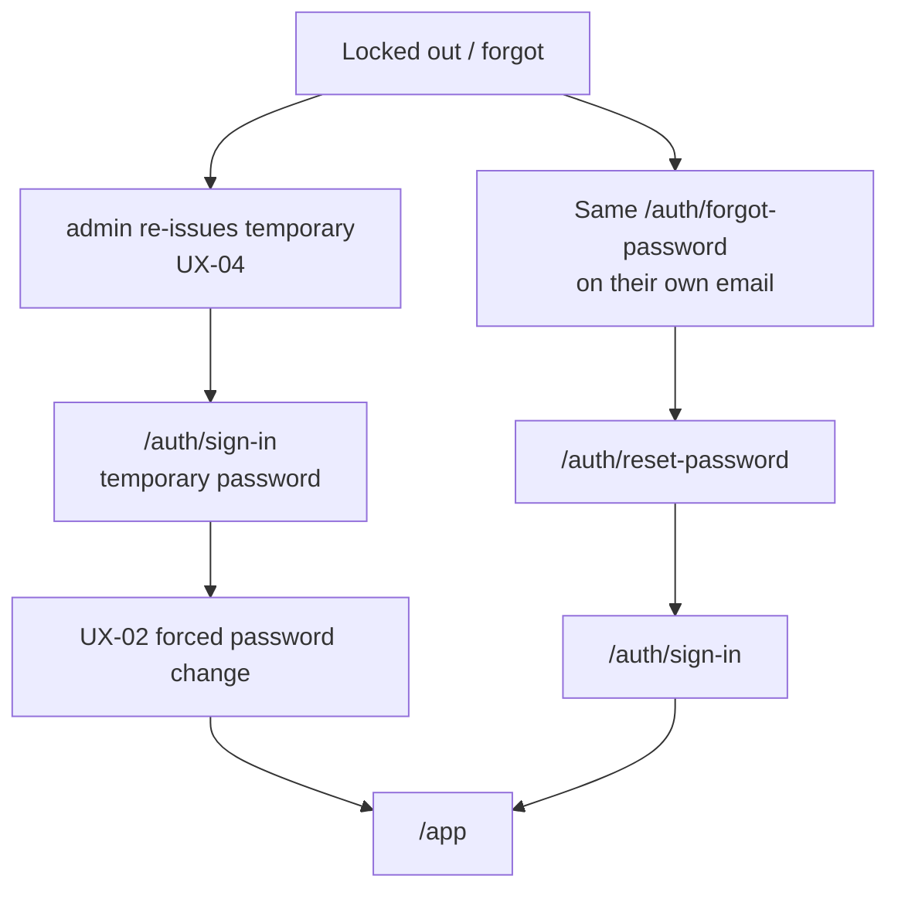
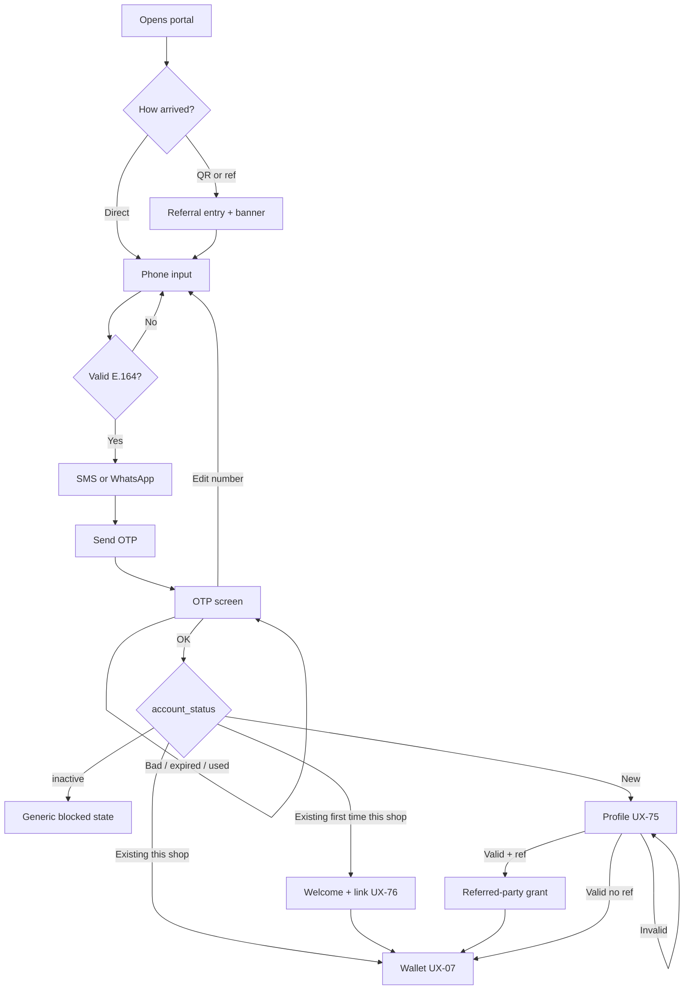
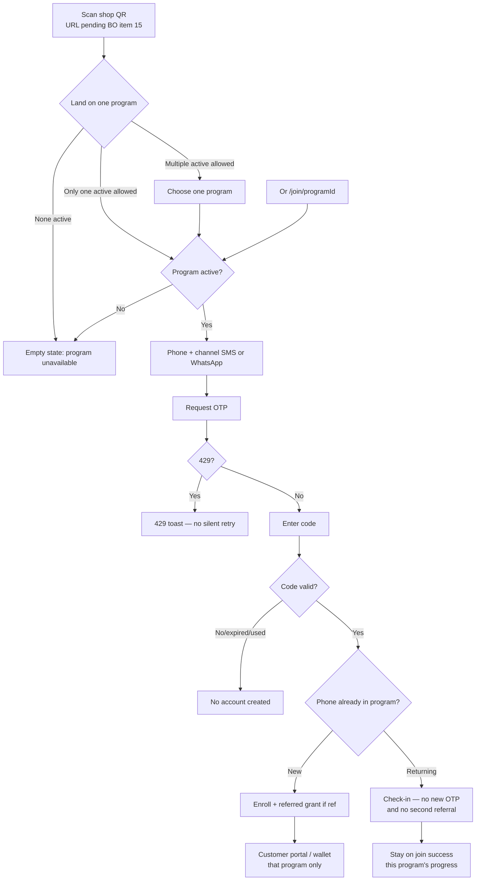
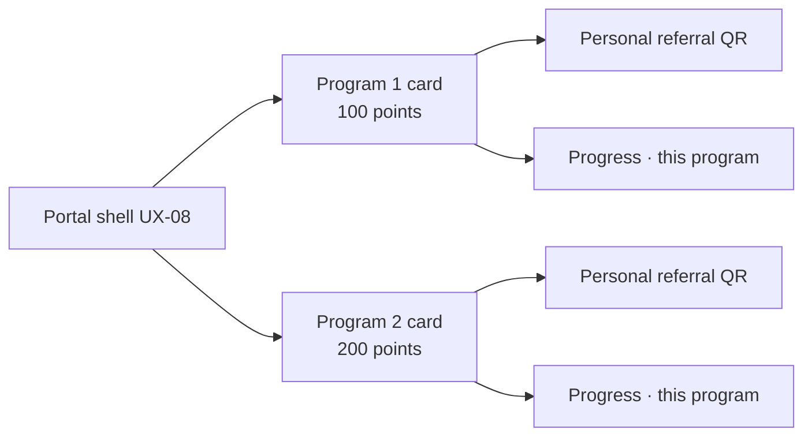

# Login / Register — UI brief

**Date:** 2026-08-16
**Audience:** UI/UX team
**Purpose:** List of missing screens + flow written as steps and diagrams. Send this file straight to design. Customer portal cases: [customer-portal-journey.md](./customer-portal-journey.md). Counter QR vs program membership: [counter-qr-and-program-membership.md](./counter-qr-and-program-membership.md).

**Locked constraints (do not redesign):**

- Same current visual identity: Figtree, navy `#0a152f`, yellow `#feb602` — [ADR-010](../architecture/decisions/ADR-010-style-and-template-parity.md)
- The customer **never has a password**. OTP is the register, login, and account-recovery mechanism
- The customer **must never** enter `/app` (merchant dashboard)
- The existing merchant screens (`/auth/sign-in` …) **already exist** — the new work below is not a redesign of them

Full source for all UI requests (not just auth): [ui-ux-team-requests.md](./ui-ux-team-requests.md).
Product lock: [11-authentication-migration.md](../frontend/11-authentication-migration.md).
Customer case map (every portal outcome): [customer-portal-journey.md](./customer-portal-journey.md).

---

## 1. What's missing and needs to go to UI?

There are **two separate levels**. Don't mix the screens.

| Who                           | Login today                                         | What's missing for design                                     |
| ----------------------------- | --------------------------------------------------- | ------------------------------------------------------------- |
| **Merchant** `admin`          | Exists: sign-up / sign-in / verify / forgot / reset | Team screens + first login + MFA challenge                    |
| **Staff** `staff`             | No account at all yet                               | Same flow as merchant + forced password change on first login |
| **Store customer** `customer` | No login yet                                        | **Everything:** OTP register/login + portal + wallet          |

### 1.1 Send these first (P0 — auth)

| ID                                                                                                                         | Screen                                                              | Who            | Status                                                                                  |
| -------------------------------------------------------------------------------------------------------------------------- | ------------------------------------------------------------------- | -------------- | --------------------------------------------------------------------------------------- |
| [UX-05](./ui-ux-team-requests.md#ux-05--customer-register-passwordless-otp)                                                | Customer registration (OTP: SMS or WhatsApp)                        | Customer       | **No UI**                                                                               |
| [UX-06](./ui-ux-team-requests.md#ux-06--customer-login--lost-access-new-otp)                                               | Customer login / lost access = new OTP (not forgot-password)        | Customer       | **No UI**                                                                               |
| [UX-08](./ui-ux-team-requests.md#ux-08--customer-portal-shell)                                                             | Portal shell after OTP (nav, sign-out, not `/app`'s look)           | Customer       | **No UI** — the URL is still not locked: propose a path                                 |
| [UX-07](./ui-ux-team-requests.md#ux-07--customer-wallet-per-program)                                                       | Wallet card **per program** (not one combined points total)         | Customer       | **No UI**                                                                               |
| [UX-09](./ui-ux-team-requests.md#ux-09--join-page-otp--referral-context)                                                   | `/join/[programId]` page: OTP step + referral context `?ref=`       | Customer       | Page exists **without** OTP                                                             |
| [UX-75](./ui-ux-team-requests.md#ux-75--customer-profile-setup-name-email-dob)                                              | After OTP: profile setup (name, email, DOB)                         | Customer       | **No UI** — from the portal case map                                                    |
| [UX-76](./ui-ux-team-requests.md#ux-76--first-shop-welcome--link-program)                                                   | Existing customer, first time in this shop: welcome + link program  | Customer       | **No UI** — from the portal case map                                                    |
| [UX-01](./ui-ux-team-requests.md#ux-01--add-teammate-form-admin-creates-admin-or-staff)                                    | Add-teammate form (name, email, role `admin`\|`staff`)              | Merchant       | **No UI**                                                                               |
| [UX-02](./ui-ux-team-requests.md#ux-02--first-login-force-password-change)                                                 | First login: must change temporary password before `/app`           | Merchant/Staff | **No UI**                                                                               |
| [UX-03](./ui-ux-team-requests.md#ux-03--account-list--activeinactive)                                                      | One page, two tabs (Team = admin/staff, Customers) + active/inactive + filters (role, email, name, phone) | Merchant       | **No UI**                                                                               |
| [UX-56](./ui-ux-team-requests.md) / [UX-19](./ui-ux-team-requests.md#ux-19--phase-1-exclusions-social-auth-2fa-pos-wallet) | MFA challenge after password on `/auth/sign-in`                     | Merchant       | Enroll exists; the login screen is **missing**. Decide: 2FA in Phase 1 or hide the card |
| [UX-61](./ui-ux-team-requests.md#ux-61--teammate-created-email)                                                            | "Added to store" email + email + temporary password                 | Copy           | **New** — don't touch `invite.tsx`                                                      |
| [UX-62](./ui-ux-team-requests.md#ux-62--otp-sms--whatsapp-text)                                                            | OTP message text (SMS / WhatsApp)                                   | Copy           | **New** — don't hardcode a fixed minutes figure (TTL is still not locked)               |

### 1.2 Next (P1 — same auth family)

| ID                                                                         | Screen                                                           |
| -------------------------------------------------------------------------- | ---------------------------------------------------------------- |
| [UX-04](./ui-ux-team-requests.md#ux-04--admin-re-issue-temporary-password) | Admin re-issues a temporary password for a locked-out teammate   |
| [UX-68](./ui-ux-team-requests.md)                                          | OTP picker states + 429 toast                                    |
| [UX-70](./ui-ux-team-requests.md)                                          | active / inactive chips (not the same as the member's `at_risk`) |
| [UX-74](./ui-ux-team-requests.md)                                          | MFA challenge screen (if 2FA is in Phase 1)                      |

### 1.3 Don't design these as part of the login flow

- Google / Facebook / Apple buttons on `/auth/*` — **not locked** for Phase 1 ([UX-19](./ui-ux-team-requests.md#ux-19--phase-1-exclusions-social-auth-2fa-pos-wallet)). Wait for a product decision before drawing the buttons.
- Forgot-password for the customer — **forbidden**. The customer has no password.
- Customer entering `/app` or `/auth/reset-password` — **forbidden**.

The rest of the product requests (wallet non-auth items, POS, campaigns, billing…) are in [ui-ux-team-requests.md](./ui-ux-team-requests.md) — not part of this brief.

---

## 2. Role map (before any wireframe)

| Role       | Surface                                    | Login method                                                                             |
| ---------- | ------------------------------------------ | ---------------------------------------------------------------------------------------- |
| `admin`    | `/app`                                     | Email + password (+ MFA if enrolled)                                                     |
| `staff`    | `/app` (same permissions as admin for now) | Email + temporary password → forced change → afterwards same forgot-password as merchant |
| `customer` | Separate portal                            | SMS or WhatsApp OTP only. No password                                                    |

---

## 3. Merchant `admin` flow — exists, do not redesign

These screens are **shipped**. UI should only review the missing states (MFA challenge, timeout return).

### 3.1 New merchant registration

**Steps**

1. Opens `/auth/sign-up` → email + password.
2. Account is created → confirmation email (`signup`).
3. Clicks the link → `/auth/verify` then `/auth/verified`.
4. Completes onboarding (name, business, plan).
5. Enters `/app`.

**Note for product/QA, not design:** email sending is currently a stub — the design should assume the email arrives.

### 3.2 Merchant login

**Steps**

1. `/auth/sign-in` → correct email + password.
2. If email is unconfirmed → redirected to `/verify` (currently gated client-side).
3. If TOTP is enrolled: **should** show a 6-digit code screen before `/app` — this screen is **missing** (UX-56). Don't assume the enroll in Settings is enough.
4. Successful login → `/app`.
5. Protected link while logged out → redirected back to `/auth/sign-in`.

### 3.3 Forgot password (merchant / staff after account is created)

**Steps**

1. `/auth/forgot-password` → enters email → **always** shows a "check your email" screen (without revealing whether the email exists).
2. `recovery` email → button opens `/auth/reset-password`.
3. Valid link → new password (minimum 8 chars, must match).
4. Broken/expired link → message + link to request a new one.
5. Success → `/auth/sign-in` (not an automatic login into `/app`).
6. If the account is `inactive` after the reset → `/app` is forbidden (once G-36 ships).

---

## 4. Staff `staff` flow — all new design

These accounts **don't exist in the product today**. The role is locked; the UI isn't.

### 4.1 Admin adds a teammate

**Steps**

1. `admin` opens the add-teammate form (path not locked — likely Settings / team). **UX-01**
2. Enters: **name + email + role** (`admin` or `staff`).
3. Clicks Create — the admin **does not choose** the password. The backend generates a random temporary password.
4. The teammate receives a new email (not the current `invite` template): added to store + email + temporary password. **UX-61 / UX-73**

### 4.2 Teammate's first login

**Steps**

1. Opens `/auth/sign-in` with the temporary password.
2. **Must** change the password before reaching `/app`. No skipping (back button, direct URL). **UX-02**
3. After the change: normal login. The subsequent forgot-password flow does **not** show this forced screen again.
4. Extra path if locked out: admin re-issues a temporary password (same email facts). **UX-04** — not another forgot screen.

---

## 5. Customer `customer` flow — all new design (P0)

No password. No `/auth/forgot-password`. After OTP → **customer portal**, not `/app`.

Portal paths are **not locked** — design should propose a URL family for product to adopt.

**Working journey (2026-08-16):** register, login, and lost access are **one OTP funnel**. Full case matrix (including errors the diagrams below omit): [customer-portal-journey.md](./customer-portal-journey.md).

There are still **two journeys**. Do not draw them as one screen sequence:

| Journey | OTP |
| ------- | --- |
| **A. Opens portal** (direct, personal QR, `?ref=`) | Always |
| **B. In-store shop QR** (URL **pending item 15**; then one program) | New phone: OTP. Returning phone **in that program**: check-in, **no** new OTP |

`G-33` / `G-36` on the case diagram are **gap IDs**, not Figma frame names. Wallet = UX-07. Inactive account = UX-06 blocked state (`inactive`, generic copy).

### 5.1 Portal open — unified OTP (journey A)

Covers direct entry **and** scanned QR / referral link. Unknown phone is **not** announced before OTP (avoids enumeration): verify phone, then either wallet, first-shop link, or profile setup.

**Steps**

1. Direct → **Phone Input**. QR / `?ref=` → **Referral Entry** + **referral banner**, then the same phone step.
2. Invalid phone format (not E.164) → UI error, stay on phone.
3. Chooses **SMS** or **WhatsApp**. **No password field.**
4. Requests a code. Draw a resend timer (diagram uses 60s — **placeholder**; TTL is not locked). **UX-68**
5. If **429**: toast, button disabled, **no silent retry**.
6. OTP screen: paste and `autocomplete="one-time-code"` allowed. **Edit number** returns to phone. Resend over cap → blocked wait (diagram uses 5 mins — **placeholder**).
7. Wrong / expired / already-used code → stay on OTP; **no** account created.
8. Correct code → branch on account:
   - **`inactive`** → blocked state, **generic** message (do not use “account suspended — contact support”; that enumerates). **UX-06** / G-36
   - **Existing**, already in this shop/program → wallet **UX-07**
   - **Existing**, first time in this shop → welcome + link program **UX-76**, then wallet
   - **New** → profile **name, email, DOB** **UX-75**. Invalid → highlight required fields. Valid + `?ref=` → **referred-party** reward only (referrer waits for first **paid** invoice), then wallet
9. **Never** `/app` or `/auth/reset-password`.

### 5.2 In-store join / check-in (journey B) — not the portal diagram

The `/join/[programId]` page exists (QR Experience branding is wired up). **Shop QR URL and whether multiple ACTIVE programs are allowed are pending Business Owner** ([counter QR §15](./counter-qr-and-program-membership.md#15-shop-qr--multiple-active-programs-pending)). Do not finalize a shop resolver or program picker until that decision. Missing today: OTP before a **new** member is created.

**Steps**

1. Scans the **shop** QR (URL pending item 15) **or** opens `/join/{programId}` (possibly with a personal invite `?ref=`).
2. Land on **one** `active` program. If only one active is allowed: Shop QR → `/join/{programId}`. If multiple active are allowed: Shop / Program selection → `/join/{programId}`. **Never** auto-join every live program. No `active` program → **no join**. Direct program URL: if `draft` or `disabled` → **no join**. Program QR stays valid only while `active`.
3. New phone: same OTP rules as §5.1 (channel, 429, no password). Existing account, first time in **this** program → create this membership only.
4. Correct code **before** a `customers` row, referral, or reward is created **in that program**.
5. If `?ref=` is valid: **referred** reward in the same transaction **for that program**. Referral never changes program scope. **Referrer** still waits for first paid invoice.
6. Returning scan (same phone **in this program**), even with `ref` = check-in, **not** another OTP and **not** another referral (no duplicate membership).

Returning check-in does **not** replace portal login. That member still uses §5.1 OTP when they open the portal later.

### 5.3 After login — wallet

**Locked per program card**

| Field             | Rule                                                                           |
| ----------------- | ------------------------------------------------------------------------------ |
| Program name      | From this program                                                              |
| Redeemable points | This program only. **Never** sum 100+200 = 300                                 |
| Expiry            | Single date if batches share the same day; otherwise amount + date groups      |
| Coupons           | `active` + their dates                                                         |
| Sharing           | Personal link + QR `/join/{programId}?ref={code}` — this is not the shop **counter** QR |
| **Reward progress** | This program only. Visit: `n / visits_required`. Points: spendable vs next unearned live catalog reward. Tier: current + remaining to next. Check-in success uses the same numbers. [customer-reward-progress.md](./customer-reward-progress.md) |

---

## 6. States that must be drawn in every OTP flow

Design the state, don't invent TTL/attempt numbers (still not locked in the product).

| State                              | Locked behavior                                                              |
| ---------------------------------- | ---------------------------------------------------------------------------- |
| Wrong OTP                          | No member / no session                                                       |
| Expired OTP                        | Same as above + request a new code                                           |
| OTP already used                   | Once-use — not a raw database error                                          |
| Invalid phone format               | Stay on phone input; E.164                                                   |
| Edit number                        | Back to phone; do not keep the old challenge as valid for the new number     |
| Resend cooldown / cap              | Blocked state (draw it; **don't** hardcode 60s / 5 min as product)           |
| 429                                | Toast + disable submit + no silent retry                                     |
| Send failure (503)                 | Generic "could not send code"                                                |
| Program not `active`               | No join (journey B)                                                          |
| `inactive` account                 | No session — **generic** copy, not "account suspended"                       |
| Double-click / retry after timeout | Same as OTP already used                                                     |
| Pasting the code                   | **Allowed** (don't block paste)                                              |

---

## 7. Suggested work order for design

1. Phase 1 decision: social buttons + 2FA shown or hidden (**UX-19**). Without this decision you'll be designing screens outside scope.
2. Customer P0 flow: UX-05, UX-06, UX-08, UX-07, UX-09, UX-75, UX-76 + OTP copy (**UX-62**). Use [customer-portal-journey.md](./customer-portal-journey.md) as the case list.
3. Team P0 flow: UX-01, UX-02, UX-03 + teammate email (**UX-61**).
4. MFA challenge on sign-in if 2FA is in Phase 1 (**UX-56 / UX-74**).

---

## 8. Not UI work — don't wait on fake data

Don't design a full customer dashboard or revenue figures. The backend is still missing: `visit_events`, `points_ledger`, customer session, `account_status` column. Until these ship: hide or show `"—"`.

Open product questions (don't guess in the mockup):

- Portal URL
- OTP TTL and attempt count (draw the state, not the number — the case diagram's 60s / 5 min are placeholders)
- Whether name / email / DOB on UX-75 are all **required** (diagram says yes; join fields are optional today)
- Whether `staff` can open the add-teammate form

Working answer (not a new ADR): registration and login are **one** OTP funnel ([customer-portal-journey.md](./customer-portal-journey.md)).

---

_This file is documentation for the UI team. It does not authorize code implementation or schema changes ([ADR-014](../architecture/decisions/ADR-014-product-data-ownership.md)). Existing merchant screens must not be redesigned ([ADR-010](../architecture/decisions/ADR-010-style-and-template-parity.md))._
