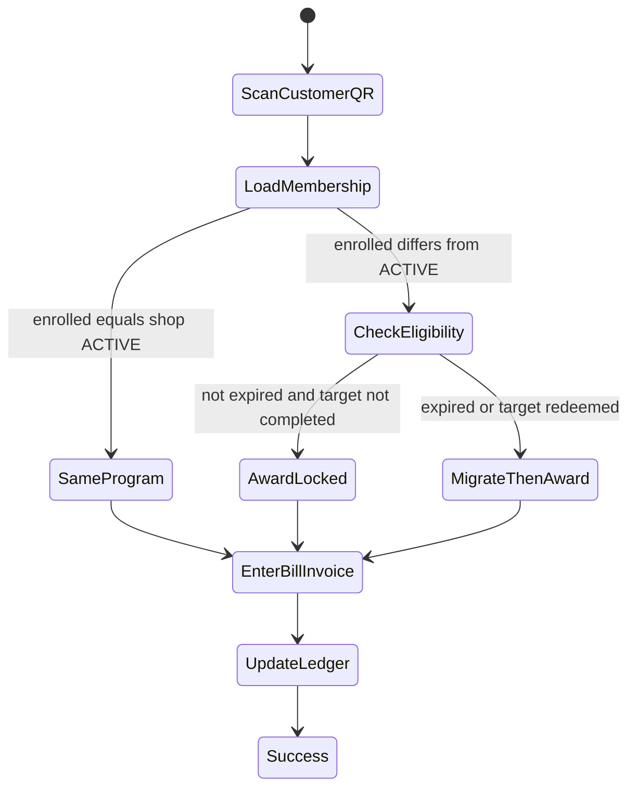

# Counter QR, membership, and POS check-in

**Date:** 2026-08-18  
**Status:** DECIDED — independent programs, one ACTIVE default, deferred POS migration (not shipped). **Supersedes** 2026-08-17 Shop-capability / “Shop QR always this Shop, no picker” as the join target. The QR still has **no picker**: it always resolves to the Shop’s **current ACTIVE program**.  
**Audience:** Product, UI/UX, QA, backend  
**Does not authorize** schema, APIs, or Next.js implementation ([ADR-014](../architecture/decisions/ADR-014-product-data-ownership.md), [ADR-016](../architecture/decisions/ADR-016-independent-programs.md)).

**Sources of truth:** [program-model.md](./program-model.md) · [loyalty-page.md](../frontend/loyalty-page.md) · [reward-redemption-flow.md](./reward-redemption-flow.md) · [customer-portal-journey.md](./customer-portal-journey.md)

---

## 1. QR architecture

### Counter / door QR

Identifies the Shop’s **current `ACTIVE` program**. No program picker. If there is no ACTIVE program → unavailable (same empty state as no live loyalty).

Exact URL is backend-owned (`/join/{programId}` today may keep working while that UUID is the ACTIVE row, or `/join/shop/{shopSlug}` that **resolves** to ACTIVE).

### Personal referral QR

```text
{activeProgramJoinUrl}?ref={code}
```

The referral code must never change Shop scope. Joining via `?ref=` enrolls into the **ACTIVE** program (not an archived program).

| QR | Role |
| --- | ---- |
| **Counter / door** | New join or (customer-app) check-in against ACTIVE |
| **Personal referral** | Same + referral attribution |
| **Customer wallet QR** | Cashier POS identify / earn (not catalog redeem) |
| **Redemption QR** | Staff scan to complete a `PENDING` catalog redeem ([redemption](./reward-redemption-flow.md)) |

---

## 2. First join vs returning vs POS

### First time (this Shop, new membership)

```text
OTP (PM-06) → UX-75 profile (name, email, DOB required) → enroll into ACTIVE program → signup bonus if enabled
```

### Existing account, first time at this Shop (UX-76)

Link this Shop → enroll into **ACTIVE** (new card). Welcome screens are UX only.

### Returning member (already enrolled)

**Customer-app / door QR:** check-in on **locked** `enrolled_program` (no duplicate membership). Does not OTP.

**Cashier POS (customer QR):** [migration check](#3-deferred-auto-migration) then bill + invoice.

---

## 3. Deferred auto-migration

Merchant switching ACTIVE does **not** migrate members immediately.

On **POS scan**, if `enrolled_program != shop ACTIVE` **and** (target redeemed **or** enrolled program expired):

1. Lock leftover points/stamps as `ARCHIVED` (non-spendable; Archived History)
2. Close that membership
3. Enroll into current ACTIVE at balance `0`
4. Grant new program Sign-up Bonus if enabled
5. Continue the cashier transaction on the **new** program

Otherwise award using **locked enrolled** program rules.

**Target:** Visit = stamps + completion redemption `completed`. Points = `goal_reward_id` completed if set, else expiry only. Tier = program expiry only.



**Index:** ACTIVE lookup `(owner_id) WHERE status = 'active'` (or equivalent `(owner_id, id, is_active)`). Membership: `enrolled_program_id` indexed. Do not table-scan at POS.

---

## 4. Cashier transaction (Product MVP (Ship 1))

Staff POS app (not third-party POS integrations):

1. Scan customer QR  
2. Alignment + optional migrate  
3. Load profile  
4. **Bill Amount** + **Invoice Number**  
5. Calc from locked program → ledger + `orders` (`amount_cents`, `invoice_number`, `currency_code` snapshot)

---

## Canonical redeem (after earn)

Membership stays on the enrolled program’s catalog. Redeem: Available ≥ snapshot cost → `PENDING` + reserve + `reward_snapshot` + 10-min QR → staff scan `COMPLETED` or job `EXPIRED` ([reward-redemption-flow.md](./reward-redemption-flow.md)).

```text
                    ACTIVE program
                     │
                  Counter QR
                     │
                     ▼
             New enroll (ACTIVE)
                     │
        Existing members stay locked
                     │
                     ▼
              POS migrate if eligible
                     │
                     ▼
         Catalog redeem (snapshot + QR)
```

---

## Core constraints

1. QR/referral → **ACTIVE** program only. No picker.
2. Members stay on `enrolled_program` until deferred POS migration.
3. Archived balances are not converted.
4. Cross-Shop points never mix.
5. Redemption QR ≠ customer identify QR.
