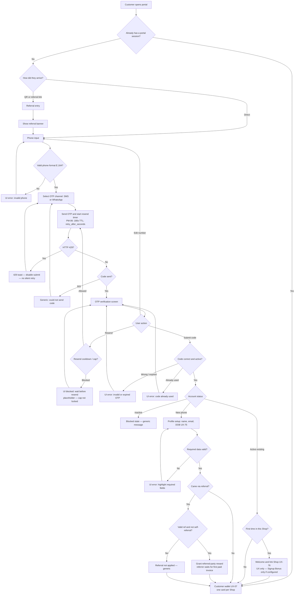
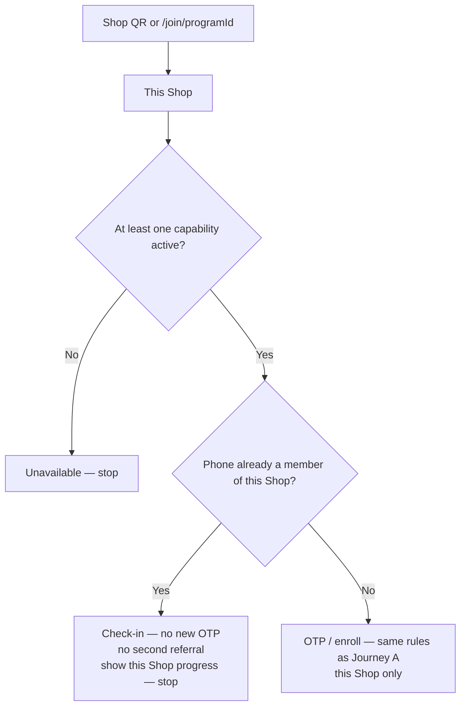

# Customer portal journey — all cases

**Date:** 2026-08-18 (synced to independent programs + PM-06 OTP)  
**Audience:** Product, UI/UX, QA  
**Purpose:** One case map for every outcome when a **shop customer** opens the portal (direct, QR, or referral). This is the working journey for design. It does **not** authorize schema, APIs, or Next.js implementation ([ADR-014](../architecture/decisions/ADR-014-product-data-ownership.md)).

**Sources:** customer-portal case diagram (updated 2026-08-17) · [auth-login-register-ui-brief.md](./auth-login-register-ui-brief.md) · [ui-ux-team-requests.md](./ui-ux-team-requests.md) · [11-authentication-migration.md](../frontend/11-authentication-migration.md) · [loyalty-page.md](../frontend/loyalty-page.md) · [program-model.md](./program-model.md) · [counter-qr-and-program-membership.md](./counter-qr-and-program-membership.md) · [customer-reward-progress.md](./customer-reward-progress.md) · [reward-redemption-flow.md](./reward-redemption-flow.md) · [G-33](../frontend/gaps-and-solutions.md#g-33--shop-customers-have-no-registerlogin-kpis-rely-on-owner-typed-rows) · [G-36](../frontend/gaps-and-solutions.md#g-36--no-admin-account-list-or-activeinactive-for-staffcustomer)

---

## How to read the diagram labels

`G-33` and `G-36` are **gap IDs**, not screen IDs. Do not name Figma frames after them. The current image should use UX IDs only (UX-07, UX-75, UX-76).

| Gap ID | Meaning | Screen / request |
| ------ | ------- | ---------------- |
| **G-33** | No customer register/login/wallet yet | [UX-07](./ui-ux-team-requests.md#ux-07--customer-wallet-per-shop) wallet + [UX-08](./ui-ux-team-requests.md#ux-08--customer-portal-shell) shell |
| **G-36** | No `account_status` yet | Inactive-account state on [UX-06](./ui-ux-team-requests.md#ux-06--customer-login--lost-access-new-otp). Stored value is **`inactive`**, not “disabled / blocked” |

---

## Two journeys — do not merge them

| Journey | When | OTP? |
| ------- | ---- | ---- |
| **A. Customer opens portal** | Direct URL, personal referral link/QR, or “log in” | **Always** — this *is* register + login + lost access |
| **B. In-store shop QR** | Shop counter QR → this **Shop**, then check-in | **New** phone: OTP then enroll **in that Shop**. **Returning** phone **in that Shop**: check-in, **no** new OTP, **no** second referral. Direct `/join/{programId}` still valid as today’s printed QR ([counter QR](./counter-qr-and-program-membership.md) · [loyalty-page](../frontend/loyalty-page.md#public-join--check-in)) |

Journey B is drawn as a **sibling** box on the same canvas (UX-09). Do not merge returning in-store check-in into Journey A OTP boxes. A returning member who later opens the **portal** still does OTP (Journey A).

---

## Case matrix

Legend: **Covered** = on the current diagram. **Fix** = on the diagram but wrong vs a DECIDED lock. **Add** = still missing from the image. **Out of scope** = do not put on this canvas.

| # | Case | Diagram | Docs lock | Design action |
| - | ---- | ------- | --------- | ------------- |
| 1 | Direct entry | Covered | UX-06 path not locked | Same phone screen as register |
| 2 | Scanned QR / `?ref=` link | Covered (banner) | UX-09 open | Banner is the working answer for how `?ref=` is shown |
| 3 | Invalid phone format | Covered | E.164 required ([data-contract](../backend/data-contract.md)) | **Fix label:** say `(E.164)` on the decision |
| 4 | Channel SMS or WhatsApp | Covered | DECIDED | [UX-68](./ui-ux-team-requests.md) |
| 5 | Send OTP + resend timer | Covered | **PM-06:** TTL **180s**; UI from `retry_after_seconds` | Do not hardcode timers in clients |
| 6 | OTP verification screen | Covered | UX-05 / UX-06 | Paste + `autocomplete="one-time-code"` allowed |
| 7 | Edit number | Covered | Required loop | Back to Phone Input |
| 8 | Resend under cap | Covered | **PM-06:** 60s cooldown | |
| 9 | Resend over cap | Covered | **PM-06:** 5 sends / 24h per phone → **429** `DAILY_OTP_LIMIT_REACHED`; ADR-012 IP limits may coexist | Cooldown UI **and** 429 toast are separate states |
| 10 | Wrong or expired OTP | Covered | DECIDED: no member / no session | Same screen, not a new route |
| 11 | OTP already used (double-submit) | Covered | DECIDED in auth brief §6 | Stay on OTP; not a raw DB error |
| 12 | HTTP 429 on request/enroll | Covered | ADR-012 | **Fix label:** toast + **disable submit** + no silent retry |
| 13 | Transport failure (SMS/WhatsApp stub) | Covered | API `503` generic | Generic “could not send code” |
| 14 | Program `draft` / `disabled` | Covered on Journey B | DECIDED: no join | Portal-only login with no program in URL may skip this |
| 15 | `account_status = inactive` | Covered (generic block) | Generic message — do **not** enumerate ([QA §4.1](../audit/2026-08-15-customer-auth-qa-analysis.md)) | Keep generic copy |
| 16 | Existing user, already in **this** Shop | Covered → wallet | No second membership | Happy path (portal) |
| 17 | Existing user, **first time in this Shop** | Covered (UX-76) | Membership for **this** Shop only; welcome is **UX only** unless Signup Bonus is configured ([Signup vs Referral](../frontend/loyalty-page.md#signup-bonus-vs-referral-bonus-decided)) | Welcome ≠ bonus |
| 18 | New user (phone not an account) | Covered (UX-75) | **UX-75 required** `full_name` / `email` / `birth_date` | Enroll 400 `ENROLL_VALIDATION_FAILED` |
| 19 | Profile invalid | Covered | Required error on UX-75 | Highlight required fields |
| 20 | New user **with** valid `?ref=` | Covered (referred-party) | Referred grant after OTP; **referrer** on first **paid** invoice | Do not show referrer as paid at enroll |
| 21 | New user **without** `?ref=` | Covered → wallet | DECIDED | Happy path |
| 22 | Self-referral / invalid `ref` | **Add** | DB `CHECK` / `409` | Generic “Referral not applied” → still wallet |
| 23 | Same device/IP same minute | Out of scope | `pending_review`; referrer blocked | No customer “pending” wallet badge unless product asks (UX-12 is merchant) |
| 24 | Unknown phone | Covered (→ new after OTP) | Avoid enumeration | No “phone not found” before OTP |
| 25 | Already has a portal session | Covered | Skip OTP → wallet | Re-auth if session expired |
| 26 | Customer reaches `/app` | Out of scope | DECIDED forbidden | Never a portal screen |
| 27 | Owner **Add Customer** | Out of scope | Merchant tool, no OTP | Do not merge into this funnel |
| 28 | Journey B returning check-in | **Fix** | Already in Shop → check-in, **no** OTP | Image currently has Yes/No **reversed** |
| 29 | Journey B new phone / first join | **Fix** | Not in Shop → OTP / enroll | Image currently sends this path to check-in |
| 30 | Journey B resolve | **Covered** | Shop QR always this Shop (item 15 **closed**) | No picker |
| 31 | Check-in / wallet reward progress | **Add** | [customer-reward-progress](./customer-reward-progress.md) | This Shop only; same numbers as wallet card |

Happy-path terminal for 16, 17, 20, and 21: **Customer wallet** (one card per Shop, sections for enabled capabilities — never a mixed total across Shops). Welcome on case 17 does not grant a bonus unless Signup Bonus is configured.

---

## Unified flowchart (Journey A — portal = register = login)

Register and login are **one OTP funnel**. Pixel layout and portal **URL** stay not locked.

---

## Journey B flowchart (in-store shop QR — sibling)

Shop QR always resolves to **this Shop**. Direct `/join/{programId}` stays valid as today’s printed QR while it maps to the Shop and at least one capability is `active`.

Membership, points, stamps, wallet, and rewards after this are **this Shop only** — one card, sections for enabled capabilities. Never a second membership for Points vs Visit.

Catalog redeem (pending + reserve + QR verification) is **not** on this canvas — [reward-redemption-flow.md](./reward-redemption-flow.md).

---

## Screens this journey needs

| Screen | UX | On diagram? |
| ------ | -- | ----------- |
| Phone input + country / E.164 | UX-05 / UX-06 (unified) | Yes — add `(E.164)` on the decision label |
| Referral entry + banner | UX-09 | Yes |
| Channel picker | UX-68 | Yes |
| OTP verification (edit number, resend, paste) | UX-05 / UX-06 | Yes |
| Resend cooldown / cap block | UX-05 states | Yes (placeholder) |
| 429 toast + disable submit | UX-68 | Yes — confirm “disable submit” in the label |
| Inactive account (generic) | UX-06 | Yes |
| Profile setup name / email / DOB | **UX-75** | Yes |
| First-Shop welcome + link Shop | **UX-76** | Yes — note welcome ≠ Signup Bonus |
| Wallet per Shop | UX-07 | Yes — one card per Shop |
| OTP already used | auth brief §6 | Yes |
| Self-referral / invalid ref | journey case 22 | **Add** |
| Reward progress on wallet / check-in success | UX-07 / UX-09 | **Add** (same numbers; that Shop only) |
| Portal shell | UX-08 | After wallet land (not required on this canvas) |
| Unavailable (no live capability) | UX-09 | Yes on Journey B — keep |
| Program picker (several `active`) | — | **Removed** — Shop QR always this Shop |
| Journey B Yes/No wiring | UX-09 | **Fix** (currently reversed on the image) |

---

## Remaining image edits (vs current canvas)

Keep layout, legend, and colors. Do not redesign.

**Legend (keep):** blue = screen · red = error / blocked · green = success · yellow = decision · white dashed = overlay / action.

### Still open

1. **Journey B — flip Yes/No**  
   - `Phone already a member of this Shop?` **Yes** → Check-in (no OTP, no second referral) + this Shop’s progress — **stop**  
   - **No** → OTP / enroll (Journey A rules) for **this** Shop only  
   - Do **not** send returning members into the portal OTP funnel from this box

2. **Journey B — front**  
   - Shop QR → **ACTIVE** program (no picker)  
   - Keep unavailable when no `active` program
   - Footnote: **PM-06** 180s / 3 guesses / 60s / 5 per 24h; `inactive` ≠ program `disabled` ≠ member `at_risk`

3. **Journey A — small adds / renames**  
   - Phone decision: `Valid phone format (E.164)?`  
   - First-time branch: `First time in this Shop?`  
   - UX-76 note: welcome is UX only; Signup Bonus only if configured  
   - UX-07 note: one card per Shop (enrolled + Archived History)  
   - 429 box: include **disable submit**  
   - After valid profile + referral: self-referral / invalid `ref` → red `Referral not applied` → still wallet  
   - Footnote: **PM-06** timers; add `inactive` ≠ program `disabled` ≠ member `at_risk`

### Already done on the current image (do not re-ask)

- Session check → wallet  
- Direct vs QR / referral + banner  
- 429 + could not send code  
- OTP already used  
- Generic inactive block  
- Referred-party grant wording  
- UX-75 / UX-76 / UX-07 IDs (no G-33 / G-36 on screens)  
- Title: Journey A register = login = one OTP funnel  
- Placeholder footnote for 60s / 5 min  

### Leave unchanged / off canvas

- No password, no `/app`, no “forgot PIN”  
- `pending_review` customer badge  
- Catalog redeem  
- Owner Add Customer  
- Portal shell chrome (UX-08) after land  

---

## Do not copy these diagram details as product locks

| Diagram text | Keep as |
| ------------ | ------- |
| Any timer / “wait N mins” number | Placeholder. OTP TTL and attempt cap are **not locked**. |
| Disabled / Blocked / Suspended | Stored **`inactive`**. Distinct from member `at_risk` / `churned` and program `disabled`. |
| Grant Referral Reward (undifferentiated) | **Referred** now; **referrer** on first paid invoice. |
| First time in this Shop / this program | First time in this **Shop**. |
| G-33 / G-36 as screen names | Gap IDs only. |
| Journey B Yes → portal OTP | Wrong. Returning in Shop = check-in only. |
| Journey B program picker | Removed. Shop QR always this Shop. |

---

_This file documents the customer case map for design and QA. Existing DECIDED locks in 11-auth, loyalty-page, ADR-012, counter-qr, and ADR-014 win when the diagram disagrees._
