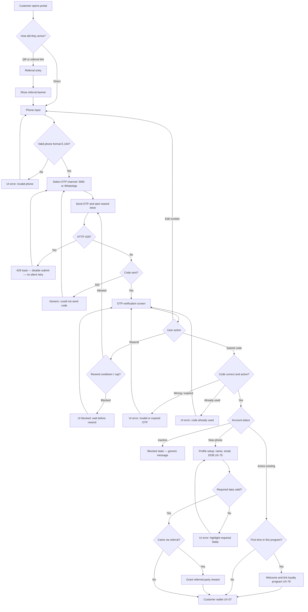

# Customer portal journey — all cases

**Date:** 2026-08-16  
**Audience:** Product, UI/UX, QA  
**Purpose:** One case map for every outcome when a **shop customer** opens the portal (direct, QR, or referral). This is the working journey for design. It does **not** authorize schema, APIs, or Next.js implementation ([ADR-014](../architecture/decisions/ADR-014-product-data-ownership.md)).

**Sources:** customer-portal case diagram (2026-08-16) · [auth-login-register-ui-brief.md](./auth-login-register-ui-brief.md) · [ui-ux-team-requests.md](./ui-ux-team-requests.md) · [11-authentication-migration.md](../frontend/11-authentication-migration.md) · [loyalty-page.md](../frontend/loyalty-page.md) · [program-model.md](./program-model.md) · [counter-qr-and-program-membership.md](./counter-qr-and-program-membership.md) · [customer-reward-progress.md](./customer-reward-progress.md) · [reward-redemption-flow.md](./reward-redemption-flow.md) · [G-33](../frontend/gaps-and-solutions.md#g-33--shop-customers-have-no-registerlogin-kpis-rely-on-owner-typed-rows) · [G-36](../frontend/gaps-and-solutions.md#g-36--no-admin-account-list-or-activeinactive-for-staffcustomer)

---

## How to read the diagram labels

`G-33` and `G-36` on the diagram are **gap IDs**, not screen IDs. Do not name Figma frames after them.

| Diagram label | Actual meaning | Screen / request |
| ------------- | -------------- | ---------------- |
| Customer Wallet **G-33** | Gap: no customer register/login/wallet yet | [UX-07](./ui-ux-team-requests.md#ux-07--customer-wallet-per-program) wallet card + [UX-08](./ui-ux-team-requests.md#ux-08--customer-portal-shell) shell |
| Account Suspended **G-36** | Gap: no `account_status` yet | Inactive-account state on [UX-06](./ui-ux-team-requests.md#ux-06--customer-login--lost-access-new-otp). Stored value is **`inactive`**, not “disabled / blocked” |

---

## Two journeys — do not merge them

| Journey | When | OTP? |
| ------- | ---- | ---- |
| **A. Customer opens portal** (this file) | Direct URL, personal referral link/QR, or “log in” | **Always** — this *is* register + login + lost access |
| **B. In-store shop QR** | Shop counter QR (URL **pending item 15**) → one **program**, then check-in | **New** phone: OTP then enroll **in that program**. **Returning** phone **in that program**: check-in, **no** new OTP, **no** second referral. Direct `/join/{programId}` still valid for program/referral QRs ([counter QR](./counter-qr-and-program-membership.md) · [loyalty-page](../frontend/loyalty-page.md#public-join--check-in)) |

Journey B is **not** drawn on the portal diagram. Keep it as a sibling flow (UX-09). A returning member who later opens the **portal** still does OTP (journey A).

---

## Case matrix

Legend: **Covered** = on the 2026-08-16 diagram. **Add** = must still be designed. **Conflict** = diagram wording vs a DECIDED lock — follow the lock.

| # | Case | Diagram | Docs lock | Design action |
| - | ---- | ------- | --------- | ------------- |
| 1 | Direct entry | Phone Input | UX-06 path not locked | Same phone screen as register |
| 2 | Scanned QR / `?ref=` link | Referral Entry + **Show Referral Banner** | UX-09 open | Banner is the working answer for how `?ref=` is shown |
| 3 | Invalid phone format | UI error → back to phone | E.164 required ([data-contract](../backend/data-contract.md)) | Draw the error; reject non-E.164 |
| 4 | Channel SMS or WhatsApp | Channel picker | DECIDED | [UX-68](./ui-ux-team-requests.md) |
| 5 | Send OTP + resend timer | **60s** timer | TTL **not locked** | Draw a timer; **do not** treat 60s as a product lock |
| 6 | OTP verification screen | Yes | UX-05 / UX-06 | Paste + `autocomplete="one-time-code"` allowed |
| 7 | Edit number | Back to Phone Input | Missing before | Required loop |
| 8 | Resend under cap | Re-send OTP | Attempt cap **not locked** | Draw resend; numbers stay placeholder |
| 9 | Resend over cap | **Wait 5 mins** block | Attempt cap **not locked**; HTTP **429** **is** locked ([ADR-012](../architecture/decisions/ADR-012-public-enrollment-rate-limiting.md)) | Two different states: cooldown UI **and** 429 toast (no silent retry) |
| 10 | Wrong or expired OTP | Error → stay on OTP | DECIDED: no member / no session | Same screen, not a new route |
| 11 | OTP already used (double-submit) | **Missing** | DECIDED in auth brief §6 | **Add** “code already used” — not a raw DB error |
| 12 | HTTP 429 on request/enroll | **Missing** | ADR-012 | **Add** toast + disable submit |
| 13 | Transport failure (SMS/WhatsApp stub) | **Missing** | API `503` generic | **Add** generic “could not send code” |
| 14 | Program `draft` / `disabled` | **Missing** | DECIDED: no join | **Add** empty state (UX-09). Portal-only login with no program context may skip this |
| 15 | `account_status = inactive` | “Disabled / Blocked” → Suspended, Contact Support | **`inactive`**. Generic message — do **not** help an attacker tell “real disabled account” from “unknown phone” ([QA §4.1](../audit/2026-08-15-customer-auth-qa-analysis.md)) | **Conflict:** keep generic copy. “Account suspended — contact support” enumerates |
| 16 | Existing user, already a member of **this** program | Straight to wallet | Phone already in **this** program — check-in / wallet, **no** second membership | Happy path |
| 17 | Existing user, **first time in this program** | Welcome + **Link Loyalty Program** | Create **this** program’s membership only; never auto-join sibling programs. Welcome is **UX only** — it does **not** grant a bonus unless this Program’s **Signup Bonus** is configured ([Signup vs Referral](../frontend/loyalty-page.md#signup-bonus-vs-referral-bonus-decided)) | **Add** [UX-76](./ui-ux-team-requests.md#ux-76--first-shop-welcome--link-program) |
| 18 | New user (phone not an account) | Profile: **Name, Email, DOB** | Join fields exist and are **optional** today; enroll API accepts them | **Add** [UX-75](./ui-ux-team-requests.md#ux-75--customer-profile-setup-name-email-dob). Required vs optional is **PROPOSED** by the diagram |
| 19 | Profile invalid | Highlight required fields | Missing | Required error state on UX-75 |
| 20 | New user **with** valid `?ref=` | **Grant Referral Reward** then wallet | **Referred** grant after OTP in the enroll transaction. **Referrer** grant only on first **paid** invoice — **not** at enroll | Diagram step = **referred** party only. Do not show the referrer as paid at this moment |
| 21 | New user **without** `?ref=` | Straight to wallet | DECIDED | Happy path |
| 22 | Self-referral (`referrer` = this phone) | **Missing** | DB `CHECK` reject | **Add** generic failure; no second account |
| 23 | Same device/IP same minute | **Missing** | `pending_review`; referred grant may still issue; referrer blocked | Customer UI: do not invent a “pending” wallet badge unless product asks (UX-12 is merchant) |
| 24 | Unknown phone | Treated as **new** after OTP | UX-06 left this open | Working answer: OTP first, then profile (no “phone not found” before OTP — avoids enumeration) |
| 25 | Already has a portal session | **Missing** | Not specified | **Add**: skip OTP, land on wallet (or re-auth if session expired) |
| 26 | Customer reaches `/app` | Out of scope (forbidden) | DECIDED | Never a portal screen |
| 27 | Owner **Add Customer** | Out of scope | Merchant tool, no OTP | Do not merge into this funnel |

Happy-path terminal for 16, 17, 20, and 21: **Customer wallet** (one card per program, any mix of types — never a mixed total). Welcome on case 17 does not grant a bonus unless Signup Bonus is configured.

---

## Unified flowchart (portal = register = login)

Register and login are **one OTP funnel**. Product previously left “one screen vs two” open; this case map is the working answer for design. Pixel layout and portal **URL** stay not locked.

Program-unavailable sits **before** phone on journey B: shop QR with **no** `active` program, or a direct `/join/{programId}` that is `draft` / `disabled` — see UX-09. It is omitted from the portal-only branch when there is no program in the URL.

---

## Screens this journey needs

| Screen | UX | On diagram? |
| ------ | -- | ----------- |
| Phone input + country / E.164 | UX-05 / UX-06 (unified) | Yes |
| Referral entry + banner | UX-09 | Yes |
| Channel picker | UX-68 | Yes |
| OTP verification (edit number, resend, paste) | UX-05 / UX-06 | Yes |
| Resend cooldown / cap block | UX-05 states | Yes (placeholder “5 mins”) |
| 429 toast | UX-68 | **Add** |
| Inactive account (generic) | UX-06 | Yes (reword vs “suspended”) |
| Profile setup name / email / DOB | **UX-75** | Yes — was missing from the UX list |
| First-program welcome + link program | **UX-76** | Yes — was missing from the UX list |
| Wallet per program | UX-07 | Yes |
| Reward progress on wallet / check-in success | UX-07 / UX-09 | **Add** (same numbers; that program only) |
| Portal shell | UX-08 | After wallet land |
| Program unavailable | UX-09 | **Add** (shop QR with no live program, or `/join/{programId}` `draft`/`disabled`) |
| Program picker (several `active`, no default) | UX-09 | **Add only if** Business Owner allows multiple ACTIVE programs (item 15 pending) |
| OTP already used | auth brief §6 | **Add** |

---

## Diagram edit brief — update the existing image

Keep the current layout, legend, and colors. Edit **labels and a few wires** — do not redesign.

**Legend (keep):** blue = screen · red = error / blocked · green = success · yellow = decision · white dashed = overlay / action.

### A. Rename (find the old text, replace)

| Find this box | Change to | Color |
| ------------- | --------- | ----- |
| Send OTP Code & Start **60s** Timer | Send OTP & start resend timer *(placeholder — TTL not locked)* | Blue |
| Exceeded Max Attempts? | Resend cooldown / cap reached? | Yellow |
| UI Blocked State: Wait **5 Mins** | UI blocked: wait before resend *(placeholder — cap not locked)* | Red |
| Disabled / Blocked **G-36** *(decision branch)* | `inactive` | Yellow branch label |
| UI Screen: Account Suspended Contact Support | Blocked state — generic message *(do not say the account exists)* | Red |
| Grant Referral Reward | Grant **referred-party** reward *(referrer waits for first paid invoice)* | Green |
| Customer Wallet Screen **G-33** | Customer wallet *(UX-07 — one card per program)* | Blue |
| Show Welcome & Link Loyalty Program | Welcome & link loyalty program *(UX-76)* | Green |
| Profile Setup Screen: Name, Email, DOB | Profile setup: name, email, DOB *(UX-75)* | Blue |
| Valid Phone Format? | Valid phone format (E.164)? | Yellow |

Do **not** put `G-33` or `G-36` on any screen. Those are backlog IDs, not UI names.

### B. Add on the **same** canvas (portal = journey A)

Wire these without moving the happy path.

1. **After “Send OTP…”** and **before** OTP Verification Screen  
   - Yellow: `HTTP 429?`  
     - Yes → red: `429 toast — disable submit — no silent retry` → back to channel picker  
     - No → yellow: `Code sent?`  
       - No / 503 → red: `Could not send code` *(generic)* → back to channel picker  
       - Yes → existing OTP Verification Screen

2. **On “Is Code Correct & Active?”** add a third branch next to No / Expired  
   - `Already used` → red: `UI error: code already used` → back to OTP Verification Screen  
   - Keep No / Expired as it is

3. **At the very start**, before “How did they arrive?”  
   - Yellow: `Already has a portal session?`  
     - Yes → Customer wallet  
     - No → existing “How did they arrive?”

4. **On “Came via Referral?” Yes path**, optional small red  
   - If self-referral / invalid `ref` → red: `Referral not applied` *(generic)* → still go to wallet (account is created; no second referral)

### C. Do **not** put on this canvas (sibling flow)

Draw a **second** small chart, or a right-hand swimlane titled **Journey B — in-store shop QR** (Shop QR URL **pending Business Owner** item 15):

1. Yellow: `Resolve shop → one program` (do not finalize URL until item 15)  
   - No `active` program → red: `Program unavailable` — **stop**  
   - If BO allows only one `active` → Shop QR → `/join/{programId}`  
   - If BO allows several `active` → Shop / Program selection → customer **chooses one** → `/join/{programId}`  
2. Yellow: `Program active?` (direct `/join/{programId}` still used for program/referral QRs)  
   - No → red: `Program unavailable` (`draft` / `disabled`) — **stop**  
   - Yes → phone + OTP **only if new phone**
3. Yellow: `Phone already in this program?`  
   - Yes → green: `Check-in — no new OTP, no second referral` — show **this program’s** progress snippet — **stop** (do not go to portal wallet on this chart)  
   - No → same OTP path as journey A

Membership, points, stamps, wallet, and rewards after this are **that program only** — never a shop-wide balance. Never enroll the customer into every `active` program.

Do not merge returning in-store check-in into the portal OTP boxes.

Catalog redeem (pending + reserve + QR verification) is **not** on this canvas — [reward-redemption-flow.md](./reward-redemption-flow.md).

### D. Leave unchanged

- Direct vs QR / referral + Show Referral Banner  
- Invalid phone → Phone Input  
- Channel SMS / WhatsApp  
- Edit number → Phone Input  
- Resend loop  
- First time in this **program**? → Welcome (UX-76) vs wallet  
- New user → profile → required fields → referral yes/no → wallet  
- All happy paths still end at the wallet  
- No password, no `/app`, no “forgot PIN”

### E. Title / footnote to add on the image

- Title: **Journey A — Customer opens portal** (register = login = lost access = one OTP funnel)  
- Footnote: *60s / 5 min on older drafts were placeholders. OTP TTL and attempt cap are not locked. `inactive` ≠ program `disabled` ≠ member `at_risk`.*

---

## Do not copy these diagram details as product locks

| Diagram text | Keep as |
| ------------ | ------- |
| 60s timer | Placeholder. OTP TTL is **not locked**. |
| Wait 5 mins | Placeholder. Attempt cap is **not locked**. |
| Disabled / Blocked | Stored **`inactive`**. Distinct from member `at_risk` / `churned` and program `disabled`. |
| Account Suspended Contact Support | Too specific (enumeration). Generic blocked copy. |
| Grant Referral Reward (undifferentiated) | **Referred** now; **referrer** on first paid invoice. |
| G-33 / G-36 as screen names | Gap IDs only. |

---

_This file documents the customer case map for design and QA. Existing DECIDED locks in 11-auth, loyalty-page, ADR-012, and ADR-014 win when the diagram disagrees._
