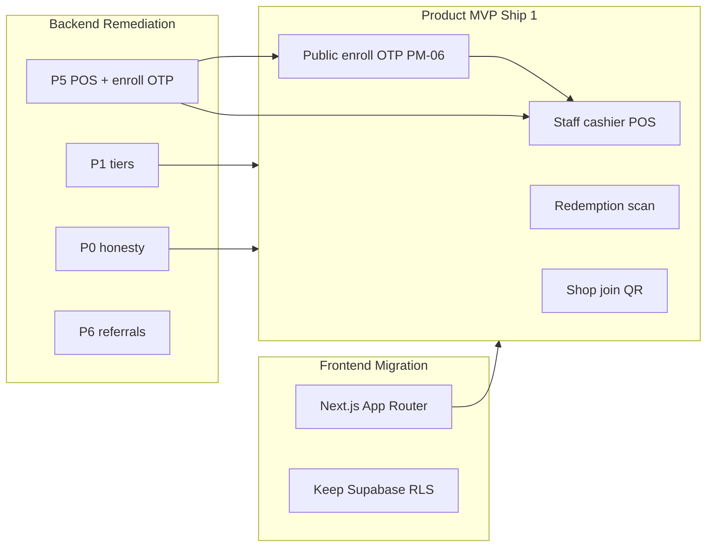

# Product MVP (Ship 1) — scope and terminology

**Date:** 2026-08-18  
**Status:** DECIDED (docs lock; UI exclusions via code comments)  
**Audience:** Product, engineering, QA, UI/UX  
**Does not authorize** schema or API implementation ([ADR-014](../architecture/decisions/ADR-014-product-data-ownership.md)).

This file is the **single product scope list** for the merchant first ship. It resolves `DG-01`, `DG-02`, `DG-03`, and the “Phase 1” naming collision called out in the [2026-08-14 audit](../audit/2026-08-14-security-ui-product-audit.md#phase-name-collision-read-first).

**Glossary:** [GLOSSARY.md](../../GLOSSARY.md) defines **Product MVP (Ship 1)** as the current trimmed launch version.

---

## Ship 1 UI exclusion lock (DECIDED)

These five capability groups are **OUT OF SCOPE for Product MVP (Ship 1)**. They must be **hidden in the merchant UI** — not shown as empty placeholders, interest toggles, or `"—"` dashes.

| # | Feature | Ship 1 behavior | Audit |
| --- | --- | --- | --- |
| 1 | **2FA / MFA** | Hide Settings → Security **Two-Factor Authentication** card entirely. No TOTP enroll UI. | `DG-01` |
| 2 | **Revenue UI** | Hide Analytics **Revenue Impact** tab; hide Overview **Revenue impact** card; hide dashboard **Total Revenue** and all other revenue/ROI stat tiles listed below. | `DG-03` |
| 3 | **Integrations tab** | Hide Settings → **Integrations** tab and all third-party toggles (Square, Clover, Toast, Lightspeed, Shopify POS, Mailchimp, Klaviyo, Twilio). | `DG-01`, `DG-02` |
| 4 | **Apple / Google Wallet** | Hide **QR & Wallet** integration rows and any **Add to Wallet** / wallet-pass sync UI. (Distinct from shop **join QR** and customer **wallet QR** at POS — those stay **in** scope.) | `DG-01` |
| 5 | **Retained core** | **Keep:** in-shop customer join via QR (`/app/loyalty`), public enroll OTP, staff cashier POS, catalog redemption scan. | — |

**Resolved decisions:**

- **DG-01:** Hide (not interest-only) for 2FA, third-party POS, and Wallet passes.
- **DG-02:** Integrations tab is **out** of Product MVP (Ship 1) — hide the whole tab.
- **DG-03:** Hide (not `"—"`) Revenue Impact tab and all revenue widgets in the inventory below.

### Implementation — comment out, do not refactor (DECIDED)

Ship 1 UI exclusions are implemented by **commenting out** the JSX / tab entries / stat tiles listed below — **not** by feature flags, env vars, conditional `if`, or other runtime toggles.

| Rule | Detail |
| --- | --- |
| **Do** | Wrap each excluded block in a block comment with marker `/* OUT OF SCOPE Ship 1: <feature> — see docs/product/phase-1-scope.md */` … `*/` |
| **Do not** | Add `product-mvp-flags`, `NEXT_PUBLIC_*` toggles, or `{flag && …}` guards for these surfaces |
| **Why** | Keeps Ship 1 diff minimal; original UI stays in-file for fast uncomment post–Ship 1 |
| **Post–Ship 1** | Remove the comment wrapper and restore the block — no flag cleanup |

**Example (Settings Integrations tab entry):**

```tsx
{/* OUT OF SCOPE Ship 1: Integrations tab — see docs/product/phase-1-scope.md
["integrations", "Integrations"],
*/}
```

**Example (Analytics Revenue Impact tab):**

```tsx
{/* OUT OF SCOPE Ship 1: Revenue Impact tab — see docs/product/phase-1-scope.md
{ id: "revenue", label: "Revenue Impact" },
*/}
```

### Code inventory — blocks to comment out for Ship 1

| File | Block to comment out |
| --- | --- |
| `src/features/settings/settings-page.tsx` | Settings tab bar entry `["integrations", "Integrations"]` |
| `src/features/settings/settings-page.tsx` | Tab panel branch `tab === "integrations"` → `<IntegrationsTab … />` |
| `src/features/settings/settings-page.tsx` | `SecurityTab` → `<TwoFactorCard />` |
| `src/features/settings/settings-page.tsx` | `INTEGRATION_CATEGORIES` → `"QR & Wallet"` (`apple_wallet`, `google_wallet`) when Integrations is restored later |
| `src/features/analytics/analytics-page.tsx` | Tab bar entry `{ id: "revenue", label: "Revenue Impact" }` |
| `src/features/analytics/analytics-page.tsx` | Tab panel branch for `<RevenueTab />` |
| `src/features/analytics/analytics-page.tsx` | `OverviewTab` bottom **Revenue impact** `<Card>…</Card>` |
| `src/features/analytics/analytics-page.tsx` | Subtitle phrase “…and revenue impact” (trim copy while card is commented) |
| `src/components/dashboard/SetupCompleteDashboard.tsx` | Stat card **Total Revenue** |
| `src/features/campaigns/campaigns-page.tsx` | Stat card **Campaign Revenue** |
| `src/features/campaigns/campaign-detail-page.tsx` | Stat tile **Revenue Influenced** |
| `src/components/loyalty/RewardsSection.tsx` | Reward detail stat tile **Total Revenue** |
| `src/features/customers/customers-page.tsx` | Table column **Revenue**; sort options `revenue_desc` / `revenue_asc` |
| `src/features/branches/branches-page.tsx` | **Performance** section (“By revenue” donut) |
| `src/features/branches/branch-detail-page.tsx` | Stat tile **Revenue Influenced** |

**Not commented out (in scope):** `/app/loyalty` shop join QR (`QRExperienceSection`, `join-page`), staff POS flows, catalog redemption, campaigns list/lifecycle (minus revenue stat).

**Marketing site only (no Ship 1 change):** `src/features/marketing/features-page.tsx` mentions “Revenue Impact” in public copy — out of merchant app scope.

---

## Terminology — four different “Phase 1” labels

Never use bare **“Phase 1”** in specs, tickets, or PRs. Always qualify:

| Label | Meaning | Canonical doc |
| --- | --- | --- |
| **Product MVP (Ship 1)** | Merchant launch features the product owner commits to for first customer-facing ship (Staff POS, join QR, redemption scan, etc.). | **This file** · [GLOSSARY.md](../../GLOSSARY.md) |
| **Frontend Migration** | TanStack → Next.js App Router while **retaining Supabase RLS** for leftover client data paths. ADR-011 Phase 1. | [ADR-011](../architecture/decisions/ADR-011-rls-storage-strategy.md) |
| **Backend Remediation P[N]** | Ordered backend fix ladder (P0 honesty → P7 pagination). **Not** the product ship list. | [remediation-roadmap.md](../backend/remediation-roadmap.md) |
| **Feature [In/Out of Scope]** | A specific capability inclusion or exclusion for **Product MVP (Ship 1)** only. | Tables below |

**Gaps index column `Phase`:** always means **Backend Remediation P[N]**, not Product MVP (Ship 1). See [gaps-and-solutions.md](../frontend/gaps-and-solutions.md).

**Error codes** ending in `_PHASE1` (e.g. `AUTOMATIONS_NOT_AVAILABLE_PHASE1`, `SMS_CAMPAIGNS_NOT_AVAILABLE_PHASE1`) are legacy identifiers; they mean **“not available in Product MVP (Ship 1)”** — do not rename without a coordinated API change.

---

## OTP vs Staff POS — resolved split

**Contradiction (fixed):** Staff cashier POS requires scanning a **customer wallet QR** ([counter-qr-and-program-membership.md](./counter-qr-and-program-membership.md)). That implies enrolled members with issued QRs. Public **first join** requires **PM-06 OTP** before a member row exists. [G-33](../frontend/gaps-and-solutions.md#g-33--shop-customers-have-no-registerlogin-kpis-rely-on-owner-typed-rows) had deferred all customer auth to “later,” and [Backend Remediation P6](../backend/remediation-roadmap.md#backend-remediation-p6--referrals--campaigns--insight-nudges--search) had placed OTP in P6 — after Staff POS in P5.

**Resolution:**

| Capability | Product MVP (Ship 1) | Backend Remediation | Notes |
| --- | --- | --- | --- |
| **Public enroll OTP (PM-06)** | **In scope** | **P5** (with Staff POS) | Counter/door QR first join: OTP → UX-75 profile → enroll → **wallet QR issued**. Required before cashier can scan. |
| **Returning check-in (door QR)** | **In scope** | **P5** | Known member at this Shop: check-in **without** new OTP ([counter-qr](./counter-qr-and-program-membership.md)). |
| **Staff POS scan + earn** | **In scope** | **P5** | Scan **customer wallet QR** → optional deferred migrate → Bill Amount + Invoice Number. |
| **Customer portal sessions** | **Out of scope** | **Later** (post–Ship 1) | Register/login/recovery **app**, `/api/me/wallet` behind customer JWT, account inactive gates ([G-33](../frontend/gaps-and-solutions.md#g-33--shop-customers-have-no-registerlogin-kpis-rely-on-owner-typed-rows) portal portion). |
| **Referral OTP + grants** | **Out of scope** | **P6** | Reuses PM-06 store from P5; referral attribution and both-party grants stay deferred. |

**Rule:** enrollment OTP and wallet QR are **Ship 1**; persistent **customer login** is **not**. A member can earn at POS and redeem via QR without ever opening a customer portal app.

---

## Product MVP (Ship 1) — in scope

| Area | In scope | Source |
| --- | --- | --- |
| **Merchant app** | `/app` for **`admin`** and **`staff`** (same permissions for now) | [11-authentication-migration.md](../frontend/11-authentication-migration.md#locked-role-matrix) |
| **Merchant auth** | NestJS JWT for admin/staff; temp password + first-login change; email password reset | [ADR-005](../architecture/decisions/ADR-005-authentication.md) Option C |
| **Programs** | Independent programs; **one ACTIVE** per Shop; counter QR → ACTIVE only | [ADR-016](../architecture/decisions/ADR-016-independent-programs.md) |
| **Join QR** | Shop join QR on `/app/loyalty` (print/display) | [ui-ux-team-requests.md](./ui-ux-team-requests.md#ux-10--loyalty-program-list--active-default) |
| **Public enroll** | Counter QR → PM-06 OTP (new phone) → UX-75 profile → membership + **wallet QR** | [counter-qr-and-program-membership.md](./counter-qr-and-program-membership.md) |
| **Staff cashier POS** | Scan customer QR → migrate if eligible → bill + invoice; earn on locked program | [api-contract.md](../backend/api-contract.md#staff-pos-product-mvp-ship-1-cashier) |
| **Catalog redeem** | Customer Redeem → snapshot + reserve + 10-min QR → staff scan verify | [reward-redemption-flow.md](./reward-redemption-flow.md) |
| **Redemption authz** | Shop-level; any Staff or Admin may scan/verify and use cashier POS | [reward-redemption-flow.md](./reward-redemption-flow.md#11-staff-authorization-shop-level) |
| **Campaigns** | List, create, Launch, Completed lifecycle; **hide** Scheduled Automations (PM-18) | [campaigns-page.md](../frontend/campaigns-page.md#pm-18--hide-scheduled-automations-product-mvp-ship-1) |
| **Campaign honesty** | No open tracking; sent campaigns show `0% Open` / `—` until deferred | [product-manager-meeting-report.md](../product-manager-meeting-report.md) |
| **Owner add customer** | Manual add in `/app/customers` (no OTP); collect UX-75 fields when possible | [customers-page.md](../frontend/customers-page.md) |
| **Tier display** | Tier ladder applied on enroll + earn (Backend Remediation **P1**) | [remediation-roadmap.md](../backend/remediation-roadmap.md#backend-remediation-p1--apply-the-tier-ladder--db-automation) |
| **UI honesty** | No fabricated metrics; hide excluded widgets per Ship 1 UI lock; `"—"` only where a metric is **in scope** but not yet wired | [remediation-roadmap.md](../backend/remediation-roadmap.md#backend-remediation-p0--honesty-in-ui) |

---

## Product MVP (Ship 1) — out of scope

| Area | Out of scope | Ship behavior | Source |
| --- | --- | --- | --- |
| **Customer portal app** | Register/login/recovery **sessions** for role `customer`; `/api/me/wallet` behind customer JWT | Public join + wallet QR only; no standalone customer app routes | [G-33](../frontend/gaps-and-solutions.md#g-33--shop-customers-have-no-registerlogin-kpis-rely-on-owner-typed-rows) |
| **Social sign-in** | Facebook / Google / Apple on `/auth/*` | Hidden or absent | [UX-19](./ui-ux-team-requests.md#ux-19--product-mvp-ship-1-exclusions-social-auth-2fa-pos-wallet) |
| **2FA / MFA** | TOTP enroll + sign-in challenge | **Comment out** Security `TwoFactorCard` | [UX-19](./ui-ux-team-requests.md#ux-19--product-mvp-ship-1-exclusions-social-auth-2fa-pos-wallet) · `DG-01` ✓ |
| **Third-party POS** | Square, Clover, Toast, Lightspeed, Shopify integrations | **Comment out** Integrations tab and toggles | [UX-19](./ui-ux-team-requests.md#ux-19--product-mvp-ship-1-exclusions-social-auth-2fa-pos-wallet) · `DG-01` ✓ · `DG-02` ✓ |
| **Apple / Google Wallet** | Settings → Integrations → QR & Wallet pass | **Comment out** wallet rows and Add-to-Wallet flows. **Not** shop join QR or POS wallet QR | [UX-19](./ui-ux-team-requests.md#ux-19--product-mvp-ship-1-exclusions-social-auth-2fa-pos-wallet) · `DG-01` ✓ |
| **Referrals (live)** | Both-party grants, `?ref=` attribution, pending review UI | Settings/config may exist; grants deferred (Backend **P6**) | [G-14](../frontend/gaps-and-solutions.md#g-14--referrals-settings-without-attribution) |
| **Scheduled automations** | Worker-fired automations | UI hidden; writes → 503 `AUTOMATIONS_NOT_AVAILABLE_PHASE1` | [PM-18](./ui-ux-team-requests.md#ux-15--automations-config-only-vs-hide-enable) |
| **Campaign opens** | `% Open`, ESP webhooks | `0% Open` / honest placeholder | [G-09](../frontend/gaps-and-solutions.md#g-09--campaign-send--opens--automations) |
| **Revenue / ROI widgets** | POS-attributed revenue, AOV, ROI cards, campaign revenue tiles | **Comment out** entirely — no tab, card, or `"—"` placeholder | [G-06](../frontend/gaps-and-solutions.md#g-06--revenue-widgets-show-mock-or-empty) · `DG-03` ✓ |
| **Refund / reversal** | POS or redemption reverse | Not implemented | [reward-redemption-flow.md](./reward-redemption-flow.md) |
| **Team invite UI** | Admin form add admin/staff + emailed temp password | Deferred (Backend **Later**) | [G-34](../frontend/gaps-and-solutions.md#g-34--admin-cannot-create-adminstaff-with-emailed-temp-password) |
| **Account active/inactive admin** | Team + Customers tabs with filters | Deferred | [G-36](../frontend/gaps-and-solutions.md#g-36--no-admin-account-list-or-activeinactive-for-staffcustomer) |
| **Insight nudge CTAs** | `POST /api/insights/:key/actions` | Disabled/hidden until Backend **P6** | [remediation-roadmap.md](../backend/remediation-roadmap.md#backend-remediation-p0--honesty-in-ui) |
| **Global search** | Header search with results | Hide or disable until Backend **P6** | [G-05](../frontend/gaps-and-solutions.md#g-05--global-search-is-a-dead-button) |
| **SMS campaigns (live)** | Bulk SMS send path | **Visible-fail stub (DG-08 ✓):** channel stays in UI; send → 503 `SMS_CAMPAIGNS_NOT_AVAILABLE_PHASE1` + shared trial message | [UX-24](./ui-ux-team-requests.md#ux-24--communication-policy--sms-in-product-mvp-ship-1) |

---

## Cross-track map (read when planning)



---

## Related decisions still open (`DG-*`)

These do **not** block Ship 1 UI exclusion lock but must close before shipping conflicting screens:

| ID | Question |
| --- | --- |
| **DG-11** | Referral `pending_review` merchant UI vs internal-only |
| **DG-14** | Single at-risk definition (30 vs 60 vs 20–60 day cutoffs) |

Track in [ui-ux-team-requests.md](./ui-ux-team-requests.md) and [deferred-decisions.md](../architecture/deferred-decisions.md).

**Resolved (2026-08-18):** `DG-01` (hide 2FA, POS, Wallet), `DG-02` (hide Integrations tab), `DG-03` (hide Revenue UI), `DG-04` (no subscription downgrade; upgrade or cancel-to-period-end; Ship 1 placeholder Billing OK without paid matrix), `DG-08` (SMS campaigns **visible-fail**: channel stays; send 503 `SMS_CAMPAIGNS_NOT_AVAILABLE_PHASE1`), `DG-14` (at risk = **> 30 days** inactivity; snake_case `at_risk`).

---

## Verification

- [ ] No bare **“Phase 1”** in new docs or tickets without one of the four qualified labels above.
- [ ] Staff POS specs reference **public enroll OTP** as a Ship 1 prerequisite, not Backend Remediation P6-only.
- [ ] G-33 portal session work is explicitly **Out of Product MVP (Ship 1)**; enroll OTP is **In**.
- [ ] Settings: Integrations tab and 2FA card **commented out** (not flag-gated).
- [ ] Analytics: Revenue Impact tab and Overview revenue card **commented out**.
- [ ] Dashboard / Campaigns / Customers / Branches: revenue stat tiles/columns **commented out**.
- [ ] `/app/loyalty` join QR and core loyalty flows remain visible and functional.
