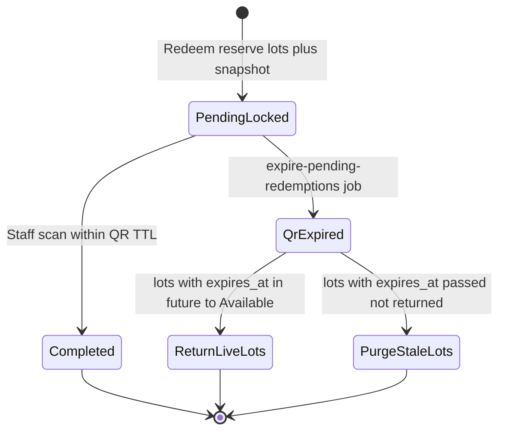

# Reward redemption flow (per program)

**Date:** 2026-08-18  
**Status:** DECIDED for Product MVP (Ship 1) lifecycle (not shipped). Former §14 items are **DECIDED** — see [§14](#14-decided-pending-edges).  
**Audience:** Product, UI/UX, QA, backend  
**Does not authorize** schema, APIs, or Next.js implementation ([ADR-014](../architecture/decisions/ADR-014-product-data-ownership.md), [ADR-016](../architecture/decisions/ADR-016-independent-programs.md)).

**Sources of truth to keep in sync:** [program-model.md](./program-model.md) · [counter-qr-and-program-membership.md](./counter-qr-and-program-membership.md) · [loyalty-page.md](../frontend/loyalty-page.md#reward-redemption-lifecycle-decided) · [customer-reward-progress.md](./customer-reward-progress.md) · [G-20](../frontend/gaps-and-solutions.md#g-20--rewardsredeemed_count-vs-earn) · [data-contract](../backend/data-contract.md) · [api-contract](../backend/api-contract.md)

The customer redeems **only** rewards that belong to their **enrolled program**. Points, stamps, wallet, and catalog never mix across **Shops** or across programs except via deferred POS migration ([program-model.md](./program-model.md)). `Available = Total − Reserved`. Signup / Referral grants stay on [loyalty-page.md](../frontend/loyalty-page.md#signup-bonus-vs-referral-bonus-decided).

---

## 1. Catalog redeem vs earn vs voucher

Do not collapse these three paths:

| Path | What it is | This file |
| ---- | ---------- | --------- |
| **Catalog redemption** | Customer selects a program reward, creates a redemption, staff **verifies** a single-use QR at checkout | **Yes** — pending, reserve, QR, scan → `completed` or job → `expired` |
| **Earn** | Check-in / visit completion / POS spend may *earn* a reward (`earned` ≠ redeemed) | Earn must be **idempotent** (see §9). Fulfilment still needs an explicit redeem |
| **Referral voucher** | Discount-kind grant on `vouchers` | [referral rewards](../frontend/loyalty-page.md#referral-rewards-decided) — not this state machine |

Earn ≠ redeem remains locked. A visit-completion “ready at the counter” is not an automatic catalog redemption.

**Exception (not a contradiction):** purely **digital** catalog rewards (for example an instantly-applied discount voucher) may skip the QR / staff-scan step and complete in the same create transaction. Physical / in-person handoff rewards use the QR flow below. **Product MVP (Ship 1):** no digital/physical flag exists yet — all catalog items default to **physical** ([§16](#16-digital-rewards-exception)).

---

## 2. Customer request → staff QR verification

Staff scanning is **verification**, not discretionary approval. Staff cannot reject a valid, unexpired, un-redeemed QR.

```text
Customer taps Redeem on a reward
   (e.g. Free Coffee = 100 points)
   ↓
Available = Total − Reserved
   ↓
Available < cost?
   ├── Yes → reject immediately (clear error; no row; no reservation)
   └── No  → reserve points (increment Reserved)
             persist reward_snapshot (cost + conditions at create)
             create Redemption PENDING
             generate single-use QR tied to that row
             qr_expires_at = now + 10 minutes
   ↓
Customer shows QR at checkout
   ↓
Staff scans QR
   ↓
Validate: maps to PENDING, correct Shop,
          QR not expired, single-use
   ├── Valid     → atomic PENDING → COMPLETED
   │               permanently deduct reserved from Total
   │               staff hands over the reward
   ├── COMPLETED → reject scan (“already redeemed”)
   └── EXPIRED   → reject scan (“expired”)
```

The customer **cannot** redeem a reward that belongs to another Shop.

Stored status names: `pending` · `completed` · `expired` · `rejected`. Do not use other spellings.

- `pending` — points reserved; QR live until `qr_expires_at`.
- `completed` — staff scan (or instant digital complete) succeeded; reserved points consumed from Total.
- `expired` — scheduled job (or scan of a past-due QR) released the reservation. Not a staff action.
- `rejected` — **not** a staff action on a valid physical QR. Retained for other / non-QR flows if a created row must be invalidated without completing. Insufficient Available at create is an **error with no row**, not `rejected`.

Optional later states (`cancelled` · `reversed`): **`cancelled` is later-phase only** (emergency force-delete). General refund / reversal is out of Product MVP (Ship 1) ([§12](#12-refund--reversal-deferred--out-of-product-mvp-ship-1)).

---

## 3. Pending redemption reserves points

Reservation happens at **Redeem** time, not at staff-scan time.

Pending redemptions **reserve** the required points:

```text
Total Points
     -
Pending Reserved Points
     =
Available Points
```

Example:

```text
Total Points = 100
Reward A = 70 points → PENDING
Reserved = 70
Available = 30
```

A second reward costing 50 points must be **rejected immediately** (50 > 30): clear error, **no** reservation, **no** row. Combined pending cost must never exceed available balance. Concurrent redemption attempts must be checked against **Available**, not Total, so two in-flight Redeems cannot overspend.

**Spendable / available** on the wallet and on redeem eligibility is this **available** figure — not a stale client total, and not a raw `customers.points` counter that ignores reservations.

How reserved points interact with **lot** expiry (`points_ledger.expires_at`) is **DECIDED PM-04** ([§14](#14-decided-pending-edges)): lots are locked for the 10-minute QR TTL; unclaimed expiry then purges lots past `expires_at`. Independent of QR TTL itself ([§6b](#6b-expiry-handling-scheduled-job)).

---

## 4. State machine (server-enforced)

Minimum Product MVP (Ship 1) lifecycle (physical / in-person handoff):

```text
PENDING
   │
   ├── staff scan (verify) → COMPLETED
   │
   └── scheduled job / past qr_expires_at → EXPIRED
```

Digital exception: create may go `PENDING → COMPLETED` in the same transaction with no QR ([§16](#16-digital-rewards-exception)).

Rules:

- Transitions are enforced **server-side** (database transaction).
- `PENDING → COMPLETED` must be an **atomic, conditional** update: `UPDATE … WHERE status = 'pending'` (and QR still valid) and **affected row count = 1**. If count is 0, the scan failed (already `completed`, `expired`, or otherwise not pending).
- A second scan of a `completed` QR is **rejected** with a specific “already redeemed” error — not a silent success.
- A scan of an `expired` QR is **rejected** with a specific “expired” error.
- Frontend may disable Redeem after submit and show a countdown on the QR; that is **UX only** and **must not** be relied upon for correctness.

---

## 5. Duplicate protection (backend)

### Create must be idempotent

Viewing the same existing redemption from multiple devices is allowed and is **not** a duplicate:

```text
Mobile A → Redemption #123 → PENDING (same QR)
Mobile B → Redemption #123 → PENDING (same QR)
```

The Backend must still prevent the **create** operation from inserting multiple redemptions because of double-click, multiple tabs, multiple devices, or network retry. Use an idempotency / business rule and/or a unique database constraint.

```text
First request
→ Create Redemption #123
→ Reserve points
→ Issue QR (10-minute expiry)

Duplicate request
→ Detect existing operation
→ Return / use Redemption #123
→ Do not create another Redemption
→ Do not reserve points again
→ Do not issue a second QR
```

### Pending duplicate

When the business rule does not allow it, a customer must not have multiple `pending` redemptions for the same reward.

Validate:

```text
customer + shop + reward + pending redemption
```

Database-level uniqueness (or an equivalent transactional lock) must handle races. UI disable is insufficient.

---

## 6. Atomic staff verification (QR scan)

Staff scanning **verifies** the QR. It is not an Approve / Reject decision.

On a valid scan:

```text
PENDING
→ COMPLETED
→ consume / deduct the reserved points from Total
→ staff hands over the reward
```

The `PENDING → COMPLETED` write must be:

```text
UPDATE … SET status = 'completed', … 
WHERE id = :id AND status = 'pending'
  AND qr_expires_at > now()
```

Commit only if **affected row count = 1**. That prevents two concurrent scans from both completing.

A second scan after complete:

```text
COMPLETED → reject (“already redeemed”) — do not deduct again
```

An expired QR (status already `expired`, or `qr_expires_at <= now()` while still `pending`):

```text
EXPIRED / past due → reject (“expired”) — do not complete, do not deduct
```

If the row is still `pending` but past `qr_expires_at`, the scan must **not** complete it. Prefer failing the scan with “expired”; the scheduled job is what marks `expired` and releases reserved points ([§6b](#6b-expiry-handling-scheduled-job)). Do not leave a past-due `pending` row completable.

The Backend transaction must ensure that the state transition and points consumption cannot partially succeed.

Two staff members scanning at once must never double-deduct or double-fulfil:

```text
Staff A → PENDING → COMPLETED (row count = 1)
Staff B → already COMPLETED → reject (“already redeemed”)
```

QR codes are **single-use**. Knowing a `qr_code` after complete must not fulfil again.

### Network retry during scan

The Scan / verify endpoint must be idempotent in the sense that a retry never consumes points twice. Enforced by the Backend / database, not the Frontend. A retry after a successful complete returns **“already redeemed”** (the first scan already succeeded — do not hand the reward over a second time).

```text
Request #1
→ PENDING → COMPLETED (row count = 1)
→ consume reserved points
→ success

Network timeout

Request #2 / retry
→ Redemption already COMPLETED
→ no additional points consumption
→ error “already redeemed”
```

A network retry must never create another points transaction or perform another deduction.

---

## 6b. Expiry handling (scheduled job)

PENDING redemptions expire **10 minutes** after create (`qr_expires_at`).

A **scheduled job** (cron / background worker) must periodically:

1. Find `pending` rows with `qr_expires_at <= now()`.
2. Mark them `expired` with an atomic conditional update (`WHERE status = 'pending' AND qr_expires_at <= now()`).
3. Release the reserved points back to Available.

Do **not** rely on client-side or lazy expiry only. Expired reservations must be released even if the customer never reopens the app.

Scan of a past-due QR must not complete the row ([§6](#6-atomic-staff-verification-qr-scan)). The job is the writer that turns those rows into `expired` and frees Reserved.

This 10-minute QR TTL is **independent** of the catalog reward’s `expires_at` ([§8](#8-reward-eligibility-at-create-agreed)).

---

## 7. Concurrent earn and redeem (Backend)

Earn and Redemption operations must use the **same** concurrency / transaction consistency model for points.

The Backend must prevent race conditions that could cause:

- Negative balances
- Lost updates
- Double deductions
- Lost / created points due to concurrent requests
- Incorrect points reservations
- Overspend when two Redeems race against **Total** instead of **Available**

Balance validation and points reservation / consumption must be performed **atomically**. No operation may trust a stale client-side balance.

Example: initial available balance = 50. Concurrent `Earn +100` and `Redeem 100` must still result in a transactionally consistent final state.

---

## 8. Reward eligibility at create (agreed)

Reward eligibility / expiry is evaluated **when the Redemption is created**.

```text
10:59 → Reward is valid
       → Customer creates Redemption
       → PENDING + QR (qr_expires_at = 11:09)

11:00 → Reward catalog expires_at passes

11:05 → Staff scans QR (still within 10-minute QR window)
```

The Reward expiring after the Redemption was created **must not** automatically invalidate the existing Redemption.

The **QR / pending-redemption TTL is 10 minutes** and is **independent** of the Reward’s `expires_at`. Do not use reward `expires_at` as the QR timer.

Whether a later **catalog price change** updates a `PENDING` row’s reserved `points_cost` is **DECIDED**: it does **not**. Persist `reward_snapshot` at create; scan uses the snapshot ([§14.1](#141-reward-snapshot-prospective-edits-versions)).

---

## 9. Earn must also be idempotent (Backend)

Every Earn operation must have an **idempotency key** or unique business reference representing the underlying business event. The same business event must only award points once. Enforce a suitable unique constraint / business reference at the Backend / database level.

```text
Purchase #123
First request → +100 points
Retry         → no-op
```

Different legitimate business events must both be processed:

```text
Purchase #123 → +100
Purchase #124 → +100
```

Idempotency prevents duplicate processing of the **same** event; it must not prevent legitimate separate earning events. `Invoice.Paid` is already idempotent on `order_id` ([api-contract](../backend/api-contract.md)). Check-in / POS earn needs the same class of protection.

---

## 10. Shop isolation (agreed)

A Redemption remains **permanently** associated with the Shop under which it was created:

```text
redemption.shop_id = Shop A
```

(Today’s schema may still store `loyalty_program_id`; target meaning is the **enrolled program** under that Shop — [data-contract](../backend/data-contract.md).)

If the customer later joins or uses Shop B, the existing Redemption must remain associated with Shop A / that program.

- The Redemption must not be transferred to Shop B.
- The Redemption must not be covered using Shop B’s points.
- The points reservation must remain associated with the customer’s balance for that **program**.
- The QR is valid only for that Shop. Staff/scanner must belong to that Shop.

```text
Customer
├── Shop A / Program 1 → 100 points  (Redemption #123 stays here)
└── Shop B / Program 2 → 50 points   (must not pay for #123)
```

No cross-Shop balance aggregation. Scan uses `reward_snapshot`, not the live catalog.

---

## 11. Staff authorization (Shop-level)

A Shop can have multiple Branches. Staff members are associated with a Branch.

Any authorized Staff member from **any Branch belonging to the same Shop** can **scan / verify** Redemptions for that Shop.

```text
Shop A
├── Branch 1
│   ├── Staff A
│   └── Staff B
│
└── Branch 2
    ├── Staff C
    └── Staff D

All of these Staff members can scan QRs belonging to Shop A.
Staff from Shop B must not access or complete Shop A’s Redemptions.
```

The authorization boundary is **Shop**, not Branch:

```text
staff.branch.shop_id
    ===
redemption.shop_id
```

(Today: owner of the capability rows / `profiles.id`.)

Knowing a `redemption_id` or `qr_code` must not let Shop A staff complete a Shop B redemption. Do not authorize on the redemption ID or QR payload alone.

The scan must confirm the redemption belongs to the **scanner’s Shop**.

The Frontend should only expose a scanner for the Staff’s Shop. The Backend must enforce the same authorization independently.

Staff **cannot** discretionary-reject a valid, unexpired, un-redeemed QR. Invalid scans return specific errors (`already redeemed`, `expired`, wrong shop / program). They are not a `rejected` status chosen by staff.

### Product MVP (Ship 1) role permissions (agreed)

Any existing **Staff** or **Admin** role can perform Redemption **scan / verify** operations.

Do **not** introduce additional role-based restrictions for Redemption in Product MVP (Ship 1) unless explicitly decided later.

Existing authentication and authorization / security rules still apply (including the Shop boundary above).

---

## 12. Refund / reversal (deferred — out of Product MVP (Ship 1))

General Refund / Reversal is **not** part of the Product MVP (Ship 1) Redemption flow.

Do **not** implement `COMPLETED → REVERSED` in Product MVP (Ship 1) APIs, UI, or state machine.

**Later phase (specified):** emergency program `soft_deleted` may **cancel** remaining `PENDING` rows, auto-refund reserved points, and notify customers. That is not a merchant “reverse a completed redeem” tool.

---

## 13. Multiple devices (agreed)

The customer may have the same account open on several devices. Local UI state must not be what prevents a duplicate redeem. Server-side state (`pending` / `completed` / `expired` / `rejected`) is authoritative. The UI refreshes / reconciles against the server (same QR + remaining TTL on every device).

Viewing the same record on two devices is allowed ([§5](#5-duplicate-protection-backend)). Creating two records for the same operation is not. Completing from a scan on one device must show `completed` on the others; expiry on the server must show `expired` even if a device still displays a stale QR.

---

## 14. Decided pending edges

Former “do not invent” items. **DECIDED 2026-08-18.**

### 14.1 Reward snapshot, prospective edits, versions

At Redeem create, persist **`reward_snapshot`** (JSON): `reward_id`, `reward_version`, `point_cost`, fulfillment conditions, display name.

Staff scan **must** consume using the snapshot + reserved lots, not the live `rewards` row.

Program / reward **edits are prospective only**. They apply to new earn and new Redeem creates. They must not rewrite `points_ledger` lots, `spendable_points`, `period_points_earned` (PM-08), or existing `PENDING` rows.

**Material** catalog cuts (large `point_cost` increase, tighter conditions) = new **reward version**. Already-earned spendable points stay honourable against the version they were earned under. This is **inside one program**, not independent-program migration.

### 14.2 Reward disabled / deleted while PENDING

**DECIDED:** cannot `DELETE` / `DISABLE` / `DRAFT` a reward (or its program) while `EXISTS` pending claims — [program-model mutation guards](./program-model.md#7-mutation-guards-product-mvp-ship-1). **Archive** keeps PENDING completable (staff scan still works). UI 409 with pending count + Wait vs Archive.

### 14.3 Program disabled while PENDING

**Same guards.** Archive the previous ACTIVE when switching default. Do not disable a still-valid program that has members or PENDING claims.

### 14.4 Point lot expiry while reserved (PM-04)

**Option 1 — reservation locks expiration.**

While `status = pending` and `qr_expires_at > now()`, reserved lots are **locked** against `points_ledger.expires_at`. Expiry jobs skip those lots.

- **Scan within TTL:** `COMPLETED`; consume reserved lots even if `expires_at` passed during the window.
- **Unclaimed QR:** job marks redemption `expired`, releases reservation, then **purges** lots with `expires_at <= now()` — those units are **not** returned to Available. Lots still inside `expires_at` return to Available.

Does not decrement `period_points_earned`. Independent of catalog reward `expires_at` ([§8](#8-reward-eligibility-at-create-agreed)).



---

## 15. Core constraints (Product MVP (Ship 1))

1. Membership, points, stamps, wallet, and rewards are **program-scoped** under a Shop. Cross-Shop never mixes.
2. A customer joins a **program** (via Shop ACTIVE QR), never a reward.
3. Pending redemptions **reserve** points at Redeem time; concurrent Redeems check Available, not Total. Persist `reward_snapshot` at create.
4. Staff scan is **verification**, not approval. `PENDING → COMPLETED` is atomic (`WHERE status = 'pending'`, affected rows = 1).
5. Create-redemption is **idempotent**. Do not issue a second QR or reserve twice.
6. A scheduled job expires `pending` past `qr_expires_at` and applies **PM-04** on release.
7. Earn is **idempotent** per business event.
8. A redemption never moves to another Shop or program.
9. Staff authorization is **Shop-level**, server-side. Product MVP (Ship 1): any Staff or Admin may scan for that Shop.
10. Reward eligibility / catalog `expires_at` is evaluated **at create**. Snapshot holds cost. QR TTL is 10 minutes, independent.
11. General refund / reversal is **out of Product MVP (Ship 1)**. Emergency cancel+refund is later-phase only.
12. Digital catalog rewards may complete instantly without QR ([§16](#16-digital-rewards-exception)).
13. Mutation guards: no DELETE/DISABLE/DRAFT with PENDING / incomplete members / unexpired program; archive is allowed.

Canonical join → POS → redeem: [counter QR](./counter-qr-and-program-membership.md).

---

## 16. Digital rewards exception

This file’s QR + staff-scan path applies to rewards that need **physical / in-person handoff**.

Purely **digital** catalog rewards (for example an instantly-applied discount voucher) **may** bypass QR generation and staff scan:

```text
Available ≥ cost → reserve + COMPLETED in one transaction
(permanently deduct; no QR, no 10-minute hold)
Available < cost → error, no row
```

That is a documented **exception**, not a second contradictory state machine. Referral discount grants remain on `vouchers` ([§1](#1-catalog-redeem-vs-earn-vs-voucher)) and are not this path.

Which catalog rewards are digital vs physical is a catalog/product flag (backend-owned). **That flag does not exist in the backend schema yet.**

**Product MVP (Ship 1) default:** treat **every** catalog item as a **PHYSICAL** reward — pending + reserve + single-use QR + staff scan. Do **not** use the instant digital complete path ([§16](#16-digital-rewards-exception) exception) until the flag ships and a reward is explicitly marked digital. Referral discount grants on `vouchers` are unchanged ([§1](#1-catalog-redeem-vs-earn-vs-voucher)).

---

## Gaps (design vs implementation)

This section is a **design change**, not a clarification of shipped code.

| Gap | Reality today | Locked design |
| --- | ------------- | ------------- |
| No catalog redeem lifecycle | Check-in may insert `customer_rewards` with `status = earned`; `redeemed_count` is not a pending → completed machine ([G-20](../frontend/gaps-and-solutions.md#g-20--rewardsredeemed_count-vs-earn)) | Customer Redeem → `pending` + reserve + QR; staff **scan** → atomic `completed`; job → `expired` |
| Previous spec was staff **Approve / Reject** | Docs and UX briefs (UX-11, older api-contract approve/reject) described a discretionary pending list | **Superseded.** Do not implement staff Approve/Reject for physical catalog rewards. Scan verifies; staff cannot reject a valid QR |
| No redemption QR / 10-minute TTL / expiry job | Not in schema or workers | `qr_code` + `qr_expires_at`; cron/worker must release Reserved even if the app never reopens |
| Instant digital complete | Not distinguished from physical | [§16](#16-digital-rewards-exception) — exception only |

Do not ship a staff “pending redemptions → Approve / Reject” UI as if it matched this lock.
